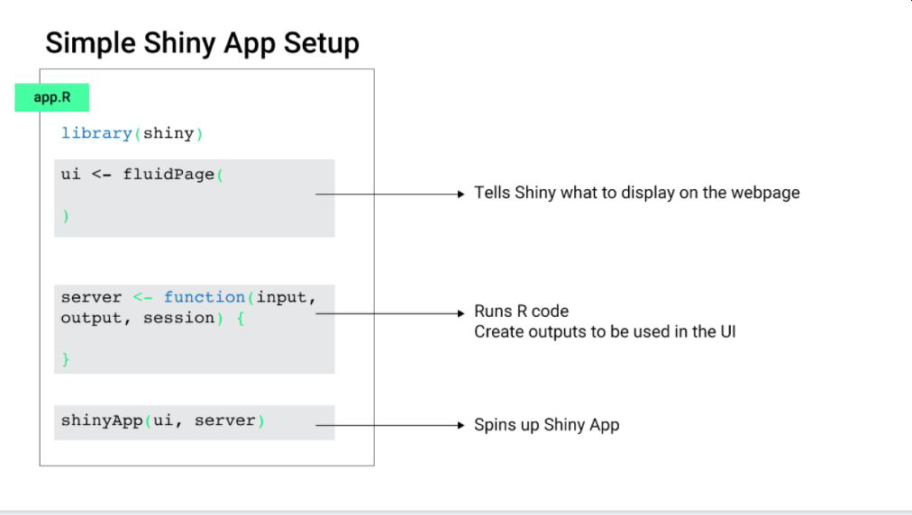

```{r xaringan-themer, include = FALSE}
library(xaringanthemer)
style_mono_accent(
  base_color = "#428bca",
  header_font_google = google_font("Jost"),
  link_color = "steelblue",
  text_font_size = "24px",
  footnote_font_size = "20px"
)
```

```{r xaringanExtra, echo=FALSE}
xaringanExtra::use_xaringan_extra(c("tile_view", "logo", "tachyons"))
xaringanExtra::use_panelset()
xaringanExtra::use_tachyons()
```

```{r setup, include=FALSE}
options(htmltools.dir.version = FALSE)
library(tidyverse)
library(flair)
library(shiny)
library(fivethirtyeight)
library(plotly)
library(ggplot2movies)
library(RColorBrewer)
data(biopics)
```

```{css, echo=FALSE}
.tiny .remark-code { /*Change made here*/
  font-size: 80% !important;
}
```

# Get Prepapred to Get Distracted by Shiny Things

<center>

</center>
<br>
.footnote[This slideshow is adapted from the workshop [*a gRadual intRoduction to Shiny*](https://laderast.github.io/gradual_shiny/index.html)]

---

# What is Shiny?

.pull-left[
- A web based framework for interactive visuals
- Developed by Joe Cheng and RStudio
- Server based: requires a basic installation of R and RStudio to work
]

.pull-right[
```{r echo=FALSE}
knitr::include_graphics("img/shiny.png")
```

]

---

# Why Shiny?

- Interactive figures that help users explore data
- Dashboards for showing people summaries of data
- Widely Used (more than Tableau and Microsoft Power BI put together!)
- Leverages R and its visualization tools

---

# But First: Functions

In order to use Shiny we need to have an understanding of R code syntax and how to use functions in R.

Functions take an argument - an *input* - and produces a result - an *output* 

---

# An Example

A simple function is the `mean()`. In R we can just write

```{r eval=FALSE}
mean(c(1,2,3,4,5))
```

to get `r mean(c(1,2,3,4,5))`.

---

class: center, middle

# Part 1: The Basic Shiny App Framework

---



.footnote[*Credit: Vivian Peng*]

---

# The (Bare) Minimal Shiny App


.pull-left.tiny[
##ui
```{r ui_min, eval=FALSE, include=FALSE}
ui <- fluidPage()
```

```{r echo=FALSE}
decorate("ui_min") %>%
  flair("%>%", background="#cdecff") %>% 
  knit_print.with_flair()
```

- note that `fluidPage` is a `function`
- uses .bg-lightest-blue[`()`], so arguments need to be comma separated
  
]

.pull-right.tiny[
##server
```{r server_min, eval=FALSE, include=FALSE}
server <- function(input, output) {}
```

```{r echo=FALSE}
decorate("server_min", eval = FALSE) %>%
  flair("{}", background="#ffb700") %>% 
  knit_print.with_flair()
```

- Note that `server` defines a new function
- Uses .bg-gold[{}] (curly brackets), so code is separated by line

]

```{r eval=FALSE}
shinyApp(ui = ui, server = server)
```

---

# `input` and `output` are how `ui` and `server` communicate

- `ui` and `server` are continuously running and listening to each other

--

- `ui`: listens to `output` and puts info into `input` 
    - passes on information on state of controls into `input` (`input$my_slider`)
    - listens to `output` for generated plots and tables and changes

--

- `server`: listens to `input` and puts info into `output`
    - passes on plots and tables into `output` (`output$my_plot`)
    - listens to `input` for changes in controls

---

# `ggplot2movies` dataset

```{r echo=FALSE}
ggplot2movies::movies
```

---

`ggplot2movies` is essentially A tibble with 28819 rows and 24 variables with the following columns 

+ `title`. Title of the movie.

+ `year`. Year of release.

+ `budget`. Total budget (if known) in US dollars

+ `length`. Length in minutes.

+ `rating`. Average IMDB user rating.

+ `votes`. Number of IMDB users who rated this movie.

+ `r1-10`. Multiplying by ten gives percentile (to nearest 10%) of users who rated this movie a 1.

+ `mpaa`. MPAA rating.

+ `action`, `animation`, `comedy`, `drama`, `documentary`, `romance`, `short`. Binary variables representing if movie was classified as belonging to that genre.

---

# Wrangling

```{r}
movies_wrangled <- movies %>%
  na.omit() %>%
  mutate(budget = budget/1000000) %>%
  gather(key = genre, value, -c(title:mpaa)) %>%
  filter(!mpaa == "") %>%
  select(-value) 

movies_by_decade <- movies_wrangled  %>%
  mutate(year = case_when(
    year %in% 1930:1939 ~ "1930s",
    year %in% 1940:1949 ~ "1940s",
    year %in% 1950:1959 ~ "1950s",
    year %in% 1960:1969 ~ "1960s",
    year %in% 1970:1979 ~ "1970s",
    year %in% 1980:1989 ~ "1980s",
    year %in% 1990:1999 ~ "1990s",
    year %in% 2000:2009~ "2000s"
    )
  ) 
```
---

```{r}
movies_by_decade %>% 
  head()
```

---

# 1.2 Adding a Plot to our App

---

## Let's Add This Plot

.pull-left[
.tiny[
```{r aes1, eval=FALSE, include=FALSE}
movies_plot <- ggplot(movies_by_decade) + 
                aes_string(
                    x="length", 
                    fill= "genre"
                  ) +
                geom_bar() +
                theme_minimal() +
            scale_fill_brewer(palette = "Spectral")
```

```{r echo=FALSE}
decorate("aes1") %>%
   flair("aes_string", background="#ffb700") %>% 
  knit_print.with_flair()
```

- We use .bg-gold[`aes_string()`] instead of `aes()` because we can specify variables as `character` - such as `"year"`

- Will be helpful later when we add a control
]
]

.pull-right[
.tiny[
```{r echo=FALSE, warning=FALSE}
   ggplot(movies_by_decade) + 
                aes_string(
                    x="length", 
                    fill= "genre"
                  ) +
                geom_bar() +
                theme_minimal() +
      scale_fill_brewer(palette = "Spectral")
```
]
]

---

# Adding a plot: `plotOutput` and `renderPlot`

```{r uibasic2, include=FALSE, eval=FALSE}
ui <- fluidPage(
  plotOutput("movies_plot")
)
```


```{r serverbasic2, include=FALSE, eval=FALSE}
server <- function(input, output) {

 output$movies_plot <- renderPlot({

   
   
   
})

}

```

.pull-left.tiny[
```{r, echo=FALSE}
decorate("uibasic2") %>% 
  flair("movies_plot", background="#cdecff") %>%
  flair("plotOutput", background = "#ffb700") %>% 
  knit_print.with_flair()
```

- for `ui`, need to add a .bg-gold[`plotOutput()`] to display the plot
- note the argument .bg-lightest-blue[`"movies_plot"`]
]

.pull-right.tiny[
```{r, echo=FALSE}
decorate("serverbasic2") %>% 
  flair("movies_plot", background="#cdecff") %>%
  flair("renderPlot({", background="#ffb700") %>%
  flair("})", background="#ffb700") %>% 
  knit_print.with_flair()
```
- for `server`, need to add a .bg-gold[`renderPlot()`] to generate the plot

- assign into .bg-lightest-blue[`output$movies_plot`] so `ui` can display it

]

---
# Adding our ggplot code

```{r uibasic, include=FALSE, eval=FALSE}
ui <- fluidPage(
  plotOutput("movies_plot")
)
```


```{r serverbasic, include=FALSE, eval=FALSE}
server <- function(input, output) {

 output$movies_plot <- renderPlot({

  ggplot(movies_by_decade) + 
                aes_string(
                    x="length", 
                    fill= "genre"
                  ) +
                geom_bar() +
                theme_minimal() +
                scale_fill_brewer(palette = "Spectral")

})

}

```

.pull-left.tiny[
```{r, echo=FALSE}
decorate("uibasic") %>% 
  flair("movies_plot", background="#cdecff") %>% 
  knit_print.with_flair()

```

]

.pull-right.tiny[
```{r, echo=FALSE}
decorate("serverbasic") %>% 
  flair("movie_plot", background="#cdecff") %>%
  flair_lines(5:12) %>% 
  knit_print.with_flair()
```

- Now we add our .bg-light-yellow[`ggplot()`] statement in
]

---
class: center, middle

# Let's Add a Control

---

# Define control options

```{r control_opts}
categoricalVars <- c("year", 
                     "mpaa", 
                     "genre")
```

---
# selectInput

.pull-left.tiny[
```{r selbox, eval=FALSE}
selectInput(
  inputId = "color_select", 
  label = "Select Categorical Variable", 
  choices = categoricalVars
  )
```
]

.pull-right.tiny[
`r knitr::include_graphics("img/selectInput.png")`
]

- Want to control the variable we **color** with the `selectInput()` control!

---
# Adding the selectInput

```{r ui2, include=FALSE, eval=FALSE}
ui <- fluidPage(
  plotOutput("movies_plot"),
  selectInput(
    inputId = "color_select", 
    label = "Select Categorical Variable", 
    choices = categoricalVars)
)
```


```{r server2, include=FALSE, eval=FALSE}
server <- function(input, output) {

  output$movies_plot <- renderPlot({

   ggplot(movies_by_decade) + 
                aes_string(
                    x="length", 
                    fill= "genre"
                  ) +
                geom_bar() +
                theme_minimal() +
                scale_fill_brewer(palette = "Spectral")
  })

}
```

.pull-left.tiny[
```{r, echo=FALSE}
decorate("ui2") %>% 
  flair_lines(3:6) %>% 
  knit_print.with_flair()
```

- Here we add the .bg-light-yellow[`selectInput()`] control
- Note the comma after `plotOutput("movies_plot")`
]

.pull-right.tiny[
```{r, echo=FALSE}
decorate("server2") %>%
  flair('color = "type_of_subject"') %>% 
  knit_print.with_flair()
```
]

---

# Wiring in the Input

```{r server3, include=FALSE, eval=FALSE}
server <- function(input, output) {

output$movie_plot <- renderPlot({
    
    gplot(movies_by_decade) + 
            aes_string(
                x="length", 
                fill="genre",
          color=input$color_select
                  ) +
                geom_bar() +
                theme_minimal() +
                scale_fill_brewer(palette = "Spectral")
  })

}
```

.pull-left.tiny[
```{r, echo=FALSE}
decorate("ui2") %>% 
  flair("color_select", background = "#cdecff") %>%
  flair("selectInput", background = "#fbf1a9") %>% 
  knit_print.with_flair()
```
]

.pull-right.tiny[
```{r, echo=FALSE}
decorate("server3") %>% 
  flair("color_select", background = "#cdecff") %>% 
  knit_print.with_flair()

```
]

---

.pull-left.tiny[
```{r, echo=FALSE}
decorate("server3") %>% 
  flair("color_select", background = "#cdecff") %>% 
  knit_print.with_flair()

```
]

.pull-right[
- now we connect our .bg-light-yellow[`selectInput`] to our `ggplot`

- use .bg-lightest-blue[`input$color_select`] as argument to `color` in `aes_string()`
]

---

# The Flow: from `selectInput()` to `plotOutput()`

<center>

</center>

---

class: center, middle

# Part 2: Making Data Reactive

<center>

</center>

---

# Making a Dataset Filterable

.pull-left.tiny[
```{r filter, include=FALSE, eval=FALSE}
movies %>%
  filter(year > 1979) %>%
  head(n=3)
```

```{r echo=FALSE}
decorate("filter") %>%
  flair("filter", background = "#ffb700") %>% 
  knit_print.with_flair()
```
]

.pull-right.tiny[
- We want to make this .bg-gold[`filter()`] statement dynamic
- Move a slider, and change the year
- We'll need to put it in a `reactive` expression
]

---

# Making your data listen

```{r reactive1, eval=FALSE, include=FALSE}
movies_filtered <- reactive({
    
      movies %>%
        filter(year > input$year)
    
  })
```

```{r echo=FALSE}
decorate("reactive1") %>%
  flair("reactive({", background="#ffb700") %>%
  flair("})", background="#ffb700") %>%
  flair("input$year_filter", background="#cdecff") %>% 
  knit_print.with_flair()
```

- **reactive** expressions listen to changes in .bg-lightest-blue[`input`]
- started with a .bg-gold[`reactive({})`]
- The curly brackets in .bg-gold[`reactive({})`] let us use more than one line of code `{}`

---
class: center, middle

# Reactive Flow: from slider to data to plot

<center>

</center>

---
class: center, middle

# Reactive Flow: from slider to data to plot
  
<center>

</center>
  
---

# Adding our control: sliderInput()
  
.pull-left.tiny[
```{r eval=FALSE}
    sliderInput(inputId = "year", 
                "Select a Year", 
                min = min(movies),
                max = max(movies), 
                value = 1970)
    
    ```
  ]

---

# Adding sliderInput (in `ui`)
  
.pull-left.tiny[
```{r slider_ui, eval=FALSE, include=FALSE}
ui <- fluidPage(
  
  plotOutput("movies_plot"),
  sliderInput("year_filter", 
              "Select a Year", 
              min = 1893,
              max = 2005, 
              value = 1970)
)
```

```{r echo=FALSE}
decorate("slider_ui") %>%
  flair_lines(4:8) %>% 
  knit_print.with_flair()
```

- Don't forget the comma after `plotOutput("movies_plot")`!
]

---

# Using our Reactive (in `server`)

```{r reactive2, include=FALSE, eval=FALSE}
movies_filtered <- reactive({
    movies_wrangled %>%
      filter(year >
               input$year_filter)
})
```

```{r reactive3, include=FALSE, eval=FALSE}

renderPlot({
  
output$movies_plot <- ggplot(movies_filtered()) + 
      aes_string(x="year",
                 y="length") + 
      geom_bar(stat="identity")
     
})

```

.pull-left.tiny[
```{r, echo=FALSE}
decorate("reactive2") %>%
  flair("movies_filtered", background="#ffb700") %>% 
  knit_print.with_flair()

```
]

.pull-right.tiny[
```{r, echo=FALSE}
decorate("reactive3") %>%
  flair("movies_filtered()", background="#ffb700") %>% 
  knit_print.with_flair()

```
]

---

# Plot

Take a look at `classthing.R` to see an output.

---

# Some Tips

- Always call reactives with the `()` 

- Example: `movies_filtered()`

---
class: center, middle

# Part 3: Adding Tooltips with `plotly`

---

# What is `plotly`?
  
- A JavaScript library that makes your interactive plots more interactive.

- accessed with the `plotly` package in R

---

# Making a `ggplot` into a `plotly` plot

```{r plotly2, eval=FALSE, include=FALSE}
my_plot <- ggplot(movies_wrangled) +
  aes_string(x = "length", 
             y = "year",
             fill = "genre") +
  geom_bar(stat = "identity") +
  theme(legend.position="none") +
  theme_minimal() +
  scale_fill_brewer(palette = "Spectral")


#ggplotly(my_plot)
```

.pull-left.tiny[
```{r echo=FALSE}
  decorate("plotly2") %>%
    flair("my_plot", background = "#cdecff") %>%
    flair("ggplotly(", background = "#ffb700") %>% 
    knit_print.with_flair()
```
  
- assign our plot to .bg-lightest-blue[`my_plot`]
- run .bg-gold[`ggplotly()`] on .bg-lightest-blue[`my_plot`]
]

.pull-right.tiny[
```{r echo=FALSE, warning=FALSE}
  my_plot <- ggplot(movies_wrangled) +
    aes_string(x = "length", 
               y = "year",
               fill = "genre") +
    geom_bar(stat = "identity") +
    theme(legend.position="none") +
    theme_minimal() +
    scale_fill_brewer(palette = "Spectral")
  
ggplotly(my_plot)
```
]

---

# Adding more tooltip information
  
```{r plotly1, eval=FALSE, include=FALSE}
my_plot <- ggplot(movies_wrangled) +
    aes_string(x = "length", 
               y = "year",
               fill = "genre",
               title = "title") +
    geom_bar(stat = "identity") +
    theme(legend.position="none") +
    theme_minimal() +
    scale_fill_brewer(palette = "Spectral")

#ggplotly(my_plot)
```


.pull-left.tiny[
```{r echo=FALSE}
  decorate("plotly1") %>%
    flair_lines(5) %>% 
    knit_print.with_flair()
```
  
- add to `aes_string()`
]

.pull-right.tiny[
```{r echo=FALSE, warning=FALSE}
my_plot <- ggplot(movies_wrangled) +
    aes_string(x = "length", 
               y = "year",
               fill = "genre",
               title = "title") +
    geom_bar(stat = "identity") +
    theme(legend.position="none") +
    theme_minimal() +
    scale_fill_brewer(palette = "Spectral")
  
  ggplotly(my_plot)
```
]

---

# Adding to our app - make these changes
  
  .pull-left.tiny[## in `ui`:
    
    Change
    
    plotOutput()
   
    to
    
    plotlyOutput()

  ]

.pull-right.tiny[## in `server`:
    
    Change
    
    renderPlot()
    
    to
   
    renderPlotly()
  
]

---

# Modified App for `plotly` tooltips
  
```{r ui_plotly, include=FALSE, eval=FALSE}
ui <- fluidPage(
  plotlyOutput("movies_plot"),
  selectInput(inputId = "color_select", 
              label = "Select Categorical Variable", 
              choices = categoricalVars)
)
```

```{r, server_plotly, include=FALSE, eval=FALSE}
server <- function(input, output) {
  
  output$movies_plot <- renderPlotly({
    
    my_plot <- ggplot(movies_wrangled) +
    aes_string(x = "length", 
               y = "year",
               fill = "genre") +
    geom_bar(stat = "identity") +
    theme(legend.position="none") +
    theme_minimal() +
    scale_fill_brewer(palette = "Spectral")
    
    ggplotly(my_plot)
  })
}
```

.pull-left.tiny[
```{r echo=FALSE}
  decorate("ui_plotly") %>%
    flair("plotlyOutput", background="#cdecff") %>% 
    knit_print.with_flair()
```
]

.pull-right.tiny[
```{r echo=FALSE}
  decorate("server_plotly") %>%
    flair("renderPlotly", background="#cdecff") %>%
    flair_lines(5:12) %>% 
    knit_print.with_flair()
```
]

---

# `app.R`

We've been running Shiny apps as code blocks so far.

Apps are usually set up in a folder with `app.R` or separate `ui.R` and `server.r` files

---

# Making a new app as a project

In a project, use 

**File > New Project > New Directory > Shiny Web Application**

And then name your app.

---
class: center, middle

# Wrap up and Resources

---
# More about inputs and outputs

Further reading on the different control inputs, and data output types here:

Shiny Widget Gallery: https://shiny.rstudio.com/gallery/widget-gallery.html

Shiny Tutorials: https://shiny.rstudio.com/tutorial/

---
# Layouts

Ways to lay out elements of your application:

- `fluidPage` - https://shiny.rstudio.com/articles/layout-guide.html

- `flexdashboard` - https://rmarkdown.rstudio.com/flexdashboard/

---

# Shiny at WVU

- Plan on getting on RStudio Connect server that is accessible to everyone

- Typically requires a developer's fee and user. This applies to all app rendering systems like Tableau and Microsoft BI

---
  # Shiny in the Real World
  
- [shinyapps.io](https://www.shinyapps.io/) lets you host Shiny apps externally

- Other sites also host Shiny apps

---

# Deploying Apps on shinyapps.io
  
- Requires installing `{rsconnect}` package

--


- When you first try to deploy, it will ask you for your account info

--


- When you run the app, there is a "Publish" button

---
  
# Shiny Gallery
  
You should now know enough to start learning from the examples:
  
- https://shiny.rstudio.com/gallery/

---

# Going Further
  
- Try to compute statistics ahead of time prior to any Shiny code

--


- Learn more about how to dynamically update the `ui`

--


- Look at `htmlwidgets` for possible JavaScript visualizations you can leverage

---

# Suggested Reading
  
- [Mastering Shiny](https://mastering-shiny.org/) by Hadley Wickham
  
- [Interactive web-based data visualization with R, plotly, and shiny](https://plotly-r.com/) by Carson Sievert

---
class: center, middle

# Questions?
