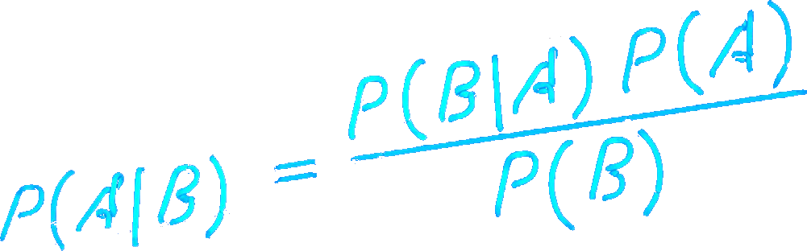
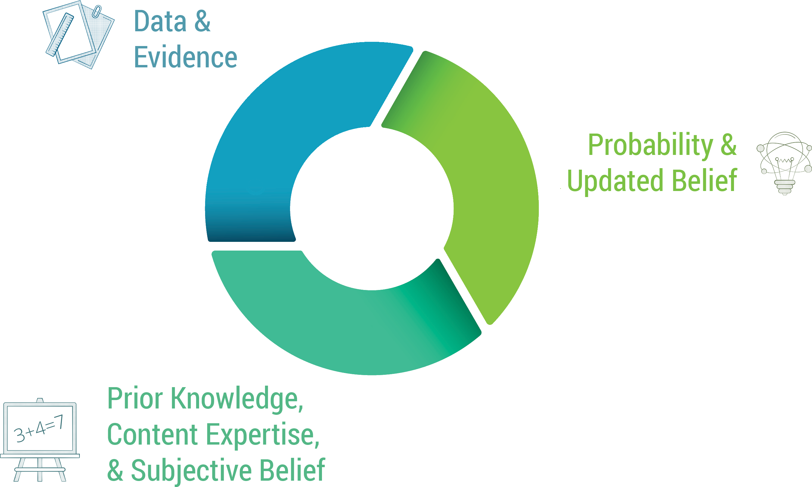
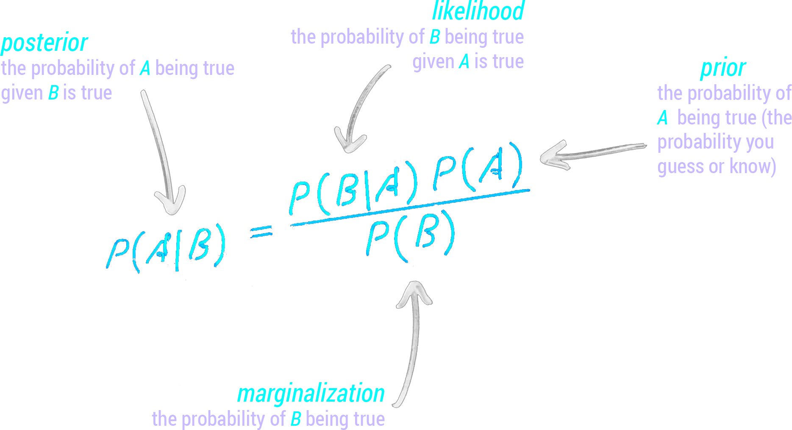
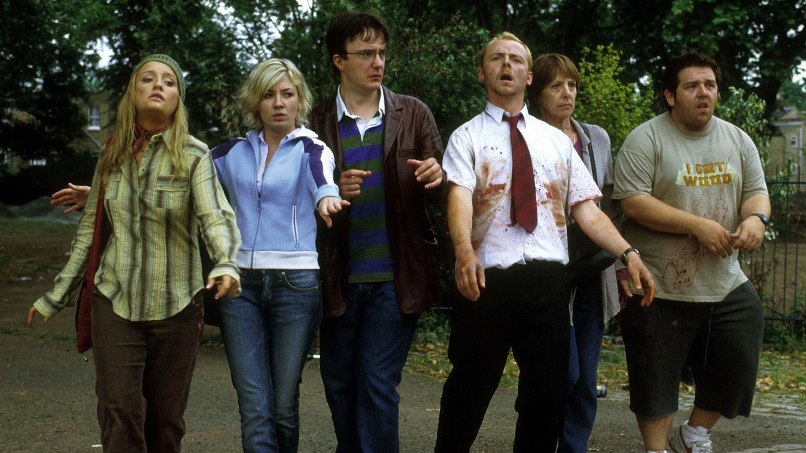
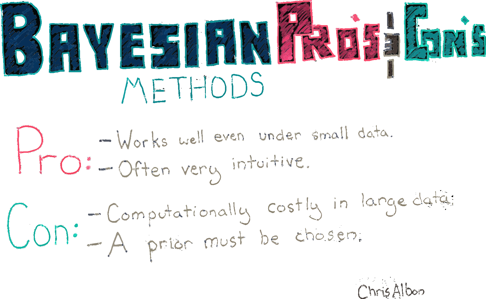

<script src="https://ajax.googleapis.com/ajax/libs/jquery/3.6.0/jquery.min.js"></script>

<script type="text/x-mathjax-config">
MathJax.Hub.Register.StartupHook("TeX Jax Ready",function () {
  MathJax.Hub.Insert(MathJax.InputJax.TeX.Definitions.macros,{
    cancel: ["Extension","cancel"],
    bcancel: ["Extension","cancel"],
    xcancel: ["Extension","cancel"],
    cancelto: ["Extension","cancel"]
  });
});
</script>

<style>
section {
    display: flex;
    display: -webkit-flex;
}

section {
    height: 600px;
    width: 60%;
    margin: auto;
    border-radius: 21px;
    background-color: #212121;
}

.remark-slide-container {
background: #212121;
}

.hljs-github .hljs {
    background: transparent;
    color: #b2dfdb;
}

.hljs-github .hljs-keyword {
    color: #64b5f6;
}

.hljs-github .hljs-literal {
    color: #64b5f6;
}

.hljs-github .hljs-number {
    color: #64b5f6;
}

.hljs-github .hljs-string {
    color: #b7b3ef;
}


.hljs-github .hljs {
    background: transparent;
    color: #b2dfdb;
}

.hljs-github .hljs-keyword {
    color: #64b5f6;
}

.hljs-github .hljs-literal {
    color: #64b5f6;
}

.hljs-github .hljs-number {
    color: #64b5f6;
}

.hljs-github .hljs-string {
    color: #b7b3ef;
}

section p {
    text-align: center;
    font-size: 30px;
    background-color: #212121;
    border-radius: 21px;
    font-family: Roboto Condensed;
    font-style: bold;
    padding: 12px;
    color: #bff4ee;
    margin: auto;
}

#center {
text-align: center;
}

#right {
  text-align: right;
} 

.center p {
  margin: 0;
  position: absolute;
  top: 50%;
  left: 50%;
  -ms-transform: translate(-50%, -50%);
  transform: translate(-50%, -50%);
}

.center2 {
  margin: 0;
  position: absolute;
  top: 50%;
  left: 50%;
  -ms-transform: translate(-50%, -50%);
  transform: translate(-50%, -50%);
}

.tab {
    display: inline-block;
    margin-left: 40px;
}

.tabdbl {
    display: inline-block;
    margin-left: 80px;
}

.tabtpl {
    display: inline-block;
    margin-left: 120px;
}


.obr
{
    display:block;
    margin-top:-15px;
}

.pull-left-left {
  float: left;
  width: 27%;
}

.pull-right-right {
  float: right;
  width: 32%;
}

img.expand:hover {
  margin: 0 auto;
  position: relative;
  width: 50%;
  display: flex;
  justify-content: center;
  align-items: center;
  align-content: center;
  transform: scale(1.5)             
  translateX(-35%);
  z-index: 99;
  transition:all 0.5s ease-in-out;
  -webkit-transition:all 0.2s ease-in-out;
}

.vertline {
  border-left: 5px solid #212121;
  height: 100px;
  margin-left: 15px;
  margin-right: 15px;
}

*, *:before, *:after {
	 box-sizing: border-box;
	 outline: none;
}

.hover {
	 position: relative;
	 display: flex;
	 align-items: center;
	 justify-content: center;
	 width: 400px;
	 height: 65px;
	 background-color: #e3c0ff;
	 border-radius: 99px;
	 box-shadow: 0 1px 3px rgba(0, 0, 0, 0.12), 0 1px 2px rgba(0, 0, 0, 0.24);
	 transition: all 0.3s cubic-bezier(0.25, 0.8, 0.25, 1);
	 overflow: hidden;
}

 .hover:before, .hover:after {
	 position: absolute;
	 top: 0;
	 display: flex;
	 align-items: center;
   justify-content: center;
	 width: 50%;
	 height: 100%;
	 transition: 0.25s linear;
	 z-index: 1;
}

 .hover:before {
	 content: '';
	 left: 0;
	 background-color: #ca86ec;
   color: #212121;
}

 .hover:after {
	 content: '';
	 right: 0;
	 background-color: #d896ff;
}

 .hover:hover {
	 background-color: #cc8bff;
	 box-shadow: 0 14px 28px rgba(0, 0, 0, 0.25), 0 10px 10px rgba(0, 0, 0, 0.22);
}

 .hover:hover span {
	 opacity: 0;
	 z-index: -3;
}

 .hover:hover:before {
	 opacity: 0.5;
	 transform: translateY(-100%);
}

 .hover:hover:after {
	 opacity: 0.5;
	 transform: translateY(100%);
}

 .hover span {
	 position: absolute;
	 top: 0;
	 left: 0;
	 display: flex;
	 align-items: center;
	 justify-content: center;
	 text-align: center;
	 width: 100%;
	 height: 100%;
	 color: #212121;
	 font-size: 24px;
	 font-weight: 700;
	 opacity: 1;
	 transition: opacity 0.25s;
	 z-index: 2;
   white-space:pre;
}

 .hover .doc-link {
	 position: relative;
	 display: flex;
	 align-items: center;
	 justify-content: center;
	 text-align: center;
	 width: 25%;
	 height: 100%;
	 color: whitesmoke;
	 font-size: 24px;
	 text-decoration: none;
	 transition: 0.25s;
}
 .hover .doc-link i {
	 text-shadow: 1px 1px rgba(70, 98, 127, 0.7);
	 transform: scale(1);
}
 .hover .doc-link:hover {
	 background-color: rgba(245, 245, 245, 0.1);
}
 .hover .doc-link:hover i {
	 animation: bounce 0.4s linear;
}
 @keyframes bounce {
	 40% {
		 transform: scale(1.4);
	}
	 60% {
		 transform: scale(0.8);
	}
	 80% {
		 transform: scale(1.2);
	}
	 100% {
		 transform: scale(1);
	}
}

.boxl {
    width: 50%;
    margin: 5px;
    text-align: center;
}

.boxr {
    margin: 5px;
    text-align: center;
}

.picr {
    display: flex;
    justify-content: space-around;
    align-items: center;
}

.hr-lines:before{
  content:" ";
  display: block;
  height: 2px;
  width: 350px;
  position: relative;
  top: 50%;
  left: 0;
  background: #FAF9F6;
  margin-top: 5px;
  margin-bottom: 5px;
}

div.rounded pre {
  border-radius: 25px;
  border: 1px solid #bbc6cc;
  padding: 20px;
}

div.rounded pre.r {
  border-radius: 25px;
  border: 1px solid #93bdbd;
  padding: 20px;
 }

#rounded_corners {
  border-radius: 25px;
  border: 2px solid #80FFDB;
  padding: 20px;
  width: 350px;
  height: 115px;
}
</style>

```{css echo=FALSE}
.highlight-last-item > ul > li,
.highlight-last-item > ol > li {
  opacity: 0.5;
}
.highlight-last-item > ul > li:last-of-type,
.highlight-last-item > ol > li:last-of-type {
  opacity: 1;
}
```

```{r setup, include=FALSE, purl=FALSE}
library(tidyverse)
library(DiagrammeR)
library(widgetframe)
library(knitr)
library(kableExtra)
library(fontawesome)
library(here)
library(showtext)
font_add_google("Roboto Condensed", "roboto")
showtext_auto()
```

```{r echo = FALSE, purl=FALSE}
xaringanthemer::style_duo(
  primary_color = "#212121",
  secondary_color = "#bff4ee",
  link_color = "#b1ead6",
  text_bold_color = "#00b0cc",
  table_row_border_color = "#212121",
  table_row_even_background_color = "#212121",
  footnote_font_size = "0.6em",
  header_font_google = xaringanthemer::google_font("Roboto Condensed", "700"),
  text_font_google   = xaringanthemer::google_font("Roboto Condensed", "400")
)

xaringanExtra::use_xaringan_extra(c("tile_view", 
                                    "animate_css", 
                                    "tachyons"))

xaringanExtra::use_logo(
  image_url = here::here("static", "img", "course_hex.png"),
  link_url = "https://edp619.asocialdatascientist.com",
  position = xaringanExtra::css_position(top = "1em", right = "1em")
)
```

```{r functions, echo=FALSE}
bayes_probability_tree <- function(prior, true_positive, true_negative) {
  
  if (!all(c(prior, true_positive, true_negative) > 0) && !all(c(prior, true_positive, true_negative) < 1)) {
    stop("probabilities must be greater than 0 and less than 1.",
         call. = FALSE)
  }
  c_prior <- 1 - prior
  c_tp <- 1 - true_positive
  c_tn <- 1 - true_negative
  
  round4 <- purrr::partial(round, digits = 4)
  
  b1 <- round4(prior * true_positive)
  b2 <- round4(prior * c_tp)
  b3 <- round4(c_prior * c_tn)
  b4 <- round4(c_prior * true_negative)
  
  bp <-  round4(b1/(b1 + b3))
  
  labs <- c("infection test", prior, c_prior, true_positive, c_tp, true_negative, c_tn, b1, b2, b4, b3)
  
  tree <-
    create_graph() %>%
    add_n_nodes(
      n = 11,
      type = "path",
      label = labs,
      node_aes = node_aes(
        shape = "circle",
        height = 1,
        width = 1,
        x = c(0, 3, 3, 6, 6, 6, 6, 8, 8, 8, 8),
        y = c(0, 2, -2, 3, 1, -3, -1, 3, 1, -3, -1))) %>% 
    add_edge(
      from = 1,
      to = 2,
      edge_aes = edge_aes(
        label = "Zombie Bite"
      )
    ) %>% 
    add_edge(
      from = 1, 
      to = 3,
      edge_aes = edge_aes(
        label = "NO Zombie Bite"
      )
    ) %>% 
    add_edge(
      from = 2,
      to = 4,
      edge_aes = edge_aes(
        label = "True Positive"
      )
    ) %>% 
    add_edge(
      from = 2,
      to = 5,
      edge_aes = edge_aes(
        label = "False Negative"
      )
    ) %>% 
    add_edge(
      from = 3,
      to = 7,
      edge_aes = edge_aes(
        label = "False Positive"
      )
    ) %>% 
    add_edge(
      from = 3,
      to = 6,
      edge_aes = edge_aes(
        label = "True Negative"
      )
    ) %>% 
    add_edge(
      from = 4,
      to = 8,
      edge_aes = edge_aes(
        label = ""
      )
    ) %>% 
    add_edge(
      from = 5,
      to = 9,
      edge_aes = edge_aes(
        label = ""
      )
    ) %>% 
    add_edge(
      from = 7,
      to = 11,
      edge_aes = edge_aes(
        label = ""
      )
    ) %>% 
    add_edge(
      from = 6,
      to = 10,
      edge_aes = edge_aes(
        label = ""
      )
    ) 
#  message(glue::glue("The probability of having (prior) after testing positive is {bp}"))
  print(render_graph(tree))
  invisible(tree)
}

colorize <- function(x, color) {
  if (knitr::is_latex_output()) {
    sprintf("\\textcolor{%s}{%s}", color, x)
  } else if (knitr::is_html_output()) {
    sprintf("<span style='color: %s;'>%s</span>", color,
      x)
  } else x
}
```

## Note

--

We are going to try to keep this as light as possible, but you will to think outside of your traditional training. For most of you, you'll likely see this as a new way of thinking and may even appear to be counterintuitive - however you may find this idea of iterative refining of one's beliefs is a fundamental principle of being human

If you are interested in learning more about the statistics, here is an absolutely biased selection of texts you may want to look at. While both employ R, the one on the right uses it significantly less than the text sitting on the left. 

--

<br>
.pull-left[
<center>
<a href="https://libwvu.on.worldcat.org/oclc/881386855" target="_blank">

</a>
</center>
]


.pull-right[
<center>
<a href="https://libwvu.on.worldcat.org/oclc/1108874742" target="_blank">

</a>
</center>
]

--

<br>
<center>
As of this writing, both texts are available as ebooks through WVU Libraries. Please click on the images above to access them
</center>

---

# Bayesian Inference

.center2[

]

---

## The Idea

.pull-left[
1. Begin with 

  > a hypothesis 
  
  > a degree of belief (in the hypothesis)
  
  So based on domain expertise or prior knowledge, we assign a non-zero probability to that hypothesis
  
2. Then
  > gather data
  
  Collection is probability based and done without a purpose
  
3. Finally
  
  > update our initial beliefs (if needed) 

  If the data supports the hypothesis then the probability goes up, and if not then it goes down. ***Then recursively begin the cycle again with the updated probabilities***
  ]
  
--

.pull-right[
<br>
<br>
<br>
<br>

  ]
  
---

### Getting A Different Perspective

--

Is your understanding of *conditional probability* a bit fuzzy or possibly even non existent? That is understandable - you probably took statistics from a frequentist, that's ok! Click on the icons below to take a look at the two videos from the wonderful series Crash Course Statistics. I'm 95% sure you won't regret it!

<br>
<br>
<br>
<br>
<br>
.pull-left[
<center>
 <a href="https://youtu.be/OyddY7DlV58">

</a>
</center>
]

.pull-right[
<center>
 <a href="https://youtu.be/oZCskBpHWyk">

</a>
</center>
]

---

## Hopefully Some Review

--

<br>
.pull-left[
$$P(\color{RoyalBlue}{A} \,\,\textrm{and}\,\, \color{OrangeRed}{B})\,\, \\ \textrm{means the probability of} \,\,\color{RoyalBlue}{A}\,\,\textrm{and}\,\,\color{OrangeRed}{B}\,\, \textrm{happening}$$]

--

.pull-right[
$$P(\color{RoyalBlue}{A}\,|\,\color{OrangeRed}{B})\\ \,\,\textrm{means the probability of} \,\,\color{RoyalBlue}{A} \,\,\textrm{happening if} \,\,\color{OrangeRed}{B} \,\,\textrm{happens}$$]

--

<br>
.pull-left[
$$P(\color{RoyalBlue}{A} \,\,\textrm{and}\,\, \color{OrangeRed}{B}) = P(\color{OrangeRed}{B} \,\,\textrm{and}\,\, \color{RoyalBlue}{A})$$]
--

.pull-right[
$$P(\color{RoyalBlue}{A}\,|\,\color{OrangeRed}{B}) \neq P(\color{OrangeRed}{B}\,|\,\color{RoyalBlue}{A})$$]

--

<br>
.pull-left[
<i>As long as both events happen, we DO NOT care about the order</i>
]

--

.pull-right[
<i>One event relies on the other happening so we ABSOLUTELY care about the order</i>
]

---

## And Some More Review

--

<br>
<br>
.pull-left[
$$P(\color{RoyalBlue}{A} \,\,\textrm{and}\,\, \color{OrangeRed}{B})$$ 
<center>has a standard formula regardless<br>if they are dependent or independent
</center>
]

--

.pull-right[
<br>
$$P(\color{RoyalBlue}{A} \,\,\textrm{and}\,\, \color{OrangeRed}{B}) = P(\color{OrangeRed}{B}\,|\,\color{RoyalBlue}{A}) \cdot P(\color{RoyalBlue}{A})$$
]

--

<br>
<br>
.pull-left[
$$P(\color{OrangeRed}{B})$$
<center>is the average<br>probability of a positive test result<sup>1</sup></center>
]

--

.pull-right[
<br>
$$P(\color{OrangeRed}{B}) = P(\color{RoyalBlue}{A} \,\,\textrm{and}\,\, \color{OrangeRed}{B}) + P(\color{OrangeRed}{B}\,|\,\color{Orchid}{\neg{A}})\cdot (1-P(\color{RoyalBlue}{A}))$$
]


.footnote[<sup>1</sup> `\\(\color{Orchid}{\neg{A}}\\)` is one of many ways to write shorthand for the statement `r colorize("NOT", "Orchid")` `\\(\color{Orchid}{A}\\)`. In an absolutely non confusing way, you may also see variants like `\\(\color{Orchid}{\sim{A}}\\)`,&nbsp; `\\(\color{Orchid}{\widetilde{A}}\\)`,&nbsp; or `\\(\color{Orchid}{\overline{A}}\\)` just to name a few that all denote the same<br>&nbsp;&nbsp;&nbsp;thing]

---

## Labels

Now that we have some understanding of what the parts of Bayes' Theorem are, let's take a look at the names of each

.center2[
<br>
<br>
<br>

]

---

## More about $P(\color{RoyalBlue}{A}\,|\,\color{OrangeRed}{B}) \neq P(\color{OrangeRed}{B}\,|\,\color{RoyalBlue}{A})$

<br>
.pull-left[
<span class="tabtpl">
$P(\color{RoyalBlue}{A}\,|\,\color{OrangeRed}{B}) =\dfrac{P(\color{RoyalBlue}{\color{RoyalBlue}{A}} \,\,\textrm{and}\,\, \color{OrangeRed}{B})}{P(\color{OrangeRed}{B})}$
</span>
]


--

.pull-right[
<span class="tabtpl">
$P(\color{OrangeRed}{B}\,|\,\color{RoyalBlue}{A}) =\dfrac{P(\color{OrangeRed}{B} \,\,\textrm{and}\,\, \color{RoyalBlue}{A})}{P(\color{RoyalBlue}{A})}$
</span>
]

--

<br>
<br>
<center>
<p style="font-size:30px">Some Algebra!</p>
</center>
<br>

--

<br>
.pull-left[
<span class="tabtpl">
$P(\color{RoyalBlue}{\color{RoyalBlue}{A}} \,\,\textrm{and}\,\, \color{OrangeRed}{B}) = P(\color{RoyalBlue}{A})\cdot P(\color{OrangeRed}{B}\,|\,\color{RoyalBlue}{A})$
</span>
]

--

.pull-right[
<span class="tabtpl">
$P(\color{OrangeRed}{B} \,\,\textrm{and}\,\, \color{RoyalBlue}{A}) = P(\color{OrangeRed}{B})\cdot P(\color{OrangeRed}{B}\,|\,\color{RoyalBlue}{A})$
</span>
]

---

### Getting A Different Perspective

--

Still a bit or all the way confused? Then try going through through this incredible video from [Josh Starmer](https://statquest.org/) by clicking on the icon below. Now I'm 98% sure you won't regret it!
.center2[
<br>
<br>
<br>
<br>
<br>
<center>
 <a href="https://youtu.be/9wCnvr7Xw4E">

</a>
</center>
]

---

# Example

.center2[

]

---

## Screening

--

.pull-left[
Let's say the chance of a test for infection coming back `r colorize("positive", "OrangeRed")` given a person was `r colorize("bitten by a zombie", "RoyalBlue")` is
$$P(\color{OrangeRed}{+}\,\,|\,\,\color{RoyalBlue}{\textrm{zombie bite}}) = 0.90$$ 
<center>
This is known as as test <b><i>sensitivity</i></b>
</center>
]

--

.pull-right[
And the chance of a test for infection coming back `r colorize("negative", "ForestGreen")`<br>given a person was `r colorize("NOT bitten by a zombie", "Orchid")` is
$$P(\color{ForestGreen}{-}\,\,|\,\,\color{Orchid}{\textrm{NO zombie bite}}) = 0.95$$ 
<center>
This is known as as test <b><i>specificity</i></b>
</center>
]

--

<br>
<br>
<br>
<center>
So based on the two pieces of information above we can say the following about<br>a test for infection coming back `r colorize("positive", "OrangeRed")` even though a person was `r colorize("NOT bitten by a zombie", "Orchid")`
</center>

\begin{align}
P(\color{OrangeRed}{+}\,\,|\,\, \color{Orchid}{\textrm{NO zombie bite}}) &= 1 - P(\color{ForestGreen}{-}\,\,|\,\,\color{Orchid}{\textrm{NO zombie bite}}) \\\\
&=  1 - 0.95 \\\\
&= 0.05
\end{align}


--

.footnote[Remember that all test, especially medical tests have some error]

---

## Questions

--

<br>
<br>
<br>
<br>
.pull-left[
<center>
Perspective of a person administering the test

<hr style="width:75%">
<br><p id="center" style="color:#bca0dc; font-weight: bold; border:1px; border-style:solid; border-color:#74cbda; border-radius: 25px; padding: 0.3em;">
<i>Given a person was `r colorize("bitten by a zombie", "RoyalBlue")`, what is<br>the probability that their test is `r colorize("positive", "OrangeRed")`?</i>
</p>
<br>
</center>
$$P(\color{OrangeRed}{+}\,\,|\,\,\color{RoyalBlue}{\textrm{zombie bite}}) = 0.90$$ 
]

--

.pull-right[
<center>
Perspective of a person who is not infected

<hr style="width:75%">
<br>
<p id="center" style="color:#74cbda; font-weight: bold; border:1px; border-style:solid; border-color:#74cbda; border-radius: 25px; padding: 0.3em;">
<i>Given that their test is `r colorize("positive", "OrangeRed")`, what is<br>the probability that person was `r colorize("bitten by a zombie", "RoyalBlue")`?</i>
</p>
</center>
<br>
$$P(\color{RoyalBlue}{\textrm{zombie bite}}\,\,\,|\,\,\color{OrangeRed}{+}) = \textrm{?}$$
]

---

## Assumtions

--

.center2[
Assume that for now zombies are pretty rare and represent only 0.1% of the population. This means that<br>
$$P(\color{RoyalBlue}{\textrm{zombie bite}}) = 0.001$$
]

<br>
<br>
<br>
<br>
<br>
<br>
<br>
<br>
<br>
<br>
<br>
<center>
This is known as a <b><i>prior</i></b?
</center>

---

### The Math

--

1. From Bayes'theorem we have $$P(\color{RoyalBlue}{\textrm{zombie bite}}\,\,|\,\color{OrangeRed}{+}) = \dfrac{P(\color{RoyalBlue}{\color{RoyalBlue}{\textrm{zombie bite}}} \,\,\,\textrm{and}\,\, \color{OrangeRed}{+})}{P(\color{OrangeRed}{+})}$$

<br>
<br>
.pull-left[
<div id="center" style="color:#f4acf6; font-weight: bold; border:1px; border-style:solid; border-color:#74cbda; border-radius: 25px; padding: 2.3em; width: 750px; height: 300px;">
<span style = "color:#ffffba;">The numerator</span>
`
\begin{align}
  P(\color{RoyalBlue}{\color{RoyalBlue}{\textrm{zombie bite}}} \,\,\,\textrm{and}\,\, \color{OrangeRed}{+}) &= P(\color{RoyalBlue}{\textrm{zombie bite}}) \cdot P(\color{OrangeRed}{+}\,\,|\,\,\color{RoyalBlue}{\textrm{zombie bite}}) \\\\&= 0.001 \cdot 0.90 \\\\
  &= 0.0009
\end{align}
`
</div>
]

--

.pull-right-right[
<br>
> This follows
$$P(\color{RoyalBlue}{\color{RoyalBlue}{A}} \,\,\textrm{and}\,\, \color{OrangeRed}{B}) = P(\color{RoyalBlue}{A})\cdot P(\color{OrangeRed}{B}\,|\,\color{RoyalBlue}{A})$$
]
 
---

.pull-left[ 
<div id="center" style="color:#f4acf6; font-weight: bold; border:1px; border-style:solid; border-color:#74cbda; border-radius: 25px; padding: 2.3em; width: 950px; height: 300px;">
<span style = "color:#ffffba;">The denominator</span>
`
\begin{align}
  P(\color{OrangeRed}{+}) &= P(\color{RoyalBlue}{\color{RoyalBlue}{\textrm{zombie bite}}} \,\,\,\textrm{and}\,\, \color{OrangeRed}{+})\,\, + P(\color{OrangeRed}{+}\,\,|\,\,\color{Orchid}{\textrm{NO zombie bite}}) \cdot (1-P(\color{RoyalBlue}{\textrm{zombie bite}}))\\\\
  &= 0.0009 + 0.05 \cdot (1-0.0001) \\\\
&= 0.5085
\end{align}
`
</div>
]

.pull-right[ 

]

--

.pull-left[
<br>
> The above follows
$$P(\color{OrangeRed}{B}) = P(\color{RoyalBlue}{A} \,\,\textrm{and}\,\, \color{OrangeRed}{B}) + P(\color{OrangeRed}{B}\,|\,\color{Orchid}{\neg{A}})\cdot (1-P(\color{RoyalBlue}{A}))$$
]


.pull-right[]

---

<ol start="2">
2. We can take the previous values into Bayes' theorem to get
 \begin{align}
 P(\color{RoyalBlue}{\textrm{zombie bite}}\,\,|\,\color{OrangeRed}{+}) &= \dfrac{0.0009}{0.05085}\\\\
 &= 0.02
 \end{align}
</ol>

--

<span class="tab">&nbsp;&nbsp;&nbsp;implying that given a positive test result, there is only a 2% chance that they were bitten by a zombie</span> 

---

## Does this seem counterintuitive? 

--

> You are definitely not alone, but this silly example is indicative a pretty important result because it parallels the nature of many realistic testing contexts  such as HIV and DNA testing, criminal profiling, and even your standard run of the mill statistical significance testing

--

> Now for the time being, forget about the result that you may be dismissing as garbage and try to make sense think about why the probability was so low. After you come to conclusion or get stuck, move on

---

## Considerations

--

.pull-left[
Whenever the condition of interest is very rare, having a test that finds all the true cases is still no guarantee that a positive result carries much information at all]

--

.pull-right[
Remember that zombies are pretty rare, only making up 0.1% of the population. As of this writing, there are about [7.93 billion people](https://www.census.gov/popclock/) in the world. While 8 million zombies appears to be a lot, consider that in this scenario they would be spread out over the globe. Even if you restrict that number to the United States, the country alone has a population of about 333 million people making zombies about 2.4% of the total count of "people". or to put it another way, as of 2021 the number of zombies could almost equal the state population of Virginia
]

--

<br>
<br>
<center>But why?</center>
<br>
<br>

--

<center>Well the reason may also seem counterintuitive but here you go:<br><br><b><i>most positive results are false positives, even when all the true positives are detected correctly</i></b></center>

--

Now through testing and larger samples, if the prior probability changes then there is a good chance that the narrative above also changes with it

---

### A Probability Tree of the Zombie "Problem"

--

```{r echo=FALSE, eval=TRUE, results='asis'}
zombies <- 
  bayes_probability_tree(prior = 0.001, 
                         true_positive = 0.90, 
                         true_negative = 0.95)
```

<center>
```{r echo=FALSE, eval=TRUE}
render_graph(zombies)
```
</center>

---

## Is it perfect?

--

No! If someone has a prior of 0 or 1, then it doesn't matter what you do, statistically speaking their mind is not going to change! 

--

Also there are some issues with people's ability to use Bayesian approaches

<center>

</center>

---

### Did You Know?

In 2005 John Ioannidis, a professor at the Stanford School of Medicine, published a very famous and highly controversial paper named [*Why Most Published Research Findings Are False*](https://journals.plos.org/plosmedicine/article?id=10.1371/journal.pmed.0020124). He used Bayes' Theorem to establish a weak basis, though one did not exist prior to his publication. His calculation led to a broader argument and warnings that have been for the most part accepted by the broader research community

---

### If You Torture Data Long Enough, It Will Confess to Anything

If you're interested in a broader review of how most research is false but is worth doing anyway, click on the icon below

<br>
<br>
<br>
<br>
<br>
<br>
<center>
 <a href="https://youtu.be/42QuXLucH3Q">

</a>
</center>

---

# One Last Thing About Bayes

We barely scratched the surface of Bayesian thinking. Unfortunately it is underutilized in the social sciences and education and that will become an issue as areas such as machine learning and the data sciences in general become prevalent. If you find this area interesting, I am happy to point you to resources that may be useful. In the meantime, you may wish to take a look at the papers below by hovering over the pills

<br>
<br>
<br>
<br>
<br>
<br>
.pull-left[
<span class = "tab"><a href="https://edp619.asocialdatascientist.com/slides/basics%20and%20buttons/papers/Villar%2C%20Callegaro%2C%20%26%20Yang%20%282013%29.pdf" target='_blank' download="Aczel et al. (2020).pdf">
<span class = "hr-lines">Aczel et al. (2020)</span></span>
]

.pull-right[
<a href="https://edp619.asocialdatascientist.com/slides/basics%20and%20buttons/papers/Villar%2C%20Callegaro%2C%20%26%20Yang%20%282013%29.pdf" target='_blank' download="Kruschke (2010).pdf">
<span class = "hr-lines">Kruschke (2010)</span></span>
]

---

## Thats it!

If you have any questions, please reach out

--

<br>
<br>
<br>
<br>
<br>
<br>
<br>
<br>
<br>
<center>
<br><br>
<div class="fade_rule"></div>  
<br><br>
</center>

<center>
<a rel="license" href="http://creativecommons.org/licenses/by-nc-sa/4.0/"></a><br /><br />This work is licensed under a <br /><a rel="license" href="http://creativecommons.org/licenses/by-nc-sa/4.0/">Creative Commons Attribution-NonCommercial-ShareAlike 4.0 International License</a>
</center>
