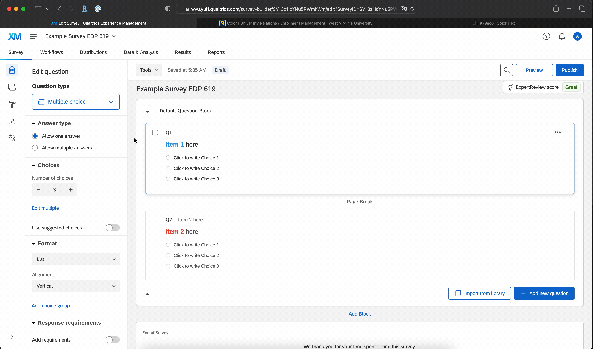
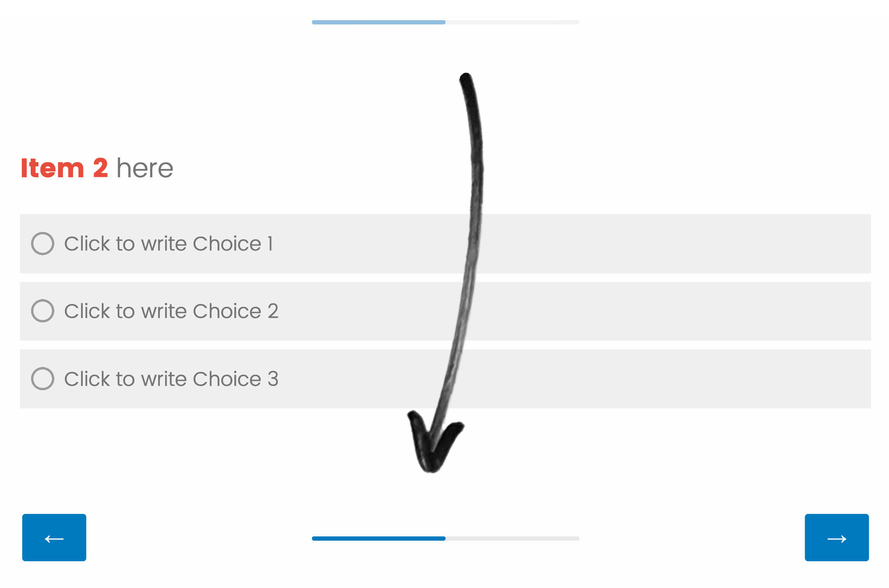
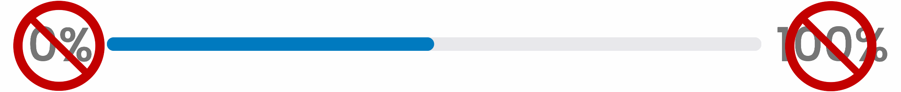
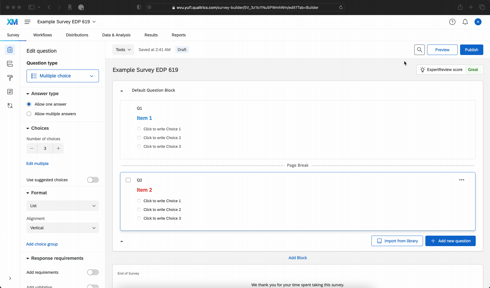
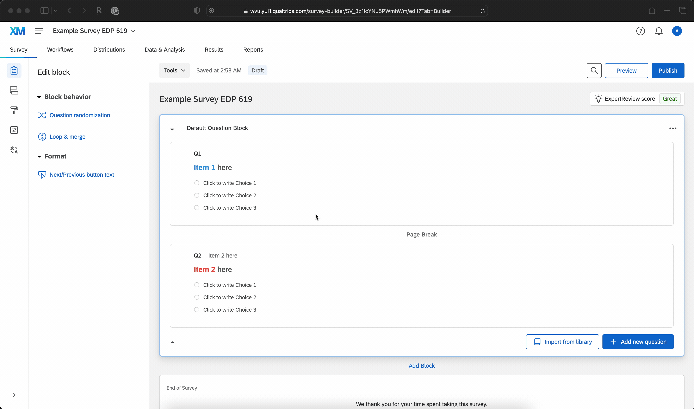

<script src="https://ajax.googleapis.com/ajax/libs/jquery/3.6.0/jquery.min.js"></script>

<script type="text/x-mathjax-config">
MathJax.Hub.Register.StartupHook("TeX Jax Ready",function () {
  MathJax.Hub.Insert(MathJax.InputJax.TeX.Definitions.macros,{
    cancel: ["Extension","cancel"],
    bcancel: ["Extension","cancel"],
    xcancel: ["Extension","cancel"],
    cancelto: ["Extension","cancel"]
  });
});
</script>

<style>
section {
    display: flex;
    display: -webkit-flex;
}

section {
    height: 600px;
    width: 60%;
    margin: auto;
    border-radius: 21px;
    background-color: #212121;
}

.remark-slide-container {
background: #212121;
}

.hljs-github .hljs {
    background: transparent;
    color: #b2dfdb;
}

.hljs-github .hljs-keyword {
    color: #64b5f6;
}

.hljs-github .hljs-literal {
    color: #64b5f6;
}

.hljs-github .hljs-number {
    color: #64b5f6;
}

.hljs-github .hljs-string {
    color: #b7b3ef;
}


.hljs-github .hljs {
    background: transparent;
    color: #b2dfdb;
}

.hljs-github .hljs-keyword {
    color: #64b5f6;
}

.hljs-github .hljs-literal {
    color: #64b5f6;
}

.hljs-github .hljs-number {
    color: #64b5f6;
}

.hljs-github .hljs-string {
    color: #b7b3ef;
}

section p {
    text-align: center;
    font-size: 30px;
    background-color: #212121;
    border-radius: 21px;
    font-family: Roboto Condensed;
    font-style: bold;
    padding: 12px;
    color: #bff4ee;
    margin: auto;
}

#center {
text-align: center;
}

#right {
  text-align: right;
} 

.center p {
  margin: 0;
  position: absolute;
  top: 50%;
  left: 50%;
  margin-right: -50%;
  transform: translate(-50%, -50%) 
}

.center2 {
  margin: 0;
  position: absolute;
  top: 50%;
  left: 50%;
  -ms-transform: translate(-50%, -50%);
  transform: translate(-50%, -50%);
}

.tab {
    display: inline-block;
    margin-left: 40px;
}

.obr
{
    display:block;
    margin-top:-15px;
}

.center-left-four {
  position:          relative;
  top:               50%;
  transform:         translateY(50%);
}

.center-left-five {
  position:          relative;
  top:               50%;
  transform:         translateY(40%);
}

.center-left-six {
  position:          relative;
  top:               50%;
  transform:         translateY(30%);
}

.center-left-sixhalf {
  position:          relative;
  top:               50%;
  transform:         translateY(25%);
}

.center-left-seven {
  position:          relative;
  top:               50%;
  transform:         translateY(20%);
}

.center-left-sevenhalf {
  position:          relative;
  top:               50%;
  transform:         translateY(15%);
}

.center-left-eight {
  position:          relative;
  top:               50%;
  transform:         translateY(10%);
}

.center-left-eighthalf {
  position:          relative;
  top:               50%;
  transform:         translateY(5%);
}

.center-right {
  position:          relative;
  top:               50%;
  transform:         translateY(10%);
}

img.expand:hover {
  margin: 0 auto;
  position: relative;
  width: 50%;
  display: flex;
  justify-content: center;
  align-items: center;
  align-content: center;
  transform: scale(1.5)             
  translateX(-35%);
  z-index: 99;
  transition:all 0.5s ease-in-out;
  -webkit-transition:all 0.2s ease-in-out;
}

.vertline {
  border-left: 5px solid #212121;
  height: 100px;
  margin-left: 15px;
  margin-right: 15px;
}

*, *:before, *:after {
	 box-sizing: border-box;
	 outline: none;
}

.hover {
	 position: relative;
	 display: flex;
	 align-items: center;
	 justify-content: center;
	 width: 400px;
	 height: 65px;
	 background-color: #e3c0ff;
	 border-radius: 99px;
	 box-shadow: 0 1px 3px rgba(0, 0, 0, 0.12), 0 1px 2px rgba(0, 0, 0, 0.24);
	 transition: all 0.3s cubic-bezier(0.25, 0.8, 0.25, 1);
	 overflow: hidden;
}

 .hover:before, .hover:after {
	 position: absolute;
	 top: 0;
	 display: flex;
	 align-items: center;
   justify-content: center;
	 width: 50%;
	 height: 100%;
	 transition: 0.25s linear;
	 z-index: 1;
}

 .hover:before {
	 content: '';
	 left: 0;
	 background-color: #ca86ec;
   color: #212121;
}

 .hover:after {
	 content: '';
	 right: 0;
	 background-color: #d896ff;
}

 .hover:hover {
	 background-color: #cc8bff;
	 box-shadow: 0 14px 28px rgba(0, 0, 0, 0.25), 0 10px 10px rgba(0, 0, 0, 0.22);
}

 .hover:hover span {
	 opacity: 0;
	 z-index: -3;
}

 .hover:hover:before {
	 opacity: 0.5;
	 transform: translateY(-100%);
}

 .hover:hover:after {
	 opacity: 0.5;
	 transform: translateY(100%);
}

 .hover span {
	 position: absolute;
	 top: 0;
	 left: 0;
	 display: flex;
	 align-items: center;
	 justify-content: center;
	 text-align: center;
	 width: 100%;
	 height: 100%;
	 color: #212121;
	 font-size: 24px;
	 font-weight: 700;
	 opacity: 1;
	 transition: opacity 0.25s;
	 z-index: 2;
   white-space:pre;
}

 .hover .doc-link {
	 position: relative;
	 display: flex;
	 align-items: center;
	 justify-content: center;
	 text-align: center;
	 width: 25%;
	 height: 100%;
	 color: whitesmoke;
	 font-size: 24px;
	 text-decoration: none;
	 transition: 0.25s;
}
 .hover .doc-link i {
	 text-shadow: 1px 1px rgba(70, 98, 127, 0.7);
	 transform: scale(1);
}
 .hover .doc-link:hover {
	 background-color: rgba(245, 245, 245, 0.1);
}
 .hover .doc-link:hover i {
	 animation: bounce 0.4s linear;
}
 @keyframes bounce {
	 40% {
		 transform: scale(1.4);
	}
	 60% {
		 transform: scale(0.8);
	}
	 80% {
		 transform: scale(1.2);
	}
	 100% {
		 transform: scale(1);
	}
}

.boxl {
    width: 50%;
    margin: 5px;
    text-align: center;
}

.boxr {
    margin: 5px;
    text-align: center;
}

.picr {
    display: flex;
    justify-content: space-around;
    align-items: center;
}
</style>

```{css echo=FALSE}
.highlight-last-item > ul > li,
.highlight-last-item > ol > li {
  opacity: 0.5;
}
.highlight-last-item > ul > li:last-of-type,
.highlight-last-item > ol > li:last-of-type {
  opacity: 1;
}
```

```{r load_packages, echo = FALSE, message=FALSE, warning=FALSE}
library(tidyverse)
library(knitr)
library(kableExtra)
library(fontawesome)
library(here)
library(xaringanthemer)
library(showtext)
font_add_google("Roboto Condensed", "roboto")
showtext_auto()
```

```{r echo = FALSE, purl=FALSE}
xaringanthemer::style_duo(
  primary_color = "#212121",
  secondary_color = "#bff4ee",
  link_color = "#b1ead6",
  text_bold_color = "#4dc6e2",
  table_row_border_color = "#212121",
  table_row_even_background_color = "#212121",
  footnote_font_size = "0.6em",
  header_font_google = xaringanthemer::google_font("Roboto Condensed", "700"),
  text_font_google   = xaringanthemer::google_font("Roboto Condensed", "400")
)

xaringanExtra::use_xaringan_extra(c("tile_view", 
                                    "animate_css", 
                                    "tachyons"))

xaringanExtra::use_logo(
  image_url = here::here("static", "img", "course_hex.png"),
  link_url = "https://edp619.asocialdatascientist.com",
  position = xaringanExtra::css_position(top = "1em", right = "1em")
)

xaringanExtra::use_freezeframe(overlay = TRUE,
                               trigger = c("click"))
```

```{r echo=FALSE}
image_link <- function(image,url,...){
  htmltools::a(
    href=url,
    htmltools::img(src=image,...)
    )
}
```

---

class: highlight-last-item
layout: true

---

# In Design, Stop Thinking Like an Academic 

Have you ever bought something just because it looked good?

You probably don't need to be told that product aesthetics and perceived value are linked. It takes a few seconds to find numerous studies like <a href="papers/Pombo%2C%20M.%20%26%20Velasco%2C%20C%20%282020%29.pdf" target='_blank' download="Pombo, M. & Velasco, C (2020).pdf">this</a> that tout this inherent connection.

Similarly akin to competition in a store, your future survey is a product and will be in competition with all other surveys people are lambasted with on a weekly, if not a daily basis. So how can you make your instrument stand out? Well you have a pretty sizable advantage in that most people do not know how or take the time to work on both enhancing the aesthetics and usability of their surveys. Over the next few weeks, we'll tweak Qualtrics to get it out of the typically dull out of the box look and feel.

---

### Notes

--

+ Some of these are not unique and certainly can be tweaked simply by using the available options. Given that, the Qualtrics menu can be confusing, changes often during major update cycles, and creates a situation where the platform defines what you can and cannot change. For people who like to have control over much of the functionality and aesthetics, then this is simply a tiny slice of what you can do with a little cutting and pasting

--

+ gif use

  + Hover over any gif to *zoom* the window

  + Click on any gif to *start*, *stop*, and *restart* it

---

# Some Menu Tweaks

---

## <center>Using the Blank Theme</center>

Unless you specify a theme type when creating a new survey Quatrics will provide you with one that has a WVU branding. While certainly helpful in some situations, many of the tweaks you could perform have been disabled. Due to that very reason, we'll use the simple stock Blank theme.

--

.pull-left[.center-left-sixhalf[

1. Go to **Look and feel**

2. Click on the first option **Theme**

3. Click on the only dropdown menu below **Dynamic Options**

4. Select **Presets**

5. Scroll down to **Blank** and select it

6. Click **Apply**

]]

.pull-right[.center-right[

]]

---

## <center>Enabling the Progress Bar</center>

Progress bars have a single primary purpose – to help inform respondent on how (1) much time and/or (2) many items are left until they are done. This single element can be the difference between attrition and completion

--

.pull-left[.center-left-four[

1. Go to **Look and feel**

2. Click on the third option **General**

3. Click on the third dropdown menu below **Progress Bar** and pick an option

4. Click **Apply**

]]

.pull-right[.center-right[

]]

.pull-left[
<center>
<div class="hover">
  <span> Read   More!</span>
  <div class="boxl"><p style="color:#212121;">Villar, Callegaro, & Yang (2013)</p></div>
  <div class="vertline"></div>
  <div class="boxr"><a href="papers/Villar%2C%20Callegaro%2C%20%26%20Yang%20%282013%29.pdf" target='_blank' download="Villar, Callegaro, & Yang (2013).pdf"></div>
  <div class="vertical"></div>
<div class="picr"></div>
    </a>
</div>
<center>
]


---

### <center><span style="color:#bff4ee">Some Notes About the Progress Bar</span></center>

--

<br>
<br>
<center>Research shows that <b>progress bars</b> should</center>

--

<br>
<br>
<br>
.pull-left[<span style="color:#f4eebf;">go at the bottom of each page of the survey. You can enable this using the dropdown under <span style = "color:#4dc6e2"><b>Progress Bar Position</b></span> below <span style = "color:#4dc6e2"><b>Progress Bar</b></span> and selecting <span style = "color:#4dc6e2"><b><i>Below</i></b></span></span><br><br>
<center>

</center>
]

--

.pull-right[<span style="color:#f4d4bf;">be displayed alone without any flair. You can enable this using the dropdown under <span style = "color:#4dc6e2"><b>Progress Bar</b></span> and choosing <span style = "color:#4dc6e2"><b><i>Without Text</i></b></span></span><br><br><br><br><br><br><br>
<center>

</center>
]


---

## <center>Turning on the Back Button</center>

A back button allows respondents can return to pages they have already visited in your survey and update their responses. It is not enabled by default in Qualtrics and even when it is, the button will not appear between Blocks.

--

.pull-left[.center-left-four[

1. Go to **Survey options**

2. Click on the second option **Responses**

3. Click on the slider under the **Back Botton** to turn it on

4. Click **Apply**

]]

.pull-right[.center-right[

]]

<br>
.pull-left[
<center>
<div class="hover">
  <span> Read   More!</span>
   <div class="boxl"><p style="color:#212121;">Hays et al (2010)</p></div>
  <div class="vertline"></div>
  <div class="boxr"><a href="papers/Hays%20et%20al%20%282010%29.pdf" target='_blank' download="Hays et al (2010).pdf"></div>
  <div class="vertical"></div>
<div class="picr"></div>
    </a>
</div>
<center>
]

---

## <center>Editing Button Labels</center>

The default text you see on buttons within Qualtrics are left and right arrows. They are fine as is, but you can also edit each separately. 

--

.pull-left[.center-left-seven[

1. Go to **Look and feel**

2. Click on the third option **General**

3. Change the entry under **Next Button Text** and **Back Button Text**

4. Click **Apply**

5. (if necessary) To change either or both values back to the default arrows, go back to the same submenu, erase the applicable entry, and press the down arrow

]]

.pull-right[.center-right[

]]

<br>
<br>
.pull-left[
<center>
<div class="hover">
  <span> Read   More!</span>
   <div class="boxl"><p style="color:#212121;">Feuer et. al (2021)</p></div>
  <div class="vertline"></div>
  <div class="boxr"><a href="papers/Feuer%20et.%20al%20%282021%29.pdf" target='_blank' download="Feuer et. al (2021).pdf"></div>
  <div class="vertical"></div>
<div class="picr"></div>
    </a>
</div>
<center>
]

---

# Some ~~Coding~~ Copy & Paste Tweaks

---

### Notes

+ There will be some discussion about color which can be declared in many ways, namely by

> name

> hex code

> RGB

which are given in order of most to least limited but also in least difficult to most difficult to understand and apply. For the purposes of 
this class and to split the difference, we'll use hex codes which uses a six-digit value that uses a combination of alphanumeric characters including letters and numbers to identify a color. 

+ Here are just a few of the sites that contain both individual colors and palettes

> [color-hex](https://www.color-hex.com/)

> [coolors](https://coolors.co/)

> [ColorSpace](https://mycolor.space/)

---

### More Notes

+ You should also be aware of [colorblindness](https://www.nei.nih.gov/learn-about-eye-health/eye-conditions-and-diseases/color-blindness/types-color-blindness) when designing surveys. A great and free tool that can help with this is [Color Oracle](https://colororacle.org/).

--

+ Since this is not a visualization course, we won't have the time to go into the benefits and drawbacks of each, though if colors or aesthetics in general interest you, consider enrolling in [EDP 693e: Data Visualization](https://edp693e.asocialdatascientist.com/)<sup>1</sup>

--

.footnote[<sup>1</sup> shameless plug]

---

## Oh The Place(s) You'll Go

We'll be working in one particular submenu this week, namely the **Custom CSS** text box to make your survey more aesthetically pleasing and user friendly. This is not a unique feature to Qualtrics - every modern-day service from SurveyMonkey to Alchemer (formerly SurveyGizmo) to even Google Forms provide dedicated spaces where you can implement both CSS and Javascript to move beyond the stock choices that the platform provides.

--

.pull-left[.center-left-seven[

1. Go to **Look and feel**

2. Click on the fourth option **Style**

3. Go down to the text box under **Custom CSS**

4. Click **Edit**

5. Copy, paste, and edit syntax as needed

]]

.pull-right[.center-right[

]]

.pull-left[
<center>
<div class="hover">
  <span> Read   More!</span>
   <div class="boxl"><p style="color:#212121;">Mahon-Haft, T. A., & Dillman, D. A. (2010)</p></div>
  <div class="vertline"></div>
  <div class="boxr"><a href="papers/Mahon-Haft%2C%20T.%20A.%2C%20%26%20Dillman%2C%20D.%20A.%20%282010%29.pdf" target='_blank' download="Mahon-Haft, T. A., & Dillman, D. A. (2010).pdf"></div>
  <div class="vertical"></div>
<div class="picr"></div>
    </a>
</div>
<center>
]

---

## Coloring the Background

--

Is dark mode really that better for you? More specifically is it better in getting response rates than the standard white background with black text? Well officially the jury is still out but multiple lines of research are alluding to that being an actual effect, even having an impact on <a href="papers/Koning%2C%20L.%20%26%20Junger%2C%20M.%20%282021%29.pdf" target='_blank' download="Pombo, M. & Velasco, C (2020).pdf">how honest people are when they are tired</a>.

--

.pull-left[.center-left-five[

1. Start in the **Custom CSS** textbox 

2. Open `background-color.txt`

3. Copy and paste the syntax in the window & edit as needed

4. Click **Save**

5. Click **Apply**

]]

.pull-right[.center-right[

]]

.pull-left[
<center>
<div class="hover" style="margin-top:30px;">
  <span> Read   More!</span>
   <div class="boxl"><p style="color:#212121;">Eisfeld, H., & Kristallovich, F. (2020)</p></div>
  <div class="vertline"></div>
  <div class="boxr"><a href="papers/Eisfeld%2C%20H.%2C%20%26%20Kristallovich%2C%20F.%20%282020%29.pdf" target='_blank' download="Eisfeld, H., & Kristallovich, F. (2020).pdf"></div>
  <div class="vertical"></div>
<div class="picr"></div>
    </a>
</div>
<center>
]

---

## Coloring the Text

--

The text color clearly needs to be changed. But the larger question here is does text color matter at all? Well it does, but likely not in the way you think. What you want to avoid is a 100% white or black background with opposing 100% white or black text, respectively.

--

.pull-left[.center-left-seven[

1. Start in the **Custom CSS** textbox 

2. Open `text-color.txt`

3. Copy and paste the syntax in the window & edit as needed

4. Click **Save**

5. Click **Apply**

]]

.pull-right[.center-right-seven[

]]

.pull-left[
<center>
<div class="hover">
  <span> Read   More!</span>
   <div class="boxl"><p style="color:#212121;">Aleman, A.C., Wang, M., & Schaeffel, F. (2018)</p></div>
  <div class="vertline"></div>
  <div class="boxr"><a href="papers/Aleman%2C%20A.C.%2C%20Wang%2C%20M.%2C%20%26%20Schaeffel%2C%20F.%20%282018%29.pdf" target='_blank' download="Aleman, A.C., Wang, M., & Schaeffel, F. (2018).pdf"></div>
  <div class="vertical"></div>
<div class="picr"></div>
    </a>
</div>
<center>
]

---

## Coloring the Buttons<sup>1</sup>

--

The remaining slides are dedicated to adding color to the buttons. So does this actually matter? Well we just don't know.

--

There is only one known study in this area which reported that the color <span style = "color:#f8a0ac;">red</span> negatively affected male participant's ability to recall information that could be helpful in a given scenario (left), but that finding was thoroughly refuted by the same author via a meta-analysis published in 2020 (right). 

<br>
.pull-left[
<center>
<div class="hover">
  <span> Read   More!</span>
   <div class="boxl"><p style="color:#212121;">Gnambs, T., Appel, M., & Batinic, B. (2010)</p></div>
  <div class="vertline"></div>
  <div class="boxr"><a href="papers/Gnambs%2C%20T.%2C%20Appel%2C%20M.%2C%20%26%20Batinic%2C%20B.%20%282010%29.pdf" target='_blank' download="Gnambs, T., Appel, M., & Batinic, B. (2010).pdf"></div>
  <div class="vertical"></div>
<div class="picr"></div>
    </a>
</div>
<center>
]


.pull-right[
<center>
<div class="hover">
  <span> Read   More!</span>
   <div class="boxl"><p style="color:#212121;">Gnambs, T. (2020)</p></div>
  <div class="vertline"></div>
  <div class="boxr"><a href="papers/Gnambs%2C%20T.%20%282020%29.pdf" target='_blank' download="Gnambs, T. (2020).pdf"></div>
  <div class="vertical"></div>
<div class="picr"></div>
    </a>
</div>
<center>
]

--

<br>
<br>
<br>
Until we know more, best practices align with findings about colors themselves. For example, using colors that are linked with emotions may elicit or deter if and how participants respond to a survey. In fact, that connection between color and emotions may even be a universal trait!  
<br>
.pull-right[
<center>
<div class="hover">
  <span> Read   More!</span>
   <div class="boxl"><p style="color:#212121;">Jonauskaite et al. (2020)</p></div>
  <div class="vertline"></div>
  <div class="boxr"><a href="papers/Jonauskaite%20et%20al.%20%282020%29.pdf" target='_blank' download="Jonauskaite et al. (2020).pdf"></div>
  <div class="vertical"></div>
<div class="picr"></div>
    </a>
</div>
<center>
]


.footnote[
<sup>1</sup> 
As mundane as it may sound, the effect of the color of buttons
on survey responses <br>
&nbsp;&nbsp; would make an absolutely excellent research project/thesis/dissertation/because.]

---

### A Note About Coloring the Buttons

--

<br>
<br>
When it comes to button colors in Qualtrics, by default there are two criteria we have to define 

> the default color of the buttons 

> the color of the buttons if a mouse hovers over it

--

.center2[
<br>
<br>
<br>
<br>
<br>
For the remainder of this slideshow, you'll learn how to color some/all the same and differently...
]

--

<br>
<br>
<br>
<br>
<br>
<br>
<br>
<br>
<br>
.pull-right[...and even how to split the button into different colors]

---

### Uniform Color

--

<br>
In this example, we define *both* the default and hover color for the back and next buttons to be the *same*

--

.pull-left[.center-left-five[

1. Start in the **Custom CSS** textbox 

2. Open `buttons-all.txt`

3. Copy and paste the syntax in the window & edit as needed

4. Click **Save**

5. Click **Apply**

]]

.pull-right[.center-right[

]]

---

### Different Default and Hover Colors

--

<br>
In this example, we define *both* the default and hover colors for the back and next buttons to be *different*

--

<br>
<br>
.pull-left[.center-left-sevenhalf[

1. Start in the **Custom CSS** textbox 

2. Open `buttons-different-hovercolor.txt`

3. Copy and paste the syntax in the window & edit as needed

4. Click **Save**

5. Click **Apply**

]]

.pull-right[.center-right[

]]

---

### Different Colors For All

--

<br>
In this example, we define *every* default and hover color for the back and next buttons to be *different*

--

<br>
<br>
.pull-left[.center-left-sevenhalf[

1. Start in the **Custom CSS** textbox 

2. Open `buttons-all-differentcolors.txt`

3. Copy and paste the syntax in the window & edit as needed

4. Click **Save**

5. Click **Apply**

]]

.pull-right[.center-right[

]]

---

### Adding Border Colors

--

<br>
In this example, we *split* the back and next buttons and define different colors for each

--

<br>
<br>
.pull-left[.center-left-eighthalf[

1. Start in the **Custom CSS** textbox 

2. Open `buttons-all-differentcolors-lrborder.txt`

3. Copy and paste the syntax in the window & edit as needed

4. Click **Save**

5. Click **Apply**

]]

.pull-right[.center-right[

]]

.footnote[Go to the <a href="https://universityrelations.wvu.edu/brand-guide/color" target='_blank'>WVU Brand Guide for Color</a>]

---

### Why is the Shape of the Button Not Here?

--

<br>
While the number of studies on the color of buttons is fairly low, the effect or lack thereof on the shape of buttons in surveys is non-existent! Given that, a fairly recent study focused on the structure of webpages in general suggests that shape does not have any effect on intent, drive, or emotions. However the authors suggest that the color and design of a site could drown out any detectable effects that may be attributed to shape

<br>
<br>
<center>
<div class="hover">
  <span> Read   More!</span>
   <div class="boxl"><p style="color:#212121;">Nissen, A. & Riedl, R. (2021)</p></div>
  <div class="vertline"></div>
  <div class="boxr"><a href="papers/Nissen%2C%20A.%20%26%20Riedl%2C%20R.%20%282021%29.pdf" target='_blank' download="Nissen, A. & Riedl, R. (2021).pdf"></div>
  <div class="vertical"></div>
<div class="picr"></div>
    </a>
</div>
<center>

---

## Thats it!

If you have any questions, please reach out

--

<br>
<br>
<br>
<br>
<br>
<br>
<br>
<br>
<br>
<center>
<br><br>
<div class="fade_rule"></div>  
<br><br>
</center>

<center>
<a rel="license" href="http://creativecommons.org/licenses/by-nc-sa/4.0/"></a><br /><br />This work is licensed under a <br /><a rel="license" href="http://creativecommons.org/licenses/by-nc-sa/4.0/">Creative Commons Attribution-NonCommercial-ShareAlike 4.0 International License</a>
</center>
