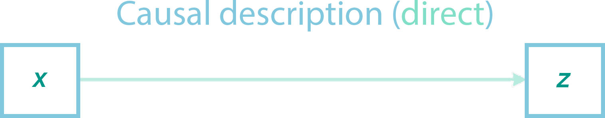
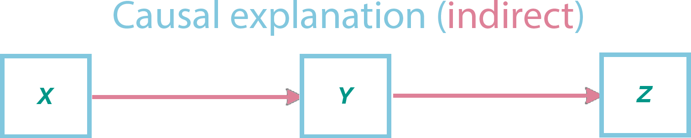
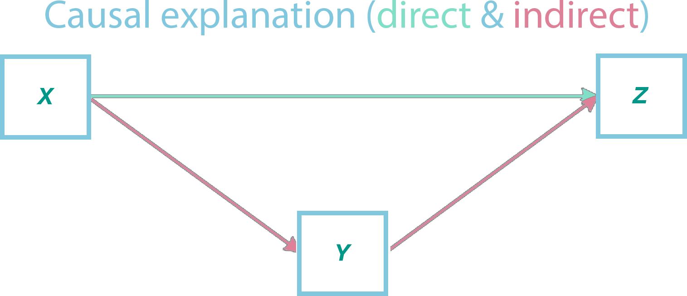
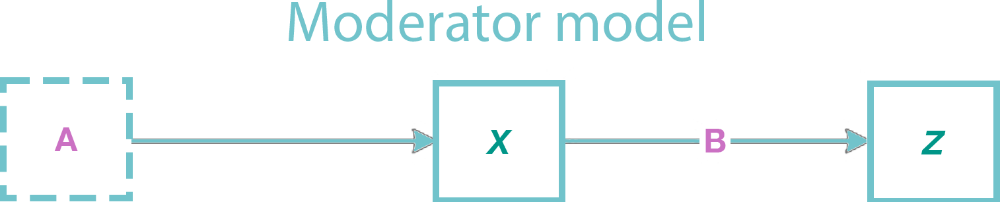
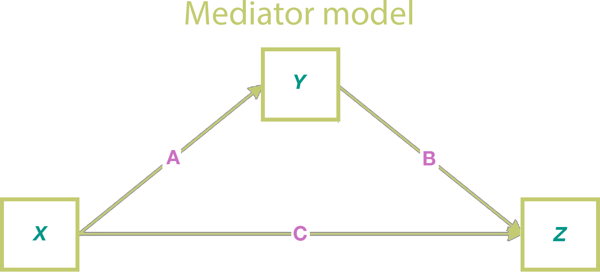
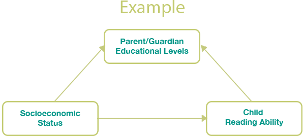

<script src="https://ajax.googleapis.com/ajax/libs/jquery/3.6.0/jquery.min.js"></script>

<script type="text/x-mathjax-config">
MathJax.Hub.Register.StartupHook("TeX Jax Ready",function () {
  MathJax.Hub.Insert(MathJax.InputJax.TeX.Definitions.macros,{
    cancel: ["Extension","cancel"],
    bcancel: ["Extension","cancel"],
    xcancel: ["Extension","cancel"],
    cancelto: ["Extension","cancel"]
  });
});
</script>

<style>
section {
    display: flex;
    display: -webkit-flex;
}

section {
    height: 600px;
    width: 60%;
    margin: auto;
    border-radius: 21px;
    background-color: #212121;
}

.remark-slide-container {
background: #212121;
}

.hljs-github .hljs {
    background: transparent;
    color: #b2dfdb;
}

.hljs-github .hljs-keyword {
    color: #64b5f6;
}

.hljs-github .hljs-literal {
    color: #64b5f6;
}

.hljs-github .hljs-number {
    color: #64b5f6;
}

.hljs-github .hljs-string {
    color: #b7b3ef;
}


.hljs-github .hljs {
    background: transparent;
    color: #b2dfdb;
}

.hljs-github .hljs-keyword {
    color: #64b5f6;
}

.hljs-github .hljs-literal {
    color: #64b5f6;
}

.hljs-github .hljs-number {
    color: #64b5f6;
}

.hljs-github .hljs-string {
    color: #b7b3ef;
}

section p {
    text-align: center;
    font-size: 30px;
    background-color: #212121;
    border-radius: 21px;
    font-family: Roboto Condensed;
    font-style: bold;
    padding: 12px;
    color: #bff4ee;
    margin: auto;
}

#center {
text-align: center;
}

#right {
  text-align: right;
} 

.center p {
  margin: 0;
  position: absolute;
  top: 50%;
  left: 50%;
  -ms-transform: translate(-50%, -50%);
  transform: translate(-50%, -50%);
}

.center2 {
  margin: 0;
  position: absolute;
  top: 50%;
  left: 50%;
  -ms-transform: translate(-50%, -50%);
  transform: translate(-50%, -50%);
}

.tab {
    display: inline-block;
    margin-left: 40px;
}

.tabdbl {
    display: inline-block;
    margin-left: 80px;
}

.tabtpl {
    display: inline-block;
    margin-left: 120px;
}


.obr
{
    display:block;
    margin-top:-15px;
}

.pull-left-left {
  float: left;
  width: 27%;
}

.pull-right-right {
  float: right;
  width: 32%;
}

img.expand:hover {
  margin: 0 auto;
  position: relative;
  width: 50%;
  display: flex;
  justify-content: center;
  align-items: center;
  align-content: center;
  transform: scale(1.5)             
  translateX(-35%);
  z-index: 99;
  transition:all 0.5s ease-in-out;
  -webkit-transition:all 0.2s ease-in-out;
}

.vertline {
  border-left: 5px solid #212121;
  height: 100px;
  margin-left: 15px;
  margin-right: 15px;
}

*, *:before, *:after {
	 box-sizing: border-box;
	 outline: none;
}

.hover {
	 position: relative;
	 display: flex;
	 align-items: center;
	 justify-content: center;
	 width: 400px;
	 height: 65px;
	 background-color: #e3c0ff;
	 border-radius: 99px;
	 box-shadow: 0 1px 3px rgba(0, 0, 0, 0.12), 0 1px 2px rgba(0, 0, 0, 0.24);
	 transition: all 0.3s cubic-bezier(0.25, 0.8, 0.25, 1);
	 overflow: hidden;
}

 .hover:before, .hover:after {
	 position: absolute;
	 top: 0;
	 display: flex;
	 align-items: center;
   justify-content: center;
	 width: 50%;
	 height: 100%;
	 transition: 0.25s linear;
	 z-index: 1;
}

 .hover:before {
	 content: '';
	 left: 0;
	 background-color: #ca86ec;
   color: #212121;
}

 .hover:after {
	 content: '';
	 right: 0;
	 background-color: #d896ff;
}

 .hover:hover {
	 background-color: #cc8bff;
	 box-shadow: 0 14px 28px rgba(0, 0, 0, 0.25), 0 10px 10px rgba(0, 0, 0, 0.22);
}

 .hover:hover span {
	 opacity: 0;
	 z-index: -3;
}

 .hover:hover:before {
	 opacity: 0.5;
	 transform: translateY(-100%);
}

 .hover:hover:after {
	 opacity: 0.5;
	 transform: translateY(100%);
}

 .hover span {
	 position: absolute;
	 top: 0;
	 left: 0;
	 display: flex;
	 align-items: center;
	 justify-content: center;
	 text-align: center;
	 width: 100%;
	 height: 100%;
	 color: #212121;
	 font-size: 24px;
	 font-weight: 700;
	 opacity: 1;
	 transition: opacity 0.25s;
	 z-index: 2;
   white-space:pre;
}

 .hover .doc-link {
	 position: relative;
	 display: flex;
	 align-items: center;
	 justify-content: center;
	 text-align: center;
	 width: 25%;
	 height: 100%;
	 color: whitesmoke;
	 font-size: 24px;
	 text-decoration: none;
	 transition: 0.25s;
}
 .hover .doc-link i {
	 text-shadow: 1px 1px rgba(70, 98, 127, 0.7);
	 transform: scale(1);
}
 .hover .doc-link:hover {
	 background-color: rgba(245, 245, 245, 0.1);
}
 .hover .doc-link:hover i {
	 animation: bounce 0.4s linear;
}
 @keyframes bounce {
	 40% {
		 transform: scale(1.4);
	}
	 60% {
		 transform: scale(0.8);
	}
	 80% {
		 transform: scale(1.2);
	}
	 100% {
		 transform: scale(1);
	}
}

.boxl {
    width: 50%;
    margin: 5px;
    text-align: center;
}

.boxr {
    margin: 5px;
    text-align: center;
}

.picr {
    display: flex;
    justify-content: space-around;
    align-items: center;
}
</style>

```{r setup, include=FALSE, purl=FALSE}
library(tidyverse)
library(patchwork)
library(pwr)
library(knitr)
library(kableExtra)
library(DT)
library(scales)
library(fontawesome)
library(flipbookr)
library(tweetrmd)
library(here)
library(showtext)
font_add_google("Roboto Condensed", "roboto")
showtext_auto()
```

```{css echo=FALSE}
.highlight-last-item > ul > li,
.highlight-last-item > ol > li {
  opacity: 0.5;
}
.highlight-last-item > ul > li:last-of-type,
.highlight-last-item > ol > li:last-of-type {
  opacity: 1;
}
```

```{r echo = FALSE, purl=FALSE}
xaringanthemer::style_duo(
  primary_color = "#212121",
  secondary_color = "#bff4ee",
  link_color = "#b1ead6",
  code_inline_background_color = "transparent",
  code_inline_color = "#009688",
  code_highlight_color = "#212121",
  text_bold_color = "#00b0cc",
  table_row_border_color = "#212121",
  table_row_even_background_color = "#212121",
  footnote_font_size = "0.6em",
  header_font_google = xaringanthemer::google_font("Roboto Condensed", "700"),
  text_font_google   = xaringanthemer::google_font("Roboto Condensed", "400")
)

xaringanExtra::use_xaringan_extra(c("tile_view", 
                                    "animate_css", 
                                    "tachyons"))

xaringanExtra::use_panelset()

xaringanExtra::use_logo(
  image_url = here::here("static", "img", "course_hex.png"),
  link_url = "https://edp619.asocialdatascientist.com",
  position = xaringanExtra::css_position(top = "1em", right = "1em")
)

opts_chunk$set(dev.args=list(bg="transparent"))
```

---

class: highlight-last-item
layout: true

---

# Experiments and Causation 

---

## Cause 

--

+ Variable that produces an effect or result

--

+ Most causes are **inus** 
	
.pull-left[
> A cause is an insufficient (**i**) 

> but non-redundant (**n**) 

> part of an unnecessary (**u**) but

> sufficient condition (**s**)
]

--

.pull-right[
Example
]

--

- A given event may have many different causes
	
--

- Many factors are required for an effect to occur, but they can rarely be fully known and how they relate to one another

---

## Effect 

--

+ **Probabilistic Outcomes**. difference between what did happen and what would have happened

--

+ **Counterfactual**. generally requires some necessary factor without which the outcome would not have occurred
	
---

## Counterfactual 

--
<br>
<br>
<br>
<center><i>Knowledge of what would have happened in the absence of a suspected causal agent</i></center>
<br>
<br>
<br>
<br>
<br>
<br>

--

.pull-left[Physically impossible since we cannot simultaneously receive and not receive a treatment]

--

.pull-right[So the central task of all cause-probing research is to approximate the physically impossible counterfactual]


---

# Criteria to Establish Causality

--

1. **Temporal precedence**. cause preceded effect

--

2. **Covariation**. cause and effect move together

--

3. **No plausible alternative explanations**. no other variable or factor is causing the outcome

---

# Cause, Effect, and Causal Relationships in Experiments

--

+ **Temporal precedence**. presumed causes are manipulated to observe their effect

--

+ **Covariation**. variability in cause related to variation in an effect

--

+ **No plausible alternative explanations**. elements of design and extra-study knowledge are used to account for and reduce the plausibility of alternative explanations

---

# Causation, Correlation, and Confounds 

--

<br>
<br>
<br>
<center><span style="color:#ff8080; font-weight: bold; font-size: 1.2em;">Correlation does not prove Causation!</span></center>
<br>
<br>
<br>

--

.pull-left[.tabtpl[Fails **Temporal precedence** <br><br><span style="color:#ffb3c2;">Correlations do not meet the first premise of causal logic since we cannot determine direction</span>]]

--

.pull-right[.tabtpl[Fails **No plausible alternative explanations**<br><br><span style="color:#ffb3c2;">These relationships are often due to a third variable (i.e., a confound)</span>]]

---

## Correlations: Making Some Sense Out Of a Mess

--

```{r, echo=FALSE,  warning=FALSE, message=FALSE, error=FALSE}
auto <- read_csv("data/Auto.csv",
                 show_col_types = FALSE)
```

```{r, echo=FALSE, warning=FALSE, message=FALSE, error=FALSE, out.width="25%"}
neg <- 
  ggplot(data=auto, mapping = aes(x = weight, y = mpg)) + 
  geom_point(aes(color = origin),
             shape = 21,
             show.legend = FALSE) +
 scale_color_distiller(palette = "Spectral") +
 theme_void(base_family = "roboto") +
 theme(plot.title = element_text(color = "#ffffff",
                                 hjust = 0.5,
                                 size = 20),
       plot.background = element_rect(fill = "#212121",
                                      color = "#212121"),
       panel.border = element_blank()) +
  ggtitle("Negative Correlation")
```


```{r, echo=FALSE, warning=FALSE, message=FALSE, error=FALSE, out.width="25%"}
pos <- 
  ggplot(data=auto, mapping = aes(x = weight, y = horsepower)) + 
  geom_point(aes(color = origin),
             shape = 21,
             show.legend = FALSE) +
 scale_color_distiller(palette = "Spectral") +
 theme_void(base_family = "roboto") +
 theme(plot.title = element_text(color = "#ffffff",
                                 hjust = 0.5,
                                 size = 20),
       plot.background = element_rect(fill = "#212121",
                                      color = "#212121"),
       panel.border = element_blank()) +
  ggtitle("Postive Correlation")
```

```{r, echo=FALSE, warning=FALSE, message=FALSE, error=FALSE, out.width="25%"}
no <-
  ggplot(data=auto, mapping = aes(x = weight, y = acceleration)) + 
  geom_point(aes(color = origin),
             shape = 21,
             show.legend = FALSE) +
 scale_color_distiller(palette = "Spectral") +
 theme_void(base_family = "roboto") +
 theme(plot.title = element_text(color = "#ffffff",
                                 hjust = 0.5,
                                 size = 20),
       plot.background = element_rect(fill = "#212121",
                                      color = "#212121"),
       panel.border = element_blank()) +
  ggtitle("Weak or No Correlation")
```
<br>
<br>
```{r, echo=FALSE, warning=FALSE, message=FALSE, error=FALSE, fig.height=5, fig.width=15, fig.align='center'}
neg + no + pos + 
  plot_annotation(
    theme = theme(plot.background = element_rect(fill = "#212121",
                                                 color = "#212121"))
  )
```

---

# Manipulable and Nonmanipulable Causes 
<br>
<br>
<br>
<br>
<br>
<br>
--


.pull-left[Experiments involve causal agents that can be *manipulated*]

--

.pull-right[Rigid criteria (e.g., ethnicity, gender) are *non manipulable* causes in experiments because they cannot be deliberately varied]

---

# Causal Description and Causal Explanation 

--

+ **Causal description**. identifying that a causal relationship exists between `X` and `Y`

--

+ **Molar causation**. the overall relationship between a treatment package and its effects

--

+ **Causal explanation**. explaining how `X` causes `Y`

--

+ **Molecular causation**. knowing which parts of a treatment are responsible for which parts of an effect

---

# Causal Models (1)
<br>
<br>
.pull-left[
<center>

<center>
]

--

.pull-right[
<center>

<center>
]

--

<br>
<br>
<br>
<center>

<center>

---

# Causal Models (2)
<br>
<br>

--


.pull-left[]


--

.pull-right[]
<br>
<br>
<br>
<br>

--

.pull-left[]

--

.pull-right[]

---

# Modern Descriptions of Experiments 

---

# Randomized Experiment 

--

+ Units are assigned to conditions randomly

--

+ Randomly assigned units are probabilistically equivalent based on expectancy (if certain conditions are met)
	
--

+ Under the appropriate conditions, randomized experiments provide unbiased estimates of an effect

---

## Quasi-Experiment 

--

> Shares all features of randomized experiments except assignment

--

> Assignment to conditions occurs by self-selection

--

> Greater emphasis on enumerating and ruling out alternative explanations through 
  + logic<br><br>
  + reasoning<br><br>
  + design<br><br>
  + measurement

---

## Natural Experiment 

> Naturally-occurring contrast between a treatment and comparison condition

--

> Typically concern nonmanipulable causes

--

> Requires constructing a counterfactual rather than manipulating one

---

# Nonexperimental Designs 

+ Often called correlational or passive designs (i.e., cross-sectional)

--

+ Statistical controls often used in place of structural design elements

--

+ Generally do not support strong causal inferences

---

# Experiments and the Generalization of Causal Connections 

--

+ Most experiments are localized but have general aspirations 

--

+ Limited samples of **utos** 
  > units (**u**)<br><br> 
  > treatments (**t**)<br><br> 
  > observations (**o**)<br><br> 
  > settings (**s**)

--

+ Known as **local molar causal validity**

---

# Construct Validity: Causal Generalization as Representation 

--

+ Premised on generalizing from particular sampled instances of units, treatments, observations, and settings to the abstract, higher order constructs that sampled instances represent

---

# External Validity: Causal Generalization as Extrapolation 

--

+ Inferring a causal relationship to unsampled units, treatments, observations, and settings from sampled instances

--

+ Enhanced when probability sampling methods are used

--

.pull-left[.tabtpl[<span style = "line-height:4.5em;">Broad &#8594; Narrow</span>]]


.pull-right[.tabtpl[<span style = "line-height:4.5em;">Narrow &#8594; Broad</span>]]

---

# Approaches to Making Causal Generalizations

--

+ Applying probability sampling techniques

--

+ Arguing causal reasoning

--

+ Employing interpolation and extrapolation

--

+ Establishing discrimination

--

+ Implementing a Grounded Theory approach

--

+ Ruling out irrelevancies

--

+ Uncovering heterogeneous instances

--

+ Using targeted purposive sampling

--

+ Utilizing surface and structural similarity in analogical reasoning


---


# Validity

--

> Approximate truthfulness of correctness of an inference

--

>  Not an all or none, either or, condition, rather a matter of degree

--

> Efforts to increase one type of validity often reduce others

---

## Statistical Conclusion Validity


.center2[ 
Validity of inferences about the covariation between a treatment (cause) and corresponding outcome (effect)
]

---

## Internal Validity

 
.center2[Validity of inferences about whether observed covariation between `A` (treatment/cause) and `Y` (outcome/effect) reflects a causal relationship from `X` to `Y` as those variables were manipulated or measured]

---

## Construct Validity


.center2[Validity of inferences about the higher order constructs that represent sampling particulars]

---

## External Validity 


.center2[Validity of inferences about whether a cause-effect relationship holds over variations in units, treatments, observations, and settings]

---

## Internal Validity

--

.center2[Inferences about whether the observed covariation between `X` and `Y` reflects a causal relationship from `X` to `Y` in the form in which the variables were manipulated or measured]


---

### Note

.center2[In most cause-probing studies, internal validity is the primary focus]

---

# Threats to Validity 

--

<br>
<br>
<center>
<b>Reasons why an inference may be partly or wholly incorrect</b>
</center>
<br>
<br>
<hr style="width:25%"> 


--

<br>
<center>
<b>Design controls can be used to reduce many validity threats, but not in all instances</b>
</center>
<br>
<br>
<hr style="width:25%"> 

--

<br>
<center>
<b>Generally context-dependent</b>
</center>

---

## Threats to Internal Validity

---

### Single Group Studies (1)

--

.pull-left[
<br>
<p id="center" style="color:#f7c1e5; font-weight: bold; border:1px; border-style:solid; border-color:#f7c1e5; border-radius: 25px; padding: 0.3em;">
<i>History</i><br><br>
an unrelated event influences the outcomes
</p>
]


.pull-right[
<br>
<p id="center" style="color:#f7c1e5; border:1px; border-style:solid; border-color:#f7c1e5; border-radius: 25px; padding: 0.3em;">
<i>Example</i><br><br>
A week before the closing of a survey on worker well-being, a new CEO takes over and announces to all employees in an email that there will be layoffs resulting in a 20% reduction in the total number of workers. As a result survey responses moving forward are skewed.
</p>
]

--

.pull-left[
<br>
<p id="center" style="color:#bca0dc; font-weight: bold; border:1px; border-style:solid; border-color:#bca0dc; border-radius: 25px; padding: 0.3em;">
<i>Maturation</i><br><br>
 the outcomes of a study vary as a natural result of time.
</p>
]

.pull-right[
<br>
<p id="center" style="color:#bca0dc; border:1px; border-style:solid; border-color:#bca0dc; border-radius: 25px; padding: 0.3em;">
<i>Example</i><br><br>
Most participants are new to their job at the time of an employee ability survey assessment. A month later, their productivity has improved as a result of time spent working in the position
</p>
]

---

### Single Group Studies (2)

--

.pull-left[
<p id="center" style="color:#e69288; font-weight: bold; border:1px; border-style:solid; border-color:#e69288; border-radius: 25px; padding: 0.3em;">
<i>Instrumentation</i><br><br>
different measures are used in pre-test and post-test phases
</p>
]

.pull-right[
<p id="center" style="color:#e69288;  border:1px; border-style:solid; border-color:#e69288; border-radius: 25px; padding: 0.3em;">
<i>Example</i><br><br>
survey participants are given 5 minutes to complete a pre-test survey prior to a training session causing some to leave some items blank. However the same participants are asked to fill out a post-test survey with identical questions, but are afforded 15 minutes for completion allowing everyone adequate time to address all items
</p>
]

--

.pull-left[
<p id="center" style="color:#78c1c9; font-weight: bold; border:1px; border-style:solid; border-color:#78c1c9; border-radius: 25px; padding: 0.3em; width: 525px;">
<i>Testing</i><br><br>
a pre-test influences the outcomes of the post-test
</p>
]


.pull-right[
<p id="center" style="color:#78c1c9; border:1px; border-style:solid; border-color:#78c1c9; border-radius: 25px; padding: 0.3em; width: 525px;">
<i>Example</i><br><br>
low-performing students are given an self-reported survey of skills prior to a six week math and science camp. After the camp comes to a close, the same participants are asked to fill out an identical survey. Outcomes indicate higher self-reported scores due to the familiarity and/or awareness of the survey's purpose. 
</p>
]

---

### Countering Threats to Single Group Studies

--

> Adding a comparable control group counters all threats to single-group studies. If comparable control and treatment groups each face the same threats, the outcomes of the study won’t be affected by them

--

> A large sample size counters testing, because results would be more sensitive to any variability in the outcomes

--

> Using filler-tasks or questionnaires to hide the purpose of study also counters testing threats

---

### Multi-group Studies (1)

--

.pull-left[
<p id="center" style="color:#74cbda; font-weight: bold; border:1px; border-style:solid; border-color:#74cbda; border-radius: 25px; padding: 0.3em;">
<i>Attrition</i><br><br>
unexplained or uncontrollable dropout from participants
</p>
]


.pull-right[
<p id="center" style="color:#74cbda; border:1px; border-style:solid; border-color:#74cbda; border-radius: 25px; padding: 0.3em;">
<i>Example</i><br><br>
due to an error in your survey's functionality that was caught a day after the initial launch, 20% of participants provided unusable data. Almost all of the responses were from a control group making it impossible hard to compare the responses with those from a treatment groups that did not experience said error.
</p>
]

--

.pull-left[
<p id="center" style="color:#8ec9bb; font-weight: bold; border:1px; border-style:solid; border-color:#8ec9bb; border-radius: 25px; padding: 0.3em;">
<i>Regression to the mean</i><br><br>
there is a statistical tendency for people who score extremely low or high on a test to score closer to the middle the next time
</p>
]


.pull-right[
<p id="center" style="color:#8ec9bb; border:1px; border-style:solid; border-color:#8ec9bb; border-radius: 25px; padding: 0.3em;">
<i>Example</i><br><br>
Participants are placed into groups based on their initial scores on a survey following a training. As a result, it is difficult to determine whether the outcomes would be due to the treatment or statistical norms
</p>
]

---


### Multi-group Studies (2)

--

.pull-left[
<p id="center" style="color:#fbc1ae; font-weight: bold; border:1px; border-style:solid; border-color:#fbc1ae; border-radius: 25px; padding: 0.3em;">
<i>Selection bias</i><br><br>
groups are not comparable at the beginning of the study
</p>
]


.pull-right[
<p id="center" style="color:#fbc1ae; border:1px; border-style:solid; border-color:#fbc1ae; border-radius: 25px; padding: 0.3em;">
<i>Example</i><br><br>
Scores on a survey administered to assess loneliness groups participants into two groups: high and low. Without the researchers' awareness, the groups also happen to consist of extroverts and introverts, respectively. Since there are already systematic differences between the groups at the baseline, any improvements or declines in group assessments may be due to reasons other than a treatment intended to address loneliness.
</p>
]

--

.pull-left[
<p id="center" style="color:#91eeaa; font-weight: bold; border:1px; border-style:solid; border-color:#8ec9bb; border-radius: 25px; padding: 0.3em;">
<i>Social interaction</i><br><br>
participants from different groups may compare notes and either figure out the aim of the study or feel resentful of others.
</p>
]


.pull-right[
<p id="center" style="color:#91eeaa; border:1px; border-style:solid; border-color:#8ec9bb; border-radius: 25px; padding: 0.3em;">
<i>Example</i><br><br>
Two groups of participants in a single-blind study are asked to take a pre-screening survey at different times. After submitting their responses, some of the individuals in the first group discover that participants who answered the items on the survey in a certain way guaranteed that they were placed into the experimental group. The information is passed along to most participants in the second group ensuring their admittance as well.
</p>
]

---

### Countering Threats to Multi-Group Studies

--

>  Blinding participants to the aim of the study counters the effects of social interaction.

--

> Random assignment of participants to groups counters selection bias and regression to the mean by making groups comparable at the start of the study.
    
---

# Estimating Internal Validity in Experiments 

--

> By definition randomized experiments eliminate selection through random assignment to conditions

--

> Most other threats are likely probabilistically distributed as well

--

> Typically only two likely validity threats arise from experiments

--


.pull-left[.tabtpl[<span style="color:#74cbda; font-weight: bold; font-style:italic; line-height:4.5em;">Attrition</span>]]

--

.pull-right[.tabtpl[<span style="color:#78c1c9; font-weight: bold; font-style:italic; line-height:4.5em;">Testing</span>]]

---

# Estimating Internal Validity in Quasi-Experiments

--

> Differences between groups tend to be more systematic than random

--

> All threats should be made explicit and then ruled out one by one
	
--

> Once identified, threats can be systematically examined

---

## Thats it!

If you have any questions, please reach out

--

<br>
<br>
<br>
<br>
<br>
<br>
<br>
<br>
<br>
<center>
<br><br>
<div class="fade_rule"></div>  
<br><br>
</center>

<center>
<a rel="license" href="http://creativecommons.org/licenses/by-nc-sa/4.0/"></a><br /><br />This work is licensed under a <br /><a rel="license" href="http://creativecommons.org/licenses/by-nc-sa/4.0/">Creative Commons Attribution-NonCommercial-ShareAlike 4.0 International License</a>
</center>
