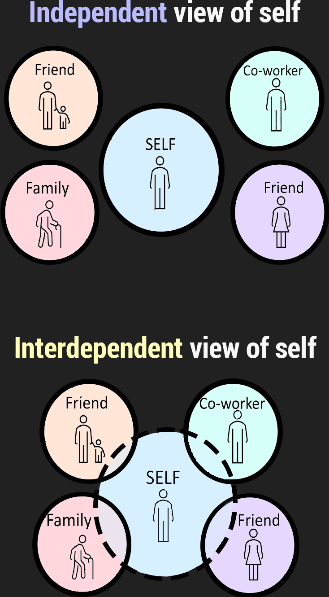

<script src="https://ajax.googleapis.com/ajax/libs/jquery/3.6.0/jquery.min.js"></script>

<script type="text/x-mathjax-config">
MathJax.Hub.Register.StartupHook("TeX Jax Ready",function () {
  MathJax.Hub.Insert(MathJax.InputJax.TeX.Definitions.macros,{
    cancel: ["Extension","cancel"],
    bcancel: ["Extension","cancel"],
    xcancel: ["Extension","cancel"],
    cancelto: ["Extension","cancel"]
  });
});
</script>

<style>
section {
    display: flex;
    display: -webkit-flex;
}

section {
    height: 600px;
    width: 60%;
    margin: auto;
    border-radius: 21px;
    background-color: #212121;
}

.remark-slide-container {
background: #212121;
}

.hljs-github .hljs {
    background: transparent;
    color: #b2dfdb;
}

.hljs-github .hljs-keyword {
    color: #64b5f6;
}

.hljs-github .hljs-literal {
    color: #64b5f6;
}

.hljs-github .hljs-number {
    color: #64b5f6;
}

.hljs-github .hljs-string {
    color: #b7b3ef;
}


.hljs-github .hljs {
    background: transparent;
    color: #b2dfdb;
}

.hljs-github .hljs-keyword {
    color: #64b5f6;
}

.hljs-github .hljs-literal {
    color: #64b5f6;
}

.hljs-github .hljs-number {
    color: #64b5f6;
}

.hljs-github .hljs-string {
    color: #b7b3ef;
}

section p {
    text-align: center;
    font-size: 30px;
    background-color: #212121;
    border-radius: 21px;
    font-family: Roboto Condensed;
    font-style: bold;
    padding: 12px;
    color: #bff4ee;
    margin: auto;
}

#center {
text-align: center;
}

#right {
  text-align: right;
} 

.center p {
  margin: 0;
  position: absolute;
  top: 50%;
  left: 50%;
  -ms-transform: translate(-50%, -50%);
  transform: translate(-50%, -50%);
}

.center2 {
  margin: 0;
  position: absolute;
  top: 50%;
  left: 50%;
  -ms-transform: translate(-50%, -50%);
  transform: translate(-50%, -50%);
}

.tab {
    display: inline-block;
    margin-left: 40px;
}

.obr
{
    display:block;
    margin-top:-15px;
}
</style>

```{css echo=FALSE}
.highlight-last-item > ul > li,
.highlight-last-item > ol > li {
  opacity: 0.5;
}
.highlight-last-item > ul > li:last-of-type,
.highlight-last-item > ol > li:last-of-type {
  opacity: 1;
}
```

```{r load_packages, echo = FALSE, message=FALSE, warning=FALSE}
library(tidyverse)
library(knitr)
library(kableExtra)
library(fontawesome)
library(here)
library(xaringanthemer)
library(showtext)
font_add_google("Roboto Condensed", "roboto")
showtext_auto()
```

```{r echo = FALSE, purl=FALSE}
xaringanthemer::style_duo(
  primary_color = "#212121",
  secondary_color = "#bff4ee",
  link_color = "#b1ead6",
  text_bold_color = "#4dc6e2",
  table_row_border_color = "#212121",
  table_row_even_background_color = "#212121",
  footnote_font_size = "0.6em",
  header_font_google = xaringanthemer::google_font("Roboto Condensed", "700"),
  text_font_google   = xaringanthemer::google_font("Roboto Condensed", "400")
)

xaringanExtra::use_xaringan_extra(c("tile_view", 
                                    "animate_css", 
                                    "tachyons"))

xaringanExtra::use_logo(
  image_url = here::here("static", "img", "course_hex.png"),
  link_url = "https://edp619.asocialdatascientist.com",
  position = xaringanExtra::css_position(top = "1em", right = "1em")
)
```

```{r echo=FALSE}
image_link <- function(image,url,...){
  htmltools::a(
    href=url,
    htmltools::img(src=image,...)
    )
}
```

---

class: highlight-last-item
layout: true

---

# Welcome! 

Some information about the audio files. Firstly and importantly, I'm no Morgan Freeman but each page will have some audio that will hopefully help you understand a bit more about what's on the page

<center>
<audio controls preload="auto">
  <source src="audio/criteria/S1_Introduction.mp3" type="audio/mpeg">
  Your browser does not support embedded audio.
<audio>
</center>

---

# Defining Evaluations 

.bg-washed.b--dark-green.ba.bw2.br3.shadow-5.ph4.mt5[
**Evaluation** is the act or process of determining the ***merit***, ***worth***, or ***significance*** of something or the product of that process.
]

<br>
<center>
<audio controls preload="auto">
  <source src="audio/criteria/S2_Evaluation_Definition.mp3" type="audio/mpeg">
  Your browser does not support embedded audio.
</audio>
</center>

---

# Explaining it to Everyone Else 

<center>
.bg-washed.b--dark-green.ba.bw2.br3.shadow-5.ph4.mt5[
**Evaluation** answers ***if it works?*** and ***why does it work?***
]
</center>
<br>
<br>

--

We typically leave the ***if it works?*** to people with grounded knowledge in a particular area - aka *content experts*. 

---

# Merit, Worth, & Significance

--

.pull-left[
First consider these

+ What do ***merit***, ***worth***,and ***significance*** mean to you both separately and combined?

+ Can you think of real world examples of each?
]

--

<br>
<br>
<br>
<br>
<br>
<br>
<br>
.pull-right[
Now listen to these
<br>

<center>
<audio controls preload="auto">
  <source src="audio/criteria/S3a_Merit_Worth_Significance.mp3" type="audio/mpeg">
  Your browser does not support embedded audio.
</audio>
</center>
<br>
<center>
<audio controls preload="auto">
  <source src="audio/criteria/S3c_Merit.mp3" type="audio/mpeg">
  Your browser does not support embedded audio.
</audio>
</center>
<br>
<center>
<audio controls preload="auto">
  <source src="audio/criteria/S3d_Worth.mp3" type="audio/mpeg">
  Your browser does not support embedded audio.
</audio>
</center>
<br>
<center>
<audio controls preload="auto">
  <source src="audio/criteria/S3e_Significance.mp3" type="audio/mpeg">
  Your browser does not support embedded audio.
</audio>
</center>
]

---

# Evaluation 

<br>
<br>
<br>
.pull-left[
Evaluation is the act or process of determining the 

> *merit* (***quality***)

> *worth* (***value***), or 

> *significance* (***importance***) 

of something or the product of that process
]

.pull-right[
<br>
<br>
<br>
<center>
<audio controls preload="auto">
  <source src="audio/criteria/S4_Evaluation_Definition_Extended.mp3" type="audio/mpeg">
  Your browser does not support embedded audio.
</audio>
</center>
]

---

# Eval Stem 

--

<br>
<br>
<br>
.pull-left[
<i>Evaluand</i>
<br>
<br>
This is not always as obvious to define in practice as it may seem. Where are the boundaries of a particular program? Do the evaluator, their employer, and various other stakeholders agree on those boundaries?
]

.pull-right[
<i>Evaluator</i> 
<br>
<br>
Who you are matters… more on this later
]

<br>
<center>
<audio controls preload="auto">
  <source src="audio/criteria/S5_Evaluand_and_Evaluator.mp3" type="audio/mpeg">
  Your browser does not support embedded audio.
</audio>
</center>

---

# Criteria, Standard, and Indicator 

.pull-left[
First consider these

+ In addition to defining these for ourselves, what are examples from everyday?

+ Which of the three is harder to identify? Why?
]

<br>
<br>
<br>
<br>
<br>
<br>
<br>
.pull-right[
Now listen to these
<br>

<center>
<audio controls preload="auto">
  <source src="audio/criteria/S6b_Criteria.mp3" type="audio/mpeg">
  Your browser does not support embedded audio.
</audio>
</center>
<br>
<center>
<audio controls preload="auto">
  <source src="audio/criteria/S6c_Indicator.mp3" type="audio/mpeg">
  Your browser does not support embedded audio.
</audio>
</center>
<br>
<center>
<audio controls preload="auto">
  <source src="audio/criteria/S6d_Standard.mp3" type="audio/mpeg">
  Your browser does not support embedded audio.
</audio>
</center>
]

---

# <b>Primary</b> Purposes of Evaluation

--

<br>
<br>
<br>
.pull-left[
<p id="center" style="color:#ffb3ba; font-weight: bold; border:1px; border-style:solid; border-color:#ffb3ba; border-radius: 25px; padding: 0.3em;">
<i>Formative</i><br><br>
Conducted with the intent to improve
</p>
]

.pull-right[
<p id="center" style="color:#bae1ff; font-weight: bold; border:1px; border-style:solid; border-color:#bae1ff; border-radius: 25px; padding: 0.3em;">
<i>Summative</i><br><br>
Conducted with the intent to inform decision making and/or determine judgment
</p>
]


</audio>
</center>
<br>
<center>
<audio controls preload="auto">
  <source src="audio/criteria/S7_Formative_Summative.mp3" type="audio/mpeg">
  Your browser does not support embedded audio.
</audio>
</center>

---

# <b>Secondary</b> Purposes of Evaluation 

--

.pull-left[
<p id="center" style="color:#f9c7ca; font-weight: bold; border:1px; border-style:solid; border-color:#f9c7ca; border-radius: 25px; padding: 0.3em;">
<i>Developmental</i><br><br>
To help develop an intervention or program
</p>
]

--

.pull-right[
<p id="center" style="color:#95f4f1; font-weight: bold; border:1px; border-style:solid; border-color:#95f4f1; border-radius: 25px; padding: 0.3em;">
<i>Accountability</i><br><br>
To hold accountable
</p>
]

--

<center>
<br>
<p id="center" style="color:#ccfaca; font-weight: bold; border:1px; border-style:solid; border-color:#ccfaca; border-radius: 25px; padding: 0.3em; width: 525px;">
<i>Monitoring</i><br><br>
To assess implementation and gauge progress toward a desired end
</p>
<br>
</center>

--

.pull-left[
<p id="center" style="color:#f7d5b5; font-weight: bold; border:1px; border-style:solid; border-color:#f7d5b5; border-radius: 25px; padding: 0.3em;">
<i>Knowledge Generation</i><br><br>
To generate knowledge about general patterns of effectiveness
</p>
]

--

.pull-right[
<p id="center" style="color:#b1d5f7; font-weight: bold; border:1px; border-style:solid; border-color:#b1d5f7; border-radius: 25px; padding: 0.3em;">
<i>Ascriptive</i><br><br>
Merely for the sake of knowing
</p>
]

---

# Developmental vs Formative Evaluation


.center2[
<iframe width="670.2" height="330.6" src="https://www.youtube.com/embed/Wg3IL-XjmuM" frameborder="0" allow="accelerometer; autoplay; clipboard-write; encrypted-media; gyroscope; picture-in-picture" allowfullscreen>
</iframe>
]

---

# A bit more on Developmental Evaluation 

</audio>
</center>
<br>
<center>
<audio controls preload="auto">
  <source src="audio/criteria/S10_Developmental.mp3" type="audio/mpeg">
  Your browser does not support embedded audio.
</audio>
</center>

---

# Try This at Home

</audio>
</center>
<br>
<center>
<audio controls preload="auto">
  <source src="audio/criteria/S11_Activity.mp3" type="audio/mpeg">
  Your browser does not support embedded audio.
</audio>
</center>
<br>
<br>
```{r tbl10, echo = FALSE}
tibble::tribble(
  ~` `, ~`What might the purpose of the evaluation be?`, ~`What questions might the evaluation try to answer?`,
  "<span style='color:#ffb3ba; font-weight: bold;'><i>Formative</i></span> <b>Evaluation</b>"," "," ",
  "The program has been designed and piloted with a group of 20 principals. What kind of evaluative feedback should the ASDC seek?"," "," ",
  " "," "," ",
  "<span style='color:#bae1ff; font-weight: bold;'><i>Summative</i></span> <b>Evaluation</b>"," "," ",
  "The program has been delivered to all principals in the county. What kind of evaluative feedback should the ASDC seek?"," "," "
) %>%
 knitr::kable(escape = FALSE)%>%
  row_spec(0:4, color = "white", background = "#212121")
```

---

# Introduction to Roles and Styles 

--

.pull-left[
Evaluator Roles: Independent, Topical, External, Internal
]

.pull-right[
The one that you fill in your evaluation will determine a lot!
]

</audio>
</center>
<br>
<center>
<audio controls preload="auto">
  <source src="audio/criteria/S12b_Independent.mp3" type="audio/mpeg">
  Your browser does not support embedded audio.
</audio>
</center>
<br>
<center>
<audio controls preload="auto">
  <source src="audio/criteria/S12c_External.mp3" type="audio/mpeg">
  Your browser does not support embedded audio.
</audio>
</center>
<br>
<center>
<audio controls preload="auto">
  <source src="audio/criteria/S12d_Topical.mp3" type="audio/mpeg">
  Your browser does not support embedded audio.
</audio>
</center>
<br>
<center>
<audio controls preload="auto">
  <source src="audio/criteria/S12e_Internal.mp3" type="audio/mpeg">
  Your browser does not support embedded audio.
</audio>
</center>


---

# Defining Culture 

<div style="margin-left: 380px; margin-top: 300px; position:absolute;">
<center>
<audio controls preload="auto">
  <source src="audio/criteria/S13_Culture.mp3" type="audio/mpeg">
  Your browser does not support embedded audio.
</audio>
</center>
</div>

--

> What is culture?


> How do we recognize it?

--

<br>
<i>Culture can be defined as the shared experiences of people, including their languages, values, customs, beliefs, and more. It also includes worldviews, ways of knowing, and ways of communicating. Culturally significant factors encompass, but are not limited to, race/ethnicity, religion, social class, language, disability, sexual orientation, age, and gender.</i><br>
.pull-right[
-- American Evaluation Association (2011)
]

---

# The Iceberg

.pull-left[
<center>

</center>
]

.pull-right[
<br>
<br>
<br>
<br>
<br>
<br>
<br>
<center>
<audio controls preload="auto">
  <source src="audio/criteria/S14_Iceberg.mp3" type="audio/mpeg">
  Your browser does not support embedded audio.
</audio>
</center>
]

---

# Markus & Kitayama (1991) 

.pull-left[
<center>

</center>
]

.pull-right[
<br>
<br>
<br>
<br>
<br>
<center>
<audio controls preload="auto">
  <source src="audio/criteria/S15_Self.mp3" type="audio/mpeg">
  Your browser does not support embedded audio.
</audio>
<br>
<br>
<br>
<br>
Download the <a href="docs/%4D%61%72%6B%75%73%20%26%20%4B%69%74%61%79%61%6D%61%20%28%31%39%39%31%29%2E%70%64%66" target="_blank">article</a>
</center>
]

---

# Cultural Influences Activity 

.pull-left[
How might each of the following influence an evaluation’s design and implementation?

> Language of participants

> Role of food and eating

> Evaluators attire when interacting with participants
 
> Concept of time

> Communication styles

> Importance of family relationships

> Values/norms re: individualism, independence, conflict

> Understanding of social structure
]


.pull-right[
<br>
<br>
<br>
<br>
<br>
<br>
<br>
<center>
<audio controls preload="auto">
  <source src="audio/criteria/S16_Cultural_Activity.mp3" type="audio/mpeg">
  Your browser does not support embedded audio.
</audio>
</center>
]

---

# Increasing your cultural sensitivity 

<div style="margin-left: 380px; margin-top: 320px; position:absolute;">
<center>
<audio controls preload="auto">
  <source src="audio/criteria/S17_Sensitivity.mp3" type="audio/mpeg">
  Your browser does not support embedded audio.
</audio>
</center>
</div>

--

Try to

--

> Assess your own attitudes, beliefs, values

> Incorporate culturally diverse groups and perspectives throughout evaluation process

> Build in sufficient time to negotiate access and build trust in community / organization

> Demystify evaluation, avoid jargon, build buy-in

> Be flexible in choice of evaluation methods, use multiple data sources, multiple data collection methods, multiple perspectives

---

# Meta-evaluation

<div style="margin-left: 380px; margin-top: 340px; position:absolute;">
<center>
<audio controls preload="auto">
  <source src="audio/criteria/S18_Meta_Evaluation.mp3" type="audio/mpeg">
  Your browser does not support embedded audio.
</audio>
</center>
</div>

--

A ***metaevaluation*** is an evaluation of an evaluation or evaluations

--

<br>
<center>
There are two main types
</center>
<br>
<br>

.pull-left[
<p id="center" style="color:#e7d1ff; font-weight: bold; border:1px; border-style:solid; border-color:#ffb3ba; border-radius: 25px; padding: 0.3em;">
<i>Formal</i><br><br>
Extra, external study to authenticate the process or product of the evaluation
</p>
]

.pull-right[
<p id="center" style="color:#e9ffd1; font-weight: bold; border:1px; border-style:solid; border-color:#bae1ff; border-radius: 25px; padding: 0.3em;">
<i>Informal</i><br><br>
Evaluating an evaluation or evaluations
</p>
]

---

# Things to Evaluate

--

<br>
<br>
<br>
<br>
.pull-left[
> Evaluation criteria

> Evaluation standards

> Performance

> Program costs

> Program goals
]

.pull-right[
<br>
<br>
<br>
<center>
<audio controls preload="auto">
  <source src="audio/standards/S1 Things to Evaluate.mp3" type="audio/mpeg">
  Your browser does not support embedded audio.
<audio>
</center>
]

---

# Things to Consider 

--

<br>
<br>
<br>
<br>
.pull-left[
> [Evaluation Standards](https://evaluationstandards.org/program/)

> Location

> Stakeholder Needs

> Sponsor Needs

> Your costs
]

.pull-right[
<br>
<br>
<br>
<center>
<audio controls preload="auto">
  <source src="audio/standards/S2 Things to Consider.mp3" type="audio/mpeg">
  Your browser does not support embedded audio.
<audio>
</center>
]

---

# Goals Include

<div style="margin-left: 380px; margin-top: 470px; position:absolute;">
<center>
<audio controls preload="auto">
  <source src="audio/standards/S3 Goals.mp3" type="audio/mpeg">
  Your browser does not support embedded audio.
<audio>
</center>
</div>

--

.pull-left[
Preparatory conditions
]

.pull-right[
+ What does it take to be ready to target a goal?
  
+ Progress toward that state is a goal
]
  
--

<br>
.pull-left[
Intended operations
]

.pull-right[
+ What a program tries to implement to achieve a goal is a type of goal.
]
  
--

<br>
.pull-left[
Targeted outcomes
]

.pull-right[
+ Short-term (initial)

+ Medium-term (intermediate)
  
+ Long-term (distant)
]

---

# Whose Goals are Important? 

It's not so clear cut!

<br>
<center>
<audio controls preload="auto">
  <source src="audio/standards/S4 Whose Goals.mp3" type="audio/mpeg">
  Your browser does not support embedded audio.
<audio>
</center>

---

# How to Decide Which Goals Matter Most? 

--

> Talk to stakeholders/sponsors; explicitly ask their perspective on recipient needs, program goals, and evaluation goals


> Figure out other ways to find needs


> Read all available program documentation

> Develop a logic model connecting needs through program activities, outputs and outcomes associated with goals

<br>
<center>
<audio controls preload="auto">
  <source src="audio/standards/S5 Deciding on Goals.mp3" type="audio/mpeg">
  Your browser does not support embedded audio.
<audio>
</center>

---

# Logic Model Parts

<div style="margin-left: 380px; margin-top: 340px; position:absolute;">
<center>
<audio controls preload="auto">
  <source src="audio/standards/S6 Logic Model Parts.mp3" type="audio/mpeg">
  Your browser does not support embedded audio.
<audio>
</center>
</div>

--

+ **Inputs**. what resources go into a program (aka investments)

--

+ **Outputs**. what is produced through those activities
  + **Activities**. what activities the program assumes (what actually occurs)
  + **Participation**. who is part of the program and how are they served (who is served like stakeholders and sponsors and what engagement they have)

--

+ **Outcomes**. changes or benefits that result from the program
  + **Short**. Learning (awareness, knowledge, attitudes, skills, opinions, aspirations, motivations)
  + **Medium** *or* **Intermediate**. Action (behavior, practice, decisions, policies)
  + **Long**. Consequences (civic, economic, environmental, political, professional, social, etc.)
  

---

## Basic Logic Model

.pull-left[
<center>

</center>
]

.pull-right[
<br>
<br>
<br>
<br>
<br>
<center>
<audio controls preload="auto">
  <source src="audio/standards/S7 Blank Logic Model.mp3" type="audio/mpeg">
  Your browser does not support embedded audio.
<audio>
]

<center>
.pull-left[
<br>
<br>
*Download a [high quality PDF](docs/Blank Logic Model.pdf)*
]
</center>

<center>
<br>
<br>
.pull-right[
*Other [types of logic models](https://fyi.extension.wisc.edu/programdevelopment/logic-models/)*
]
</center>
---

## Example Logic Model 

.pull-left[
<center>

</center>
]

.pull-right[
<br>
<br>
<br>
<br>
<br>
<center>
<audio controls preload="auto">
  <source src="audio/standards/S8 Example Logic Model.mp3" type="audio/mpeg">
  Your browser does not support embedded audio.
<audio>
</center>
]


<center>
.pull-left[
<br>
<br>
*Download a [high quality PDF](docs/Example Logic Model.pdf)*
]
</center>

<center>
<br>
<br>
.pull-right[
*More [examples of logic models](https://fyi.extension.wisc.edu/programdevelopment/logic-models/bibliography/)!*
]
</center>

---

## Identifying Criteria 

--

What matters enough to measure given what you know about all the other factors?

> Any relevant past performance data

> Costs

> Existing literature and standards

> Needs and Goals

<br>
<center>
<audio controls preload="auto">
  <source src="audio/standards/S9 Identifying Criteria.mp3" type="audio/mpeg">
  Your browser does not support embedded audio.
<audio>
</center>

---

## Estimating Cost

<div style="margin-left: 380px; margin-top: 250px; position:absolute;">
<center>
<audio controls preload="auto">
  <source src="audio/standards/S10 Cost Analysis.mp3" type="audio/mpeg">
  Your browser does not support embedded audio.
<audio>
</center>
</div>

--

+ Often very hard to do well

--

+ Almost always addressed in a relative way

  + Relative resource intensity of alternative programs (including development and/or retraining costs)
  
  + Proportion of resources allocated to different program activities (logic modeling can be very helpful for thinking about this)
  
---

## Measuring Performances

--

.pull-left[
> Sponsor perception

> Staff performance / perception

> Stakeholder performance / perception
]


.pull-right[
In a nutshell

> Who is best positioned to really know?

> Multiple times, multiple perspectives
]

<br>
<br>
<center>
<audio controls preload="auto">
  <source src="audio/standards/S11 Measuring Performance.mp3" type="audio/mpeg">
  Your browser does not support embedded audio.
<audio>
</center>

---

## Evaluation Statements

---

### Developing a Purpose

--

<br>
<br>
<br>
<center>
<audio controls preload="auto">
  <source src="audio/standards/S12 Evaluation Purpose Activity.mp3" type="audio/mpeg">
  Your browser does not support embedded audio.
<audio>
</center>
<br>

*Step 1*. Critique sample evaluation purpose statements (see following slides) to better understand what might go into crafting a good one

*Step 2*. Write preliminary evaluation statement for the program you'll evaluate

*Step 3*. Write 3 - 7 potential evaluation questions relevant to the evaluation purpose statement you wrote for step 2

---

### Thinking About Statements

<div style="margin-left: 380px; margin-top: 300px; position:absolute;">
<center>
<audio controls preload="auto">
  <source src="audio/standards/S13 Evaluation Purpose Questions.mp3" type="audio/mpeg">
  Your browser does not support embedded audio.
<audio>
</center>
</div>

--

In the next two slides, take a look at the sample evaluation purpose statements and *for each* try to identify

--

> what is being evaluated?

> how will results be used?

> what kind of evaluation (developmental, formative, or summative)?

> how could the purpose statement be improved?

---

#### Sample Evaluation Statements (1/2)

<br>
<center>

</center>
<br>
<center>

</center>

---

#### Sample Evaluation Statements (2/2)

<br>
<center>

</center>
<br>
<center>

</center>

---

# Tips

--

> Be clear

> Be concise 

> Be truthful

> Get buy in

> Be confident but **never** demeaning or overpowering

> Don’t overpromise and underdeliver!

> Write in a way that's meaningful to your sponsor(s)/stakeholder(s)

<br>
<center>
<audio controls preload="auto">
  <source src="audio/standards/S14 Tips.mp3" type="audio/mpeg">
  Your browser does not support embedded audio.
<audio>
</center>

---

## Thats it!

If you have any questions, please reach out

--

<br>
<br>
<br>
<br>
<br>
<br>
<br>
<br>
<br>
<center>
<br><br>
<div class="fade_rule"></div>  
<br><br>
</center>

<center>
<a rel="license" href="http://creativecommons.org/licenses/by-nc-sa/4.0/"></a><br /><br />This work is licensed under a <br /><a rel="license" href="http://creativecommons.org/licenses/by-nc-sa/4.0/">Creative Commons Attribution-NonCommercial-ShareAlike 4.0 International License</a>
</center>
