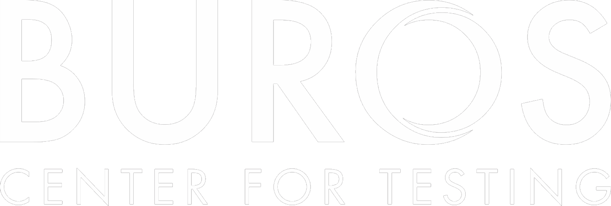
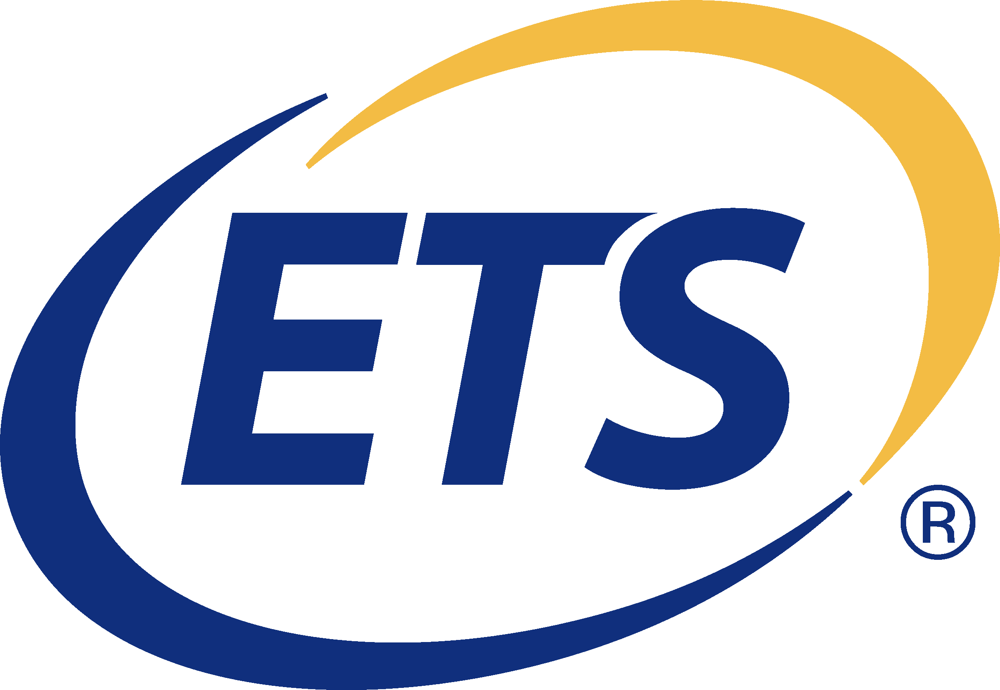
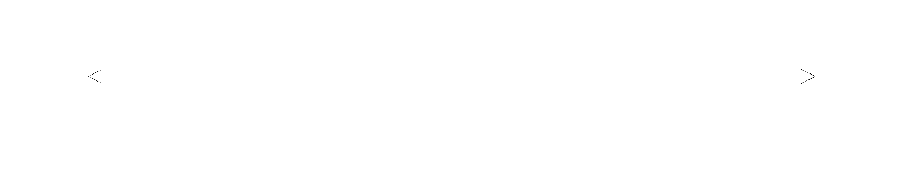

```{r setup, echo=FALSE, warning=FALSE, message=FALSE, include=FALSE}
source(here::here("static", "slides", "all.R"))
```

```{css echo=FALSE}
.highlight-last-item > ul > li,
.highlight-last-item > ol > li {
  opacity: 0.5;
}
.highlight-last-item > ul > li:last-of-type,
.highlight-last-item > ol > li:last-of-type {
  opacity: 1;
}
```

# Welcome! 

Data collection is a must in every evaluation. This slideshow will give you a compact primer and/or reminder of all things basic research methods. 

--

<br>
<br>
<center><i>Please note that most images have active links</i></center>

---

# Crafting a Design: The Framework

--

Here you select an evaluation model, approach, etc. or develop your own synthesis/integration of others. Ask yourself the following when thinking of your choice

--

+ **Who** is likely to know what you are interested in?  How can you represent various groups of participants?

--

+ **What** particular aspects of the program are you interested in (criteria, issues)?  What kinds of data relate to your questions/issues?

--

+ **Where** do relevant activities occur?  If you can’t directly observe it, where is it reflected?

--

+ **When** do relevant activities occur?  When should you collect data?

--

+ **How** can you explore the phenomena in ways that accommodate both your needs and stakeholder needs? Consider your resources and constraints. Be realistic.

---

# Activity Part 1 

Think about the criteria, standards, potential indicators and/or issues you may come across in an evaluation - possibly even one you or your group are considering.

--

> *Start with a brainstorm*. List as many as possible without worrying about whether they are feasible

--

> *Prioritize your brainstorm*. Rank those most likely to reveal program quality at the top of the list

--

> *Retain your brainstorm*. Keep your list because you will use it later

---

# Data, Data Everywhere 

.pull-left[
Quantitative Data
+ *Concrete* and more closely connected to standards-based approaches

  > Tests
  
  > Surveys
  
  > Program Performance
  
  > Statistics
]

.pull-right[
Qualitative Data
+ *Interpretive* and more closely connected to responsive evaluation approaches

  > Document Analysis
  
  > Interview
  
  > Observation
  
  > Surveys
]

---

# Collecting Quantitative Data

--

<br>
<br>

.pull-left[
Identifying existing program data sources
]

.pull-right[
If possible, finding existing instruments / measures to collect additional data with
]

<br>
<br>
<br>

.pull-left[
Developing surveys and tests to collect additional data with
]


---

# A Note About Testing Sources 

.pull-left[
<center>
<a href="https://databases.lib.wvu.edu/search?query=test+instruments" target="_blank">

</a>
<br>
<br>
WVU Library database
</center>
]


.pull-right[
<center>
<a href="https://www.midss.org/" target="_blank">

</a>
<br>
<br>
Measurement Instrument Database for the Social Sciences (MIDSS)
</center>
]

<br>
<br>
.pull-left[
<center>
<a href="https://www.rand.org/education-and-labor/projects/assessments.html" target="_blank">

</a>
<br>
<br>
RAND Education Assessment Finder
</center>
]


---

# Sources of Test Information

--

On the next five slides we'll look at some sources you can utilize to get and assess established tests

---

## Catalog

.pull-left[
Mental Measurement Yearbooks (MMY)

  > Provides factual information on all known tests
  
  > Provides objective test reviews
  
  > Comprehensive bibliography for specific tests
  
  > Indices: acronyms, developers, publishers, subject, titles
]

<br>
<br>
<br>
.pull-right[
<center>
<a href="http://buros.org/" target="_blank">

</a>
<br>
<br>
</center>
]

---

# Another Catalog

.pull-left[
ETS Test Collection

  > Annotated bibliographies on achievement, aptitude, attitude and interests, personality, sensory motor, special populations, vocational/occupational, and miscellaneous
  
  > Includes test title, author, publication date, target population, publisher, and description of purpose
  
  > Published and unpublished tests

]

<br>
<br>
.pull-right[
<center>
<a href="https://www.ets.org/test-collection.html" target="_blank">

</a>
</center>
]

---

## Sources of Tests and Test Information

<br>
.pull-left[
+ Tests in Print
]

.pull-right[
  > See all known commercially produced tests currently available
]

--

<br>
.pull-left[
+ Professional journals
]

.pull-right[
  > See what others have used
]

--

<br>
.pull-left[
+ Test publishers and distributors
]

.pull-right[
  > See current and former test types and kinds 
]

---

# Issues to Consider in Selecting Tests

--

<br>
.pull-left[

  + Psychometric properties
  
      >- Validity
      
      >- Reliability
      
      >- Length of test
      
      >- Scoring and score interpretation
]

--

.pull-right[
+ Non-psychometric issues
  
      >- Administrative time
      
      >- Cost
      
      >- Duplication of testing
      
      >- Objections to content by parents or others
]

---

## Designing Your Own Tests


.pull-left[
  + Get help from others with experience developing tests
  
  + Item writing guidelines
  
      > Avoid ambiguous and confusing wording and sentence structure
      
      > Use appropriate vocabulary
      
      > Write items that have only one correct answer
      
      > Give information about the nature of the desired answer
      
      > Do not provide clues to the correct answer
]

---

#  Survey Data Collection Methods  

.pull-left[
+ Measures

  > Interview
  
  > Observation
  
  > Surveys

]

.pull-right[
+ Media
  > Face-to-face
  
  > Online
  
  > Mail
  
  > Telephone<sup>1</sup>
  
]

.footnote[<sup>1</sup> Maybe! This type of delivery is being utilized less and less.]

---

# Beneficial Extras 

<br>
<br>

.pull-left[
<br>
<br>
<br>
Follow-up or additional survey
]

.pull-right[
> Explain non-response in the narrative and include count of respondents v. non-respondents

> Telephone (again...maybe)

> Reminder postcard (paper surveys) / email (online surveys)
]

---

# Qualities of Good Items 

<br>
<br>
.pull-left[
> Address single concept

> Avoid jargon

> Avoid leading questions

> Avoid sensitive questions

> Do not assume facts not necessarily true

> Include point of reference

> **Always Pretest/Pilot Test items** 
]


---

#  Collecting Qualitative Data 

--

<br>
<br>
.pull-left[
+ Descriptive analyses of artifacts from participants’ experiences – extracted through document analysis

+ Participants’ descriptions (in their own words) about their lived experiences, beliefs, feelings, and understandings – obtained through interviews

+ Detailed descriptions of participants’ activities, behaviors, and actions – recorded from observations
]

---

# Types of Interviews 

<br>
.pull-left[
> Closed
]

.pull-right[
> mixed-response
]

--

.pull-left[
> Informal
]

.pull-right[
> conversational
]

--

.pull-left[
> Semi-structured
]

.pull-right[
> open-ended
]

--

.pull-left[
> Standardized
]

.pull-right[
> open-ended
]

---

#  Good Questions Are…	 


.pull-left[
+ Carefully worded – the wording determines how a participant will respond

+ Open-ended – avoid forcing responses (How satisfied are you… v.s. Describe how you feel about…)

+ Neutral – don’t lead (Describe what makes this program successful v.s. Describe your perceptions of this program.)

+ Singular – avoid “double-barreled” (How do you feel about this program *and* the way it is administered?)

+ Clear – use language your participants use.

+ Relevant to the central issues you want to explore – be parsimonious, value their time.
]

---

#  Good protocols… 

> + ...include questions to elicit descriptive demographic information (age, education, family configuration, relevant experiences, etc.) if necessary and relevant

> + ...are thoughtfully ordered
    + Getting to know your participants, their experiences
    + Easing them into the research event
    + Sequencing to build trust in order to elicit their opinions, feelings
    + Sequencing to maintain interest

> + ...are of a reasonable length - 8 to 10 substantive questions is often a 45 minute to hour-long interview

> + ...remind you of the critical elements you may need to probe for

> + ...include a variety of types of questions

> + ...close by giving control over the interview to your participants (Is there anything I haven’t asked about that you think I should know?)

---

#  Observation 

<br>
.pull-left[
<br>
<br>
<center>

</center>
]

.pull-right[
Different points at different times in an evaluation:

+ Full observer

+ Observer as participant

+ Participant as observer

+ Full participant
]

---

#  Unpacking and Interpreting

<br>
.pull-left[
<center>Strange &#8594; Familiar</center>
] 

.pull-right[
<center>seeking to understand</center>
]

--

<br>
.pull-left[
<center>Familiar &#8594; Strange</center>
] 

.pull-right[
<center> questioning your own assumptions</center>
]

--

<br>
<center>
<i>Staying in long enough to get the insider’s point of view, but not so long that you completely go native</i>
</center>

---

# Early Days in the Field

--

+ Anxiety is a good thing: <i>Is what you’re doing “right”?</i>

--

+ Don’t force yourself in – look for easy access.

--

+ Where are the open places?

--

+ How can you get into the closed places?

--

+ Be wary of ordered permission – it isn’t a proper invitation.

--

+ Follow the contextual schedule – be as unobtrusive as possible.

--

+ Don’t assume you don’t know anything, but do assume you don’t know everything. Use what you do know to learn more.

---

# ***Taking*** Notes

---

<br>
<br>
<br>
<br>
<br>
+ Be unobtrusive – situate yourself carefully.

--

+ With a team divide up the setting.

--

+ Use a small pad or folded paper to take notes.

--

+ Practice looking, listening, writing and keeping written lines separate.

--

+ Detail, detail, detail – not good grammar and sentence structure.

--

+ Jot down key words to jog your memory later.

--

+ Keep a card with you or a guide that helps you focus on the things most important in the observation – but note other things, too.

---

<br>

+ Continuous scripting – stopping sends the message “that’s not important” or you’re “looking for something.”

--

+ Be aware of everything!

--

+ Attend to figure-ground. Go wide then narrow your focus.

--

+ Keep track of yourself, your interpretations or reactions in brackets - Evaluator’s awareness of self. You can be judgmental here!

--

+ Keep track of the time.

--

+ Use all of your senses.

--

+ When recording conversations try to capture first, middle and last words. Listen for key words. Develop a shorthand. Verbatim quote “&nbsp;&nbsp;&nbsp;&nbsp;&nbsp;&nbsp;&nbsp;“

--

+ Close, not exact ‘&nbsp;&nbsp;&nbsp;&nbsp;&nbsp;&nbsp;&nbsp;‘

--

+ Missed something &#95;&#95;&#95;&#95;&#95;, fill in the blanks ASAP.

--

+ Quote people all the time!  What was said, how was it said?  If something is said prior to the observation event, include that in your notes.

--

+ At minimum summarize what seems to be idle talk.

---

# ***Cooking*** Notes 

--

<br>
<br>
<br>
+ Begin cooking raw notes ASAP – fill in the blanks before you leave the scene

--

+ Finish cooking ASAP, preferably immediately after event, but at least the same day– memory fades quickly and multiple observations tend to bleed together

--

+ Be concrete.  Distinguish verbatim accounts from paraphrasing and general recall.

--

+ Work at the lowest possible level of inference

---

##  Good ***Cooked*** Notes Include...

--

+ Mapping (drawn or descriptive) - Capture the physical setting, social arrangements.

--

+ Descriptive, but not judgmental language.

--

+ Excruciating, mundane detail.

--

+ Visualization

--

+ Sensory experience

--

+ Presence of self

--

+ Presence of others

--

+ Context

--

+ Figure-ground

--

+ *Notes on Notes*

---

## What the &#8727;&#8727;&#8727;&#8727; are *Notes on Notes*?

<br>
<br>
<br>
+ Your “hunches” and preliminary analyses - *How will you follow up?*

--

+ Your subjective feelings - *Why do you feel that way?*

--

+ Contrary analysis by asking *Are you being biased or avoiding certain questions?*

--

+ Clearly bracket these so you know what is true field notes vs. what is notes on notes.

---

#  Finding Documents 

<br>
<br>
<br>
> **First** begin with the public – work toward the private. Gaining access to documents follows the same path as establishing rapport with participants – the deeper the rapport, the more private documents you’ll have access to.

--

> **Then** rely on your guiding questions / issues, questions that emerge during data collection and data analysis, and your “hunches” to make decisions about what to look for and what to analyze.

---

#  Types of Documents 

.pull-left[
*Public records*
]

.pull-right[
publicity materials, board meeting minutes, evaluation reports, etc.
]

.pull-left[
*Program generated internal*
]

.pull-right[
memos, email correspondence, training manuals, time cards, performance logs, etc.
]

.pull-left[
*Personal documents*
]

.pull-right[
journals, scrapbooks, photos, letters, etc.
]

.pull-left[
*Physical materials* 
]

.pull-right[
equipment, tools, records of the results of actual behavior
]

---

#  Why Conduct Document Analysis? 

.pull-left[
*Triangulation*
]

.pull-right[
Primary source information about goals, performances, contexts, etc...
]

.pull-left[
*Proxy for non-observables*
]

.pull-right[
History, private behavior / interactions… you can’t be there all the time.
]

.pull-left[
*Mulling*
]

.pull-right[
To stimulate thinking about important questions / issues to pursue through more direct observations and interviewing.
]

---

#  Limitations 

<br>
<br>
> Information may be incomplete or may not line up neatly with your evaluation questions and issues.

> Sampling may be unrepresentative – documents produced by one group may not be produced by another group.

> May be difficult to establish authenticity, accuracy, biases.

---

# Establishing the Provenance

--

+ Ask about the history of the document – when was it produced, where has it been archived?

--

+ Consider how you obtained the document – who gave it to you, why did they give it to you?

--

+ Is the document legitimate, authentic, accurate?

--

+ What are the circumstances of the document’s production – why was it produced, who produced it, when was it produced (historical context)?

--

+ What informed the document’s production – a firsthand account, a secondhand account, a reconstruction, an interpretation

--

+ Consider possible biases and their impact on the document

--

+ Are there other documents that may help you verify the legitimacy, authenticity or accuracy of the document?

---

#  Activity Part 2

<br>
<br>
.pull-left[
<br>
<br>
Return to your prioritized list of criteria and/or issues for your class project
]

.pull-right[
+ For several items near the top consider what existing data there is that you are aware of AND specific ways you might collect data
  
+ Think about how far down the list you might feasibly go for your course project
]

---

# And That's It

Stress that your choice in method(s) will likely determine the type and strength of outcomes you get from your evaluation. If you have any questions, please feel free to reach out.

<center>
<br><br>
<div class="fade_rule"></div>  
<br><br>
</center>
<br><br><br><br><br><br><br><br><br>
<center>
<a rel="license" href="http://creativecommons.org/licenses/by-nc-sa/4.0/"></a><br /><br />This work is licensed under a <br /><a rel="license" href="http://creativecommons.org/licenses/by-nc-sa/4.0/">Creative Commons Attribution-NonCommercial-ShareAlike 4.0 International License</a>
</center>