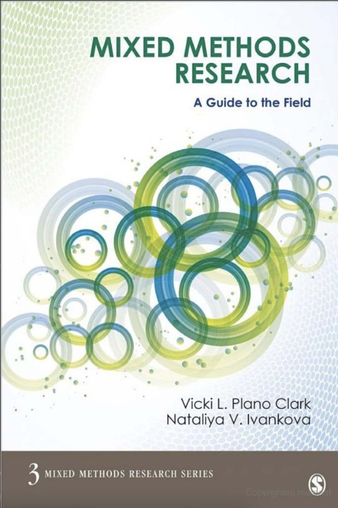

<style>

.center2 {
  margin: 0;
  position: absolute;
  top: 50%;
  left: 50%;
  -ms-transform: translate(-50%, -50%);
  transform: translate(-50%, -50%);
}

ol.nostyle li.nostyle {

  list-style-type: none;
  
}

.brsmallmed {
            display: block;
            margin-bottom: 4em;
        }

.brmedium {
            display: block;
            margin-bottom: 7em;
        }
          
.brlarge {
            display: block;
            margin-bottom: 17em;
        }

</style>

```{r setup, include=FALSE, purl=FALSE}
library(tidyverse)
library(knitr)
library(kableExtra)
library(fontawesome)
library(here)
library(DT)
library(scales)
library(latex2exp)
library(showtext)
font_add_google("Roboto Condensed", "roboto")
showtext_auto()
```
```{r echo = FALSE, purl=FALSE}
xaringanthemer::style_duo(
  primary_color = "#212121",
  secondary_color = "#03dac6",
  table_row_border_color = "#212121",
  table_row_even_background_color = "#212121",
  footnote_font_size = "0.6em",
  header_font_google = xaringanthemer::google_font("Roboto Condensed", "700"),
  text_font_google   = xaringanthemer::google_font("Roboto Condensed", "400")
)
xaringanExtra::use_xaringan_extra(c("tile_view", "animate_css", "tachyons"))

xaringanExtra::use_logo(
  image_url = here::here("static", "img", "course_hex.png"),
  link_url = "https://edp618.asocialdatascientist.com",
  position = xaringanExtra::css_position(top = "1em", right = "1em")
)

opts_chunk$set(dev.args=list(bg="transparent"))
```

```{r echo = FALSE, eval = TRUE, message=FALSE}
library(tidyverse)
``` 

# Welcome!

<center>

<center>

---

# Your Teacher


.pull-left[
<center>

</center>
]

.pull-right[
<br>
<br>
<br>
<br>
<br>
Dr. Abhik Roy<br>
Assistant Professor of Educational Psychology<br>
School of Education<br>
West Virginia University
]

---

# Overview

**All I have to do to make a study mixed is to have both a qualitative and quantitative portion right?** Mixed-Method studies are the natural byproduct of an ongoing war between people who are distinctly qualitative or quantitative. For many, the ability to look at data through two dynamically opposing approaches has opened doors that simply did not exist before and provides many design choices which can be run sequentially, concurrently, or even at times both. Furthermore when a one method is weaker, its complement can provide additional support through the mixing process. With all of these benefits, *why aren't most studies mixed methods?* This can be answered in two ways: 1) misunderstanding/misidentification: researchers for whatever reason do not to conduct the mixing process resulting in a multi-methods study and 2) methodological/structural: there is a greater risk of an entire study collapsing if errors in one approach affects the other. 

---

# Course Objectives

--

By working hard and asking for help as needed, by the end of this course you should be able to do the following

--

- <span style="color:#ffffff">assess various types of triangulation</span>

--

- <span style="color:#ffffff">create aesthetically pleasing and informative single and mixed method(s) data visualizations</span>

--

- <span style="color:#ffffff">design a structurally sound mixed methods study</span>

--

- <span style="color:#ffffff">determine how to assess item reliability and validity</span>

--

- <span style="color:#ffffff">identify pigeonholed designs and steps needed to avoid them</span>

--

- <span style="color:#ffffff">implement both quantitative and qualitative approaches when assessing open bodies of text</span>

--

- <span style="color:#ffffff">recognize standard mixed models and to create custom variants</span>

--

- <span style="color:#ffffff">utilize frequentist and/or basic Bayesian statistical methods to address effects or impacts</span>

---

# Course Materials

.pull-left[
For submissions and grades: [eCampus](https://ecampus.wvu.edu/)
]

--

.pull-left[
For everything else: [EDP 618 course site](https://edp618.asocialdatascientist.com)
]

---

# Texts

.center2[
To help minimize costs, you do not have to purchase any physical texts. We'll rely on the various materials below which, barring the APA 7th edition handbook, are either available through the WVU library [WVU library](https://library.wvu.edu/) or in digital format
]

---

## References

<br>
<br>
.pull-left[
American Psychological Association. (2020). *Publication manual of the American Psychological Association* (7th ed.).
]

.pull-right[
<center>

<center>
]

---

<br>
<br>
.pull-left[
Creamer, E. G. (2017). <i>An introduction to fully integrated mixed methods research</i>. Sage.
  - Free: [Digital edition](https://methods-sagepub-com.wvu.idm.oclc.org/book/an-introduction-to-fully-integrated-mixed-methods-research)
  - Not Free: [ISBN 9781483350936](https://us.sagepub.com/en-us/nam/an-introduction-to-fully-integrated-mixed-methods-research/book242814'>Physical)
]

.pull-right[
<center>

<center>
]

--

<br>
<br>
.pull-left[
Mertens, D. M. (2018). <i>Mixed methods design in evaluation</i>. Sage.
  - Free: [Digital edition](https://methods-sagepub-com.wvu.idm.oclc.org/book/mixed-methods-design-in-evaluation)
  - Not Free: [ISBN 9781506330655](https://us.sagepub.com/en-us/nam/mixed-methods-design-in-evaluation/book249777)
]

.pull-right[
<center>

<center>
]

---

<br>
<br>
.pull-left[
Plano Clark, V. L. & Ivankova, N. V. (2015). <i>Mixed methods research: A guide to the field</i>. Sage.
  - Free: [Digital edition](https://methods-sagepub-com.wvu.idm.oclc.org/book/mixed-methods-research-a-guide-to-the-field)
  - Not Free: [ISBN 9783319242750](https://us.sagepub.com/en-us/nam/mixed-methods-research/book241462)
]

.pull-right[
<center>

<center>
]

--

<br>
<br>
.pull-left[
Wickham, H., Navarro, D. & Pedersen, T.L. (2021). *ggplot2: Elegant Graphics for Data Analysis* (2nd and 3rd eds.). Springer.
  - Free: [Digital edition](https://ggplot2-book.org/index.html)
  - Not Free: Hardcover edition - ISBN: 9783319242750
]

.pull-right[
<center>

<center>
]

---

<br>
<br>
<br>
<br>
<br>
<br>
.pull-left[
Wickham, H. (2021). *R for Data Science* (1st ed.). O’Reilly Media.
  - Free: [Digital edition (web)](https://r4ds.had.co.nz/) 
  - Free: [Digital edition (WVU libraries)](https://libwvu.on.worldcat.org/oclc/966429425) 
  - Not Free: Hardcover edition - ISBN: 9781491910399
]

.pull-right[
<center>

<center>
]

---

.center2[
*There will also occasionally be additional articles and videos to read and watch. When this happens, links to these other resources will be included on the content page for that session.*
]

---

# Class Focus on 

<br>
<br>
.pull-left[
**Content**
  >- Readings
  >- Design & Analysis
  >- Mixing Process & Interpretation
]

--

.pull-right[
**Practice**
  >- R Modules & Walkthroughs
  >- Data Visualization & Modeling
  >- Assessing & Reporting
]

---

# What I expect

--

- Keeping an open line of communication

--

- A lot of work

--

- Asking questions and reaching out as needed (after going over all of the material)


---

## Assignments and Grades

You can find descriptions for all the assignments on the [tasks page](https://edp618.asocialdatascientist.com/tasks/).

```{r assignments-grades, include=FALSE}
assignments <- tribble(
  ~Percent,  ~Task, ~Location,
  10, "R Training & Tasks", "Data Camp",
  10, "Mixed Methods EDA", "eCampus",
  5, "Participation", "In class",
  5, "Think about Studies", "eCampus",
  5, "Create an Argument", "eCampus",
  10, "Develop a Draft", "eCampus",
  10, "Update the Draft", "eCampus", 
  10, "Refine the Draft", "eCampus",
  30, "Revise and Resubmit", "eCampus",
  5, "Give an Elevator Pitch", "eCampus/Slack"
) 
```

<center>

```{r show-assignments-table, echo=FALSE, results="asis"}
assignments %>%
  kableExtra::kable(align='cll',
               col.names = c("Percent", "Assignment", "Submission"),
      ) %>%
  kable_paper(html_font = "Roboto Condensed") %>%
  kable_styling(position = "center",
                bootstrap_options = c("hover", 
                                      "condensed", 
                                      "responsive"),
                full_width = FALSE) %>%
  column_spec(1, width = "5em", color = "#ffffff", extra_css = 'vertical-align: middle !important;') %>%
  column_spec(2, width = "15em", color = "#ffffff",
              extra_css = 'vertical-align: middle !important;') %>%
  column_spec(3, width = "9em", color = "#ffffff",
              extra_css = 'vertical-align: middle !important;') %>%
  row_spec(0, color = "#f7f7f7",
           background = "transparent") %>%
  row_spec(1:6, color = "#f7f7f7",
           background = "transparent")
```

</center>

---

.center2[
*The Final is depedendent on all course deliverables preceding it and is summarized on the [tasks](https://edp618.asocialdatascientist.com/tasks/) page.*
]

---

# Grading

```{r grading, echo=FALSE, eval=TRUE}
tribble(
  ~Grade, ~Range,
  "A",  "90% – 100%",
  "B",  "80% - 89%",  
  "C",  "70% – 79%",
  "D",  "60% – 69%", 
  "F",  "< 60%"
) %>%
  kableExtra::kable(align='cl',
               col.names = c("Grade", "Range")) %>%
  kable_paper(html_font = "Roboto Condensed") %>%
  kable_styling(position = "center",
                bootstrap_options = c("hover", 
                                      "condensed", 
                                      "responsive"),
                full_width = FALSE) %>%
  column_spec(1, width = "5em", 
              color = "#ffffff", 
              extra_css = 'vertical-align: middle !important;') %>%
  column_spec(2, width = "6.5em", 
              color = "#ffffff",
              extra_css = 'vertical-align: middle !important;') %>%
  row_spec(0, color = "#f7f7f7",
           background = "transparent") %>%
  row_spec(1:5, color = "#f7f7f7",
           background = "transparent")
```

---

## That's it. If you have questions, please send them along!
