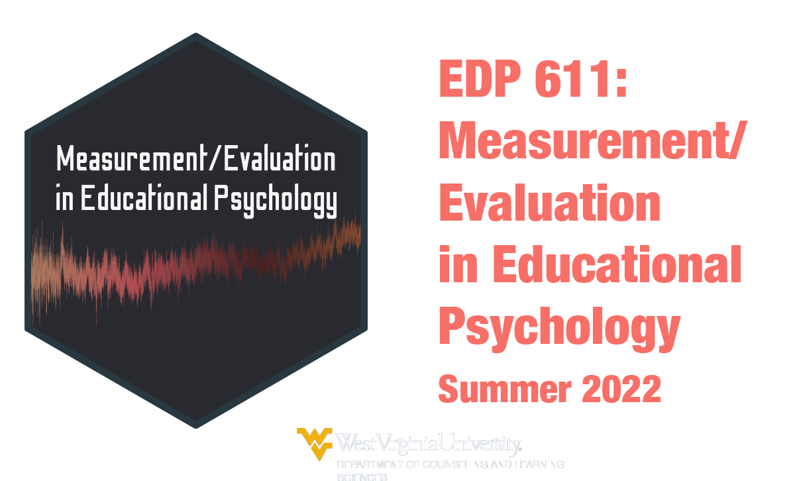
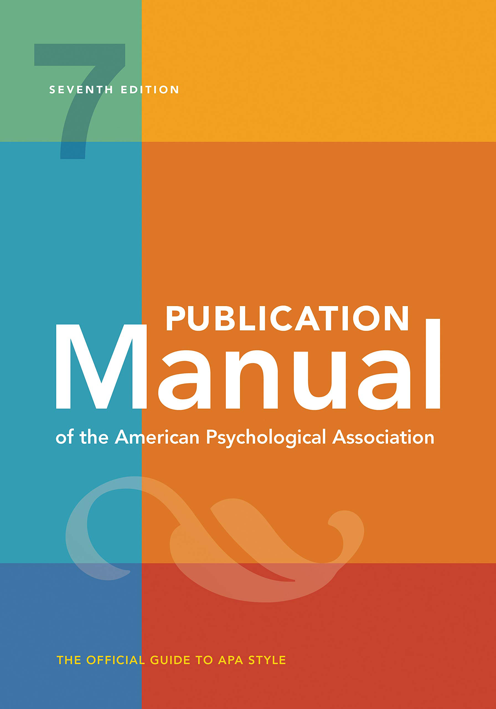
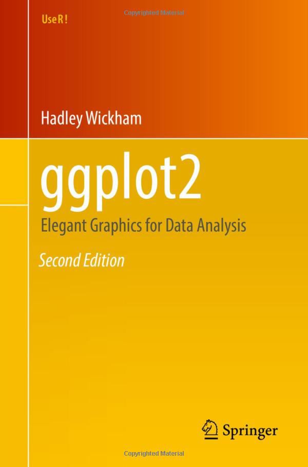

<style>

.center2 {
  margin: 0;
  position: absolute;
  top: 50%;
  left: 50%;
  -ms-transform: translate(-50%, -50%);
  transform: translate(-50%, -50%);
}

ol.nostyle li.nostyle {

  list-style-type: none;
  
}

.brsmallmed {
            display: block;
            margin-bottom: 4em;
        }

.brmedium {
            display: block;
            margin-bottom: 7em;
        }
          
.brlarge {
            display: block;
            margin-bottom: 17em;
        }

</style>

```{r setup, include=FALSE, purl=FALSE}
library(tidyverse)
library(knitr)
library(kableExtra)
library(fontawesome)
library(here)
library(DT)
library(scales)
library(latex2exp)
library(showtext)
font_add_google("Roboto Condensed", "roboto")
showtext_auto()
```
```{r echo = FALSE, purl=FALSE}
xaringanthemer::style_duo(
  primary_color = "#212121",
  secondary_color = "#03dac6",
  table_row_border_color = "#212121",
  table_row_even_background_color = "#212121",
  footnote_font_size = "0.6em",
  header_font_google = xaringanthemer::google_font("Roboto Condensed", "700"),
  text_font_google   = xaringanthemer::google_font("Roboto Condensed", "400")
)
xaringanExtra::use_xaringan_extra(c("tile_view", "animate_css", "tachyons"))

xaringanExtra::use_logo(
  image_url = here::here("static", "img", "course_hex.png"),
  link_url = "https://edp619.asocialdatascientist.com",
  position = xaringanExtra::css_position(top = "1em", right = "1em")
)

opts_chunk$set(dev.args=list(bg="transparent"))
```

```{r echo = FALSE, eval = TRUE, message=FALSE}
library(tidyverse)
``` 

# Welcome!

<center>

<center>

---

# Your Teacher


.pull-left[
<center>

</center>
]

.pull-right[
<br>
<br>
<br>
<br>
<br>
Dr. Abhik Roy<br>
Assistant Professor of Educational Psychology<br>
School of Education<br>
West Virginia University
]

---

# Overview

**Surveys are so easy right?** We live in a data-driven world with surveys providing a sizable chunk of that information. Online platforms like have made it so simple for anyone to both construct and administer a survey that it seems that we find multiple examples pop up in our inbox every week. Given that reach alone, you would think that there would simply be too much data to handle, but it turns out that the average estimated response rate falls between 20% - 30%. So what could be the problem? While some things are certainly out of a survey designer's control, approaches such as constructing an aesthetically pleasing instrument, understanding a vast array of analyses, displaying an aptitude in data visualization, constructing valid and reliable designs, having measurable outcomes, and incorporating pilot testing are just some of the things that can affect both a survey's feasibility and viability.

---

# Course Objectives

--

By working hard and asking for help as needed, by the end of this course you should be able to do the following

--

> administer both flat traditional and modern interactive surveys via the Internet

--

> assess missingness and determine next steps

--

> create aesthetically pleasing surveys using color theory and design techniques

--

> determine how to assess item reliability and validity

--

> enhance the look and feel of surveys using sandboxed syntax

--

> implement text mining approaches to probabilistically determine respondent sentiments and detect topics

--

> utilize frequentist and/or basic Bayesian statistical methods to determine outcomes

---

# Course Materials

.pull-left[
For submissions and grades: [eCampus](https://ecampus.wvu.edu/)
]

--

.pull-left[
For everything else: [EDP 619 course site](https://edp619.asocialdatascientist.com)
]

---

# Texts

.center2[
To help minimize costs, you do not have to purchase any physical texts. We'll rely on the various materials below which, barring the APA 7th edition handbook, are either available through the WVU library [WVU library](https://library.wvu.edu/) or in digital format
]

---

## Required

--

.pull-left[
Albano, T. (2020). Introduction to Educational and Psychological Measurement Using R.
  - Free: [https://thetaminusb.com/intro-measurement-r/ ](https://thetaminusb.com/intro-measurement-r/)
]

.pull-right[
<center>

<center>
]

--

<br>
<br>
.pull-left[
Dillman, D.A., Smyth, J.D., &amp; Christian, L.M. (2014). *Internet, Phone, Mail, and Mixed-Mode Surveys: The Tailored Design Method* (4th ed.). Wiley.
  - Free: [Digital edition](https://ebookcentral.proquest.com/lib/wvu/detail.action?docID=1762797)
  - Not Free: Softcover edition - ISBN: 9781118456149
]

.pull-right[
<center>

<center>
]

---

## Optional

<br>
<br>
.pull-left[
American Psychological Association. (2020). *Publication manual of the American Psychological Association* (7th ed.).
]

.pull-right[
<center>

<center>
]

---

.pull-left[
Wickham, H., Navarro, D. & Pedersen, T.L. (2021). *ggplot2: Elegant Graphics for Data Analysis* (2nd and 3rd eds.). Springer.
  - Free: [Digital edition](https://ggplot2-book.org/index.html)
  - Not Free: Hardcover edition - ISBN: 9783319242750
]

.pull-right[
<center>

<center>
]

--

<br>
<br>
.pull-left[
Wickham, H. (2021). *R for Data Science* (1st ed.). O’Reilly Media.
  - Free: [Digital edition (web)](https://r4ds.had.co.nz/) 
  - Free: [Digital edition (WVU libraries)](https://libwvu.on.worldcat.org/oclc/966429425) 
  - Not Free: Hardcover edition - ISBN: 9781491910399
]

.pull-right[
<center>

<center>
]

---

.center2[
*There will also occasionally be additional articles and videos to read and watch. When this happens, links to these other resources will be included on the content page for that session.*
]

---

# Class Focus on 

<br>
<br>
.pull-left[
**Content**
  >- Readings
  >- Design & Analysis
  >- Aesthetics & User Interface
]

--

.pull-right[
**Practice**
  >- R Modules & Walkthroughs
  >- Item Measurement & Missingness
  >- Survey Construction, Dissemenation, & Reporting
]

---

# What I expect

--

- Keeping an open line of communication

--

- A lot of work

--

- Asking questions and reaching out as needed (after going over all of the material)


---

## Assignments and Grades

You can find descriptions for all the assignments on the [tasks page](https://edp619.asocialdatascientist.com/tasks/).

<br>
```{r assignments-grades, include=FALSE}
assignments <- tribble(
  ~Percent,  ~Task, ~Location,
  15, "R Training", "Data Camp",
  10, "R Survey EDA", "eCampus",
  5, "Establish a Sampling Frame", "eCampus",
  5, "Create a Draft", "eCampus",
  10, "Refine the Draft", "eCampus",
  10, "Conduct a Pilot Study", "eCampus", 
  5, "Disseminate the Survey", "eCampus",
  10, "Test for Validity and Reliability", "eCampus",
  25, "Write an Executive Summary", "eCampus",
  5, "Give an Elevator Speech", "eCampus/Slack"
)
```

<center>

```{r show-assignments-table, echo=FALSE, results="asis"}
assignments %>%
  kableExtra::kable(align='cll',
               col.names = c("Percent", "Assignment", "Submission"),
      ) %>%
  kable_paper(html_font = "Roboto Condensed") %>%
  kable_styling(position = "center",
                bootstrap_options = c("hover", 
                                      "condensed", 
                                      "responsive"),
                full_width = FALSE) %>%
  column_spec(1, width = "5em", color = "#ffffff", extra_css = 'vertical-align: middle !important;') %>%
  column_spec(2, width = "15em", color = "#ffffff",
              extra_css = 'vertical-align: middle !important;') %>%
  column_spec(3, width = "9em", color = "#ffffff",
              extra_css = 'vertical-align: middle !important;') %>%
  row_spec(0, color = "#f7f7f7",
           background = "transparent") %>%
  row_spec(1:6, color = "#f7f7f7",
           background = "transparent")
```

</center>

---

.center2[
*The Instrument & Report are scored from a combination of all course deliverables [tasks](https://edp619.asocialdatascientist.com/tasks/). The Instrument, Executive Summary, and Elevator Pitch together is considered to be your final task.*
]

---

# Grading

```{r grading, echo=FALSE, eval=TRUE}
tribble(
  ~Grade, ~Range,
  "A",  "90% – 100%",
  "B",  "80% - 89%",  
  "C",  "70% – 79%",
  "D",  "60% – 69%", 
  "F",  "< 60%"
) %>%
  kableExtra::kable(align='cl',
               col.names = c("Grade", "Range")) %>%
  kable_paper(html_font = "Roboto Condensed") %>%
  kable_styling(position = "center",
                bootstrap_options = c("hover", 
                                      "condensed", 
                                      "responsive"),
                full_width = FALSE) %>%
  column_spec(1, width = "5em", 
              color = "#ffffff", 
              extra_css = 'vertical-align: middle !important;') %>%
  column_spec(2, width = "6.5em", 
              color = "#ffffff",
              extra_css = 'vertical-align: middle !important;') %>%
  row_spec(0, color = "#f7f7f7",
           background = "transparent") %>%
  row_spec(1:5, color = "#f7f7f7",
           background = "transparent")
```

---

## That's it. If you have questions, please send them along!
