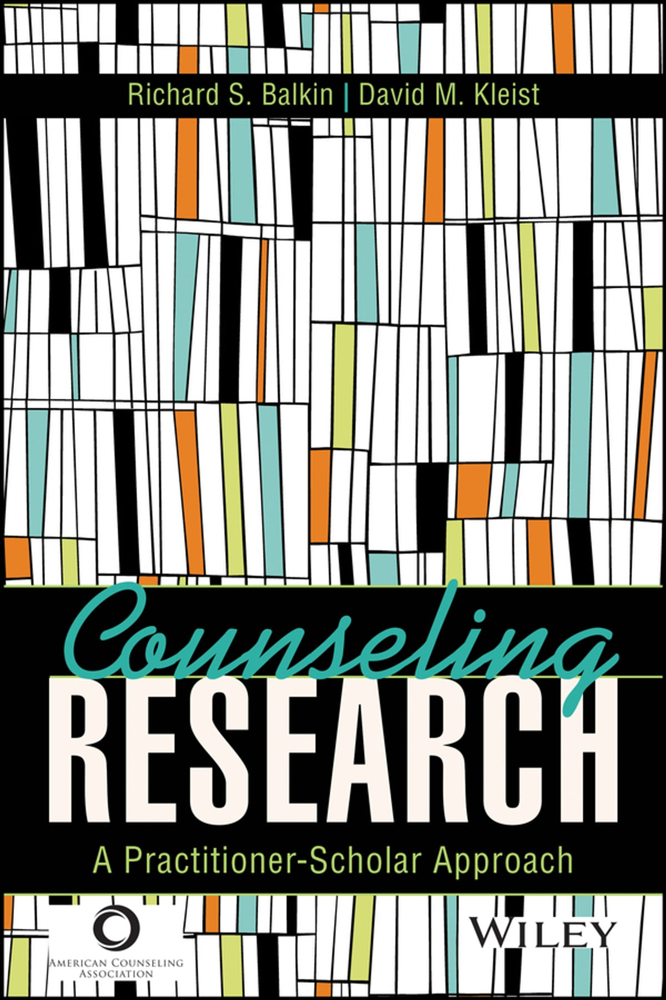

<style>

.center2 {
  margin: 0;
  position: absolute;
  top: 50%;
  left: 50%;
  -ms-transform: translate(-50%, -50%);
  transform: translate(-50%, -50%);
}

ol.nostyle li.nostyle {

  list-style-type: none;
  
}

.brsmallmed {
            display: block;
            margin-bottom: 4em;
        }

.brmedium {
            display: block;
            margin-bottom: 7em;
        }
          
.brlarge {
            display: block;
            margin-bottom: 17em;
        }

</style>

```{r setup, include=FALSE, purl=FALSE}
library(tidyverse)
library(knitr)
library(kableExtra)
library(fontawesome)
library(here)
library(DT)
library(scales)
library(latex2exp)
library(showtext)
font_add_google("Roboto Condensed", "roboto")
showtext_auto()
```
```{r echo = FALSE, purl=FALSE}
xaringanthemer::style_duo(
  primary_color = "#212121",
  secondary_color = "#03dac6",
  table_row_border_color = "#212121",
  table_row_even_background_color = "#212121",
  footnote_font_size = "0.6em",
  header_font_google = xaringanthemer::google_font("Roboto Condensed", "700"),
  text_font_google   = xaringanthemer::google_font("Roboto Condensed", "400")
)
xaringanExtra::use_xaringan_extra(c("tile_view", "animate_css", "tachyons"))

xaringanExtra::use_logo(
  image_url = here::here("static", "img", "course_hex_alpha.png"),
  link_url = "https://edp613.asocialdatascientist.com",
  position = xaringanExtra::css_position(top = "1em", right = "1em")
)

opts_chunk$set(dev.args=list(bg="transparent"))
```

```{r echo = FALSE, eval = TRUE, message=FALSE}
library(tidyverse)
``` 

# Welcome!

<center>

<center>

---

# Your Teachers


.pull-left[
<center>
Dr. Abhik Roy<br><br>
<br><br>
<i>Professor</i>
</center>
]

.pull-right[
<center>
Carrina Ferguson<br><br>
<br><br>
<i>Graduate Teaching Assistant</i>
</center>
]

---

# Overview

**You can measure many things** Measurement is a principle trait and whether it is hard wired, learned, or some combination of both, its absence makes quantitative data impossible to classify. Even in cases where measures are available, how can we know if they are consistent and accurate? Without these checks, instruments such as surveys could never be constructed, much less yield results that could be generalized. 

When assessing existing programs, having an ability to test a hypothesis is key in understanding its goals. While evaluation tells us whether a program is producing results or having an effect/impact, (performance) measurement tells us what a program did and how well it did it. In particular, the latter is a necessity and involves collecting and reporting data that can be used to compartmentalize the way a program is being implemented.

---

# Course Objectives

--

Assess the credibility and ethics of measurement practices

--

Confidently determining valid and reliable measures

--

Interpret and report psychometric properties of tests

--

Recognize measurement in the evaluative process

--

Understand the methods and techniques for establishing and evaluating reliability and validity

---

# Hope

--

By the end of this course, you will hopefully become 

--

1. literate in the connection between data and measurement principles

--

2. a skeptic of every research question or purpose that you come across

---

# Course Materials

- [eCampus](https://ecampus.wvu.edu/) access: for submissions and grades only

--

- [Readings](https://edp611.asocialdatascientist.com/readings/) and [Training](https://edp612.asocialdatascientist.com/training/) pages

---

# Helpful References 

To help minimize costs, there is no formal text. We'll rely on the text below which is available through the [WVU library](https://library.wvu.edu/) in an online capacity barring the APA 7th edition handbook.

--

<br>
<br>
.pull-left[
Balkin, R. S., &amp; Kleist, D. M. (2016). *Counseling Research: A Practitioner-Scholar Approach*. American Counseling Association. 
  - Free: [Digital edition](https://ebookcentral.proquest.com/lib/wvu/detail.action?docID=4722459)
  - Not Free: Softcover edition - ISBN: 9781556203572
]

.pull-right[
<center>

<center>
]

---

.pull-left[
Albano, T. (2020). Introduction to Educational and Psychological Measurement Using R.
  - Free: [https://thetaminusb.com/intro-measurement-r/ ](https://thetaminusb.com/intro-measurement-r/). 
]

.pull-right[
<center>

<center>
]

--

<br>
<br>
.pull-left[
American Psychological Association. (2020). *Publication manual of the American Psychological Association* (7th ed.).
]

.pull-right[
<center>

<center>
]

---

.pull-left[
Wickham, H., Navarro, D. & Pedersen, T.L. (2021). *ggplot2: Elegant Graphics for Data Analysis* (2nd and 3rd eds.). Springer.
  - Free: [Digital edition](https://ggplot2-book.org/index.html)
  - Not Free: Hardcover edition - ISBN: 9783319242750
]

.pull-right[
<center>

<center>
]

--

<br>
<br>
.pull-left[
Wickham, H. (2021). *R for Data Science* (1st ed.). O’Reilly Media.
  - Free: [Digital edition (web)](https://r4ds.had.co.nz/) 
  - Free: [Digital edition (WVU libraries)](https://libwvu.on.worldcat.org/oclc/966429425) 
  - Not Free: Hardcover edition - ISBN: 9781491910399
]

.pull-right[
<center>

<center>
]

---

.center2[
*There will also occasionally be additional articles and videos to read and watch. When this happens, links to these other resources will be included on the content page for that session.*
]

---

# Class Focus on 

<br>
<br>
.pull-left[
**Content**
  >- Readings
  >- Psychometrics
  >- No exams
]

--

.pull-right[
**Practice**
  >- R Modules
  >- R Walkthroughs
  >- Proposal
]

---

# What I expect

--

- Keeping an open line of communication

--

- Asking questions

--

- Participating like crazy

--

- Meeting with me on Zoom

---

## Assignments and Grades

You can find descriptions for all the assignments on the [tasks page](https://edp612.asocialdatascientist.com/tasks/).

<br>
```{r assignments-grades, include=FALSE}
assignments <- tribble(
  ~Percent,  ~Task, ~Location,
  15, "R Training", "Data Camp",
  15, "Reflections", "Slack",
  15, "R Measurement EDA", "eCampus/Slack",
  15, "Check-ins", "Zoom",
  30, "Proposal", "eCampus/Slack", 
  10, "Elevator Pitch", "eCampus/Slack"
) 

grading <- tribble(
  ~Grade, ~Range,
  "A",  "90–100%",
  "B",  "80%-89%",  
  "C",  "70–79%",
  "D",  "60–69%", 
  "F",  "< 60%"
)
```


<center>

```{r show-assignments-table, echo=FALSE, results="asis"}
assignments %>%
  kableExtra::kable(align='clc',
                    col.names = c("Percent", "Task", "Location"),
  ) %>%
  kable_paper(position = "center",
                bootstrap_options = c("striped", 
                                      "hover", 
                                      "condensed", 
                                      "responsive"),
                full_width = FALSE) %>%
  column_spec(1, width = "10em") %>%
  column_spec(2, width = "10em") %>%
  column_spec(3, width = "10em") %>%
  row_spec(0:6, color = "#ffffff", extra_css = 'vertical-align: middle !important;')
```

</center>

---

.center2[
*The Proposal is scored from a combination of six weekly [tasks](https://edp611.asocialdatascientist.com/tasks/). The Elevator Pitch and Proposal together is considered to be your final task.*
]

---

# Grading

```{r grading, echo=FALSE, eval=TRUE}
tribble(
  ~Grade, ~Range,
  "A",  "90% – 100%",
  "B",  "80% - 89%",  
  "C",  "70% – 79%",
  "D",  "60% – 69%", 
  "F",  "< 60%"
) %>%
  kableExtra::kable(align='cc',
               col.names = c("Grade", "Range")) %>%
   kable_paper(position = "center",
                bootstrap_options = c("striped", 
                                      "hover", 
                                      "condensed", 
                                      "responsive"),
                full_width = FALSE) %>%
  column_spec(1, width = "5em", color = "#ffffff", extra_css = 'vertical-align: middle !important;') %>%
  column_spec(2, width = "7em", color = "#ffffff",
              extra_css = 'vertical-align: middle !important;') %>%
  row_spec(0, color = "#f7f7f7")
```

---

# Things We Cover About Measurement

--

- controversies in testing

--

- interpretation of test scores norms

--

- test construction and scales

--

- writing and using educational objectives


---

# Keep These in Mind

--

<i>Measurement</i> 

--

  - is the determination of attributes or dimensions of an object, skill or knowledge

--

  - does not care about your feelings or views
  
--

  - demands ethics and trust

---

# Common Sense v. Science!

--

<br>
<br>
.pull-left[
 Common Sense - Grounded in how we come to know the world

  >- Subjective
  
  >- Objective
]

--

.pull-right[
Science - Grounded in prominent theoretical constructs

  >- Epistemology
  
  >- Methodology
]

---

# How do we know things?

--

- Beliefs

--

- Intuitions

--

- Logic

--

- Opinions of others

--

- Personal experiences

--

- Scientific method

--

- Sensory experiences

--

- Traditions

--

- Failures!

---

# Human Nature v. Science!

.pull-left[
Human Nature
]

--

.pull-right[
Science
]

--

.pull-left[
- usually observations are inaccurate
]

--

.pull-right[
- ensure observations are accurate
]

--

.pull-left[
- generalize from a few cases
]

--

.pull-right[
- explicitly sample for generalizing
]

--

.pull-left[
- observe selectively to see what we’re looking for
]

--

.pull-right[
- consciously decide what and how to observe
]

--

.pull-left[
- make things up to fulfill gaps
]

--

.pull-right[
- base conclusions on evidence alone
]

--

.pull-left[
- get personally and emotionally involved
]

--

.pull-right[
- respect scientific norms regardless of opinions
]

--

.pull-left[
- form views with little or no revisions and stick with them
]

--

.pull-right[
- constantly revise views
]

--

.pull-left[
- think we can figure out everything
]

--

.pull-right[
- accept that not everything is knowable
]


---


## That's it. If you have questions, please send them along!
