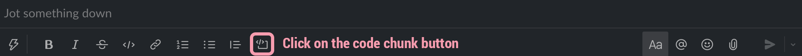
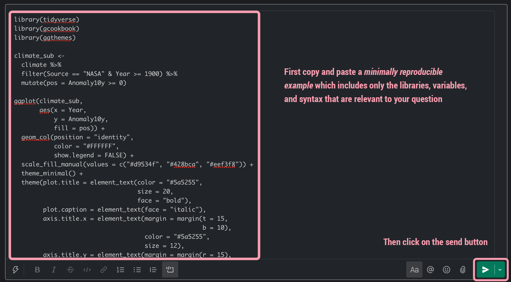

<style>

section {
    display: flex;
    display: -webkit-flex;
}

section p {
    margin: auto;
}

section {
    height: 600px;
    width: 60%;
    margin: auto;
    border-radius: 20px;
    background-color: #212121;
}

section p {
    text-align: center;
    font-size: 30px;
    background-color: #212121;
    border-radius: 20px;
    font-family: Roboto Condensed;
    font-style: bold;
    padding: 15px;
    color: #bff4ee;
}

div.a {
  text-align: center;
}

.center2 {
  margin: 0;
  position: absolute;
  top: 50%;
  left: 50%;
  -ms-transform: translate(-50%, -50%);
  transform: translate(-50%, -50%);
}

</style>

```{css, echo = FALSE}
.remark-slide-content {
  font-size: 20px;
  padding: 20px 80px 20px 80px;
}

.remark-code, .remark-inline-code {
  background: #f0f0f0;
}

.remark-code {
  font-size: 24px;
}

.huge .remark-code { /*Change made here*/
  font-size: 200% !important;
}

.tiny .remark-code { /*Change made here*/
  font-size: 50% !important;
}
```

```{r setup, include=FALSE, purl=FALSE}
library(tidyverse)
library(knitr)
library(kableExtra)
library(fontawesome)
library(here)
library(clt)
library(showtext)
font_add_google("Roboto Condensed", "roboto")
showtext_auto()
```

```{r echo = FALSE, purl=FALSE}
xaringanthemer::style_duo(
  primary_color = "#212121",
  secondary_color = "#48b297",
  table_row_border_color = "#212121",
  table_row_even_background_color = "#212121",
  code_inline_background_color = "#212121",
  footnote_font_size = "0.6em",
  header_font_google = xaringanthemer::google_font("Roboto Condensed", "700"),
  text_font_google   = xaringanthemer::google_font("Roboto Condensed", "400")
)

xaringanExtra::use_xaringan_extra(c("tile_view", 
                                    "animate_css", 
                                    "tachyons"))

xaringanExtra::use_logo(
  image_url = here::here("static", "img", "course_hex.png"),
  link_url = "https://edp613.asocialdatascientist.com",
  position = xaringanExtra::css_position(top = "1em", right = "1em")
)

```

```{r eval = TRUE, echo = FALSE, purl=FALSE}
unchecked <- as.character(fontawesome::fa("square", fill = "#b2d8d8"))

checked <- as.character(fontawesome::fa("check", fill = "#ffffff"))
```


# Training

>- You will have access to [Data Camp](https://www.datacamp.com/) which allows you to relieve professional training that otherwise costs a lot of money. Is it perfect and flashy? Nope but it is interactive and if you pay attention, then R's initial steep learning curve won't feel like an uphill battle. You can also download PDFs of the presentations and accompanying notes for reference. 

--

>- You should always treat Data Camp as a first look at what can be done in R/RStudio, rather than what is needed to be successful in the course. The overall purpose is to get you familiarized with the environment, differing packages and commands, and the overall structure of the statistical software - ultimately the R related things we do in class will be the content you will be assessed on. However much like trying to read a language without knowing its structure, trying to understand a programming language without being familiar with its underlying logic is generally a waste of time. 

---

# External Resources - Websites

> <span style='color:#5bc0de'>Site</span>: [StackOverflow](https://stackoverflow.com/) 
  >- <span style='color:#c7bbc9'>Description</span>: A pure Q&A site with what seems like an infinite number of posts that address all kinds of R related questions.
  
  >>- <span style='color:#428bca'>Positive</span>: It is site of all help sites for R related issues. 
  
  >>- <span style='color:#bbbbbb'>Neutral</span>: If you have any syntax related issue, you must produce a [minimally reproducible example](https://stackoverflow.com/help/minimal-reproducible-example). It is understandable why this required as it shows others that you've attempted to identify and solve an issue, but noneless learning how to construct one properly can be frustrating. *Please please please do this or it is unlikely that someone will answer your question.*
  
  >>- <span style='color:#d9534f'>Negative</span>: The site is used by people at all levels and some of those who are hardcore programmers can be jerks. While there are categories and subcategories, the site is not necessarily set up in an intuative way. 

---

> <span style='color:#5bc0de'>Site</span>: [RStudio Community](https://community.rstudio.com/) 
  >- <span style='color:#c7bbc9'>Description</span>: A pure Q&A site created and maintained by RStudio users and employees.
  
  >>- <span style='color:#428bca'>Positive</span>: There is a decent sized repository with a lot of support.
  
  >>- <span style='color:#bbbbbb'>Neutral</span>: If you have any syntax related issue, you must produce a [minimally reproducible example](https://community.rstudio.com/t/faq-how-to-do-a-minimal-reproducible-example-reprex-for-beginners/23061). It is understandable why this required as it shows others that you've attempted to identify and solve an issue, but noneless learning how to construct one properly can be frustrating. However unlike StackOverflow where you will get dinged, people tend to be a bit more forgiving and they will prompt and even help you produce one.
  
  >>- <span style='color:#d9534f'>Negative</span>: The site is used by people at all levels, though the responses aren't necessarily always easy to implement nor is there really a coherant structure other than that of a messaging board. If you happen to come accross it while searching for a solution, then it is likely worth taking a look but there isn't a particular reason to seek out the site.

---

> <span style='color:#5bc0de'>Site</span>: [#rstats](https://twitter.com/search?q=%23rstats) on `r fa("twitter", fill = "#1da1f2")`.
  >- <span style='color:#c7bbc9'>Description</span>: A crowdsourcing approach to getting help with R/RStudio within a social media platform.
  
  >>- <span style='color:#428bca'>Positive</span>: Users put off by StackOverflow can use <span style='color:#48b297'>#rstats</span>. Additionally since this is in real time, people tend to be more engaging and most programmers who may berate people don't seem to answer. Aditionally a majority of existing questions tend to be relatively simplistic and more apt for beginnneers simply due to the character limit imposed by the site.  
  
  >>- <span style='color:#bbbbbb'>Neutral</span>: Though not as extensive as either StackOverflow or RStudio Community, you are more likely to get a specific response tio your question here. A minimally reporducible example is suggested, but not always necessitated. 
  
  >>- <span style='color:#d9534f'>Negative</span>: Any tweet will likely get old very quickly which significantly shortens the timeframe to get an answer to a question. Simply reposting a tweet that hasn't been addressed will rarely work out so you really have two choices if you want answer on the platform: *reframe and repost* or *travel back in time*. Finally the indexing system on Twitter is a nightmare if you want to look at old <span style='color:#48b297'>#rstats</span> posts - be prepared for a lot of scrolling.
  
---

# Note

Searching for help with R on any indexed search engine can sometimes be tricky because the program name is, for a lack of a better explanation, a single letter. However if you wish to use a search engine, then consider the following tips:

- be very specific at first and then broaden your search terms

- add on a repository or site to the search that is more likely to be helpful. For example, see how differently the two Google searches are
```{r echo=FALSE,warning=FALSE}

tibble(
  
search = c("R ggplot fill aesthetic",
           "R ggplot fill aesthetic Stackoverflow"),

pngs = c("",
         ""),

links = c("link",
          "link"),
  
  .name_repair = "minimal"

) %>%
  
  kbl(col.names = c("Search terms", "Engine", "Link"),
      "html", 
      escape = FALSE,
      align = "lcc") %>%
  column_spec(2,
              image = spec_image(c("google.png", "google.png"), 50, 50),
              link = c("https://www.google.com",
                       "https://www.google.com")
              ) %>%
  column_spec(3,
              link = c("https://www.google.com/search?q=R+ggplot+fill+aesthetic",
                       "https://www.google.com/search?q=R+ggplot+fill+aesthetic+Stackoverflow")
              ) %>%
  row_spec(0, background = c("#212121")) %>%
  row_spec(2, background = c("#212121"))

```
<br>Arguably the best approach to finding something on the site is to search for the issue you are looking for using an engine like Google and then adding the term "Stackoverflow" to it like this [example search](https://www.google.com/search?q=R+how+to+turn+off+grid+ggplot+StackOverflow&sxsrf=AOaemvL8E9gCshnwwOMJY3yHWoB52tOCyw%3A1631025906917&ei=8no3YaagN8Sg5NoPtriAqAc&oq=R+how+to+turn+off+grid+ggplot+StackOverflow&gs_lcp=Cgdnd3Mtd2l6EAxKBAhBGABQAFgAYN4WaABwAngAgAEAiAEAkgEAmAEA&sclient=gws-wiz&ved=0ahUKEwim4bP-jO3yAhVEEFkFHTYcAHUQ4dUDCA4)

---

# Internal Resources - In House Messaging

>- <span style='color:#5bc0de'>Email</span>: [#rstats](https://twitter.com/search?q=%23rstats).
  >- <span style='color:#c7bbc9'>Description</span>: Its Email. Here's a [commercial from 1995](https://youtu.be/1npzZu83AfU) explaining what that is.
  
  >>- <span style='color:#428bca'>Positive</span>: You have a local and remote record of everything sent and recieved right in your inbox. 
  
  >>- <span style='color:#bbbbbb'>Neutral</span>: People usually have more than one question related to R/RStudio which often means there are multiple threads which aren't always discernable just from the subject header. However if you think ahead, have your email set up to group all of the emails in athreads together chronologically and use unique subject line text, then this may reduce or remove the burden associated with trying to figure out where a solkutiin might be buried.
  
  >>- <span style='color:#d9534f'>Negative</span>: Response times are 24-48 hours which is good for issues that do not need immediate attention.
  
---

# Note

After giving it a good effort and if you decide an email is your method of choice, include the subject header **EDP 613** or **EDP613** and **"the title of your email"**. With these as a part of your subject line, your request receives a priority status. The downside of not formatting the header correctly is that I will not receive an alert resulting in a possible missed email. In addition, adhere to the following guidelines:
.pull-left[
Please <span style='color:#d9534f'>do not</span> 
  - send a screenshot because I can't run a picture of syntax through R or RStudio because computers are stupid
      
  - copy and paste your syntax within the body of an email because that often involves me having to copy and paste the syntax back into a script which can be fairly time consuming
]

.pull-right[
Please <span style='color:#428bca'>do</span>    
  - Write up a brief description of the problem and what you have done thus far including the line number of the issue if applicable
  
  - Provide a copy of your data set if applicable
  
  - Provide a copy of your script or Rmarkdown document with a [minimally reproducible example](https://stackoverflow.com/help/minimal-reproducible-example) like the one shown on the next slide
]

---

.center2[
.tiny[
```{r eval=FALSE, warning=FALSE}
library(tidyverse)
library(gcookbook)
library(ggthemes)

climate_sub <- 
  climate %>%
  filter(Source == "NASA" & Year >= 1900) %>%
  mutate(pos = Anomaly10y >= 0) 

ggplot(climate_sub, 
       aes(x = Year, 
           y = Anomaly10y, 
           fill = pos)) +
  geom_col(position = "identity",
           color = "#FFFFFF",
           show.legend = FALSE) +
  scale_fill_manual(values = c("#d9534f", "#428bca", "#eef3f8")) + 
  theme_minimal() +
  theme(plot.title = element_text(color = "#5a5255",
                                  size = 20,
                                  face = "bold"),
        plot.caption = element_text(face = "italic"),
        axis.title.x = element_text(margin = margin(t = 15, 
                                                    b = 10),
                                    color = "#5a5255",
                                    size = 12),
        axis.title.y = element_text(margin = margin(r = 15),
                                    color = "#5a5255",
                                    size = 12)) +
  ylab("Temperature Anomaly (°C)") +
  labs(title = "Ten Year Global Temperature Anomalies 1900-2011",
       caption = "An anomaly is the difference from the baseline temperature calulated by taking the mean of the yearly temperatures from 1951-1980")
```
]
]

.footnote[You can download a copy of the syntax within a [script](mre-question.R) by right clicking and saving the <span style='color:#48b297'>mre-question.R</span> file]

---
  
> <span style='color:#5bc0de'>Slack</span>
  >- <span style='color:#c7bbc9'>Description</span>: Slack can handle documents, files, and text just to name a few. However sometimes you just need help with a chunk of code. In these cases, Slack also works fairly well.
  
  >>- <span style='color:#428bca'>Positive</span>: Like email, you have a local and remote record of everything sent and recieved right in a channel. Additionally you can communicate and address an issue often in real time. 
  
  >>- <span style='color:#bbbbbb'>Neutral</span>: While R doesn't work within Slack, [sharing code snippets](https://slack.com/slack-tips/share-code-snippets) after you've run them in RStudio is relatively easy.
  
  >>- <span style='color:#d9534f'>Negative</span>: Slack isn't necessarily intuitive or user friendly. Similar to Qualtrics, some of its best features require a working knowledge of programming. At some point you may will likely have to refer to a guide to get it to do what you want which is a lot when you're already learning the basics of R and RStudio. 

---

# Note

After giving it a good effort and if you decide that Slack is your method of choice, you must first decide if the questions is specific to you or could be helpful to others. After picking the appropriate channel to post, please adhere to the following guidelines:

- Do not 
  - send a screenshot because I can't run a picture of syntax through R or RStudio because computers are stupid 
  
- If applicable
  
  - Provide a copy of your data set as a *csv* or *excel* file
  
  - Provide a copy of your script or Rmarkdown document with a *minimally reproducible example* like [this one](mre-question.R)
  
- If posting using a chunk of your code, please follow the steps outlined in next slides 
  
---

## What you need to do

---

### Step 1

.center2[
```{r eval = TRUE, echo = FALSE, fig.align='center', out.width="100%"}

```
]

---

### Step 2

.center2[
```{r eval = TRUE, echo = FALSE, fig.align='center', out.width="100%"}
knitr::include_graphics("slackcodechunk2.png")
```
]

---

### Step 3

.center2[
```{r eval = TRUE, echo = FALSE, fig.align='center', out.width="100%"}

```
]

---

### Step 4

.center2[
```{r eval = TRUE, echo = FALSE, fig.align='center', out.width="100%"}
knitr::include_graphics("slackcodechunk4.png")
```
]

---

## What I Will Do

---

### Step 1
.center2[
```{r eval=TRUE, echo=FALSE, fig.width=18, fig.height=12, fig.align='center', warning=FALSE}
library(tidyverse)
library(gcookbook)
library(ggthemes)

climate_sub <- 
  climate %>%
  filter(Source == "NASA" & Year >= 1900) %>%
  mutate(pos = Anomaly10y >= 0) 

ggplot(climate_sub, 
       aes(x = Year, 
           y = Anomaly10y, 
           fill = pos)) +
  geom_col(position = "identity",
           color = "#FFFFFF",
           show.legend = FALSE) +
  scale_fill_manual(values = c("#d9534f", "#428bca", "#eef3f8")) + 
  theme_minimal() +
  theme(plot.title = element_text(color = "#bcd3d4",
                                  size = 40,
                                  face = "bold",
                                  hjust = 0.5),
        plot.caption = element_text(face = "italic",
                                    color = "#bcd3d4",
                                    size = 20),
        axis.title.x = element_text(margin = margin(t = 15, 
                                                    b = 10),
                                    color = "#c5ced9",
                                    size = 24),
        axis.title.y = element_text(margin = margin(r = 15),
                                    color = "#c5ced9",
                                    size = 24),
        axis.text = element_text(color = "#c5ced9",
                                 size = 20),
        plot.margin=unit(c(1,4.3,1.5,3),"cm"),
        plot.background = element_rect(color = "#212121",
                                       fill = "#212121")) +
  ylab("Temperature Anomaly (°C)") +
  labs(title = "Ten Year Global Temperature Anomalies 1900-2011",
       caption = "An anomaly is the difference from the baseline temperature calulated by taking the mean of the yearly temperatures from 1951-1980")
```
]
<br>
<br>
<br>
<br>
<br>
<br>
<br>
<br>
<br>
<br>
<br>
<br>
<br>
<br>
<br>
<br>
<br>
<br>

<center>
<span style='color:#f79daf; font-size: 12px; font-weight:bold;'>Run what you've given me</span>
</center>

.footnote[Again you can download a copy of the syntax in a [script](mre-question.R) by right clicking and saving the <span style='color:#48b297'>mre-question.R</span> file that will render a plot nearly the same as the one shown here]

---

### Step 2

.center2[
```{r eval=TRUE, echo=FALSE, fig.width=18, fig.height=12, fig.align='center', warning=FALSE}
library(tidyverse)
library(gcookbook)
library(ggthemes)

climate_sub <- 
  climate %>%
  filter(Source == "NASA" & Year >= 1900) %>%
  mutate(pos = Anomaly10y >= 0) 

ggplot(climate_sub, 
       aes(x = Year, 
           y = Anomaly10y, 
           fill = pos)) +
  geom_col(position = "identity",
           color = "#FFFFFF",
           show.legend = FALSE) +
  scale_fill_manual(values = c("#d9534f", "#428bca", "#eef3f8")) + 
  theme_minimal() +
  theme(plot.title = element_text(color = "#bcd3d4",
                                  size = 40,
                                  face = "bold",
                                  hjust = 0.5),
        plot.caption = element_text(face = "italic",
                                    color = "#bcd3d4",
                                    size = 20),
        panel.grid.major = element_blank(), # This will turn off the darker lines
        panel.grid.minor = element_blank(), # This will turn off the lighter lines
        axis.title.x = element_text(margin = margin(t = 15, 
                                                    b = 10),
                                    color = "#c5ced9",
                                    size = 24),
        axis.title.y = element_text(margin = margin(r = 15),
                                    color = "#c5ced9",
                                    size = 24),
        axis.text = element_text(color = "#c5ced9",
                                 size = 20),
        plot.margin=unit(c(1,4.3,1.5,3),"cm"),
        plot.background = element_rect(color = "#212121",
                                       fill = "#212121"))  +
  ylab("Temperature Anomaly (°C)") +
  labs(title = "Ten Year Global Temperature Anomalies 1900-2011",
       caption = "An anomaly is the difference from the baseline temperature calulated by taking the mean of the yearly temperatures from 1951-1980")
```
]
<br>
<br>
<br>
<br>
<br>
<br>
<br>
<br>
<br>
<br>
<br>
<br>
<br>
<br>
<br>
<br>
<br>
<br>
<center>
<span style='color:#f79daf; font-size: 12px; font-weight:bold;'>Without giving you the answer, I will provide support on how to solve your issue</span>
</center>

.footnote[You can download a copy of the corresponding syntax that created the output above in a [script](mre-response.R) by right clicking and saving the <span style='color:#48b297'>mre-response.R</span> file]

---

# One Final Thing

You should absolutely expect to struggle at times, but there is no better and more satisfying feeling than figuring things out for yourself! In the long run, you're more likely to remember things you've figured out rather than those you've been shown or told.

---

## That's it. Please send along questions!
