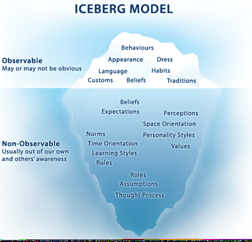
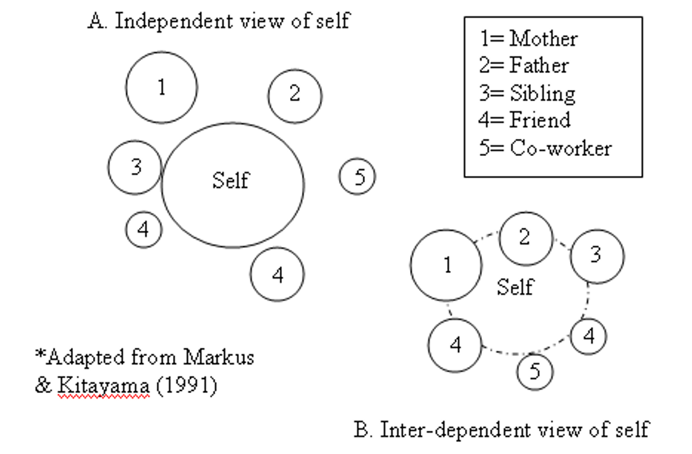

```{r setup, echo=FALSE, warning=FALSE, message=FALSE, include=FALSE}
source(here::here("static", "slides", "all.R"))
```

```{css echo=FALSE}
.highlight-last-item > ul > li,
.highlight-last-item > ol > li {
  opacity: 0.5;
}
.highlight-last-item > ul > li:last-of-type,
.highlight-last-item > ol > li:last-of-type {
  opacity: 1;
}
```

---

class: highlight-last-item
layout: true

---

# Dislaimer

My voice does not sound like Morgan Freeman at all, but most pages will have some audio that will hopefully be clear enough to help you to understand a bit more about the content.

<center>
<audio controls preload="auto">
  <source src="audio/criteria/S1_Introduction.mp3" type="audio/mpeg">
  Your browser does not support embedded audio.
<audio>
</center>

---

# Defining Evaluations 

.bg-washed.b--dark-green.ba.bw2.br3.shadow-5.ph4.mt5[
**Evaluation** is the act or process of determining the ***merit***, ***worth***, or ***significance*** of something or the product of that process.
]

<br>
<center>
<audio controls preload="auto">
  <source src="audio/criteria/S2_Evaluation_Definition.mp3" type="audio/mpeg">
  Your browser does not support embedded audio.
</audio>
</center>

---

# Explaining it to Everyone Else 

.bg-washed.b--dark-green.ba.bw2.br3.shadow-5.ph4.mt5[
**Evaluation** answers ***if it works?*** and ***why does it work?***
]

We typically leave the ***if it works?*** to people with grounded knowledge in a particular area - aka *content experts*. 

---

#  Merit, Worth & Significance 

First consider these questions
+ What do ***merit***, ***worth***,and ***significance*** mean to you both separately and combined?

+ Can you think of real world examples of each?
<br>

Now listen to these

<center>
<audio controls preload="auto">
  <source src="audio/criteria/S3a_Merit_Worth_Significance.mp3" type="audio/mpeg">
  Your browser does not support embedded audio.
</audio>
</center>
<br>
<center>
<audio controls preload="auto">
  <source src="audio/criteria/S3c_Merit.mp3" type="audio/mpeg">
  Your browser does not support embedded audio.
</audio>
</center>
<br>
<center>
<audio controls preload="auto">
  <source src="audio/criteria/S3d_Worth.mp3" type="audio/mpeg">
  Your browser does not support embedded audio.
</audio>
</center>
<br>
<center>
<audio controls preload="auto">
  <source src="audio/criteria/S3e_Significance.mp3" type="audio/mpeg">
  Your browser does not support embedded audio.
</audio>
</center>

---

#  Evaluation 

+ Evaluation is the act or process of determining the *merit* (***quality***), *worth* (***value***), or *significance* (***importance***) of something or the product of that process.

<center>
<audio controls preload="auto">
  <source src="audio/criteria/S4_Evaluation_Definition_Extended.mp3" type="audio/mpeg">
  Your browser does not support embedded audio.
</audio>
</center>

---
#  Evalu… 

- *Evaluand*. This is not always as obvious to define in practice as it may seem. Where are the boundaries of a particular program? Do the evaluator, their employer, and various other stakeholders agree on those boundaries?

- *Evaluator*. Who you are matters… more on this later

<center>
<audio controls preload="auto">
  <source src="audio/criteria/S5_Evaluand_and_Evaluator.mp3" type="audio/mpeg">
  Your browser does not support embedded audio.
</audio>
</center>

---

#  Criteria, Standard, and Indicator 

First consider these questions

+ In addition to defining these for ourselves, what are examples from everyday?

+ Which of the three is harder to identify? Why?

Now listen to these

<center>
<audio controls preload="auto">
  <source src="audio/criteria/S6b_Criteria.mp3" type="audio/mpeg">
  Your browser does not support embedded audio.
</audio>
</center>
<br>
<center>
<audio controls preload="auto">
  <source src="audio/criteria/S6c_Indicator.mp3" type="audio/mpeg">
  Your browser does not support embedded audio.
</audio>
</center>
<br>
<center>
<audio controls preload="auto">
  <source src="audio/criteria/S6d_Standard.mp3" type="audio/mpeg">
  Your browser does not support embedded audio.
</audio>
</center>

---

#  Purposes of Evaluation - Primary 

+ *Formative* - Conducted with the intent to improve

+ *Summative* - Conducted with the intent to inform decision making and/or determine judgment

</audio>
</center>
<br>
<center>
<audio controls preload="auto">
  <source src="audio/criteria/S7_Formative_Summative.mp3" type="audio/mpeg">
  Your browser does not support embedded audio.
</audio>
</center>

---

#  Purposes of Evaluation – Secondary 

+ *Developmental* - To help develop an intervention or program

+ *Accountability* - To hold accountable

+ *Monitoring* - To assess implementation and gauge progress toward a desired end

+ *Knowledge Generation* - To generate knowledge about general patterns of effectiveness

+ *Ascriptive* - Merely for the sake of knowing

---

#  Developmental vs Formative Evaluation


<center>
<iframe width="670.2" height="330.6" src="https://www.youtube.com/embed/Wg3IL-XjmuM" frameborder="0" allow="accelerometer; autoplay; clipboard-write; encrypted-media; gyroscope; picture-in-picture" allowfullscreen>
</iframe>
</center>

---

#  A bit more on Developmental Evaluation 

</audio>
</center>
<br>
<center>
<audio controls preload="auto">
  <source src="audio/criteria/S10_Developmental.mp3" type="audio/mpeg">
  Your browser does not support embedded audio.
</audio>
</center>

---

#  Try This at Home

</audio>
</center>
<br>
<center>
<audio controls preload="auto">
  <source src="audio/criteria/S11_Activity.mp3" type="audio/mpeg">
  Your browser does not support embedded audio.
</audio>
</center>
<br>
```{r tbl10, echo = FALSE}
tbl10 <- tibble::tribble(
~` `, ~`What might the purpose of the evaluation be?`, ~`What questions might the evaluation try to answer?`,
"***Formative Evaluation***"," "," ",
"The program has been designed and piloted with a group of 20 principals. What kind of evaluative feedback should the ASDC seek?"," "," ",
"***Summative Evaluation***"," "," ",
"The program has been delivered to all principals in the county. What kind of evaluative feedback should the ASDC seek?"," "," "
)
kableExtra::kable_styling(knitr::kable(tbl10, escape = FALSE), font_size = 18) %>%
  row_spec(0, color = "white", background = "#212121") %>%
  row_spec(2, color = "white", background = "#212121") %>%
  row_spec(4, color = "white", background = "#212121")
```

---

#  Introduction to Roles and Styles 

- Evaluator Roles: Independent, Topical, External, Internal

- The one that you fill in your evaluation will deternine a lot!

</audio>
</center>
<br>
<center>
<audio controls preload="auto">
  <source src="audio/criteria/S12b_Independent.mp3" type="audio/mpeg">
  Your browser does not support embedded audio.
</audio>
</center>
<br>
<center>
<audio controls preload="auto">
  <source src="audio/criteria/S12c_External.mp3" type="audio/mpeg">
  Your browser does not support embedded audio.
</audio>
</center>
<br>
<center>
<audio controls preload="auto">
  <source src="audio/criteria/S12d_Topical.mp3" type="audio/mpeg">
  Your browser does not support embedded audio.
</audio>
</center>
<br>
<center>
<audio controls preload="auto">
  <source src="audio/criteria/S12e_Internal.mp3" type="audio/mpeg">
  Your browser does not support embedded audio.
</audio>
</center>


---

#  Defining Culture 

What is culture? How do we recognize it ?

“Culture can be defined as the shared experiences of people, including their languages, values, customs, beliefs, and more. It also includes worldviews, ways of knowing, and ways of communicating. Culturally significant factors encompass, but are not limited to, race/ethnicity, religion, social class, language, disability, sexual orientation, age, and gender.” (American Evaluation Association, 2011).

</audio>
</center>
<br>
<center>
<audio controls preload="auto">
  <source src="audio/criteria/S13_Culture.mp3" type="audio/mpeg">
  Your browser does not support embedded audio.
</audio>
</center>

---

# The Iceberg

<center>

</center>
<br>

<center>
<audio controls preload="auto">
  <source src="audio/criteria/S14_Iceberg.mp3" type="audio/mpeg">
  Your browser does not support embedded audio.
</audio>
</center>

---

#  Markus & Kitayama (1991) 

<center>

</center>

<br>
<center>
<audio controls preload="auto">
  <source src="audio/criteria/S15_Self.mp3" type="audio/mpeg">
  Your browser does not support embedded audio.
</audio>
</center>

---

#  Cultural Influences Activity 

How might each of the following influence an evaluation’s design and implementation?

 - Language of participants
 - Role of food and eating
 - Evaluators attire when interacting with participants
 - Concept of time
 - Communication styles
 - Importance of family relationships
 - Values/norms re: individualism, independence, conflict
 - Understanding of social structure

</audio>
</center>
<br>
<center>
<audio controls preload="auto">
  <source src="audio/criteria/S16_Cultural_Activity.mp3" type="audio/mpeg">
  Your browser does not support embedded audio.
</audio>
</center>

---

# Increasing your cultural sensitivity 

Try to
- Assess your own attitudes, beliefs, values
- Incorporate culturally diverse groups and perspectives throughout evaluation process
- Build in sufficient time to negotiate access and build trust in community / organization
- Demystify evaluation, avoid jargon, build buy-in
- Be flexible in choice of evaluation methods, use multiple data sources, multiple data collection methods, multiple perspectives

</audio>
</center>
<br>
<center>
<audio controls preload="auto">
  <source src="audio/criteria/S17_Sensitivity.mp3" type="audio/mpeg">
  Your browser does not support embedded audio.
</audio>
</center>

---

#  Meta-evaluation

- A ***metaevaluation*** is an evaluation of an evaluation or evaluations.

- There are two main types
  - *Formal* - Extra, external study to authenticate the process or product of the evaluation.

  - *Informal* - Evaluating your own evaluation.

</audio>
</center>
<br>
<center>
<audio controls preload="auto">
  <source src="audio/criteria/S18_Meta_Evaluation.mp3" type="audio/mpeg">
  Your browser does not support embedded audio.
</audio>
</center>

---

#  Final Thoughts? 

What made sense or connected well for you in the things we focus on this week?
What didn’t quite fit together or make sense in your mind?
Anything in the reading you wondered about that we didn’t address?
Any remaining questions about the course, syllabus, assignments, etc.?

</audio>
</center>
<br>
<center>
<audio controls preload="auto">
  <source src="audio/criteria/S19_Final.mp3" type="audio/mpeg">
  Your browser does not support embedded audio.
</audio>
</center>

<center>
<br><br><br>
<div class="fade_rule"></div>  
<br><br>
</center>

<center>
<a rel="license" href="http://creativecommons.org/licenses/by-nc-sa/4.0/"></a><br /><br />This work is licensed under a <br /><a rel="license" href="http://creativecommons.org/licenses/by-nc-sa/4.0/">Creative Commons Attribution-NonCommercial-ShareAlike 4.0 International License</a>
</center>