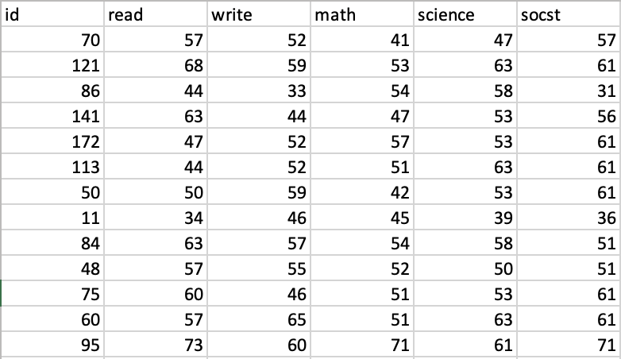
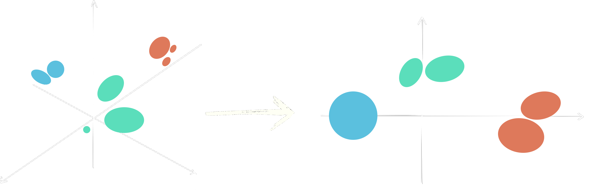
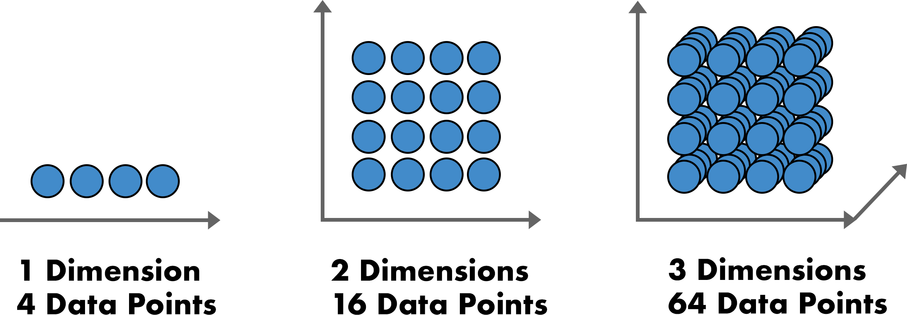
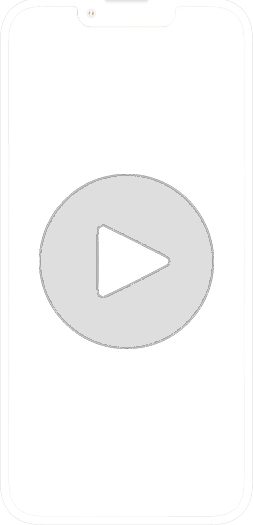
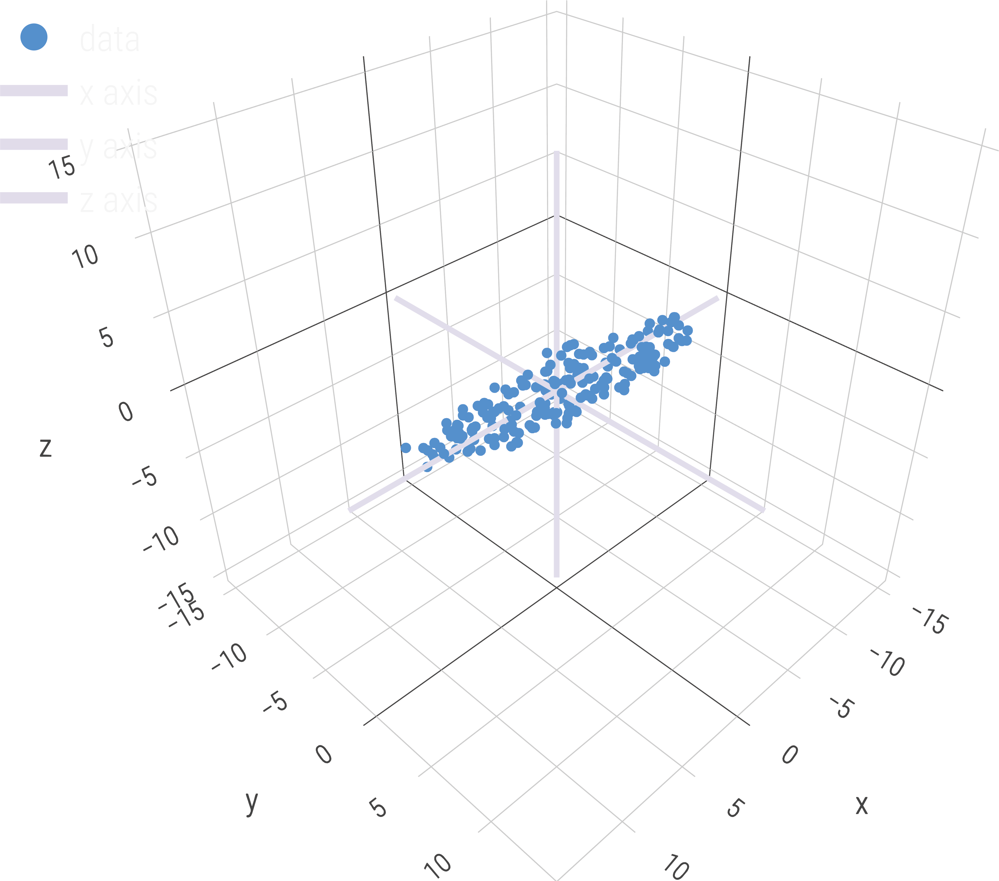
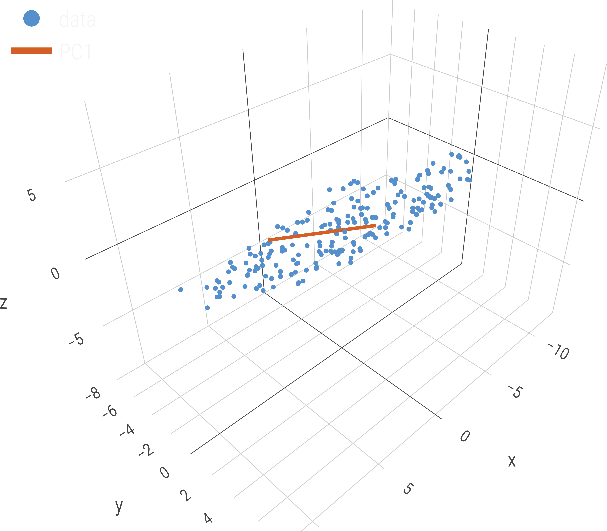
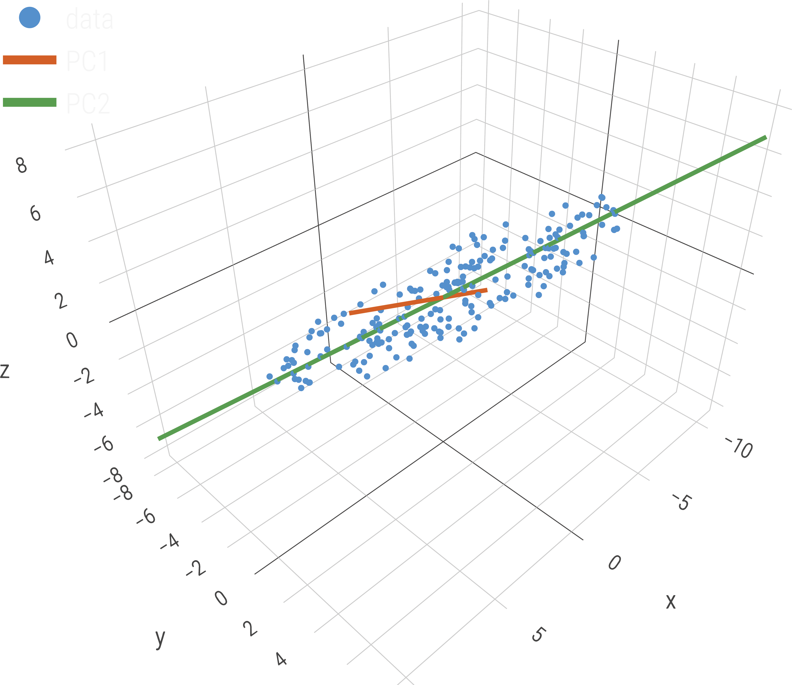
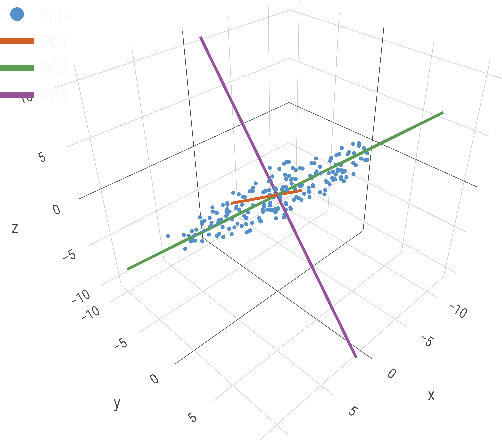

<script src="https://ajax.googleapis.com/ajax/libs/jquery/3.6.0/jquery.min.js"></script>

<script type="text/x-mathjax-config">
MathJax.Hub.Register.StartupHook("TeX Jax Ready",function () {
  MathJax.Hub.Insert(MathJax.InputJax.TeX.Definitions.macros,{
    cancel: ["Extension","cancel"],
    bcancel: ["Extension","cancel"],
    xcancel: ["Extension","cancel"],
    cancelto: ["Extension","cancel"]
  });
});
</script>

<style>
section {
    display: flex;
    display: -webkit-flex;
}

section {
    height: 600px;
    width: 60%;
    margin: auto;
    border-radius: 21px;
    background-color: #212121;
}

.remark-slide-container {
background: #212121;
}

.hljs-github .hljs {
    background: transparent;
    color: #b2dfdb;
}

.hljs-github .hljs-keyword {
    color: #64b5f6;
}

.hljs-github .hljs-literal {
    color: #64b5f6;
}

.hljs-github .hljs-number {
    color: #64b5f6;
}

.hljs-github .hljs-string {
    color: #b7b3ef;
}


.hljs-github .hljs {
    background: transparent;
    color: #b2dfdb;
}

.hljs-github .hljs-keyword {
    color: #64b5f6;
}

.hljs-github .hljs-literal {
    color: #64b5f6;
}

.hljs-github .hljs-number {
    color: #64b5f6;
}

.hljs-github .hljs-string {
    color: #b7b3ef;
}

section p {
    text-align: center;
    font-size: 30px;
    background-color: #212121;
    border-radius: 21px;
    font-family: Roboto Condensed;
    font-style: bold;
    padding: 12px;
    color: #bff4ee;
    margin: auto;
}

#center {
text-align: center;
}

#right {
  text-align: right;
} 

.center p {
  margin: 0;
  position: absolute;
  top: 50%;
  left: 50%;
  -ms-transform: translate(-50%, -50%);
  transform: translate(-50%, -50%);
}

.center2 {
  margin: 0;
  position: absolute;
  top: 50%;
  left: 50%;
  -ms-transform: translate(-50%, -50%);
  transform: translate(-50%, -50%);
}

.tab {
    display: inline-block;
    margin-left: 40px;
}

.tabdbl {
    display: inline-block;
    margin-left: 80px;
}

.tabtpl {
    display: inline-block;
    margin-left: 120px;
}


.obr
{
    display:block;
    margin-top:-15px;
}

.pull-left-left {
  float: left;
  width: 27%;
}

.pull-right-right {
  float: right;
  width: 32%;
}

img.expand:hover {
  margin: 0 auto;
  position: relative;
  width: 50%;
  display: flex;
  justify-content: center;
  align-items: center;
  align-content: center;
  transform: scale(1.5)             
  translateX(-35%);
  z-index: 99;
  transition:all 0.5s ease-in-out;
  -webkit-transition:all 0.2s ease-in-out;
}

.vertline {
  border-left: 5px solid #212121;
  height: 100px;
  margin-left: 15px;
  margin-right: 15px;
}

*, *:before, *:after {
	 box-sizing: border-box;
	 outline: none;
}

.hover {
	 position: relative;
	 display: flex;
	 align-items: center;
	 justify-content: center;
	 width: 400px;
	 height: 65px;
	 background-color: #e3c0ff;
	 border-radius: 99px;
	 box-shadow: 0 1px 3px rgba(0, 0, 0, 0.12), 0 1px 2px rgba(0, 0, 0, 0.24);
	 transition: all 0.3s cubic-bezier(0.25, 0.8, 0.25, 1);
	 overflow: hidden;
}

 .hover:before, .hover:after {
	 position: absolute;
	 top: 0;
	 display: flex;
	 align-items: center;
   justify-content: center;
	 width: 50%;
	 height: 100%;
	 transition: 0.25s linear;
	 z-index: 1;
}

 .hover:before {
	 content: '';
	 left: 0;
	 background-color: #ca86ec;
   color: #212121;
}

 .hover:after {
	 content: '';
	 right: 0;
	 background-color: #d896ff;
}

 .hover:hover {
	 background-color: #cc8bff;
	 box-shadow: 0 14px 28px rgba(0, 0, 0, 0.25), 0 10px 10px rgba(0, 0, 0, 0.22);
}

 .hover:hover span {
	 opacity: 0;
	 z-index: -3;
}

 .hover:hover:before {
	 opacity: 0.5;
	 transform: translateY(-100%);
}

 .hover:hover:after {
	 opacity: 0.5;
	 transform: translateY(100%);
}

 .hover span {
	 position: absolute;
	 top: 0;
	 left: 0;
	 display: flex;
	 align-items: center;
	 justify-content: center;
	 text-align: center;
	 width: 100%;
	 height: 100%;
	 color: #212121;
	 font-size: 24px;
	 font-weight: 700;
	 opacity: 1;
	 transition: opacity 0.25s;
	 z-index: 2;
   white-space:pre;
}

 .hover .doc-link {
	 position: relative;
	 display: flex;
	 align-items: center;
	 justify-content: center;
	 text-align: center;
	 width: 25%;
	 height: 100%;
	 color: whitesmoke;
	 font-size: 24px;
	 text-decoration: none;
	 transition: 0.25s;
}
 .hover .doc-link i {
	 text-shadow: 1px 1px rgba(70, 98, 127, 0.7);
	 transform: scale(1);
}
 .hover .doc-link:hover {
	 background-color: rgba(245, 245, 245, 0.1);
}
 .hover .doc-link:hover i {
	 animation: bounce 0.4s linear;
}
 @keyframes bounce {
	 40% {
		 transform: scale(1.4);
	}
	 60% {
		 transform: scale(0.8);
	}
	 80% {
		 transform: scale(1.2);
	}
	 100% {
		 transform: scale(1);
	}
}

.boxl {
    width: 50%;
    margin: 5px;
    text-align: center;
}

.boxr {
    margin: 5px;
    text-align: center;
}

.picr {
    display: flex;
    justify-content: space-around;
    align-items: center;
}
</style>

```{r setup, echo = FALSE, message=FALSE, warning=FALSE}
library(tidyverse)
library(magrittr)
library(knitr)
library(kableExtra)
library(fontawesome)
library(hrbrthemes)
library(here)
library(patchwork)
library(plotly)
library(plot3D)
library(xaringanthemer)
library(gganimate)
library(ggrepel)
library(tweenr)
library(data.table)
library(Rtsne)
library(cowplot)
library(showtext)
font_add_google("Roboto Condensed", "roboto")
showtext_auto()
```

```{css echo=FALSE}
.highlight-last-item > ul > li,
.highlight-last-item > ol > li {
  opacity: 0.5;
}
.highlight-last-item > ul > li:last-of-type,
.highlight-last-item > ol > li:last-of-type {
  opacity: 1;
}
```

```{r echo = FALSE, purl=FALSE}
xaringanthemer::style_duo(
  primary_color = "#212121",
  secondary_color = "#bff4ee",
  link_color = "#b1ead6",
  text_bold_color = "#00b0cc",
  table_row_border_color = "#212121",
  table_row_even_background_color = "#212121",
  footnote_font_size = "0.6em",
  header_font_google = xaringanthemer::google_font("Roboto Condensed", "700"),
  text_font_google   = xaringanthemer::google_font("Roboto Condensed", "400")
)

xaringanExtra::use_xaringan_extra(c("tile_view", 
                                    "animate_css", 
                                    "tachyons"))

xaringanExtra::use_panelset()

xaringanExtra::use_logo(
  image_url = here::here("static", "img", "course_hex.png"),
  link_url = "https://edp619.asocialdatascientist.com",
  position = xaringanExtra::css_position(top = "1em", right = "1em")
)

opts_chunk$set(dev.args=list(bg="transparent"))
```

---

class: highlight-last-item
layout: true

---

# Welcome! 

There are a lot of things going on behind the scenes when using PCAs and this is just a very brief introduction without any audio. I have tried to minimize the jargon and complexity, though some items may not be as clear as others. If you have questions, please feel free to reach out.

Additionally you may notice the following icons in the footnotes. These contain links to external sites that provide extra materials that may be of interest to you. 
<br>
<br>
<br>
<br>
<center>
<div class='footsbs'>


</div>
</center>

<!-- 
Some information about the audio files. Firstly and importantly, I'm no Morgan Freeman but each page will have some audio that will hopefully help you understand a bit more about what's on the page


<center>
<audio controls preload="auto">
  <source src="audio/criteria/S1_Introduction.mp3" type="audio/mpeg">
  Your browser does not support embedded audio.
<audio>
</center>
-->

---

# Prerequisites

This slideshow assumes that you have a basic understanding of variance and correlations. For a refresher, please take a look at both reviews below

--

.pull-left[
.bg-washed.b--dark-green.ba.bw2.br3.shadow-5.ph4.mt5[
**Variance** is essentially a measure of the spread between points in a data set. Specifically it tells us how far each data point in a set is from the mean and by proxy from every other data point in that set.<br><br>
<center>

</center><br>]
]

--

.pull-right[
.bg-washed.b--dark-green.ba.bw2.br3.shadow-5.ph4.mt5[
**Correlation** gives you an idea of the strength or weakness of the relationship between two variables. In a survey where each item is set to measure a single construct, these are essentially the applicable questions.<br>
<center>

</center><br>]
]

---

# More Review

If you would like a deeper dive on either area, tale a look at the videos below
<br>
<br>
<br>
<br>

--

.pull-left[
<center>

**Variance**
</center>
<p align="center">
    <iframe width="450" height="252" src="https://www.youtube.com/embed/SzZ6GpcfoQY" title="StatQuest Pearson's Correlation, Clearly Explained!!!" frameborder="0" allow="accelerometer; autoplay; clipboard-write; encrypted-media; gyroscope; picture-in-picture" allowfullscreen></iframe>
</p>
]

--

.pull-right[
<center>

**Correlation**
</center>
<p align="center">
    <iframe width="450" height="252" src="https://www.youtube.com/embed/xZ_z8KWkhXE" title="StatQuest Pearson's Correlation, Clearly Explained!!!" frameborder="0" allow="accelerometer; autoplay; clipboard-write; encrypted-media; gyroscope; picture-in-picture" allowfullscreen></iframe>
</p>
]

---

# From Basic to Better

--

<br>
<br>
<center>
correlations are great but they don't...
</center>
<br>
<br>

--

.centerCenter[
<br>
<br>
1. tell you how every question is related to every other question 

2. differentiate between relevant data and noise
]

--

<br>
<br>
<br>
<br>
<br>
<br>
<br>
<br>
<br>
<br>
<br>
<br>
<center>
...enter a method called <b><i>Principle Component Analysis</i></b> 
</center>

---

# Principle Component Analysis (PCA)

---

## Steps in a Nutshell

--

<center>
The basic idea of a PCA can be broken into two steps
</center>
<br>
<br>

--

.pull-left[
Locate the directions, or *components*, in a data set with high variance<br><br>
<center>

</center>
]

--

.pull-right[
Find a limited number of components with high variance that in aggregate can explain most of the overall variance in the data<br><br>
<center>

</center>
]

---

## Reducing Complexity

--

<center>
First an overview of some terms: 
</center>
<br>
<br>

--

.pull-left[
***Dimensionality*** - The number of input variables, or *features* in a dataset. In a spreadsheet, you can think of these as the column names.<br><br>
<center>

</center>
]

--

.pull-right[
***Dimensionality Reduction*** - Statistical techniques used to reduce the number of input variables.<br><br><br><br><br>
<center>

</center>
]

---

## The Problem with Dimensions

***Curse of Dimensionality*** - In brief terms, this refers to a few aspects

--

+ *statistical*. the error rate increases as the number of features increases

--

+ *computational*. algorithms are harder to design and and exponentially take more time to run in high dimensions

--

+ *practical*. higher number of dimensions theoretically allow more information to be stored, but in reality it rarely helps due to the higher possibility of noise and redundancy in real-world data

--

<br>
<br>
<center>

</center>

---

## Fundamentals of What PCAs Can and Cannot Do

PCAs are one of the most traditional methods used for dimension reduction.

--

.pull-left[
<center>

**Primary benefit**
</center>
It transforms the data into the most informative space, thereby allowing the use of lesser dimensions which retain needed information from the data while shedding much of the noise
]

--
  
.pull-right[
<center>

**Primary drawback**
</center>
It assumes linearity so any nonlinear relationship in a given data set is lost possibly causing loss in accuracy and the ability to estimate the likelihood of causality.
]

--
<br>
<br>
<br>
<br>
<hr style="width:30%">
.centerBottom[
Note as with most other procedures: *what you gain in efficiency, you lose in precision*. In a nutshell, there is no known perfect method that can both get rid of all of the noise and leave only relevant information. However with an ever growing machine learning library of approaches, we could get pretty close well within your lifetime!
]

---

## How Do PCAs Work?

--

Before moving on please note that this is a nutshell explanation of the steps and avoids the mathematics<sup>1</sup>. If you are interested in a more nuanced introduction coupled with the mathematics, watch this amazing lecture by Josh Starmer from [StatQuest](https://statquest.org/about/)<sup>2</sup>.

<p align="center">
    <iframe width="560" height="315" src="https://www.youtube.com/embed/_C9-Bn-7KO4" title="Introduction to Principal Component Analysis (PCA) by Josh Starmer from StatQuest" frameborder="0" allow="accelerometer; autoplay; clipboard-write; encrypted-media; gyroscope; picture-in-picture" allowfullscreen></iframe>
</p>

.footnote[
[1] <a href="https://www.stat.cmu.edu/~cshalizi/ADAfaEPoV/ADAfaEPoV.pdf#chapter.1" target='_blank'>

</a>
[2]<a href="https://www.youtube.com/c/joshstarmer/videos" target='_blank'>
   
</a>
]

---

```{r initCond, echo=FALSE, eval = TRUE, results = "hide"}
# colors and color names
xyzaxis_col <- "#e2dded"
xyzaxis_colname <- "#003057"

pcdata_col <- "#3399ff"
pcdata_colname <- "light blue"
pcproj_col <- "#f748a5"
pcproj_colname <- "pink"
pcaxis_col <- "#f7f7f7"
pcaxis_col1 <- "#d55e00"
pcaxis_col2 <- "#599e51"
pcaxis_col3 <- "#96519e"
pcaxis_colname <- "#003057"

# set coordinates for center of ellipsoid
x0 <- 0
y0 <- 0
z0 <- 0

# set dimensions of ellipsoid relative to center; values chosen to make x-axis more important than y-axis, which is more important than the z-axis; so pc1 is x-axis, pc2 is y-axis, pc3 = z-axis
xa <- 15
yb <- 9
zc <- 2

# generate set of random points within the ellipsoid's boundaries done by first generating random points within rectangular solid that encompasses the ellipsoid
set.seed(13)
x <- runif(400, min = -xa, max = xa)
y <- runif(400, min = -yb, max = yb)
z <- runif(400, min = -zc, max = zc)

# determine which points have (x,y,z) values that are inside the ellipsoid using equation for ellipsoid; a negative value for check means the point is inside of ellipsoid; flag as id
check <- (x - x0)^2 / xa^2 + (y - y0)^2 / yb^2 + (z - z0)^2 / zc^2 - 1
id <- which(check < 0)

# extract sets of (x,y,z) points inside of ellipsoid
xe <- x[id]
ye <- y[id]
ze <- z[id]

# function to rotate data and axes; a, b, and g are angles for rotation around the z, y, and x axes; see en.wikipedia.org/wiki/Rotation_matrix
rot <- function(a = 10, b = 10, g = 10, x = xe, y = ye, z = ze) {
  xrot <- cos(a) * cos(b) * x + (cos(a) * sin(b) * sin(g) - sin(a) * cos(g)) * y + (cos(a) * sin(b) * cos(g) + sin(a) * sin(g)) * z
  yrot <- sin(a) * cos(b) * x + (sin(a) * sin(b) * sin(g) + cos(a) * cos(g)) * y + (sin(a) * sin(b) * cos(g) - cos(a) * sin(g)) * z
  zrot <- -sin(b) * x + cos(b) * sin(g) * y + cos(b) * cos(g) * z
  out <- list(
    "xrot" = xrot,
    "yrot" = yrot,
    "zrot" = zrot
  )
}

# original pc axes (same as x,y,z axes)
xpc1 <- c(-xa, xa)
ypc1 <- c(0, 0)
zpc1 <- c(0, 0)
xpc2 <- c(0, 0)
ypc2 <- c(-xa, xa)
zpc2 <- c(0, 0)
xpc3 <- c(0, 0)
ypc3 <- c(0, 0)
zpc3 <- c(-xa, xa)

# rotate the pc axes
pc1 <- rot(x = xpc1, y = ypc1, z = zpc1)
pc2 <- rot(x = xpc2, y = ypc2, z = zpc2)
pc3 <- rot(x = xpc3, y = ypc3, z = zpc3)

# rotate the original data
rotdata <- rot()

# pca results in case they are of interest
pc_results <- 
  prcomp(data.frame(rotdata$xrot, 
                    rotdata$yrot, 
                    rotdata$zrot))
```

```{r ogdata, echo=FALSE}
  axis_width <- 5L

  rdata <- as.data.frame(rotdata)
  
  x_axis <- data.frame(xpc1, ypc1, zpc1)
  
  y_axis <- data.frame(xpc2, ypc2, zpc2)
  
  z_axis <- data.frame(xpc3, ypc3, zpc3)
  
  fig <- 
    plot_ly(
    name = "data", rdata, x = ~xrot, y = ~yrot, z = ~zrot,
    marker = list(size = 2.6, 
                  color = pcdata_col)
  ) %>%
    add_markers() %>%
    add_trace(name = "x axis", 
              data = x_axis, 
              x = ~xpc1, 
              y = ~ypc1, 
              z = ~zpc1, 
              hoverinfo = 'x',
              mode = "lines", 
              type = "scatter3d", 
              inherit = FALSE, 
              textfont = list(family = "Roboto Condensed"),
              line = list(
                width = axis_width, 
                color = xyzaxis_col)
              ) %>%
    add_trace(name = "y axis", 
              data = y_axis, 
              x = ~xpc2, 
              y = ~ypc2, 
              z = ~zpc2, 
              mode = "lines", 
              type = "scatter3d", 
              inherit = FALSE, 
              line = list(
                width = axis_width, 
                color = xyzaxis_col)
              ) %>%
    add_trace(name = "z axis", 
              data = z_axis,
              x = ~xpc3, 
              y = ~ypc3, 
              z = ~zpc3, 
              mode = "lines", 
              type = "scatter3d", 
              inherit = FALSE,
              line = list(
                width = axis_width,
                color = xyzaxis_col)
              ) %>%
    layout(
      scene = list(
        xaxis = list(title = "x",
                     hoverformat = '.2f'),
        yaxis = list(title = "y",
                     hoverformat = '.2f'),
        zaxis = list(title = "z",
                     hoverformat = '.2f')),
      font = list(family = "Roboto Condensed"),
      plot_bgcolor  = "rgba(0, 0, 0, 0)",
      paper_bgcolor = "rgba(0, 0, 0, 0)",
      fig_bgcolor   = "rgba(0, 0, 0, 0)",
      legend = list(itemsizing = 'constant',
                    font = list(family = "Roboto Condensed",
                                size = 16,
                                color = "#f7f7f7"))
      )
```

```{r pc1, echo=FALSE}
comp1 <-
  plot_ly(
    name = "data", 
    rdata, 
    x = ~xrot, 
    y = ~yrot, 
    z = ~zrot,
    marker = list(size = 2.0, 
                  color = pcdata_col)
  ) %>%
    add_markers() %>%
    add_trace(name = "PC1", 
              data = pc1, 
              x = ~xrot, 
              y = ~yrot, 
              z = ~zrot, 
              mode = "lines", 
              type = "scatter3d", 
              inherit = FALSE, 
              line = list(color = pcaxis_col1,
                          width = axis_width)) %>%
    layout(
      scene = list(
        xaxis = list(title = "x",
                     hoverformat = '.2f'),
        yaxis = list(title = "y",
                     hoverformat = '.2f'),
        zaxis = list(title = "z",
                     hoverformat = '.2f')),
      font = list(family = "Roboto Condensed"),
      plot_bgcolor  = "rgba(0, 0, 0, 0)",
      paper_bgcolor = "rgba(0, 0, 0, 0)",
      fig_bgcolor   = "rgba(0, 0, 0, 0)",
      legend = list(itemsizing = 'constant',
                    font = list(family = "Roboto Condensed",
                                size = 16,
                                color = "#f7f7f7"))
      )
```

```{r pc2, echo=FALSE}
  proj <- as.data.frame(rot(x = rep(0, length(id)), y = ye, z = ze))
  
# DFs to define 4 lines to draw "surface"
  P1P2 <- data.frame(
    x = c(pc3$xrot[2], pc2$xrot[2]),
    y = c(pc3$yrot[2], pc2$yrot[2]),
    z = c(pc3$zrot[2], pc2$zrot[2])
  )
  P2P3 <- data.frame(
    x = c(pc2$xrot[2], pc3$xrot[1]),
    y = c(pc2$yrot[2], pc3$yrot[1]),
    z = c(pc2$zrot[2], pc3$zrot[1])
  )
  P3P4 <- data.frame(
    x = c(pc3$xrot[1], pc2$xrot[1]),
    y = c(pc3$yrot[1], pc2$yrot[1]),
    z = c(pc3$zrot[1], pc2$zrot[1])
  )
  P4P1 <- data.frame(
    x = c(pc3$xrot[2], pc2$xrot[1]),
    y = c(pc3$yrot[2], pc2$yrot[1]),
    z = c(pc3$zrot[2], pc2$zrot[1])
  )
  
orthog1 <-
  plot_ly(
    name = "data", 
    rdata, 
    x = ~xrot, 
    y = ~yrot, 
    z = ~zrot,
    marker = list(size = 2.0, 
                  color = pcdata_col)
  ) %>%
    add_markers() %>%
    add_trace(name = "PC1", 
              data = pc1, 
              x = ~xrot, 
              y = ~yrot, 
              z = ~zrot, 
              mode = "lines", 
              type = "scatter3d", 
              inherit = FALSE, 
              line = list(color = pcaxis_col,
                          width = axis_width))%>%
    # Add PC2 projection plane rectangle as 4 lines; no 3d polygon appears to exist in plotly. We need 4 DFs to do this!
    add_trace(name = "line1", 
              data = P1P2, 
              x = ~x, 
              y = ~y, 
              z = ~z, 
              mode = "lines", 
              type = "scatter3d", 
              inherit = FALSE, 
              showlegend = FALSE, 
              line = list(color = pcdata_col, width = axis_width / 2)) %>%
    add_trace(name = "line2", 
              data = P2P3, 
              x = ~x, 
              y = ~y, 
              z = ~z, 
              mode = "lines", 
              type = "scatter3d", 
              inherit = FALSE, 
              showlegend = FALSE, 
              line = list(color = pcdata_col, width = axis_width / 2)) %>%
    add_trace(name = "line3", 
              data = P3P4, 
              x = ~x, 
              y = ~y, 
              z = ~z, 
              mode = "lines", 
              type = "scatter3d", 
              inherit = FALSE, 
              showlegend = FALSE, 
              line = list(color = pcdata_col, width = axis_width / 2)) %>%
    add_trace(name = "line4", 
              data = P4P1,
              x = ~x, 
              y = ~y, 
              z = ~z, 
              mode = "lines", 
              type = "scatter3d", 
              inherit = FALSE, 
              showlegend = FALSE, 
              line = list(color = pcdata_col, width = axis_width / 2)) %>%
    layout(
      scene = list(
        xaxis = list(title = "x",
                     hoverformat = '.2f'),
        yaxis = list(title = "y",
                     hoverformat = '.2f'),
        zaxis = list(title = "z",
                     hoverformat = '.2f')),
      font = list(family = "Roboto Condensed"),
      plot_bgcolor  = "rgba(0, 0, 0, 0)",
      paper_bgcolor = "rgba(0, 0, 0, 0)",
      fig_bgcolor   = "rgba(0, 0, 0, 0)",
      legend = list(itemsizing = 'constant',
                    font = list(family = "Roboto Condensed",
                                size = 16,
                                color = "#f7f7f7"))
      )

comp2 <- 
  plot_ly(
    name = "data", proj, x = ~xrot, y = ~yrot, z = ~zrot,
    marker = list(size = 2.0, color = pcdata_col)
  ) %>%
    add_markers() %>%
    add_trace(name = "PC1", 
              data = pc1, 
              x = ~xrot, 
              y = ~yrot, 
              z = ~zrot, 
              mode = "lines", 
              type = "scatter3d", 
              inherit = FALSE, 
              line = list(color = pcaxis_col1, width = axis_width)) %>%
    add_trace(name = "PC2", 
              data = pc2, 
              x = ~xrot, 
              y = ~yrot, 
              z = ~zrot, 
              mode = "lines", 
              type = "scatter3d", 
              inherit = FALSE, 
              line = list(color = pcaxis_col2, width = axis_width)) %>%
    layout(
      scene = list(
        xaxis = list(title = "x",
                     hoverformat = '.2f'),
        yaxis = list(title = "y",
                     hoverformat = '.2f'),
        zaxis = list(title = "z",
                     hoverformat = '.2f')),
      font = list(family = "Roboto Condensed"),
      plot_bgcolor  = "rgba(0, 0, 0, 0)",
      paper_bgcolor = "rgba(0, 0, 0, 0)",
      fig_bgcolor   = "rgba(0, 0, 0, 0)",
      legend = list(itemsizing = 'constant',
                    font = list(family = "Roboto Condensed",
                                size = 16,
                                color = "#f7f7f7"))
      )
  
```

```{r pc3, echo=FALSE}
comp3 <-
  plot_ly(
    name = "data", rdata, x = ~xrot, y = ~yrot, z = ~zrot,
    marker = list(size = 2.0, color = pcdata_col)
    ) %>%
    add_markers() %>%
    add_trace(name = "PC1", 
              data = pc1, 
              x = ~xrot, 
              y = ~yrot, 
              z = ~zrot, 
              mode = "lines", 
              type = "scatter3d", 
              inherit = FALSE, 
              line = list(color = pcaxis_col1, width = axis_width)) %>%
    add_trace(name = "PC2", 
              data = pc2, 
              x = ~xrot, 
              y = ~yrot, 
              z = ~zrot, 
              mode = "lines", 
              type = "scatter3d", 
              inherit = FALSE, 
              line = list(color = pcaxis_col2, width = axis_width)) %>%
  add_trace(name = "PC3", 
            data = pc3, 
            x = ~xrot, 
            y = ~yrot, 
            z = ~zrot, 
            mode = "lines", 
            type = "scatter3d", 
            inherit = FALSE, 
            line = list(color = pcaxis_col3, width = axis_width)) %>%
    layout(
      scene = list(
        xaxis = list(title = "x",
                     hoverformat = '.2f'),
        yaxis = list(title = "y",
                     hoverformat = '.2f'),
        zaxis = list(title = "z",
                     hoverformat = '.2f')),
      font = list(family = "Roboto Condensed"),
      plot_bgcolor  = "rgba(0, 0, 0, 0)",
      paper_bgcolor = "rgba(0, 0, 0, 0)",
      fig_bgcolor   = "rgba(0, 0, 0, 0)",
      legend = list(itemsizing = 'constant',
                    font = list(family = "Roboto Condensed",
                                size = 16,
                                color = "#f7f7f7"))
      )
```

## OK Now Really How Do PCAs Work?

--

.center2[
Let's look at a data set with 205 points randomly scattered in three-dimensions. Keep in mind that as you move along, the <i>PCA is carving out new dimensions which you will be able to see and interact with</i>.
]


<br>
<br>
<br>
<br>
<br>
<br>
<br>
<br>
<br>
<br>
<br>
<br>
<br>
<br>
<br>
<center>
When applying a PCA, it locates the...
</center>

---

<ol start="1">
<li>center point of data in multi-dimensional space
</li>
</ol>
<br>
<br>
<br>

.panelset.sideways[

.panel[.panel-name[Look]
```{r echo=FALSE, out.width="60%", fig.align = 'center'}

```
]

.panel[.panel-name[Interact]
```{r echo=FALSE, warning=FALSE}
fig
```
]

]

---

<ol start="2">
<li>direction with the greatest variance. This is called the <b>1st component</b>
</li>
</ol>
<br>
<br>
<br>

.panelset.sideways[

.panel[.panel-name[Look]
```{r echo=FALSE, out.width="60%", fig.align = 'center'}

```
]

.panel[.panel-name[Interact]
```{r echo=FALSE, warning=FALSE}
comp1
```
]

]

---

<ol start="3">
<li>direction that is perpendicular, or <i>orthogonal</i> to the 1st component with the greatest variance. This is called the <b>2nd component</b>.
</li>
</ol>
<br>
<br>
<br>

.panelset.sideways[

.panel[.panel-name[Look]
```{r echo=FALSE, out.width="60%", fig.align = 'center'}

```
]

.panel[.panel-name[Interact]
```{r echo=FALSE, warning=FALSE}
comp2
```
]

]

---

<ol start="4">
<li>direction that is perpendicular, or <i>orthogonal</i> to the 1st and 2nd component with the greatest variance. This is called the <b>3rd component</b>.
</li>
</ol>
<br>
<br>
<br>

.panelset.sideways[

.panel[.panel-name[Look]
```{r echo=FALSE, out.width="60%", fig.align = 'center'}

```
]

.panel[.panel-name[Interact]
```{r echo=FALSE, warning=FALSE}
comp3
```
]

]

---

> and it keeps going like this for as many dimensions as we have in a data set...
<br>
<br>

--

> so you can probably imagine that big data sets with hundreds or thousands of columns and rows can take quite a bit of time...
<br>
<br>

--

> but there are many other methods of reducing dimensions like

```{r echo=FALSE, warning=FALSE, message=FALSE}
# Normal distribution ----
set.seed(123456)
N = 30000
D = 500
data.norm = matrix(rnorm(N * D, 2), N)
groups.probs = runif(10)
groups = sample(1:10, N, TRUE, groups.probs/sum(groups.probs))
for (gp in unique(groups)) {
  dev = rep(1, D)
  dev[sample.int(D, 3)] = runif(3, -20, 20)
  data.norm[which(groups == gp), ] = data.norm[which(groups == 
                                                       gp), ] %*% diag(dev)
}

info.norm <-
  tibble(truth = factor(groups))

# Plot element ----
bgaes <- 
  list(
  theme_minimal(base_family = "roboto"),
  theme_ipsum_rc(axis_text_size = 0,
                 axis_title_size = 0,
                 plot_title_size = 0,
                 subtitle_size = 0,
                 strip_text_size = 0),
 theme(panel.grid.major = element_blank(),
          panel.grid.minor = element_blank(),
          panel.background = element_rect(fill = "#212121",
                                          color = "#212121"),
          plot.background = element_rect(fill = "#212121",
                                         color = "#212121"))
  )

# PCA ----
pca.norm = prcomp(data.norm)

info.norm %<>% 
  cbind(pca.norm$x[, 1:4])

PCA12 <- 
  ggplot(info.norm, aes(x = PC1, y = PC2, 
                        color = truth)) + 
  geom_point(alpha = 0.3,
             show.legend = FALSE) + 
  scale_color_brewer(palette = "Spectral") +
  bgaes

PCA34 <- 
  ggplot(info.norm, aes(x = PC3, y = PC4, 
                               color = truth)) + 
  geom_point(alpha = 0.3,
             show.legend = FALSE) + 
  scale_color_brewer(palette = "Spectral") +
  bgaes

# t-SNE
tsne.norm <- 
  Rtsne(pca.norm$x, 
        pca = FALSE)

info.norm %<>% 
  mutate(tsne1 = tsne.norm$Y[, 1], 
         tsne2 = tsne.norm$Y[, 2])

TSNE <- 
  ggplot(info.norm, aes(x = tsne1, 
                        y = tsne2, 
                        color = truth)) + 
  geom_point(alpha = 0.3,
             show.legend = FALSE) + 
  scale_color_brewer(palette = "Spectral") +
  bgaes

# Hierarchical clustering
hc.norm <- 
  hclust(dist(tsne.norm$Y))

info.norm$hclust <- 
  factor(cutree(hc.norm, 19))

hc.norm.cent <- 
  info.norm %>% 
  group_by(hclust) %>% 
  select(tsne1, 
         tsne2) %>% 
  summarize_all(mean)

HC <- 
  ggplot(info.norm, aes(x = tsne1, y = tsne2, color = hclust)) + 
  geom_point(alpha = 0.3) + 
  geom_label_repel(aes(label = hclust), 
                   data = hc.norm.cent) + 
  guides(color = "none") +
  bgaes

# kmeans
km.norm <- 
  kmeans(tsne.norm$Y, 19, nstart = 150)

info.norm$kmeans <- 
  factor(km.norm$cluster)

km.cent <-
  info.norm %>% 
  group_by(kmeans) %>% 
  select(tsne1, tsne2) %>% 
  summarize_all(mean)

km <- 
  ggplot(info.norm, aes(x = tsne1, y = tsne2, color = kmeans)) + 
  geom_point(alpha = 0.3, show.legend = FALSE) + 
  theme_minimal(base_family = "roboto") +
  bgaes
```

---

.pull-left[
[Hierarchical Clustering](https://uc-r.github.io/hc_clustering)<sup>3</sup>
]

.pull-right[
```{r echo=FALSE, warning=FALSE, message=FALSE}
HC
```
]

.footnote[
<div class='footsbs'>
[3] 
<a href="https://uc-r.github.io/hc_clustering" target='_blank'>

</a>
<a href="scripts/hc.zip" target='_blank' download="Hierarchical Clustering script">

</a> 
</div>
]

---

.pull-left[
[K-means Clustering](https://uc-r.github.io/kmeans_clustering)<sup>4</sup>
]

.pull-right[
```{r echo=FALSE, warning=FALSE, message=FALSE}
km
```
]

.footnote[
<div class='footsbs'>
[4] <a href="https://uc-r.github.io/kmeans_clustering" target='_blank'>

</a>
<a href="scripts/kmeans.zip" target='_blank' download="K-means script">

</a>
</div>
]

---

.pull-left[
[t-Distributed Stochastic Neighbor Embedding (t-SNE)](https://rpubs.com/marwahsi/tnse)<sup>5</sup>
]

.pull-right[
```{r echo=FALSE, warning=FALSE, message=FALSE}
TSNE
```
]

.footnote[
<div class='footsbs'>
[5] <a href="https://rpubs.com/marwahsi/tnse" target='_blank'>

</a>
<a href="https://distill.pub/2016/misread-tsne/" target='_blank'>

</a>
<a href="scripts/tsne.zip" target='_blank' download="t-SNE script">

</a>
</div>
]

---

Below is an animation of the t-SNE process which shows a complex data set, data reduction and then clustering<sup>6</sup>

```{r echo=FALSE, message = FALSE, warning = FALSE, results = FALSE}
## tSNE dimensions
tsne_dims <- 
  fread("data/tsne_dims.csv")

## tSNE dimensions
tsne_dims <- 
  fread("data/tsne_dims.csv")

ss = 180

## tSNE dimensions
set.seed(ss)
tsne_dims <- 
  read_csv("data/tsne_dims.csv",
           show_col_types = FALSE) %>%
  mutate(tsne_x = tsne_x * runif(1, 1, 1.4),
         tsne_y = tsne_y * runif(1, 0.6, 1.2)) 

## Random dimensions
random_disc_jitter <- 
  function(num_points,
           disc_radius,
           random_seed = ss) {
    
    if(!is.null(random_seed)) {
      set.seed(random_seed)
    }
    
    # Random radius positions
    r <- runif(num_points, 0, disc_radius ^ 2)
    
    # Random angles
    t <- runif(num_points, 0, 2 * pi)
    
    # Convert radius and angles to Cartesian coordinates
    data.frame(x = sqrt(r) * cos(t),
               y = sqrt(r) * sin(t))
  }

# Get the max x or y value from the tsne dims for the radius
max_tsne <- 
  max(abs(c(tsne_dims$tsne_x, 
            tsne_dims$tsne_y)))

tsne_dims <- 
  tsne_dims %>%
  mutate(random_x = random_disc_jitter(num_points = n(),
                                       disc_radius = max_tsne)$x,
         random_y = random_disc_jitter(num_points = n(),
                                       disc_radius = max_tsne)$y)

## Fermat spiral dimensions
fermat_jitter <- 
  function(num_points, 
           size, 
           center_x, 
           center_y) {
    
    golden_ratio <- (sqrt(5) + 1) / 2
    
    fibonacci_angle <- 360 / (golden_ratio ^ 2)
    
    circle_r <- sqrt(size / num_points)
    
    x <- rep(center_x, num_points)
    y <- rep(center_y, num_points)
    
    for (m in 1:(num_points - 1)) {
      n <- m - 1
      r <- circle_r * sqrt(n)
      theta <- fibonacci_angle * (n)
      x[n] <- center_x + r * cos(theta)
      y[n] <- center_y + r * sin(theta)
      
    }
    
    data.frame(x = x, 
               y = y)
    
  }

# Some trial and error for this value to find a size that packs the points without getting
# too much overlap
max_size <- 16

# We'll also need the max cluster n to scale the jitter radius
max_n <- 
  max(table(tsne_dims$cluster_id))

tsne_dims <- 
  tsne_dims %>%
  group_by(cluster_id) %>%
  mutate(centroid_x = mean(tsne_x, trim = 0),
         centroid_y = mean(tsne_y, trim = 0)) %>%
  mutate(fermat_x = fermat_jitter(num_points = n(),
                                  size = max_size * n() / max_n,
                                  center_x = centroid_x[1],
                                  center_y = centroid_y[1])$x,
         fermat_y = fermat_jitter(num_points = n(),
                                  size = max_size * n() / max_n,
                                  center_x = centroid_x[1],
                                  center_y = centroid_y[1])$y) %>%
  ungroup()

## Build the animation
state_0 <- 
  data.frame(x = tsne_dims$random_x,
             y = tsne_dims$random_y,
             fill = "#a7adba",
             stroke = 1)
  
state_1 <- 
  data.frame(x = tsne_dims$random_x,
             y = tsne_dims$random_y,
             fill = tsne_dims$cluster_color,
             stroke = 0)

state_2 <- 
  data.frame(x = tsne_dims$tsne_x,
             y = tsne_dims$tsne_y,
             fill = tsne_dims$cluster_color,
             stroke = 0)

state_3 <- 
  data.frame(x = tsne_dims$fermat_x,
             y = tsne_dims$fermat_y,
             fill = tsne_dims$cluster_color,
             stroke = 0)

state_list <- 
  list(state_0, state_1, state_2, state_3, state_2, state_1, state_0)

tweened_states <- 
  tween_states(state_list, 
               tweenlength = 2,
               statelength = 1,
               ease = "cubic-in-out",
               nframes = 96)

tweened_plot <- 
  tweened_states %>% 
  as_tibble() %>%
  rename(frame = .frame,
         id = .id,
         phase = .phase) %>%
  mutate(id = as.factor(frame)) %>%
  ggplot(aes(x = x, 
             y = y)) +
  geom_point(aes(fill = fill,
                 stroke = stroke),
             color = "#fdfdfd",
             shape = 21,
             size = 2.2) +
  scale_fill_identity() +
  theme_nothing() +
  transition_manual(frame)

tsne_anim <-
  animate(tweened_plot, 
          nframes = 600, 
          fps = 60, 
          bg = 'transparent')

anim_save("img/tsne_anim.gif", tsne_anim)
```

<center>

</center>
         
.footnote[
<div class='footsbs'>
[6]
<a href="https://hypercompetent.github.io/post/gganimate-tweenr-tsne-plot/" target='_blank'>

</a>
<a href="scripts/tsne_anim.zip" target='_blank' download="t-SNE animation bundle">

</a>
</div>
]

---

And just for fun here are two [pca](https://rpubs.com/marwahsi/tnse) rotations of the example data set<sup>7</sup>
<br>

.pull-left[
```{r echo=FALSE, warning=FALSE, message=FALSE}
PCA12
```
]

.pull-right[
```{r echo=FALSE, warning=FALSE, message=FALSE}
PCA34
```
]

.footnote[
<div class='footsbs'>
[7]
<a href="https://uc-r.github.io/pca" target='_blank'>

</a>
<a href="scripts/pca.zip" target='_blank' download="PCA script">

</a>
</div>
]


---

## Surveys and PCAs

In general, using a PCA in survey data analysis helps you to understand

--

+ how each item is similar to all others and the strength of that relationship

--

+ which items are should likely be kept or removed

---

# But Wait There's More!

Again this is just the tip of the iceberg. To really see the power of PCAs, take a look at machine learning. This is just one of many ways to deal with classification and dimensionality. Here are a couple resources. At this time, its good just to ignore the coding and to simply get a basic idea of each. 

.footnote[
[8] If you cannot see the entire page, please load the site in a private window. Directions on how to do this are provided for
<center>
<div class='footsbs'>
<a href="https://support.google.com/chrome/answer/95464" target='_blank'>

</a>
<a href="https://support.mozilla.org/en-US/kb/private-browsing-use-firefox-without-history" target='_blank' download="PCA script">

</a>
<a href="https://support.apple.com/guide/safari/browse-privately-ibrw1069/mac" target='_blank' download="PCA script">

</a>
</dvv>
</center>
]

--

+ [11 Dimensionality reduction techniques you should know in 2021](https://towardsdatascience.com/11-dimensionality-reduction-techniques-you-should-know-in-2021-dcb9500d388b)<sup>8</sup>

--

+ [Understanding Dimension Reduction and Principal Component Analysis in R for Data Science](https://towardsdatascience.com/understanding-dimension-reduction-and-principal-component-analysis-in-r-e3fbd02b29ae)<sup>8</sup>

--

+ [Workshop: Dimension reduction with R](https://rpubs.com/Saskia/520216)

---

## Thats it!

If you have any questions, please reach out

--

<br>
<br>
<br>
<br>
<br>
<br>
<br>
<br>
<br>
<center>
<br><br>
<div class="fade_rule"></div>  
<br><br>
</center>

<center>
<a rel="license" href="http://creativecommons.org/licenses/by-nc-sa/4.0/"></a><br /><br />This work is licensed under a <br /><a rel="license" href="http://creativecommons.org/licenses/by-nc-sa/4.0/">Creative Commons Attribution-NonCommercial-ShareAlike 4.0 International License</a>
</center>
