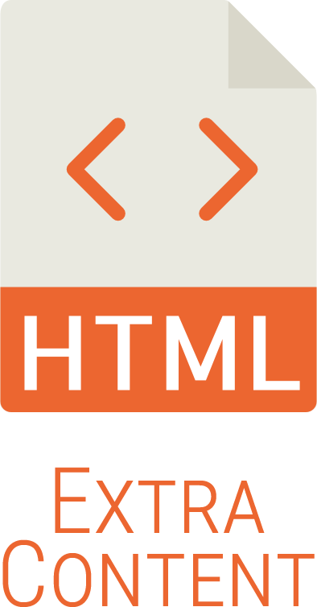
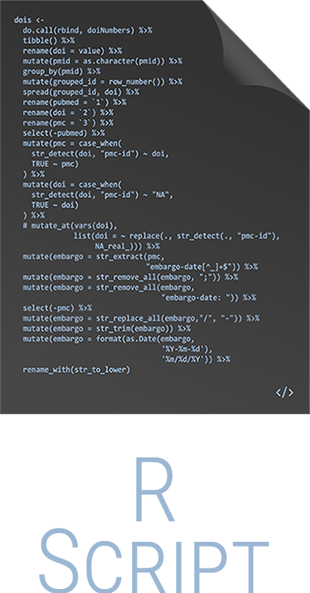
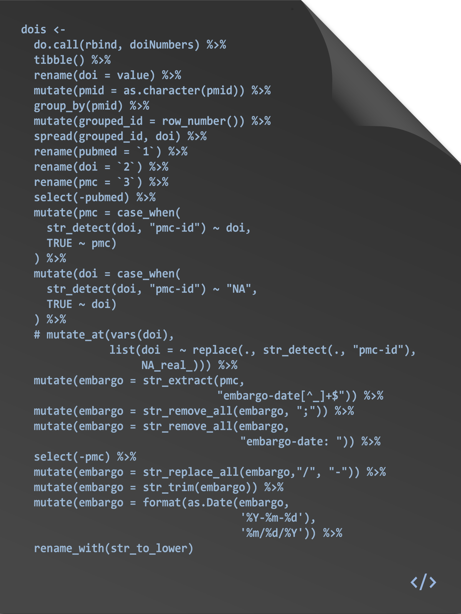
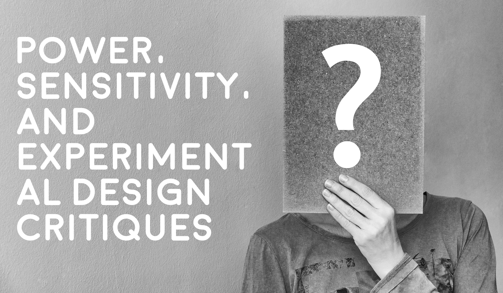

<script src="https://ajax.googleapis.com/ajax/libs/jquery/3.6.0/jquery.min.js"></script>

<script type="text/x-mathjax-config">
MathJax.Hub.Register.StartupHook("TeX Jax Ready",function () {
  MathJax.Hub.Insert(MathJax.InputJax.TeX.Definitions.macros,{
    cancel: ["Extension","cancel"],
    bcancel: ["Extension","cancel"],
    xcancel: ["Extension","cancel"],
    cancelto: ["Extension","cancel"]
  });
});
</script>

<style>
section {
    display: flex;
    display: -webkit-flex;
}

section {
    height: 600px;
    width: 60%;
    margin: auto;
    border-radius: 21px;
    background-color: #212121;
}

.remark-slide-container {
background: #212121;
}

.hljs-github .hljs {
    background: transparent;
    color: #b2dfdb;
}

.hljs-github .hljs-keyword {
    color: #64b5f6;
}

.hljs-github .hljs-literal {
    color: #64b5f6;
}

.hljs-github .hljs-number {
    color: #64b5f6;
}

.hljs-github .hljs-string {
    color: #b7b3ef;
}


.hljs-github .hljs {
    background: transparent;
    color: #b2dfdb;
}

.hljs-github .hljs-keyword {
    color: #64b5f6;
}

.hljs-github .hljs-literal {
    color: #64b5f6;
}

.hljs-github .hljs-number {
    color: #64b5f6;
}

.hljs-github .hljs-string {
    color: #b7b3ef;
}

section p {
    text-align: center;
    font-size: 30px;
    background-color: #212121;
    border-radius: 21px;
    font-family: Roboto Condensed;
    font-style: bold;
    padding: 12px;
    color: #bff4ee;
    margin: auto;
}

#center {
text-align: center;
}

#right {
  text-align: right;
} 

.center p {
  margin: 0;
  position: absolute;
  top: 50%;
  left: 50%;
  -ms-transform: translate(-50%, -50%);
  transform: translate(-50%, -50%);
}

.center2 {
  margin: 0;
  position: absolute;
  top: 50%;
  left: 50%;
  -ms-transform: translate(-50%, -50%);
  transform: translate(-50%, -50%);
}

.tab {
    display: inline-block;
    margin-left: 40px;
}

.tabdbl {
    display: inline-block;
    margin-left: 80px;
}

.tabtpl {
    display: inline-block;
    margin-left: 120px;
}


.obr
{
    display:block;
    margin-top:-15px;
}

.pull-left-left {
  float: left;
  width: 27%;
}

.pull-right-right {
  float: right;
  width: 32%;
}

img.expand:hover {
  margin: 0 auto;
  position: relative;
  width: 50%;
  display: flex;
  justify-content: center;
  align-items: center;
  align-content: center;
  transform: scale(1.5)             
  translateX(-35%);
  z-index: 99;
  transition:all 0.5s ease-in-out;
  -webkit-transition:all 0.2s ease-in-out;
}

.vertline {
  border-left: 5px solid #212121;
  height: 100px;
  margin-left: 15px;
  margin-right: 15px;
}

*, *:before, *:after {
	 box-sizing: border-box;
	 outline: none;
}

.hover {
	 position: relative;
	 display: flex;
	 align-items: center;
	 justify-content: center;
	 width: 400px;
	 height: 65px;
	 background-color: #e3c0ff;
	 border-radius: 99px;
	 box-shadow: 0 1px 3px rgba(0, 0, 0, 0.12), 0 1px 2px rgba(0, 0, 0, 0.24);
	 transition: all 0.3s cubic-bezier(0.25, 0.8, 0.25, 1);
	 overflow: hidden;
}

 .hover:before, .hover:after {
	 position: absolute;
	 top: 0;
	 display: flex;
	 align-items: center;
   justify-content: center;
	 width: 50%;
	 height: 100%;
	 transition: 0.25s linear;
	 z-index: 1;
}

 .hover:before {
	 content: '';
	 left: 0;
	 background-color: #ca86ec;
   color: #212121;
}

 .hover:after {
	 content: '';
	 right: 0;
	 background-color: #d896ff;
}

 .hover:hover {
	 background-color: #cc8bff;
	 box-shadow: 0 14px 28px rgba(0, 0, 0, 0.25), 0 10px 10px rgba(0, 0, 0, 0.22);
}

 .hover:hover span {
	 opacity: 0;
	 z-index: -3;
}

 .hover:hover:before {
	 opacity: 0.5;
	 transform: translateY(-100%);
}

 .hover:hover:after {
	 opacity: 0.5;
	 transform: translateY(100%);
}

 .hover span {
	 position: absolute;
	 top: 0;
	 left: 0;
	 display: flex;
	 align-items: center;
	 justify-content: center;
	 text-align: center;
	 width: 100%;
	 height: 100%;
	 color: #212121;
	 font-size: 24px;
	 font-weight: 700;
	 opacity: 1;
	 transition: opacity 0.25s;
	 z-index: 2;
   white-space:pre;
}

 .hover .doc-link {
	 position: relative;
	 display: flex;
	 align-items: center;
	 justify-content: center;
	 text-align: center;
	 width: 25%;
	 height: 100%;
	 color: whitesmoke;
	 font-size: 24px;
	 text-decoration: none;
	 transition: 0.25s;
}
 .hover .doc-link i {
	 text-shadow: 1px 1px rgba(70, 98, 127, 0.7);
	 transform: scale(1);
}
 .hover .doc-link:hover {
	 background-color: rgba(245, 245, 245, 0.1);
}
 .hover .doc-link:hover i {
	 animation: bounce 0.4s linear;
}
 @keyframes bounce {
	 40% {
		 transform: scale(1.4);
	}
	 60% {
		 transform: scale(0.8);
	}
	 80% {
		 transform: scale(1.2);
	}
	 100% {
		 transform: scale(1);
	}
}

.boxl {
    width: 50%;
    margin: 5px;
    text-align: center;
}

.boxr {
    margin: 5px;
    text-align: center;
}

.picr {
    display: flex;
    justify-content: space-around;
    align-items: center;
}
</style>

```{r setup, include=FALSE, purl=FALSE}
library(tidyverse)
library(pwr)
library(knitr)
library(kableExtra)
library(DT)
library(scales)
library(fontawesome)
library(flipbookr)
library(tweetrmd)
library(here)
library(showtext)
font_add_google("Roboto Condensed", "roboto")
showtext_auto()
```

```{css echo=FALSE}
.highlight-last-item > ul > li,
.highlight-last-item > ol > li {
  opacity: 0.5;
}
.highlight-last-item > ul > li:last-of-type,
.highlight-last-item > ol > li:last-of-type {
  opacity: 1;
}
```

```{r echo = FALSE, purl=FALSE}
xaringanthemer::style_duo(
  primary_color = "#212121",
  secondary_color = "#bff4ee",
  link_color = "#b1ead6",
  code_inline_background_color = "transparent",
  code_inline_color = "#b2dfdb",
  code_highlight_color = "#212121",
  text_bold_color = "#00b0cc",
  table_row_border_color = "#212121",
  table_row_even_background_color = "#212121",
  footnote_font_size = "0.6em",
  header_font_google = xaringanthemer::google_font("Roboto Condensed", "700"),
  text_font_google   = xaringanthemer::google_font("Roboto Condensed", "400")
)

xaringanExtra::use_xaringan_extra(c("tile_view", 
                                    "animate_css", 
                                    "tachyons"))

xaringanExtra::use_panelset()

xaringanExtra::use_logo(
  image_url = here::here("static", "img", "course_hex.png"),
  link_url = "https://edp619.asocialdatascientist.com",
  position = xaringanExtra::css_position(top = "1em", right = "1em")
)

opts_chunk$set(dev.args=list(bg="transparent"))
```


# Welcome! 

This is an absolutely minimalist overview of power analysis and the reasons it matters. If you want a deeper dive, consider enrolling in an advanced statistics course like [Power and Sample Size for Multilevel and Longitudinal Study Designs](https://www.coursera.org/learn/power-sample-size) for free. In the meantime, remember that you can explore power and its relationships interactively at [Understanding Statistical Power and Significance Testing](https://rpsychologist.com/d3/nhst/).

Additionally you may notice the following icons in the footnotes. These contain links to external sites that provide extra materials that may be of interest to you. 
<br>
<br>
<br>
<br>
<center>
<div class='footsbs'>





</div>
</center>

---

# Something Important

.center2[<span style="color:#8ec9bb; font-weight: bold; font-style: italic;">(Statistical) Power</span> and its corresponding analysis are by far one of the most misunderstood concepts, in that a lot of people think they know what it is but simply miss the point.]

.footnote[Please note that you will need to recall some concepts covered in an introductory statistics course]

---

# Prerequisites

Before going ahead, make sure that you have a basic understanding of sampling and hypothesis testing. For a refresher, please take a look at both reviews on the next page

---

## Review

If you would like a deeper dive on either area, please click on the icons below
<br>
<br>
<br>
<br>

--

<br>
.pull-left[
<center>

<span style="color:#00b0cc; font-weight: bold; font-style: italic;">Sampling</span>
<br>
<br>
<br>
</center>
<center>
 <a href="https://youtu.be/67zCIqdeXpo">

</a>
</center>
]


--

.pull-right[
<center>

<span style="color:#00b0cc; font-weight: bold; font-style: italic;">Hypothesis Testing</span>
<br>
<br>
<br>
</center>
<center>
 <a href="https://youtu.be/0oc49DyA3hU">

</a>
</center>
]

---

# <span style="color:#8ec9bb; font-weight: bold; font-style: italic;">(Statistical) Power</span>

---

# Definition

--

.center2[<span style="color:#8ec9bb; font-weight: bold; font-style: italic;">(Statistical) Power</span> is the probability of avoiding a Type II error <i>aka</i> detecting an effect if it exists]


---

# Dodging False Negatives  

--

<br>
<br>
<center>

</center>

---

# Influences

--

> Effect size

--

> Sample size

--

> Significance level

---

## Some Things You Should Be Aware of

--

.pull-left[
Power is usually set at 80%, but that is not a hard rule by any means
]

--

.pull-right[
This means if there are actual effects detected in 100 different studies with 80% power, then 80 out of 100 statistical tests will actually detect them
]

--

.pull-left[
If you have an *underpowered* design, you may not be able detect a true effect
]

--

.pull-right[
If you have an *overpowered* design, you may detect very small effects that are of no practical relevance<sup>1</sup>
]

.footnote[The real problem isn't that *overpowered* experiments may reveal tiny significant effects, rather it is that many academic fields and popular science reporting standard in general emphasize "statistical significance" - *a meaningless term itself* - over effect sizes - aka practical significance. And if you're wondering, by "statistical significance" I mean the *p*-value which is [generally garbage](https://www.tandfonline.com/doi/full/10.1080/00031305.2019.1583913), should be used sparingly, and if you must use it, never report the findings by themselves because they are useless]

--

.pull-left[
We want the Type I error rate to be reasonably low which is why you often see a default of $\alpha = 0.05$
]

--

.pull-right[
We want power to be high enough to minimize a Type II error ( $\beta$ ) so we reduce the chance of missing an effect
]

---

# Using <span style="color:#8ec9bb; font-weight: bold; font-style: italic;">(Statistical) Power</span>


.center2[A ***power analysis*** is the procedure that researchers can use to determine if the test contains enough power to make a reasonable conclusion. It can also be used to calculate the number of samples required to achieve a specified level of power]

---

## In a Nutshell

--

.center2[A ***power analysis*** is a calculation that can help you to determine a minimum sample size for your study]

---

## Four Components

--

.pull-left[
<br>
<p id="center" style="color:#74cbda; font-weight: bold; border:1px; border-style:solid; border-color:#74cbda; border-radius: 25px; padding: 0.3em;">
<i>Expected effect size</i><br><br>
standardized way of expressing the magnitude of the expected result of your study typically based on similar studies or a pilot study
</p>
]

--

.pull-right[
<br>
<p id="center" style="color:#bca0dc; font-weight: bold; border:1px; border-style:solid; border-color:#bca0dc; border-radius: 25px; padding: 0.3em;">
<i>Sample size</i><br><br>
the minimum number of observations needed to observe an effect of a certain size with a given power level
</p>
]

--

<br>
<br>
.pull-left[
<p id="center" style="color:#e69288; font-weight: bold; border:1px; border-style:solid; border-color:#e69288; border-radius: 25px; padding: 0.3em;">
<i>Significance level ( `\alpha` )</i><br><br>
the maximum risk of rejecting a true null hypothesis that you are willing to take - typically set at 5% or lower
</p>
]

--

.pull-right[
<p id="center" style="color:#8ec9bb; font-weight: bold; border:1px; border-style:solid; border-color:#8ec9bb; border-radius: 25px; padding: 0.3em;">
<i>(Statistical) Power</i><br><br>
the likelihood that a test will detect an effect of a certain size if there is one - typically set at 80% or higher
</p>
]

--

.footnote[If you have any of the three parameters above, then you can also calculate the fourth one]

---

# A Rundown of Power Analysis in `r fa("r-project", fill = "steelblue")`

---

## Getting Ready

To follow along, please make sure to do the following

--

1. Open up a blank `.R` script 

--

2. Run `install.packages("pwr", dependencies = TRUE)` in the Console

--

3. Load up the `pwr` package by running
    ```{r, messages = FALSE, eval = FALSE}
    library(pwr)
    ```
    
    ```{r, messages = FALSE, echo = FALSE}
    suppressPackageStartupMessages(library(pwr))
    ```

---

## List of Commands

```{r get_table, echo=FALSE, include=FALSE, purl=FALSE}
powertable <-
  read_csv(here::here("static", "data", "pwr-commands.csv"))
```

```{r, echo = FALSE, eval = TRUE}
DT::datatable(powertable,
              rownames = FALSE,
              class = list(stripe = FALSE),
              extensions = 'Buttons',
              options = list(
                pageLength = 10,
                searching = FALSE,
                autoWidth = FALSE,
                dom = "Brti",
                buttons = c('copy', 'csv', 'excel', 'pdf'),
                lengthMenu = FALSE,
          #     columnDefs = list(list(className = 'dt-center', targets = 0)),
                buttons = list(
                              list(extend = 'colvis',
                                   text = 'Toggle Column Visibility',
                                   columns = c(0:1),
                                   className = "btn btn-outline-primary mr-1",
                                   collectionLayout = 'two-column'
                              ),
                              list(extend = 'collection',
                                   buttons = list(list(extend = "copy", exportOptions = list(columns = ":visible")),
                                                  list(extend = "csv", exportOptions = list(columns = ":visible")),
                                                  list(extend = "excel", exportOptions = list(columns = ":visible")),
                                                  list(extend = "pdf", exportOptions = list(columns = ":visible"))),
                                   text = 'Special Export',
                                   className = "btn btn-outline-primary mr-1"
                                   )
                              ),
                initComplete = JS(
                  "function(settings, json) {",
                  "$(this.api().table().header()).css({'color': '#fff'});",
                  "}")
                ),
              callback=JS('$("button.buttons-copy").css("color","#bb86fc"); 
                           $("button.buttons-csv").css("color","#bb86fc"); 
                           $("button.buttons-excel").css("color","#bb86fc"); 
                           $("button.buttons-pdf").css("color","#bb86fc"); 
                            return table;')
              ) %>%
  formatStyle(colnames(powertable), color = 'white', backgroundColor = '#212121')
```

---

### *t*-test

---

#### <span style="color:#bff4ee">Equal Groups</span>

<center><kbd>pwr.t.test(n=, d=, sig.level=, power=, type=, alternative=)</kbd></center>

--

<br>
<br>
```{r echo=FALSE}
tibble(

  Option = c("<kbd>n</kbd>",
             "<kbd>d</kbd>",
             "<kbd>sig.level</kbd>",
             "<kbd>type</kbd>",
             "<kbd>alternative</kbd>"
             ),

  Description = c("Sample size",
                  "Power level",
                  "Significance level (default of 0.05)",
                  'Choice of <i>t</i>-test - either <kbd>"two.sample"</kbd> (default), <kbd>"one.sample"</kbd>, or <kbd>"paired"</kbd>',
                  'Choice of direction - either <kbd>"two.sided"</kbd> (default), <kbd>"less"</kbd>, or <kbd>"greater"</kbd>' 
                  )
) %>%
  kable(escape = FALSE,
        align = 'll') %>%
  kable_styling(full_width = FALSE,
                bootstrap_options = c('condensed')) %>%
  column_spec(1, width = "7em") %>%
  column_spec(2, width = "20em") %>%
  row_spec(0:2, background = "#212121", extra_css = 'vertical-align: middle !important;')
```

---

```{r sw1, include = FALSE}
# Equal Groups

pwr.t.test(d = 0.8, 
           sig.level = 0.05, 
           power = 0.8, 
           type = "two.sample", 
           alternative = "two.sided")
```
`r chunk_reveal(chunk_name = "sw1", color = c("white", "white", "white"), width = c(90, 110), float = "left")`

---

#### <span style="color:#bff4ee">Unequal Groups</span>

<center><kbd>pwr.t2n.test(n1=, n2=, d=, sig.level=, power=, type=, alternative=)</kbd></center>

--

<br>
<br>
```{r echo=FALSE}
tibble(

  Option = c("<kbd>n1</kbd>",
             "<kbd>n2</kbd>",
             "<kbd>d</kbd>",
             "<kbd>sig.level</kbd>",
             "<kbd>type</kbd>",
             "<kbd>alternative</kbd>"
             ),

  Description = c("One sample size",
                  "The other sample size",
                  "Power level",
                  "Significance level (default of 0.05)",
                  'Choice of <i>t</i>-test - either <kbd>"two.sample"</kbd> (default), <kbd>"one.sample"</kbd>, or <kbd>"paired"</kbd>',
                  'Choice of direction - either <kbd>"two.sided"</kbd> (default), <kbd>"less"</kbd>, or <kbd>"greater"</kbd>' 
                  )
) %>%
  kable(escape = FALSE,
        align = 'll') %>%
  kable_styling(full_width = FALSE,
                bootstrap_options = c('condensed')) %>%
  column_spec(1, width = "7em") %>%
  column_spec(2, width = "20em") %>%
  row_spec(0:2, background = "#212121", extra_css = 'vertical-align: middle !important;')
```

---

```{r sw2, include = FALSE}
# Unequal Groups

pwr.t2n.test(n1 = 28, 
             n2 = 35, 
             d = 0.5)
```
`r chunk_reveal(chunk_name = "sw2", color = c("white", "white", "white"), width = c(90, 110), float = "left")`

---

### ANOVA

--

<center><kbd>pwr.anova.test(k=, n=, f=, sig.level=, power=)</kbd></center>

--

<br>
<br>
```{r echo=FALSE}
tibble(

  Option = c("<kbd>k</kbd>",
             "<kbd>n</kbd>",
             "<kbd>f</kbd>",
             "<kbd>sig.level</kbd>",
             "<kbd>power</kbd>"
             ),

  Description = c("Number of groups",
                  "Common sample size in each group",
                  "Effect size",
                  "Significance level (default of 0.05)",
                  "Power level"
                  )
) %>%
  kable(escape = FALSE,
        align = 'll') %>%
  kable_styling(full_width = FALSE,
                bootstrap_options = c('condensed')) %>%
  column_spec(1, width = "7em") %>%
  column_spec(2, width = "20em") %>%
  row_spec(0:2, background = "#212121", extra_css = 'vertical-align: middle !important;')
```

---

```{r sw3, include = FALSE}
pwr.anova.test(k = 3, 
               f = 0.25, 
               sig.level = 0.05, 
               power = 0.9)
```
`r chunk_reveal(chunk_name = "sw3", color = c("white", "white", "white"), width = c(90, 110), float = "below")`

---

### Correlations

--

<center><kbd>pwr.r.test(n=, r=, sig.level=, power=, alternative=)</kbd></center>

--

<br>
<br>
```{r echo=FALSE}
tibble(

  Option = c("<kbd>n</kbd>",
             "<kbd>r</kbd>",
             "<kbd>sig.level</kbd>",
             "<kbd>power</kbd>",
             "<kbd>alternative</kbd>"
             ),

  Description = c("Sample size",
                  "Effect size",
                  "Significance level (default of 0.05)",
                  "Power level",
                  'Choice of direction - either <kbd>"two.sided"</kbd> (default), <kbd>"less"</kbd>, or <kbd>"greater"</kbd>'
                  )
) %>%
  kable(escape = FALSE,
        align = 'll') %>%
  kable_styling(full_width = FALSE,
                bootstrap_options = c('condensed')) %>%
  column_spec(1, width = "7em") %>%
  column_spec(2, width = "20em") %>%
  row_spec(0:2, background = "#212121", extra_css = 'vertical-align: middle !important;')
```

---

```{r sw4, include = FALSE}
pwr.r.test(r = 0.40, 
           sig.level = 0.05, 
           power = 0.80, 
           alternative = "greater")
```
`r chunk_reveal(chunk_name = "sw4", color = c("white", "white", "white"), width = c(90, 110), float = "below")`

---

### General Linear Models

--

<center><kbd>pwr.f2.test(u=, v=, f2=, sig.level=, power=) </kbd></center>

--

<br>
<br>
```{r echo=FALSE}
tibble(

  Option = c("<kbd>u</kbd>",
             "<kbd>v</kbd>",
             "<kbd>f2</kbd>",
             "<kbd>sig.level</kbd>",
             "<kbd>power</kbd>"
             ),

  Description = c("Numerator of degrees of freedom (df)",
                  "Denominator of degrees of freedom (df)",
                  "Effect size",
                  "Significance level (default of 0.05)",
                  "Power level"
                  )
) %>%
  kable(escape = FALSE,
        align = 'll') %>%
  kable_styling(full_width = FALSE,
                bootstrap_options = c('condensed')) %>%
  column_spec(1, width = "7em") %>%
  column_spec(2, width = "20em") %>%
  row_spec(0:2, background = "#212121", extra_css = 'vertical-align: middle !important;')
```

---

```{r sw5, include = FALSE}
pwr.f2.test(u = 2, 
            f2 = 0.3/(1 - 0.3), 
            sig.level = 0.001, 
            power = 0.8)
```
`r chunk_reveal(chunk_name = "sw5", color = c("white", "white", "white"), width = c(90, 110), float = "below")`

---

### Tests of Proportions

---

#### <span style="color:#bff4ee">Equal Groups</span>

<center><kbd>pwr.2p.test(h=, n=, sig.level=, power=)</kbd></center>

--

<br>
<br>
```{r echo=FALSE}
tibble(

  Option = c("<kbd>h</kbd>",
             "<kbd>n</kbd>",
             "<kbd>sig.level</kbd>",
             "<kbd>power</kbd>"
             ),

  Description = c("Effect size",
                  "Sample size",
                  "Significance level (default of 0.05)",
                  "Power level"
                  )
) %>%
  kable(escape = FALSE,
        align = 'll') %>%
  kable_styling(full_width = FALSE,
                bootstrap_options = c('condensed')) %>%
  column_spec(1, width = "7em") %>%
  column_spec(2, width = "20em") %>%
  row_spec(0:2, background = "#212121", extra_css = 'vertical-align: middle !important;')
```

---

```{r sw6, include = FALSE}
# Equal Groups

pwr.2p.test(h = ES.h(p1 = 0.55, p2 = 0.50), 
            sig.level = 0.05, 
            power = 0.80)
```
`r chunk_reveal(chunk_name = "sw6", color = c("white", "white", "white"), width = c(90, 110), float = "below")`

---

#### <span style="color:#bff4ee">Unequal Groups</span>

<center><kbd>pwr.2p2n.test(h =, n1 =, n2 =, sig.level=, power=)</kbd></center>

--

<br>
<br>
```{r echo=FALSE}
tibble(

  Option = c("<kbd>h</kbd>",
             "<kbd>n1</kbd>",
             "<kbd>n2</kbd>",
             "<kbd>sig.level</kbd>",
             "<kbd>power</kbd>",
             "<kbd>alternative</kbd>"
             ),

  Description = c("Effect size",
                  "One sample size",
                  "The other sample size",
                  "Significance level (default of 0.05)",
                  "Power level",
                  'Choice of direction - either <kbd>"two.sided"</kbd> (default), <kbd>"less"</kbd>, or <kbd>"greater"</kbd>'
                  )
) %>%
  kable(escape = FALSE,
        align = 'll') %>%
  kable_styling(full_width = FALSE,
                bootstrap_options = c('condensed')) %>%
  column_spec(1, width = "7em") %>%
  column_spec(2, width = "20em") %>%
  row_spec(0:2, background = "#212121", extra_css = 'vertical-align: middle !important;')
```

---

```{r sw7, include = FALSE}
# Unequal Groups

pwr.2p2n.test(h = 0.2, 
              n1 = 763, 
              power = 0.8, 
              sig.level = 0.05,
              alternative = "greater")
```
`r chunk_reveal(chunk_name = "sw7", color = c("white", "white", "white"), width = c(90, 110), float = "below")`

---

### Chi-square

--

<center><kbd>pwr.chisq.test(w =, N =, df =, sig.level =, power = )</kbd></center>

--

<br>
<br>
```{r echo=FALSE}
tibble(

  Option = c("<kbd>w</kbd>",
             "<kbd>N</kbd>",
             "<kbd>df</kbd>",
             "<kbd>sig.level</kbd>",
             "<kbd>power</kbd>"
             ),

  Description = c("Effect size",
                  "Total sample size",
                  "Degrees of freedom",
                  "Significance level (default of 0.05)",
                  "Power level"
                  )
) %>%
  kable(escape = FALSE,
        align = 'll') %>%
  kable_styling(full_width = FALSE,
                bootstrap_options = c('condensed')) %>%
  column_spec(1, width = "7em") %>%
  column_spec(2, width = "20em") %>%
  row_spec(0:2, background = "#212121", extra_css = 'vertical-align: middle !important;')
```

---

```{r sw8, include = FALSE}
pwr.chisq.test(w = 0.1, 
               power = 0.9, 
               df = 1, 
               sig.level = 0.01)
```
`r chunk_reveal(chunk_name = "sw8", color = c("white", "white", "white"), width = c(90, 110), float = "left")`

---

# Power Analysis Plots

--

.center2[**Power curves** are line plots that show how the change in variables, such as effect size and sample size, impact the power of the statistical test]

.footnote[Unfortunately we do not have the bandwidth to cover power curves here, but an example and annotated script is provided on the next slide should you be interested]

---

## Example

```{r echo=FALSE, fig.align='center'}
power_prop_test <- function(h, n_group) {
  pwr.2p.test(
    h = h,
    n = n_group,
    sig.level = 0.01,
    alternative = 'two.sided'
  )$power
}

power_prop_test_grid <- function(n_group, prop_control, prop_effect) {
  # get all possible combinations of 
  # n_group, prop_control, and prop_effect
  expand.grid(list(
    n_group = n_group,
    prop_control = prop_control,
    prop_effect = prop_effect
  )) %>%
    mutate(
      prop_treatment = prop_control + prop_effect,
      # standardised effect size (see pwr docs)
      h = pwr::ES.h(prop_control, prop_treatment),
      # calculate the power
      power = power_prop_test(h, n_group)
    )
}

prop_control <- seq(0.05, 0.5, 0.025)

prop_effect <- seq(0, 0.15, by = 0.001)

n_group <- c(500, 1000, 2500, 5000)

df_prop_test_power <- power_prop_test_grid(n_group, prop_control, prop_effect)

theme_power <- 
  theme_minimal(
    base_size = 12,
    base_family = "roboto") +
  theme(
    panel.grid.minor = element_blank(),
    panel.grid.major.x = element_blank(),
    panel.grid.major.y = element_line(color = "#858585", size = 0.5),
    plot.title = element_text(size = 20, color = "#f7f7f7"),
    plot.subtitle = element_text(size = 15, color = "#f7f7f7"),
    axis.title.x = element_text(margin = margin(t = 20, r = 0, b = 0, l = 0), color = "#f7f7f7"),
    axis.title.y = element_text(margin = margin(t = 0, r = 20, b = 0, l = 0), color = "#f7f7f7"),
    axis.text = element_text(color = "#f7f7f7"),
    panel.background = element_rect(color = '#212121', fill = 'transparent'), 
    panel.border = element_rect(color = '#212121', fill = NA, linewidth = 1),
    plot.background = element_rect(fill = '#212121', color = '#212121'),
    legend.background = element_rect(fill = 'transparent', color = 'transparent'), 
    legend.box.background = element_blank(),
    legend.position = "bottom",
    legend.title.align = 0.5,
    legend.key.height = unit(0.5, 'cm'),
    legend.title = element_text(size = 10, color = "#f7f7f7"),
    legend.text = element_text(size = 9, color = "#f7f7f7"),
    strip.background = element_rect(fill = 'transparent', color = "#212121"),
    strip.text = element_text(size = 12, color = '#f7f7f7'))

theme_set(theme_power)

ggplot(df_prop_test_power) + 
  aes(
    x = prop_effect,
    y = power,
    color = prop_control,
    group = prop_control) +
  geom_line(show.legend = TRUE) +
  coord_cartesian(xlim = c(0, 0.15)) +
  scale_x_continuous(
    breaks = seq(0, 0.15, 0.025),
    labels = percent_format()) +
  scale_color_distiller(palette = "Spectral") +
  facet_wrap( 
    ~ n_group,
    ncol = 2,
  labeller = as_labeller(
    function(x) { str_c('N per group: ', x)})) +
  labs(
    x = 'Difference between treatment and control groups',
    y = 'Probability of detecting an effect',
    color = 'Baseline % in control group',
    title = 'Power curves for a prop.test',
    subtitle = 'by sample size, base-rate and treatment effect'
  )  +
  guides(color = guide_legend(title.position = "bottom"))

```

.footnote[
<div class='footsbs'>
<a href="https://edp619.asocialdatascientist.com/slides/power%20analysis/scripts/powercurves_proptest.R.zip" target='_blank' download="Powercurves Example script">

</a>
</div>
]

https://edp619.asocialdatascientist.com/slides/power%20analysis/scripts/powercurves_proptest.R.zip
---

# Note: Choosing a Starting Effect Size

--

> Estimating an expected effect size is the most difficult parameter to determine

--

> It requires that you have experience with the content and context of a study and any corresponding measures (e.g. using previous studies and results to calculate possible effect sizes )

--

> If you don't have access to this information or if a study is completely novel, Cohen (1988) created some basic estimations and benchmarks. Much like other guidelines such as *p*-values (ugh), Cohen's Kappa, etc, these serve as a starting point and by no means should they be treated as static rules!

--

```{r echo=FALSE}
tibble(

  Approach = c("<i>t</i>-test",
               "ANOVA",
               "General Linear Models",
               "Tests of Proportions",
               "Chi-square"
             ),

  Variable = c("<kbd>d</kbd>",
               "<kbd>f</kbd>",
               "<kbd>f2</kbd>",
               "<kbd>h</kbd>",
               "<kbd>w</kbd>" 
               ),
  
  `Small Effect` = c("0.20", "0.10", "0.02", "0.20", "0.10"),
  
  `Medium Effect` = c("0.50", "0.25", "0.15", "0.50", "0.30"),
  
  `Large Effect` = c("0.80", "0.40", "0.35", "0.80", "0.50")
  
) %>%
  kable(escape = FALSE,
        align = 'lcccc') %>%
  kable_styling(full_width = FALSE,
                bootstrap_options = c('condensed')) %>%
  column_spec(1, width = "10em") %>%
  column_spec(2:5, width = "7em") 
```

.footnote[
<div class='footsbs'>
<a href="https://edp619.asocialdatascientist.com/slides/power%20analysis/files/Cohen%20(1988).pdf" target='_blank' download="Statistical Power Analysis for the Behavioral Sciences pdf">

</a>
</div>
]

---

# Terminology is Important!

.pull-left[
How you describe power is important!
] 

.pull-right[
```{r tweet-from-dsquintana, echo=FALSE, fig.align='center'}
include_tweet("https://twitter.com/richarddmorey/status/1076204872091893760")
```
]

--

<br>
.pull-left[
For more on this, click the graphic to the right
] 

.pull-right[
<a href="https://towardsdatascience.com/why-you-shouldnt-say-this-study-is-underpowered-627f002ddf35">

</a>
]

---

# Additional Resources

If you would like a different view of power and its use, please click on the icons below
<br>
<br>

--

<br>
<br>
.pull-left[
<center>

<span style="color:#8ec9bb; font-weight: bold; font-style: italic;">(Statistical) Power</span>
<br>
<br>
<br>
</center>
<center>
 <a href="https://youtu.be/Rsc5znwR5FA">

</a>
</center>
]

--

.pull-right[
<center>

<span style="color:#00b0cc; font-weight: bold; font-style: italic;">Power Analysis</span>
<br>
<br>
<br>
</center>
<center>
 <a href="https://youtu.be/VX_M3tIyiYk">

</a>
</center>
]

---

## Thats it!

If you have any questions, please reach out

--

<br>
<br>
<br>
<br>
<br>
<br>
<br>
<br>
<br>
<center>
<br><br>
<div class="fade_rule"></div>  
<br><br>
</center>

<center>
<a rel="license" href="http://creativecommons.org/licenses/by-nc-sa/4.0/"></a><br /><br />This work is licensed under a <br /><a rel="license" href="http://creativecommons.org/licenses/by-nc-sa/4.0/">Creative Commons Attribution-NonCommercial-ShareAlike 4.0 International License</a>
</center>
