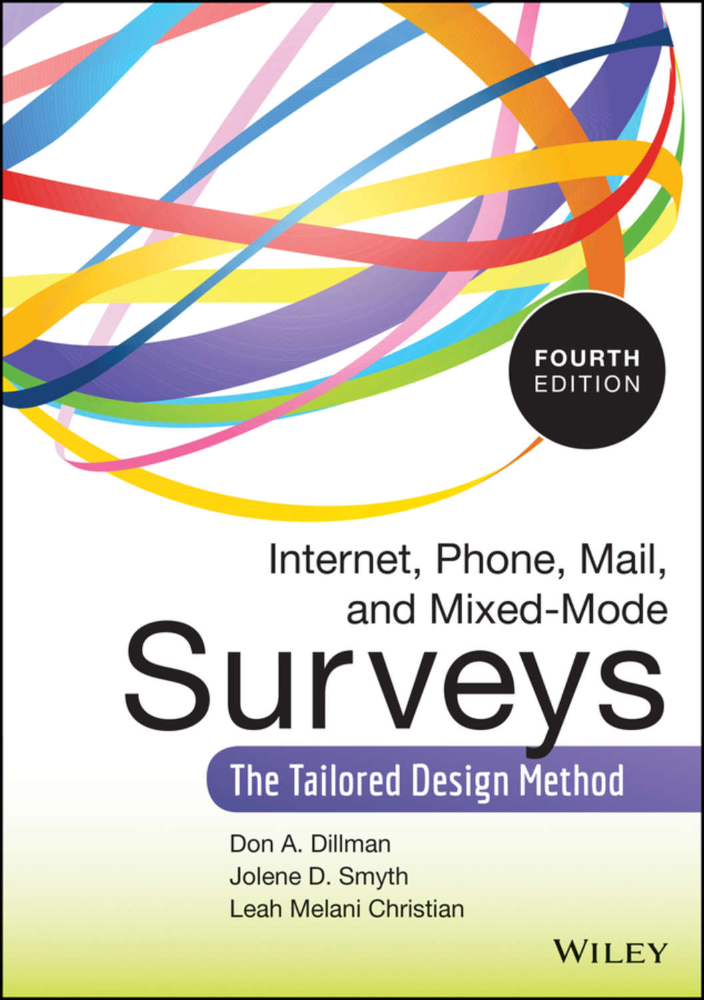
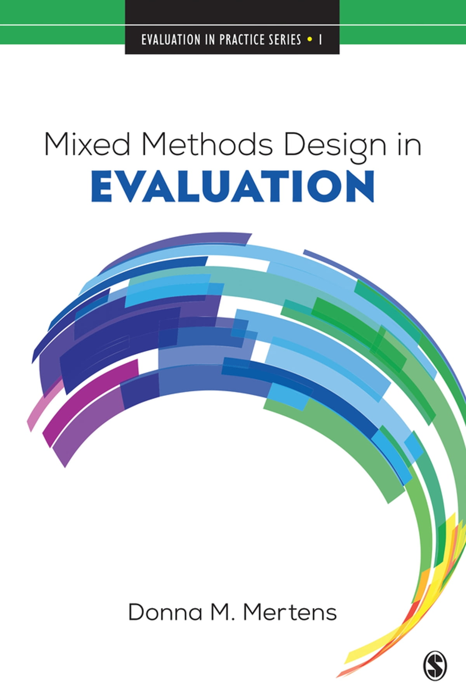
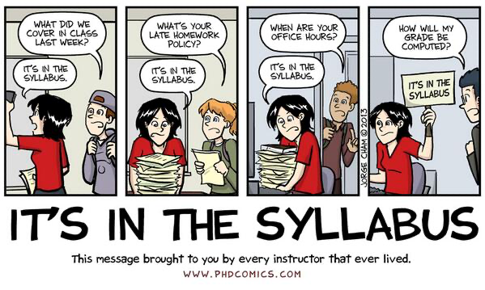

<script src="https://ajax.googleapis.com/ajax/libs/jquery/3.6.0/jquery.min.js"></script>

<script type="text/x-mathjax-config">
MathJax.Hub.Register.StartupHook("TeX Jax Ready",function () {
  MathJax.Hub.Insert(MathJax.InputJax.TeX.Definitions.macros,{
    cancel: ["Extension","cancel"],
    bcancel: ["Extension","cancel"],
    xcancel: ["Extension","cancel"],
    cancelto: ["Extension","cancel"]
  });
});
</script>

```{css echo=FALSE}
.highlight-last-item > ul > li,
.highlight-last-item > ol > li {
  opacity: 0.5;
}
.highlight-last-item > ul > li:last-of-type,
.highlight-last-item > ol > li:last-of-type {
  opacity: 1;
}
```

```{r setup, include=FALSE, purl=FALSE}
library(tidyverse)
library(knitr)
library(kableExtra)
library(fontawesome)
library(here)
library(DT)
library(scales)
library(latex2exp)
library(showtext)
font_add_google("Roboto Condensed", "roboto")
showtext_auto()
```

```{r echo = FALSE, purl=FALSE}
xaringanthemer::style_duo(
  primary_color = "#212121",
  secondary_color = "#8cc39c",
  link_color = "#b1ead6",
  code_inline_background_color = "transparent",
  code_inline_color = "#009688",
  code_highlight_color = "#212121",
  text_bold_color = "#00b0cc",
  table_row_border_color = "#212121",
  table_row_even_background_color = "#212121",
  footnote_font_size = "0.6em",
  header_font_google = xaringanthemer::google_font("Roboto Condensed", "700"),
  text_font_google   = xaringanthemer::google_font("Roboto Condensed", "400")
)

xaringanExtra::use_xaringan_extra(c("tile_view", 
                                    "animate_css", 
                                    "tachyons"))

xaringanExtra::use_panelset()

xaringanExtra::use_logo(
  image_url = here::here("static", "img", "course_hex.png"),
  link_url = "https://edp617.asocialdatascientist.com",
  position = xaringanExtra::css_position(top = "1em", right = "1em")
)

opts_chunk$set(dev.args=list(bg="transparent"))
```

---

class: highlight-last-item
layout: true

---

# Welcome!

<center>

<center>

---

# Your Teacher


.pull-left[
<center>

</center>
]

.pull-right[
<br>
<br>
<br>
<br>
<br>
<a href='https://iam.asocialdatascientist.com' target='_blank'>Dr. Abhik Roy</a><br>
Assistant Professor of Educational Psychology<br>
School of Education<br>
West Virginia University
]

---

# Overview

***What the &ast;&ast;&ast;&ast; is program evaluation?*** That question comes up more than you probably think! In practitioner-oriented fields like (but certainly not limited to) education and counseling, studies are often directed at developing and understanding the impact various programs have on those who receive services, those who provide services, and/or the larger context within which those programs operate. This mode of uncovering if something works and why it works is a basis for evaluating programs and in turn policy decision-making. Program evaluation has philosophical, theoretical, methodological, and practical peculiarities that make it necessary to devote an entire class to understanding why and how it is done. This course is designed to allow you to acquire an understanding of the choices available for and processes involved in conducting program evaluation by giving you hands-on experience conducting a small-scale evaluation study relevant to your interests.

---

# Course Objectives

--

By working hard and asking for help as needed, by the end of this course you should be able to do the following

--

> acquire knowledge of basic models and principles of program evaluation

--

> develop an understanding of program evaluation practice by designing and conducting an evaluation of a relevant program relevant

--

> gain an understanding of ethical, social, political, and cultural issues confronted by program evaluators

--

> write an evaluation report to meet stakeholder information and decision-making needs

---

# Course Materials

<br>
<br>
<br>
<br>
<br>
<br>
<center>
<div class = "rounded">
.pull-left[.tabtpl[
For submissions and grades go to<br><br>
[eCampus](https://ecampus.wvu.edu/)
]]
</div>
</center>

--

<center>
<div class = "rounded">
.pull-right[
For everything else and then some go to<br><br>
[EDP 617 course site](https://edp617.asocialdatascientist.com)
]
</div>
</center>

---

# Texts

.center2[
To help minimize costs, you do not have to purchase any physical texts. We'll rely on the various upcoming texts and barring the APA 7th edition handbook, they are available through the [WVU library](https://library.wvu.edu/) as digital editions.
]

---

## Required

--

<br>
<br>
<br>
<br>
.pull-left[
Davidson, E. J. (2007). <i>Evaluation methodology basics: The nuts and bolts of sound evaluation</i> (1st ed.). SAGE.
  - Free: [Digital](https://libwvu.on.worldcat.org/oclc/646022580)
  - Not Free: [Physical](https://us.sagepub.com/en-us/nam/evaluation-methodology-basics/book226129)
]

.pull-right[
<center>

</center>
]

---

## Optional

<br>
<br>
<br>
.pull-left[
American Psychological Association. (2020). *Publication manual of the American Psychological Association* (7th ed.).
  - Free(ish): <a href='https://libguides.wvu.edu/apa' target='_blank'>APA 7th Edition Citation Style Guide</a>
  - Not Free: <a href='https://apastyle.apa.org/products/publication-manual-7th-edition' target='_blank'>Physical</a>
]

.pull-right[
<center>

</center>
]

---

<br>
.pull-left[
Dillman, D.A., Smyth, J.D., &amp; Christian, L.M. (2014). <i>Internet, phone, mail, and mixed-mode surveys: The Tailored Design Method</i> (4th ed.). Wiley.
  - Free: [Digital](https://ebookcentral.proquest.com/lib/wvu/detail.action?docID=1762797)
  - Not Free: [Physical](https://www.wiley.com/en-us/Internet%2C+Phone%2C+Mail%2C+and+Mixed+Mode+Surveys%3A+The+Tailored+Design+Method%2C+4th+Edition-p-9781118456149)
]

.pull-right[
<center>

</center>
]

--

<br>
<br>
.pull-left[
Mertens, D. M. (2018). <i>Mixed methods design in evaluation</i>. SAGE.
  - Free: [Digital](https://methods-sagepub-com.wvu.idm.oclc.org/book/mixed-methods-design-in-evaluation)
  - Not Free: [Physical](https://us.sagepub.com/en-us/nam/mixed-methods-design-in-evaluation/book249777)
]

.pull-right[
<center>

<center>
]

---

.center2[
*There will also occasionally be additional articles and videos to read and watch. When this happens, links to these other resources will be included on the content page for that session.*
]

---

# Class Focus on 

<br>
<br>
<br>
.pull-left[
**Content**
  >- Evaluation Fundamentals
  >- Methods and Methodology
  >- Principles and Ethics
]

--

.pull-right[
**Practice**
  >- Evaluative Process
  >- Design and Analysis
  >- Reporting and Utility
]

---

# What I expect

--

- Keeping an open line of communication

--

- A lot of work

--

- Attending scheduled meetings

--

- Putting in your fair share of work in the evaluation

--

- Asking questions and reaching out as needed<sup>1</sup>

.footnote[<sup>1</sup> after going over all of the material independently]

---

# Assignments and Distribution

You can find descriptions for all the assignments on the [tasks page](https://edp617.asocialdatascientist.com/tasks/).

<br>
```{r assignments-grades, include=FALSE}
assignments <- tribble(
  ~Percent,  ~Task, ~Location,
  15, "Weekly Tasks", "Slack",
  15, "Synchronous Meetings", "Zoom",
  5, "Evaluation Prospectus", "eCampus",
  20, "Needs Assessment", "eCampus",
  15, "Evaluation Proposal", "eCampus",
  25, "Final Report", "eCampus", 
  5, "Presentation of Results", "eCampus/Slack"
)
```

<center>

```{r show-assignments-table, echo=FALSE, results="asis"}
assignments %>%
  kableExtra::kable(align='cll',
               col.names = c("Percent", "Assignment", "Submission"),
      ) %>%
  kable_paper(html_font = "Roboto Condensed") %>%
  kable_styling(position = "center",
                bootstrap_options = c("hover", 
                                      "condensed", 
                                      "responsive"),
                full_width = FALSE) %>%
  column_spec(1, width = "5em", color = "#ffffff", extra_css = 'vertical-align: middle !important;') %>%
  column_spec(2, width = "15em", color = "#ffffff",
              extra_css = 'vertical-align: middle !important;') %>%
  column_spec(3, width = "9em", color = "#ffffff",
              extra_css = 'vertical-align: middle !important;') %>%
  row_spec(0, color = "#f7f7f7",
           background = "transparent") %>%
  row_spec(1:6, color = "#f7f7f7",
           background = "transparent")
```

</center>

---

# Assessment and Grading

<br>
<br>
<br>
```{r grading, echo=FALSE, eval=TRUE}
tribble(
  ~Grade, ~Range,
  "A",  "90% – 100%",
  "B",  "80% - 89%",  
  "C",  "70% – 79%",
  "D",  "60% – 69%", 
  "F",  "< 60%"
) %>%
  kableExtra::kable(align='cl',
               col.names = c("Grade", "Range")) %>%
  kable_paper(html_font = "Roboto Condensed") %>%
  kable_styling(position = "center",
                bootstrap_options = c("hover", 
                                      "condensed", 
                                      "responsive"),
                full_width = FALSE) %>%
  column_spec(1, width = "5em", 
              color = "#ffffff", 
              extra_css = 'vertical-align: middle !important;') %>%
  column_spec(2, width = "6.5em", 
              color = "#ffffff",
              extra_css = 'vertical-align: middle !important;') %>%
  row_spec(0, color = "#f7f7f7",
           background = "transparent") %>%
  row_spec(1:5, color = "#f7f7f7",
           background = "transparent")
```

---

# Questions

<br>
<br>
<br>
.pull-left[
<center>

</center>
]

--

.float-vertical-align[
<br>
<br>
<br>
.pull-right[
...unless its not (nor can you find it on the course website). In those cases try using one of the three primary modes of contact

<center>
<div class="container">
    <figure>
        <a href="https://edp617spring2023.slack.com" target='_blank'>
        
        <figcaption>Slack</figcaption>
        </a>
    </figure>
    <figure>
        <a href="mailto:abhik.roy@mail.wvu.edu" target='_blank'>
        
        <figcaption>Email</figcaption>
        </a>
    </figure>
    <figure>
        <a href="https://calendly.com/nopiecharts/short15" target='_blank'>
        
        <figcaption>Zoom</figcaption>
        </a>
    </figure>
</div>
</center>
]
]

---

# That's it!

After reviewing the site if you have questions, please send them along...

<br>
<br>
<br>
<br>
<br>
<br>
<br>
<br>
<br>
<br>
<center>
<div class="fade_rule"></div>  
<br>
<br>
</center>

<center>
<a rel="license" href="http://creativecommons.org/licenses/by-nc-sa/4.0/"></a><br /><br />This work is licensed under a <br /><a rel="license" href="http://creativecommons.org/licenses/by-nc-sa/4.0/">Creative Commons Attribution-NonCommercial-ShareAlike 4.0 International License</a>
</center>
