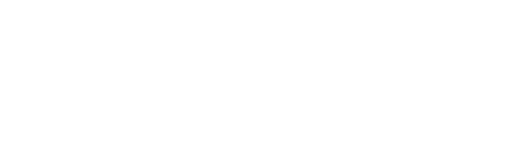
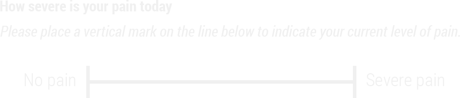
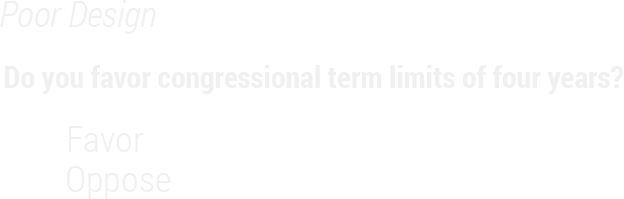
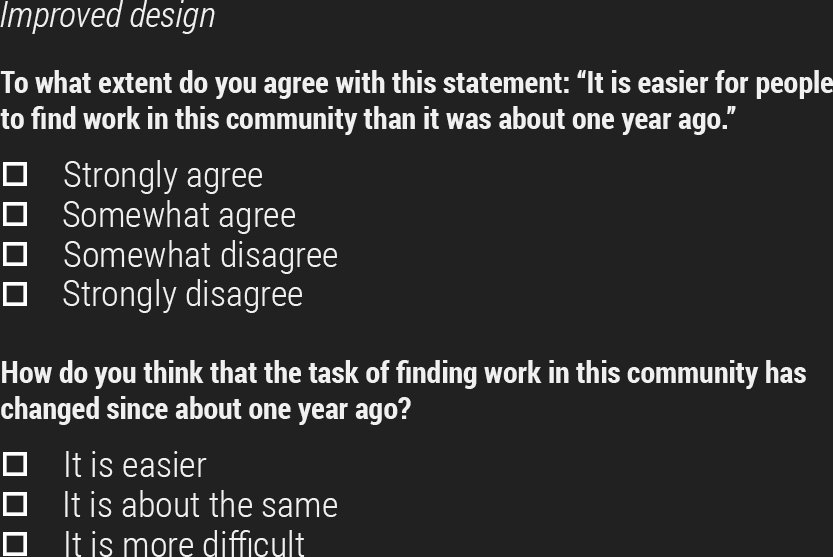
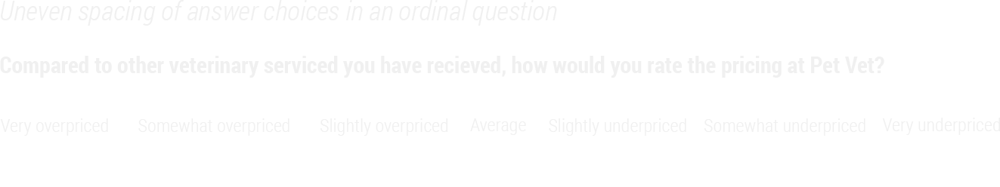
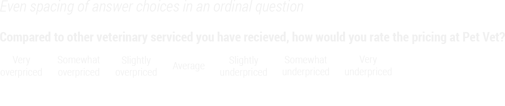
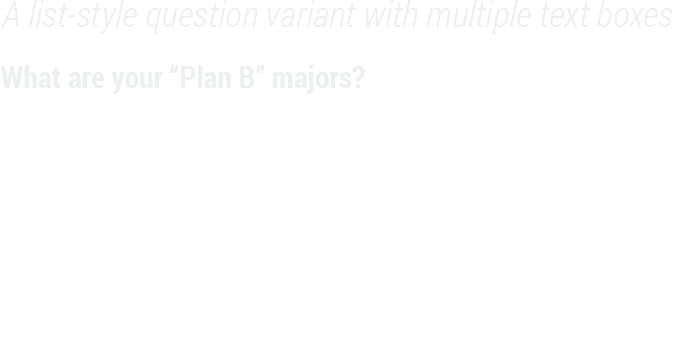
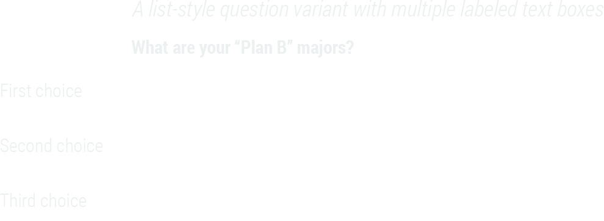
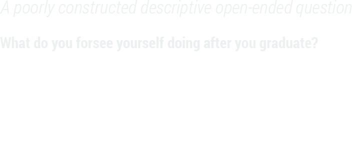

```{r setup, echo=FALSE, warning=FALSE, message=FALSE, include=FALSE}
source(here::here("static", "slides", "all.R"))
```

```{css echo=FALSE}
.highlight-last-item > ul > li,
.highlight-last-item > ol > li {
  opacity: 0.5;
}
.highlight-last-item > ul > li:last-of-type,
.highlight-last-item > ol > li:last-of-type {
  opacity: 1;
}
```

---

class: highlight-last-item
layout: true

---

#  Dislaimer

My voice does not sound like Morgan Freeman at all, but most pages will have some audio that will hopefully be clear enough to help you to understand a bit more about the content.

.center2[
<audio controls preload="auto">
  <source src="audio/survey/S0_Introduction.mp3" type="audio/mpeg">
  Your browser does not support embedded audio.
<audio>
]

---

#  The Tailored Design Method (TDM) 

<div style="margin-left: 395px; margin-top: 300px; position:absolute;">
<center>
<audio controls preload="auto">
  <source src="audio/survey/S1_TDM_A.mp3" type="audio/mpeg">
  Your browser does not support embedded audio.
<audio>
</center>
<br>
<center>
<audio controls preload="auto">
  <source src="audio/survey/S1_TDM_B.mp3" type="audio/mpeg">
  Your browser does not support embedded audio.
<audio>
</center>
</div>

--

- Premised on social exchange perspective on human behavior - *You do something for me, and I do something for you*

--

- Assumes that the likelihood of responding is greater when the expected rewards outweigh the anticipated costs - *Increased benefits with decreased costs*


---

# Approaches to Increasing Benefits 

<div style="margin-left: 700px; margin-top: 150px; position:absolute;">
<center>
<audio controls preload="auto">
  <source src="audio/survey/S2_IncreasingBenefits.mp3" type="audio/mpeg">
  Your browser does not support embedded audio.
<audio>
</center>
</div>

--

- Provide information about the survey

--

- Ask for help or advice

--

- Show positive regard

--

- Say thank you!

--

- Support group values

--

- Give tangible rewards 

--

- Make the questionnaire interesting

--

- Provide social validation

--

- Inform people that opportunities to respond are limited

---

# Approaches to Decreasing Costs 

<div style="margin-left: 700px; margin-top: 250px; position:absolute;">
<center>
<audio controls preload="auto">
  <source src="audio/survey/S3_Decreasing Costs.mp3" type="audio/mpeg">
  Your browser does not support embedded audio.
<audio>
</center>
</div>

--

- Avoid subordinating language

--

- Emphasize similarity to other requests or tasks to which a person has already responded

--

- Make it convenient to respond

--

- Make the questionnaire short and easy to complete

--

- Minimize requests for personal or sensitive information

---

#  Establishing Trust

<div style="margin-left: 700px; margin-top: 175px; position:absolute;">
<center>
<audio controls preload="auto">
  <source src="audio/survey/S4_EstiablishingTrust.mp3" type="audio/mpeg">
  Your browser does not support embedded audio.
<audio>
</center>
</div>

--

- Provide information about the survey

--

- Ask for help or advise

--

- Show positive regard

--

- Say thank you!

---

#  Choosing Words and Forming Question

--

+ Ask one question at a time

--

+ Be sure the question specifies the response task

--

+ Make sure the question applies to the respondent

--

+ Make sure the question is technically accurate

--

+ Make sure *yes* means **yes** and *no* means **no**

--

+ Use complete sentences with simple sentence structures

--

+ Use as few words as possible to pose the question

--

+ Use specific and concrete words to specify the concepts clearly

--

+ Use simple and familiar words

---

# Visual Presentation of Survey Questions (1/2)

--

+ Choose line spacing, font, and text size to ensure the legibility of the text

--

+ Integrate special instructions into the question where they will be used rather than including them as freestanding entities

--

+ Make sure words and visual elements that make up the question send consistent messages

--

+ Organize each question in a way that minimizes the need to reread portions in order to comprehend the response task

--

+ Separate optional or occasionally needed instructions from the question stem by font or symbol variation


---

# Visual Presentation of Survey Questions (2/2)

--

+ Use darker and/or larger print for the question and lighter and/or smaller print for answer choices and answer spaces

--

+ Use spacing to create subgrouping within a question

--

+ Use visual design properties to emphasize elements that are important to the respondent and to de-emphasize those that are not

--

+ Visually standardize all answer spaces or response options

---

#  First Things First: Avoid Double-Barreled Questions!

--

<br>
<br>
.pull-left[

]

--

.pull-left[

]

---

#  Double-Barreled Questions – What’s the problem? 

<div style="margin-left: 395px; margin-top: 350px; position:absolute;">
<center>
<audio controls preload="auto">
  <source src="audio/survey/S6_DoubleBarrel.mp3" type="audio/mpeg">
  Your browser does not support embedded audio.
<audio>
</center>
</div>

--

<center>

</center>
<br>

--

<hr style="width:100px; margin: auto;" />
<br>
<br>
<center>
Respondents don’t know what you are asking for
</center>

--

<br>
<center>
If the answer is <b>Yes</b>, then are the respondents saying it for the burger, fries, or both?
</center>

--

<br>
<center>
This can lead to massive bias, unreliable or unusable results
</center>

---

# Structures

**The following slides consist of examples of common structures of survey items.**
 
***This is by no means comprehensive!***

---

##  Nominal Type Questions 

.center2[

]

<br>
<br>
<br>
<br>
<br>
<br>
<br>
<br>
<br>
<br>
<br>
<br>
<br>
<br>
<center>
<audio controls preload="auto">
  <source src="audio/survey/S7_Nominal.mp3" type="audio/mpeg">
  Your browser does not support embedded audio.
<audio>
</center>
<br>
<br>
.footnote[
*More about [nominal variables](https://statsandr.com/blog/variable-types-and-examples/#nominal)*
]

---

##  Dichotomous Nominal Type Questions

--

.center2[
&emsp; &emsp; &emsp; &ensp; &ensp; 
]

<br>
<br>
<br>
<br>
<br>
<br>
<br>
<br>
<br>
<br>
<br>
<br>
<br>
<br>
<center>
<audio controls preload="auto">
  <source src="audio/survey/S8_NominalDich.mp3" type="audio/mpeg">
  Your browser does not support embedded audio.
<audio>
</center>

---

##  Ordinal Type Questions

--

.center2[

]

<br>
<br>
<br>
<br>
<br>
<br>
<br>
<br>
<br>
<br>
<br>
<br>
<br>
<br>
<br>
<br>
<center>
<audio controls preload="auto">
  <source src="audio/survey/S9_Ordinal.mp3" type="audio/mpeg">
  Your browser does not support embedded audio.
<audio>
</center>

.footnote[
*More about [ordinal variables](https://statsandr.com/blog/variable-types-and-examples/#ordinal)*
]

---

## More About Ordinal Type Questions

--

<br>
<br>
.center2[

]

<br>
<br>
<br>
<br>
<br>
<br>
<br>
<br>
<br>
<br>
<br>
<br>
<br>
<br>
<br>

---

### Ordinal or Nominal?

--

<br>
<center>
<audio controls preload="auto">
  <source src="audio/survey/S10_OrdinalorNominal_1.mp3" type="audio/mpeg">
  Your browser does not support embedded audio.
<audio>
</center>
<br>
<br>
<br>

.pull-left[

]

.pull-right[

]

<br>
<br>
.pull-left[
<center>
<audio controls preload="auto">
  <source src="audio/survey/S10_OrdinalorNominal_2.mp3" type="audio/mpeg">
  Your browser does not support embedded audio.
<audio>
</center>
]
.pull-right[
<center>
<audio controls preload="auto">
  <source src="audio/survey/S10_OrdinalorNominal_3.mp3" type="audio/mpeg">
  Your browser does not support embedded audio.
<audio>
</center>
]

.footnote[Order of audio files: top > left > right]

---

## Semantic Differentials

<div style="margin-left: 575px; margin-top: 370px; position:absolute;">
<audio controls preload="auto">
  <source src="audio/survey/S11_SemanticDiff.mp3" type="audio/mpeg">
  Your browser does not support embedded audio.
<audio>
</div>

--

<br>
.pull-left[

]

--

.pull-right[

]

--

.pull-left[

]


.pull-right[
]

---

## Visual Analogs

<div style="margin-left: 380px; margin-top: 380px; position:absolute;">
<center>
<audio controls preload="auto">
  <source src="audio/survey/S12_VisualAnalogs.mp3" type="audio/mpeg">
  Your browser does not support embedded audio.
<audio>
</center>
</div>

--

<center>

</center>

--

<br>
<br>
<center>

</center>

---

## Guttman Scaling

--

.center2[

]

<br>
<br>
<br>
<br>
<br>
<br>
<br>
<br>
<br>
<br>
<br>
<br>
<br>
<br>
<br>
<center>
<audio controls preload="auto">
  <source src="audio/survey/S13_GuttmanScaling.mp3" type="audio/mpeg">
  Your browser does not support embedded audio.
<audio>
</center>

---

## Filters/Skip Patterns

<div style="margin-left: 700px; margin-top: 175px; position:absolute;">
<center>
<audio controls preload="auto">
  <source src="audio/survey/S15_SkipLogic.mp3" type="audio/mpeg">
  Your browser does not support embedded audio.
<audio>
</center>
</div>

--

Comes in many names:

--

> Skip logic

--

> Conditional Branching

--

> Conditional Logic

--

<br>
.pull-left[

]

.pull-right[
]


---

# Closed Ended

.center2[
<audio controls preload="auto">
  <source src="audio/survey/S16_ClosedEnded.mp3" type="audio/mpeg">
  Your browser does not support embedded audio.
<audio>
]

---

# General Structural Guidelines

--

- State both positive and negative sides in the question stem when asking either/or types of questions

--

- Develop lists of answer categories that include all reasonable possible answers

--

- Develop lists of answer categories that are mutually exclusive

--

- Maintain spacing between answer categories that is consistent with measurement intent

---

## Positive and Negative Sides in Question Stem

<div style="margin-top: 380px; margin-left: 20px; position:absolute;">
<audio controls preload="auto">
  <source src="audio/survey/S17_PosNegStem.mp3" type="audio/mpeg">
  Your browser does not support embedded audio.
<audio>
</div>

--

.pull-left[

]

--

.pull-right[

]

--

.pull-left[

]

--

.pull-right[

]

---

## Exhaustive and Mutually Exclusive Questions

<div style="margin-left: 380px; margin-top: 380px; position:absolute;">
<center>
<audio controls preload="auto">
  <source src="audio/survey/S18_ExhaustiveAndME.mp3" type="audio/mpeg">
  Your browser does not support embedded audio.
<audio>
</center>
</div>

--

.pull-left[
<center>

</center>
]

--

.pull-right[
<center>

</center>
]

---

## Spacing Response Options Evenly

---

<div style="margin-left: 380px; margin-top: 540px; position:absolute;">
<center>
<audio controls preload="auto">
  <source src="audio/survey/S19_Spacing.mp3" type="audio/mpeg">
  Your browser does not support embedded audio.
<audio>
</center>
</div>

<br>
<br>
<center>
&emsp; &emsp; &emsp; &nbsp; 
</center>

--

<br>
<br>
<center>

</center>

---

# Closed-Ended Questions: Nominal Scales

--

- Ask respondents to rank only a few items at once rather than a long list

--

- Avoid bias from unequal comparisons

--

- Randomize response options if there is concern about order effects

--

- Use forced-choice questions rather than check-all-that-apply questions

--

- Consider using differently shaped answer spaces (circles and squares if possible) to help respondents distinguish between single- and multiple-answer questions

---

## Unordered

<div style="margin-left: 700px; margin-top: 150px; position:absolute;">
<center>
<audio controls preload="auto">
  <source src="audio/survey/S20_Unordered.mp3" type="audio/mpeg">
  Your browser does not support embedded audio.
<audio>
</center>
</div>

--


--

<br>
.pull-left[

]


.pull-right[

]

---

## Unordered

.center2[

]

---

## Comparisons (1/2)

--

<br>
<center>

</center>
<br>

--

<hr style="width:100px; margin: auto;" />
<br>
<center>

</center>
<br>

---

## Comparisons (2/2)

<div style="margin-left: 380px; margin-top: 440px; position:absolute;">
<center>
<audio controls preload="auto">
  <source src="audio/survey/S21_Comparisons.mp3" type="audio/mpeg">
  Your browser does not support embedded audio.
<audio>
</center>
</div>

--

<br>
<center>

</center>
<br>

--

<hr style="width:100px; margin: auto;" />
<br>
<center>
&emsp; &nbsp; 
</center>

---

## Check-all-that-Apply versus Forced-Choice

<div style="margin-left: 380px; margin-top: 380px; position:absolute;">
<center>
<audio controls preload="auto">
  <source src="audio/survey/S22_ForcedChoice.mp3" type="audio/mpeg">
  Your browser does not support embedded audio.
<audio>
</center>
</div>

--

<br>
<br>
<br>
<br>
.pull-left[
<center>

</center>
]

--

.pull-right[
<center>

</center>
]

---

## Distinguishing Between Single-and Multiple-Answer Questions

<div style="margin-left: 380px; margin-top: 340px; position:absolute;">
<center>
<audio controls preload="auto">
  <source src="audio/survey/S23_SingleMultipleChoice.mp3" type="audio/mpeg">
  Your browser does not support embedded audio.
<audio>
</center>
</div>

--

<br>
<br>
.pull-left[
<center>

</center>
]

--

.pull-right[
<center>

</center>
]

---

# Closed-Ended Questions: Ordinal Scales

--

- Align response options vertically in one column or horizontally in one row and strive for equal distance between categories

--

- Carefully evaluate the use of numeric labels and their impact on measurement

--

- Choose an appropriate scale length—in general, limit scales to four or five categories

--

- Choose direct or construct-specific labels to improve cognition

--

- Consider how verbally labeling and visually displaying all response categories may influence answers

--

- Place non-substantive options at the end of the scale and separate them from substantive options

--

- Provide scales that approximate the actual distribution of the characteristic in the population

--

- Provide balances scales where categories are relatively equal distances apart conceptually

---

## Scalar Questions (1/2)

<div style="margin-left: 700px; margin-top: 170px; position:absolute;">
<center>
<audio controls preload="auto">
  <source src="audio/survey/S24_Scalar.mp3" type="audio/mpeg">
  Your browser does not support embedded audio.
<audio>
</center>
</div>

--

.pull-left[
<center>

</center>
<br>
<center>

</center>
]

.pull-right[
]

--

<br>
.pull-left[
<center>

</center>
]

.pull-right[
]

---

## Scalar Questions (2/2)

--

<br>
<br>
.pull-left[
<center>

</center>
]

.pull-right[
<center>

</center>
]

.footnote[
*Note: Here we're referring to balanced scales as having choices that are equidistant from each other*]

---

## Aligning the Conceptual and Visual Midpoints

--

**This is by far one of the most important criteria to check off when considering survey aesthetics!**

---

<br>
.pull-left[
<center>

</center>
]

<br>
<br>
<br>
<br>
<br>
<br>
<br>
<br>
<br>
.pull-right[
<center>
<audio controls preload="auto">
  <source src="audio/survey/S25_Align.mp3" type="audio/mpeg">
  Your browser does not support embedded audio.
<audio>
</center>
]

---

# Open Ended

.center2[
<audio controls preload="auto">
  <source src="audio/survey/S26_OpenEnded.mp3" type="audio/mpeg">
  Your browser does not support embedded audio.
<audio>
]

---

## Open-Ended Numerical

--

- Ask for the specific unit desired in the question stem

--

- Provide answer spaces that are sized appropriately for the response task

--

- Provide units labels with the answer spaces

---

## Numeric

<div style="margin-top: 200px; margin-left: 700px; position:absolute;">
<audio controls preload="auto">
  <source src="audio/survey/S27_Numerical.mp3" type="audio/mpeg">
  Your browser does not support embedded audio.
<audio>
</div>

--

.pull-left[

]
<br>

.pull-right[

]

--

.pull-left[

]

.pull-right[
]

--

.pull-left[

]

.pull-right[
]

--


.pull-left[

]

.pull-right[
]


---

## Open-Ended Lists

--

- Design the answer spaces to support the number and type of responses desired

--

- Provide labels with answer spaces to reinforce the type of response requested

--

- Specify the number and type of responses desired in the question 

---

## Lists

<div style="margin-top: 200px; margin-left: 700px; position:absolute;">
<audio controls preload="auto">
  <source src="audio/survey/S28_Lists.mp3" type="audio/mpeg">
  Your browser does not support embedded audio.
<audio>
</div>

--

.pull-left[
&nbsp; &nbsp; &emsp; &emsp; &nbsp;
]

.pull-right[
]

--

.pull-left[
&emsp; &emsp; &nbsp; &nbsp; &nbsp;
]

.pull-right[
]

--

.pull-left[

]

.pull-right[
]


---

# Open-Ended Explanatory 

--

- Consider programming probes to open-ended responses in internet surveys

--

- Provide adequate space for respondents to completely answer the question

--

- Provide extra motivation to respond

--

- Use scrollable boxes on internet surveys

---

## Explanatory

<div style="margin-left: 100px; margin-top: 390px; position:absolute;">
<center>
<audio controls preload="auto">
  <source src="audio/survey/S29_Explanatory.mp3" type="audio/mpeg">
  Your browser does not support embedded audio.
<audio>
</center>
</div>

--

<br>
.pull-left[
<center>

</center>
]

.pull-right[
]

--

.pull-left[
]

<br>
<br>
<br>
<br>
.pull-right[
<center>

</center>
]


---

# Partially Closed

---

## Partially Closed Nominal

--

.center2[

]

<br>
<br>
<br>
<br>
<br>
<br>
<br>
<br>
<br>
<br>
<br>
<br>
<br>
<br>
<br>
<br>
<center>
<audio controls preload="auto">
  <source src="audio/survey/S30_PartiallyClosed.mp3" type="audio/mpeg">
  Your browser does not support embedded audio.
<audio>
</center>

---

## Thats it!

If you have any questions, please reach out

--

<br>
<br>
<br>
<br>
<br>
<br>
<br>
<br>
<br>
<center>
<br><br>
<div class="fade_rule"></div>  
<br><br>
</center>

<center>
<a rel="license" href="http://creativecommons.org/licenses/by-nc-sa/4.0/"></a><br /><br />This work is licensed under a <br /><a rel="license" href="http://creativecommons.org/licenses/by-nc-sa/4.0/">Creative Commons Attribution-NonCommercial-ShareAlike 4.0 International License</a>
</center>
