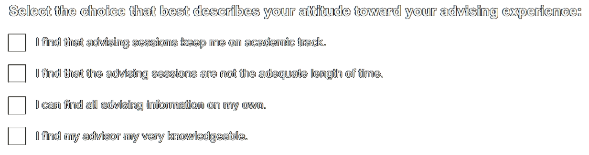
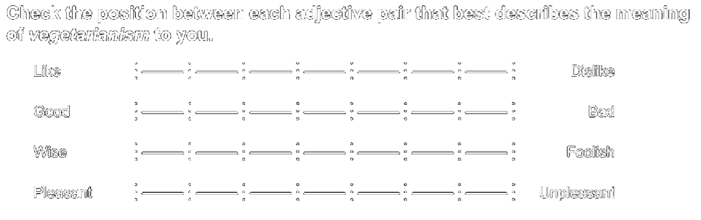
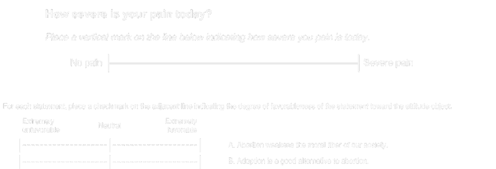
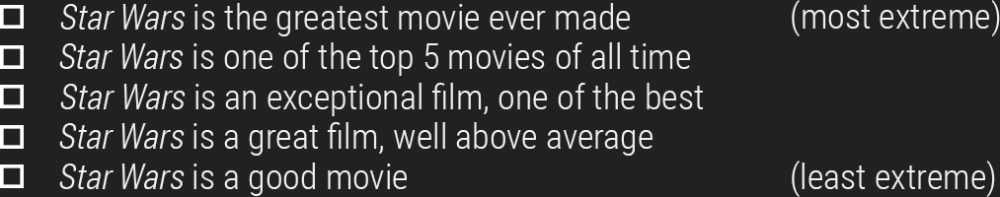
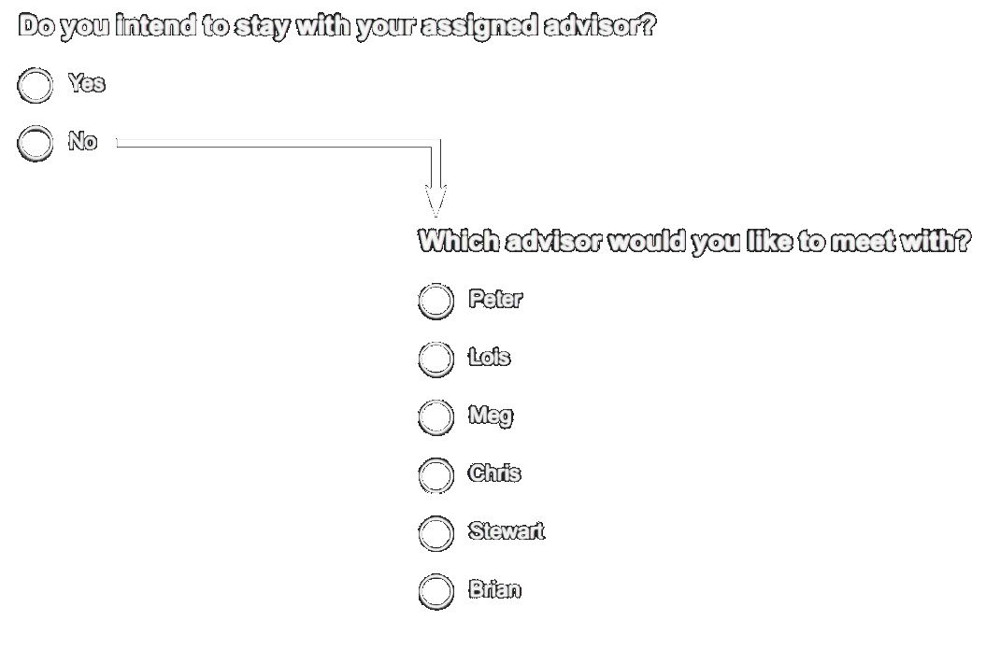
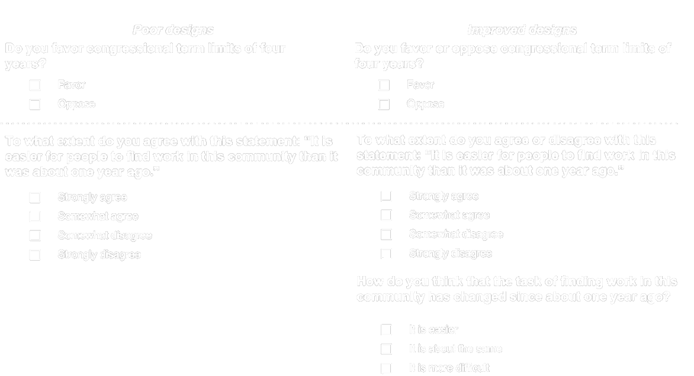
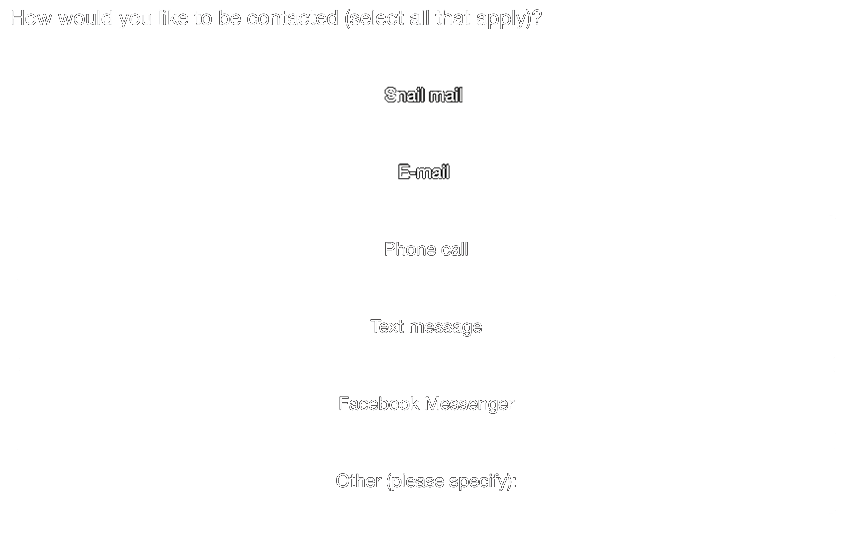
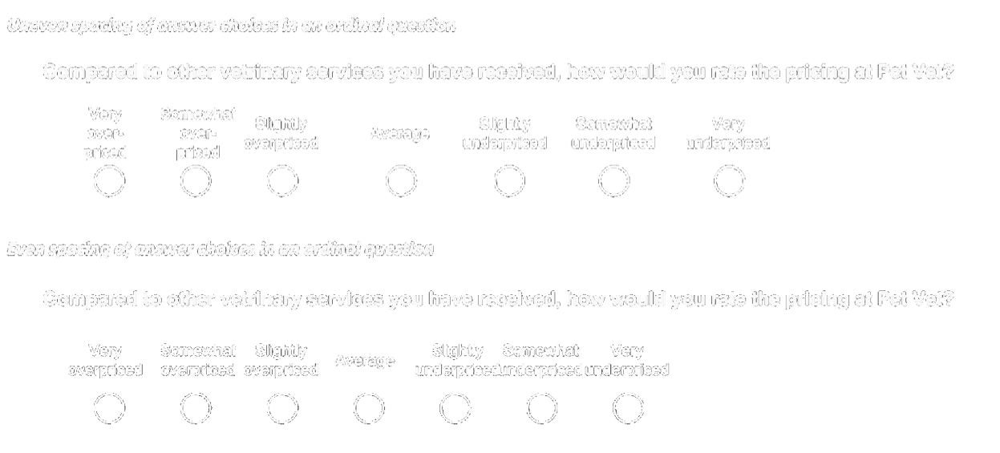
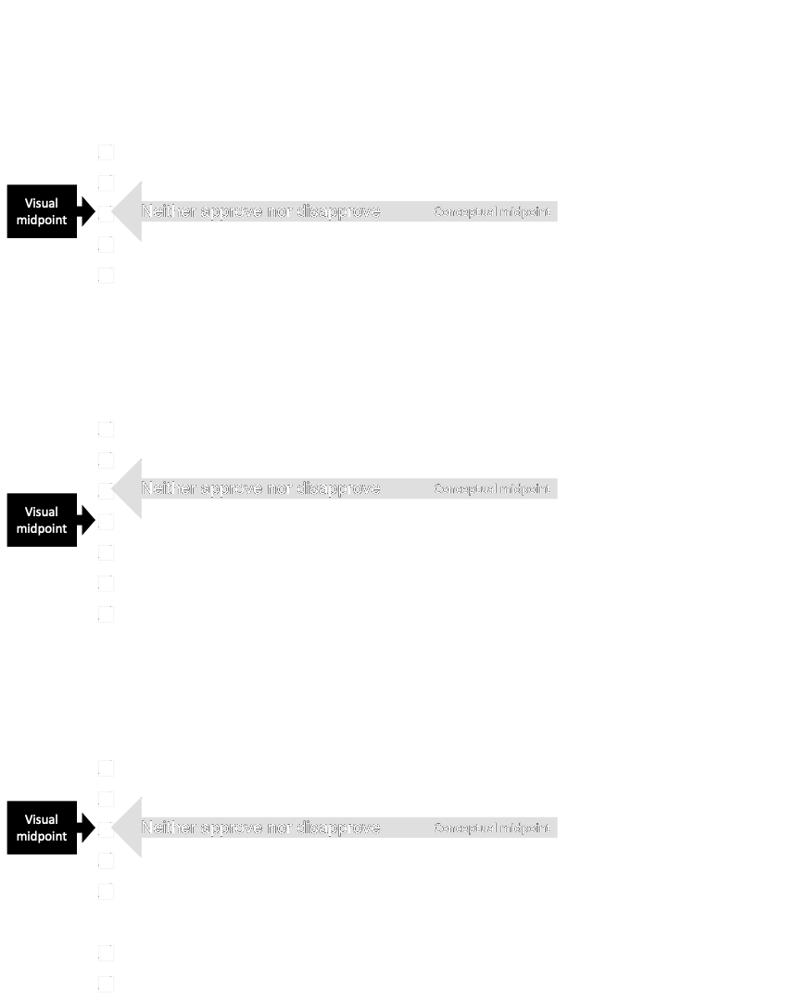
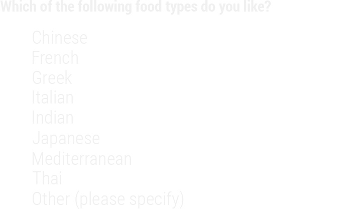

```{r load_packages, echo = FALSE, message=FALSE, warning=FALSE}
library(tidyverse)
library(fontawesome)
library(knitr)
library(kableExtra)
library(here)
library(xaringanthemer)
```

```{r echo = FALSE}
xaringanthemer::style_duo(
  primary_color = "#212121",
  secondary_color = "#6ac4cd",
  header_font_google = xaringanthemer::google_font("Jost", "600"),
  text_font_google   = xaringanthemer::google_font("Jost", "400")
)

xaringanExtra::use_xaringan_extra(c("tile_view", "animate_css", "tachyons"))
```

#  Welcome

Some information about the audio files. Again, I'm no Morgan Freeman but most pages will have some audio that will hopefully help you understand a bit more about the content.
<br>
<center>
<audio controls preload="auto">
  <source src="audio/survey/S0_Introduction.mp3" type="audio/mpeg">
  Your browser does not support embedded audio.
<audio>
</center>

---

#  The Tailored Design Method (TDM) 

>- Premised on social exchange perspective on human behavior - *You do something for me, and I do something for you*

>- Assumes that the likelihood of responding is greater when the expected rewards outweigh the anticipated costs - *Increased benefits with decreased costs*

<br>
<center>
<audio controls preload="auto">
  <source src="audio/survey/S1_TDM_A.mp3" type="audio/mpeg">
  Your browser does not support embedded audio.
<audio>
</center>
<br>
<center>
<audio controls preload="auto">
  <source src="audio/survey/S1_TDM_B.mp3" type="audio/mpeg">
  Your browser does not support embedded audio.
<audio>
</center>

---

# Approaches to Increasing Benefits 

>- Provide information about the survey
>- Ask for help or advise
>- Show positive regard
>- Say thank you!
>- Support group values
>- Give tangible rewards 
>- Make the questionnaire interesting
>- Provide social validation
>- Inform people that opportunities to respond are limited

<br>
<center>
<audio controls preload="auto">
  <source src="audio/survey/S2_IncreasingBenefits.mp3" type="audio/mpeg">
  Your browser does not support embedded audio.
<audio>
</center>

---

# Approaches to Decreasing Costs 

>- Avoid subordinating language
>- Emphasize similarity to other requests or tasks to which a person has already responded
>- Make it convenient to respond
>- Make the questionnaire short and easy to complete
>- Minimize requests for personal or sensitive information

<br>
<center>
<audio controls preload="auto">
  <source src="audio/survey/S3_Decreasing Costs.mp3" type="audio/mpeg">
  Your browser does not support embedded audio.
<audio>
</center>

---

#  Establishing Trust 

>- Provide information about the survey
>- Ask for help or advise
>- Show positive regard
>- Say thank you!

<br>
<center>
<audio controls preload="auto">
  <source src="audio/survey/S4_EstiablishingTrust.mp3" type="audio/mpeg">
  Your browser does not support embedded audio.
<audio>
</center>

---

#  General Idea 

***Things to think about***

<audio controls preload="auto">
  <source src="audio/survey/S5_GeneralGuidelines.mp3" type="audio/mpeg">
  Your browser does not support embedded audio.
<audio>

---

#  Choosing Words and Forming Question 

+ Ask one question at a time

+ Be sure the question specifies the response task

+ Make sure the question applies to the respondent

+ Make sure the question is technically accurate

+ Make sure *yes* means **yes** and *no* means **no**

+ Use complete sentences with simple sentence structures

+ Use as few words as possible to pose the question

+ Use specific and concrete words to specify the concepts clearly

+ Use simple and familiar words

---

# Visual Presentation of Survey Questions (1/2)

+ Choose line spacing, font, and text size to ensure the legibility of the text

+ Integrate special instructions into the question where they will be used rather than including them as freestanding entities

+ Make sure words and visual elements that make up the question send consistent messages

+ Organize each question in a way that minimizes the need to reread portions in order to comprehend the response task

+ Separate optional or occasionally needed instructions from the question stem by font or symbol variation


---

# Visual Presentation of Survey Questions (2/2)

+ Use darker and/or larger print for the question and lighter and/or smaller print for answer choices and answer spaces

+ Use spacing to create subgrouping within a question

+ Use visual design properties to emphasize elements that are important to the respondent and to deemphasize those that are not

+ Visually standardize all answer spaces or response options

---

#  First Things First: Avoid Double-Barreled Questions!

<center>

</center>
<br>
<center>
<audio controls preload="auto">
  <source src="audio/survey/S6_DoubleBarrel.mp3" type="audio/mpeg">
  Your browser does not support embedded audio.
<audio>
</center>

---

#  Double-Barreled Questions – What’s the problem? 

+ Respondents don’t know what you are asking for.

+ If the answer is Yes, then is he or she responding to the advising session being pleasant or meeting the overall goal or both?

+ This can lead to massive bias, unreliable or unusable results.

<br> 
<center>

</center>

---

# Structures

**The following slides consist of examples of common structures of survey items.**
 
***This is by no means comprehensive!***

---

##  Nominal Type Questions 

<center>

</center>
<br>
<center>
<audio controls preload="auto">
  <source src="audio/survey/S7_Nominal.mp3" type="audio/mpeg">
  Your browser does not support embedded audio.
<audio>
</center>

<br>


*More about [nominal variables](https://statsandr.com/blog/variable-types-and-examples/#nominal).*

---

##  Nominal Type Questions - Dichotomous 

<center>

</center>
<br>
<center>
<audio controls preload="auto">
  <source src="audio/survey/S8_NominalDich.mp3" type="audio/mpeg">
  Your browser does not support embedded audio.
<audio>
</center>

---

##  Ordinal Type Questions 

<center>

</center>
<br>
<center>
<audio controls preload="auto">
  <source src="audio/survey/S9_Ordinal.mp3" type="audio/mpeg">
  Your browser does not support embedded audio.
<audio>
</center>

<br>

*More about [ordinal variables](https://statsandr.com/blog/variable-types-and-examples/#ordinal).*

---

## More About Ordinal Type Questions

<center>

</center>
<br>
<center>
<audio controls preload="auto">
  <source src="audio/survey/S8_NominalDich.mp3" type="audio/mpeg">
  Your browser does not support embedded audio.
<audio>
</center>

---

### Ordinal or Nominal?

<center>
<audio controls preload="auto">
  <source src="audio/survey/S10_OrdinalorNominal.mp3" type="audio/mpeg">
  Your browser does not support embedded audio.
<audio>
</center>
<br>
<center>

</center>

---

## Semantic Differentials

<center>

</center>
<br>
<center>
<audio controls preload="auto">
  <source src="audio/survey/S11_SemanticDiff.mp3" type="audio/mpeg">
  Your browser does not support embedded audio.
<audio>
</center>

---

## Visual Analogs

<center>

</center>

<br>
<center>
<audio controls preload="auto">
  <source src="audio/survey/S12_VisualAnalogs.mp3" type="audio/mpeg">
  Your browser does not support embedded audio.
<audio>
</center>

---

## Guttman Scaling

<center>

</center>
<br>
<center>
<audio controls preload="auto">
  <source src="audio/survey/S13_GuttmanScaling.mp3" type="audio/mpeg">
  Your browser does not support embedded audio.
<audio>
</center>

---

## Filters/Skip Patterns

Comes in many names:

- Skip logic
- Conditional Branching
- Conditional Logic

<center>

</center>
<br>
<center>
<audio controls preload="auto">
  <source src="audio/survey/S15_SkipLogic.mp3" type="audio/mpeg">
  Your browser does not support embedded audio.
<audio>
</center>

---

# Closed Ended

<center>
<audio controls preload="auto">
  <source src="audio/survey/S16_ClosedEnded.mp3" type="audio/mpeg">
  Your browser does not support embedded audio.
<audio>
</center>

---

# General Structural Guidelines

- State both positive and negative sides in the question stem when asking either/or types of questions

- Develop lists of answer categories that include all reasonable possible answers

- Develop lists of answer categories that are mutually exclusive

- Maintain spacing between answer categories that is consistent with measurement intent

---

## Positive and Negative Sides in Question Stem

<center>

</center>

<br>
<center>
<audio controls preload="auto">
  <source src="audio/survey/S17_PosNegStem.mp3" type="audio/mpeg">
  Your browser does not support embedded audio.
<audio>
</center>

---

## Exhaustive and Mutually Exclusive Questions

.pull-left[
<center>

</center>
]

.pull-right[
<center>

</center>
]

<br>
<center>
<audio controls preload="auto">
  <source src="audio/survey/S18_ExhaustiveAndME.mp3" type="audio/mpeg">
  Your browser does not support embedded audio.
<audio>
</center>

---

## Spacing Response Options Evenly

<center>

</center>

<br>
<center>
<audio controls preload="auto">
  <source src="audio/survey/S19_Spacing.mp3" type="audio/mpeg">
  Your browser does not support embedded audio.
<audio>
</center>

---

# Closed-Ended Questions: Nominal Scales

- Ask respondents to rank only a few items at once rather than a long list

- Avoid bias from unequal comparisons
Randomize response options if there is concern about order effects

- Use forced-choice questions rather than check-all-that-apply questions

- Consider using differently shaped answer spaces (circles and squares if possible) to help respondents distinguish between single- and multiple-answer questions

---

## Unordered

.pull-left[
<center>
<audio controls preload="auto">
  <source src="audio/survey/S20_Unordered.mp3" type="audio/mpeg">
  Your browser does not support embedded audio.
<audio>
</center>
]

.pull-right[
<center>

</center>
]

---

## Comparisons

.pull-left[
<center>
<audio controls preload="auto">
  <source src="audio/survey/S21_Comparisons.mp3" type="audio/mpeg">
  Your browser does not support embedded audio.
<audio>
</center>
]

.pull-right[
<center>

</center>
]

---

## Check-all-that-Apply versus Forced-Choice

.pull-left[
<center>
<audio controls preload="auto">
  <source src="audio/survey/S22_ForcedChoice.mp3" type="audio/mpeg">
  Your browser does not support embedded audio.
<audio>
</center>
]

.pull-right[
<center>

</center>
]

---

## Distinguishing Between Single-and Multiple-Answer Questions

.pull-left[
<center>
<audio controls preload="auto">
  <source src="audio/survey/S23_SingleMultipleChoice.mp3" type="audio/mpeg">
  Your browser does not support embedded audio.
<audio>
</center>
]

.pull-right[
<center>

</center>
]

---

# Closed-Ended Questions: Ordinal Scales

- Align response options vertically in one column or horizontally in one row and strive for equal distance between categories

- Carefully evaluate the use of numeric labels and their impact on measurement

- Choose an appropriate scale length—in general, limit scales to four or five categories

- Choose direct or construct-specific labels to improve cognition

- Consider how verbally labeling and visually displaying all response categories may influence answers

- Place non-substantive options at the end of the scale and separate them from substantive options

- Provide scales that approximate the actual distribution of the characteristic in the population

- Provide balances scales where categories are relatively equal distances apart conceptually

---

## Scalar Questions

.pull-right[
<center>
<audio controls preload="auto">
  <source src="audio/survey/S24_Scalar.mp3" type="audio/mpeg">
  Your browser does not support embedded audio.
<audio>
</center>
]

.pull-left[
<center>

</center>
]

---

<center>

</center>

<br>
*Note: Balanced Scales with Even Distance Between Categories*

---

## Aligning the Conceptual and Visual Midpoints

**This is by far one of the most important criteria to check off when considering survey aesthetics!**

.pull-right[
<center>
<audio controls preload="auto">
  <source src="audio/survey/S25_Align.mp3" type="audio/mpeg">
  Your browser does not support embedded audio.
<audio>
</center>
]

.pull-left[
<center>

</center>
]

---

# Open Ended

<center>
<audio controls preload="auto">
  <source src="audio/survey/S26_OpenEnded.mp3" type="audio/mpeg">
  Your browser does not support embedded audio.
<audio>
</center>

---

## Open-Ended Numerical

- Ask for the specific unit desired in the question stem

- Provide answer spaces that are sized appropriately for the response task

- Provide units labels with the answer spaces

---

## Numeric

.pull-left[
<center>
<audio controls preload="auto">
  <source src="audio/survey/S27_Numerical.mp3" type="audio/mpeg">
  Your browser does not support embedded audio.
<audio>
</center>
]

.pull-right[
<center>

</center>
]

---

## Open-Ended Lists

- Design the answer spaces to support the number and type of responses desired

- Provide labels with answer spaces to reinforce the type of response requested

- Specify the number and type of responses desired in the question stem

---

## Lists

.pull-right[
<center>
<audio controls preload="auto">
  <source src="audio/survey/S28_Lists.mp3" type="audio/mpeg">
  Your browser does not support embedded audio.
<audio>
</center>
]

.pull-left[
<center>

</center>
]

---

# Open-Ended Explanatory 

- Consider programming probes to open-ended responses in internet surveys

- Provide adequate space for respondents to completely answer the question

- Provide extra motivation to respond

- Use scrollable boxes on internet surveys

---

## Explanatory

.pull-left[
<center>
<audio controls preload="auto">
  <source src="audio/survey/S29_Explanatory.mp3" type="audio/mpeg">
  Your browser does not support embedded audio.
<audio>
</center>
]

.pull-right[
<center>

</center>
]

---

# Partially Closed

<center>
<audio controls preload="auto">
  <source src="audio/survey/S30_PartiallyClosed.mp3" type="audio/mpeg">
  Your browser does not support embedded audio.
<audio>
</center>

---

## Partially Closed Nominal

.pull-right[
<center>
<audio controls preload="auto">
  <source src="audio/survey/S31_PartiallyClosedNominal.mp3" type="audio/mpeg">
  Your browser does not support embedded audio.
<audio>
</center>
]

.pull-left[
<center>

</center>
]

---

# And That's It...For Now!

If you are interested in a fairly light yet comprehensive read on how to create or conduct surveys, try reading ***Internet, Phone, Mail, and Mixed-Modes Surveys: The Tailored Design*** Method by *Dillman*, *Smyth* and *Christian*. The Library has an [eBook version of the text](https://libwvu.on.worldcat.org/oclc/878301194) you can access right now with your WVU login.

I also use the text in my [EDP 619: Survey Research Methods](https://edp619.theoreticalphysed.com/) course. Much like this class, the content is free to anyone for personal use. For more information, please look at the licensing information provided below.

I hope this crash course was helpful. If you have any questions, please feel free to reach out.

<center>
<br><br>
<div class="fade_rule"></div>  
<br><br>
</center>

<center>
<a rel="license" href="http://creativecommons.org/licenses/by-nc-sa/4.0/"></a><br /><br />This work is licensed under a <br /><a rel="license" href="http://creativecommons.org/licenses/by-nc-sa/4.0/">Creative Commons Attribution-NonCommercial-ShareAlike 4.0 International License</a>
</center>
