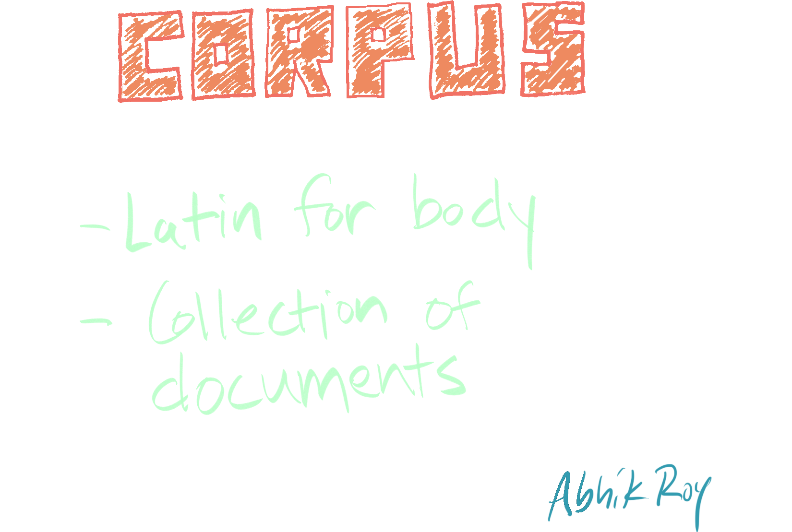
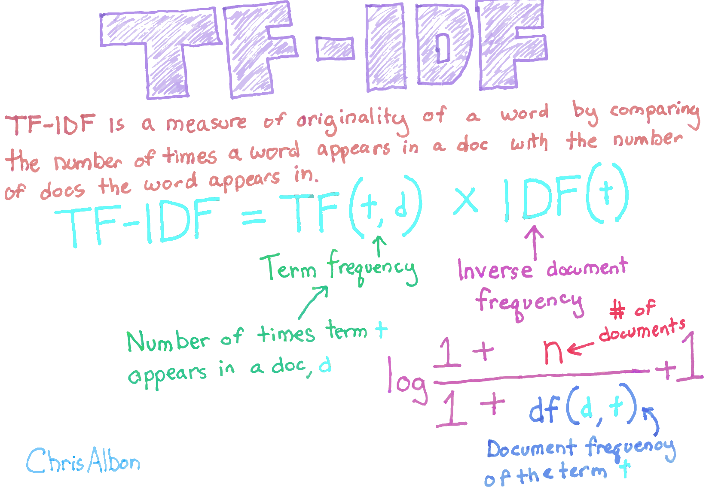
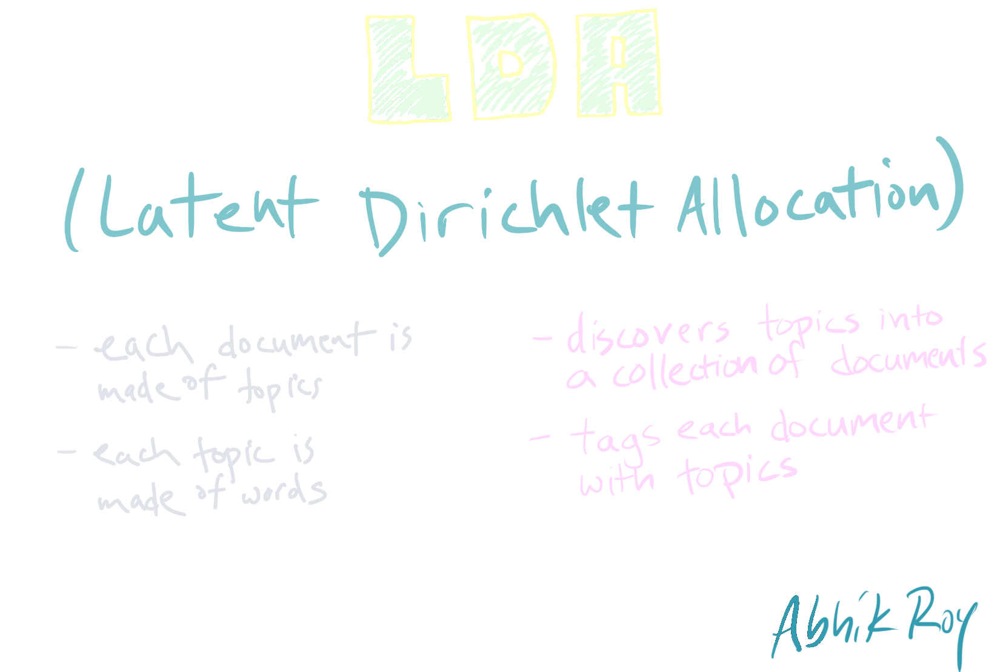
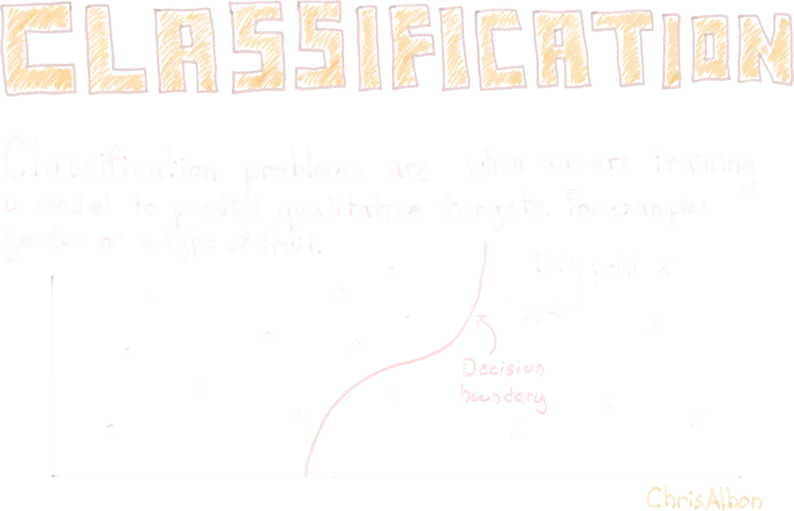
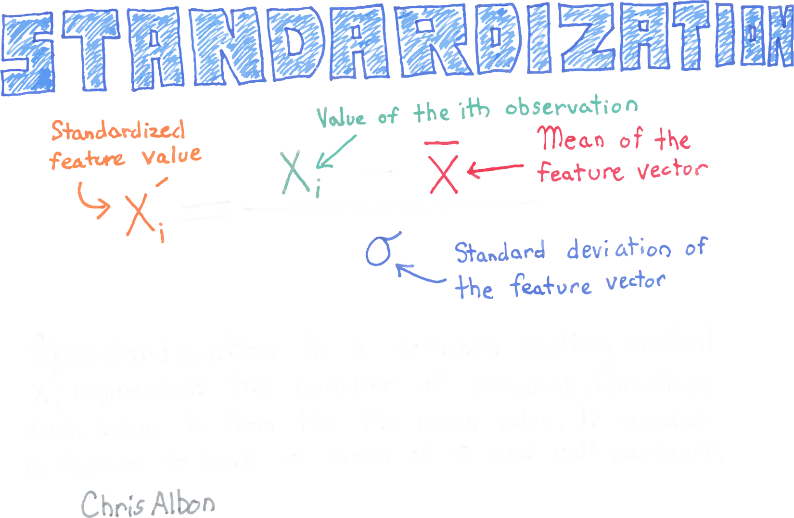
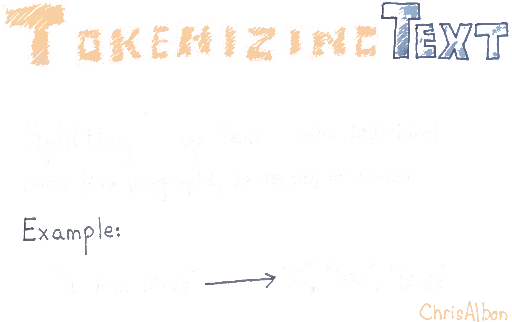

<script>
  function resizeIframe(obj) {
    obj.style.height = obj.contentWindow.document.body.scrollHeight + 'px';
  }
</script>

<script src="https://ajax.googleapis.com/ajax/libs/jquery/3.6.0/jquery.min.js"></script>

<script type="text/x-mathjax-config">
MathJax.Hub.Register.StartupHook("TeX Jax Ready",function () {
  MathJax.Hub.Insert(MathJax.InputJax.TeX.Definitions.macros,{
    cancel: ["Extension","cancel"],
    bcancel: ["Extension","cancel"],
    xcancel: ["Extension","cancel"],
    cancelto: ["Extension","cancel"]
  });
});
</script>

<style>
section {
    display: flex;
    display: -webkit-flex;
}

section {
    height: 600px;
    width: 60%;
    margin: auto;
    border-radius: 21px;
    background-color: #212121;
}

.remark-slide-container {
background: #212121;
}

.hljs-github .hljs {
    background: transparent;
    color: #b2dfdb;
}

.hljs-github .hljs-keyword {
    color: #64b5f6;
}

.hljs-github .hljs-literal {
    color: #64b5f6;
}

.hljs-github .hljs-number {
    color: #64b5f6;
}

.hljs-github .hljs-string {
    color: #b7b3ef;
}


.hljs-github .hljs {
    background: transparent;
    color: #b2dfdb;
}

.hljs-github .hljs-keyword {
    color: #64b5f6;
}

.hljs-github .hljs-literal {
    color: #64b5f6;
}

.hljs-github .hljs-number {
    color: #64b5f6;
}

.hljs-github .hljs-string {
    color: #b7b3ef;
}

section p {
    text-align: center;
    font-size: 30px;
    background-color: #212121;
    border-radius: 21px;
    font-family: Roboto Condensed;
    font-style: bold;
    padding: 12px;
    color: #bff4ee;
    margin: auto;
}

#center {
text-align: center;
}

#right {
  text-align: right;
} 

.center p {
  margin: 0;
  position: absolute;
  top: 50%;
  left: 50%;
  -ms-transform: translate(-50%, -50%);
  transform: translate(-50%, -50%);
}

.center2 {
  margin: 0;
  position: absolute;
  top: 50%;
  left: 50%;
  -ms-transform: translate(-50%, -50%);
  transform: translate(-50%, -50%);
}

.tab {
    display: inline-block;
    margin-left: 40px;
}

.listtab {
    display: inline-block;
    margin-left: 30px;
}

.obr
{
    display:block;
    margin-top:-15px;
}

.container {
  display: flex;
}

.container > div {
  flex: 1; /*grow*/
  margin-right: 40px;
}

td, th, tr, table {
    border: 0 !important;
    border-spacing:0 !important;
    overflow-x: hidden;
    overflow-y: hidden;
    background-color: unset !important;
    color: unset !important;
  }

tbody > td > tr:hover {
      background-color: unset !important;
      color: unset !important;
  }
  
.remarkwidth code[class="remark-code"] {
	white-space: pre-wrap;
	padding-left:a 1.85em;
	text-indent: -1.85em;
}

.left-code {
  color: #777;
  width: 60%;
  height: 92%;
  float: left;
}

.right-plot {
  width: 38%;
  float: right;
  padding-left: 1%;
}

.cardquad1 img:hover{
  position: relative;
  transform: translate(-50%,50%) scale(2.0);
  background-color: #212121;
}

.cardquad2 img:hover{
  position: relative;
  transform: translate(50%,50%) scale(2.0);
  background-color: #212121;
}

.cardquad3 img:hover{
  position: relative;
  transform: translate(50%,-50%) scale(2.0);
  background-color: #212121;
}

.cardquad4 img:hover{
  position: relative;
  transform: translate(-50%,-50%) scale(2.0);
  background-color: #212121;
}

img{
  -webkit-transition: transform 0.5s ease-in-out;
  -moz-transition: transform 0.5s ease-in-out;
  -ms-transition: transform 0.5s ease-in-out;
  -o-transition: transform 0.5s ease-in-out;
  transition: transform 0.5s ease-in-out;
}
</style>

```{css echo=FALSE}
.highlight-last-item > ul > li,
.highlight-last-item > ol > li {
  opacity: 0.5;
}
.highlight-last-item > ul > li:last-of-type,
.highlight-last-item > ol > li:last-of-type {
  opacity: 1;
}
```


```{r echo = FALSE, purl=FALSE}
xaringanthemer::style_duo(
  primary_color = "#212121",
  secondary_color = "#bff4ee",
  link_color = "#b1ead6",
  text_bold_color = "#4dc6e2",
  table_row_border_color = "#212121",
  table_row_even_background_color = "#212121",
  footnote_font_size = "0.6em",
  header_font_google = xaringanthemer::google_font("Roboto Condensed", "700"),
  text_font_google   = xaringanthemer::google_font("Roboto Condensed", "400")
)

xaringanExtra::use_xaringan_extra(c("tile_view", 
                                    "animate_css", 
                                    "tachyons"))

xaringanExtra::use_logo(
  image_url = here::here("static", "img", "course_hex.png"),
  link_url = "https://edp619.asocialdatascientist.com",
  position = xaringanExtra::css_position(top = "1em", right = "1em")
)
```

```{r setup, include=FALSE, purl=FALSE}
library(tidyverse)
library(knitr)
library(kableExtra)
library(fontawesome)
library(patchwork)
library(flipbookr)
library(here)
library(showtext)
font_add_google("Roboto Condensed", "roboto")
showtext_auto()

suppressMessages(library(tidyverse))
suppressMessages(library(tidytext))
suppressMessages(library(tm))
suppressMessages(library(textclean))
suppressMessages(library(topicmodels))
suppressMessages(library(ldatuning))
suppressMessages(library(stopwords))
suppressMessages(library(textstem))
suppressMessages(library(broom))

knitr::opts_chunk$set(echo = TRUE)
options(knitr.table.format = function() {
  if (knitr::is_latex_output()) 'latex' else 'pandoc'
})
```

```{r functions, echo=FALSE}
textcolor <- 
  function(text, color){
  sprintf("<span style='color: %s;'>%s</span>", color, text)
    }
```

---

class: highlight-last-item
layout: true

---

# Setting Up

--

1. You can retrieve the *employee sample reviews* survey response data set and both installation and walkthrough `r fa("r-project", fill = "steelblue")` *scripts* by clicking on the icon below<br>
<br>
<center>
<a href="files/topic_modeling_files.zip" target='_blank' download="Topic Modeling Files">
</a>
</center>

--

2. Open up RStudio

--

3. Open up <span style="font-family:'Source Code Pro'; color:#b7b3ef">Topic Modeling Install.R</span>

--

4. Open <span style="font-family:'Source Code Pro'; color:#b7b3ef">Topic Modeling Script.R</span>

--

.footnote[Take a look at the various types of files that can be imported in the tidyverse <a href="files/data-import.pdf" target='_blank' download="Data import with the tidyverse">
</a>]

---

# Getting Prepped

--

In <span style="font-family:'Source Code Pro'; color:#b7b3ef">Topic Modeling Script.R</span>, run the following commands

--

1. Setting the working directory as source
    ```{r echo = TRUE, eval = FALSE}
    setwd(dirname(rstudioapi::getActiveDocumentContext()$path))
    ```
    
--

2. Loading the needed packages for this walkthrough
    ```{r echo = TRUE, eval = FALSE}
    library(tidyverse)
    library(tidytext)
    library(tm)
    library(textclean)
    library(topicmodels)
    library(ldatuning)
    library(stopwords)
    library(textstem)
    library(broom)
    ```  
.footnote[Alternatively if you have the **pacman** package, run `pacman::p_install("tidyverse", "tidytext", "tm", "textclean", "topicmodels", "ldatuning", "stopwords", "textstem", "broom")`]

---

<ol start="3">
<li> Bringing in the survey data 
</ol>


```{r message=FALSE}
   employee_responses <- 
     read_csv("employee sample reviews.csv")
```

--

<ol start="4">
<li> Bringing in the common names set (as a character string)
</ol> 

```{r message=FALSE}
   common_names <- 
     read_csv("most common names.csv") %>%
     simplify_all() %>%
     .[[1]]
```

--

<ol start="5">
<li> Retrieving stopwords
</ol> 

```{r}
   data("stop_words")
```

---

## Too Many Files?

--

You may have noticed that the there are a lot of files. Some of them we'll use while the others are included for completeness. Below you will see a description of each

--

.pull-left[
<p id="center" style="color:#baffc9; border:1px; border-style:solid; border-color:#baffc9; border-radius: 25px; padding: 0.3em; margin-top: -6px">
<span style = "font-weight:bold; font-style:italic;">Data sets we <i>are</i> using </span><br><br>
<span style="font-family:'Source Code Pro'; color:#bff4ee">employee sample reviews.csv</span> is a 10% random sampling of the original data set that was created to save computing time for the example given in the walkthrough<br><br>
<span style="font-family:'Source Code Pro'; color:#bff4ee">most common names.csv</span> is a list of approximately 97,000+ common U.S. names derived from both U.S. Census and Social Security Administration data 
</p>
]

--

.pull-right[
<p id="center" style="color:#baffc9; border:1px; border-style:solid; border-color:#baffc9; border-radius: 25px; padding: 0.3em; margin-top: -6px">
<span style = "font-weight:bold; font-style:italic;">R Scripts we <i>are</i> using </span><br><br>
<span style="font-family:'Source Code Pro'; color:#b7b3ef">Topic Modeling Install.R</span> is the installation file needed for the walkthrough<br><br>
<span style="font-family:'Source Code Pro'; color:#b7b3ef">Topic Modeling Script.R</span> is a static copy of the commands used in the walkthrough
</p>
]

--

.pull-left[
<p id="center" style="color:#ffb3ba; border:1px; border-style:solid; border-color:#ffb3ba; border-radius: 25px; padding: 0.3em; margin-top: -6px">
<span style = "font-weight:bold; font-style:italic;">Data sets we <i>are not</i> using </span><br><br>
<span style="font-family:'Source Code Pro'; color:#bff4ee">employee reviews.csv</span> is the original data set and may be found on [Kaggle](https://www.kaggle.com/datasets/fiodarryzhykau/employee-review)
</p>
]

--

.pull-right[
<p id="center" style="color:#ffb3ba; border:1px; border-style:solid; border-color:#ffb3ba; border-radius: 25px; padding: 0.3em; margin-top: -6px">
<span style = "font-weight:bold; font-style:italic;">R scripts we <i>are not</i> using </span><br><br>
<span style="font-family:'Source Code Pro'; color:#b7b3ef">Get Common Names.R</span> provides a list of <b>dplyr</b> commands that uses the <b>lexicon</b>, <b>babynames</b>, and <b>genderdata</b> packages to create the most common names data set<br><br>
<span style="font-family:'Source Code Pro'; color:#b7b3ef">Random Sampling Rows.R</span> provides a list of <b>dplyr</b> commands used to create the sample data set
</p>
]

---

# Before We Begin

--

This is the process we'll cover lightly. There is a lot more going on under the hood and you may not be able to recognize all of the terms, but if you can get a basic understanding of the process, the rest can be filled in by conducting a topic model!

<center>
</a>
</center>

---

If you didn't know, computers can't understand human languages...not directly anyway. Enter this idea below of using a medium to communicate with one (or multiple)

<br>
<br>
<br>
<center>
</a>
</center>

---

Here are a few things we won't be covering in this session so please read over the areas you lack familiarity with. Given that, it is absolutely fine if you cannot fully understand all of these ideas right now - they will hopefully become apparent as we progress

.center2[
<div style="text-align: center; color: #212121; border:1px; border-style:solid; border-color:#c7f9f6; background-color: #c7f9f6; border-radius: 15px; padding: 0.65em; width:fit-content;">
hover over<br>any card<br>to make<br>it bigger
</div>]

--

.pull-left[
<center>
<div class="cardquad2">
</a>
</center>
</div>
]

--

.pull-right[
<div class="cardquad1">
<center>
</a>
</center>
</div>
]

--

<br>
.pull-left[
<div class="cardquad3">
<center>
</a>
</center>
</div>
]

--

.pull-right[
<div class="cardquad4">
<center>
</a>
</center>
</div>
]


---

Here are some basic terms you should try to keep while going through the walkthrough. Again it is completely fine if you do not understand what these mean in context right now!

.center2[
<div style="text-align: center; color: #212121; border:1px; border-style:solid; border-color:#c7f9f6; background-color: #c7f9f6; border-radius: 15px; padding: 0.65em; width:fit-content;">
hover over<br>any card<br>to make<br>it bigger
</div>]

--

.pull-left[
<center>
<div class="cardquad2">
</a>
</center>
</div>
]

--

.pull-right[
<div class="cardquad1">
<center>
</a>
</center>
</div>
]

--

<br>
.pull-left[
<div class="cardquad3">
<center>
</a>
</center>
</div>
]

--

.pull-right[
<div class="cardquad4">
<center>
</a>
</center>
</div>
]

---

<br>
<br>
#<center>Topic Modeling</center>

--

<br>
<br>
<br>
<center>
<div style="text-align: center; color:#c7f9f6; border:1px; border-style:solid; border-color:#c7f9f6; border-radius: 25px; padding: 0.8em; width:fit-content;">
A type of probabilistic statistical model for<br><br>
<div style="display: inline-block; text-align: left;">
(a) discovering the abstract "topics"<br>
<span class = "listtab">- or <i>hidden semantic structures</i> -</span><br>
<span class = "listtab">that occur in a collection of documents</span><br><br>
(b) dimensionality reduction</span>
</div>
</div>
</center>

---

### The Most Annoying Thing About Data

--

.center2[<b>The 80/20 Rule</b><sup>1</sup>: <i>Most data scientists spend only 20 percent of their time on actual data analysis and 80 percent of their time finding, cleaning, and reorganizing huge amounts of data</i>]

.footnote[<sup>1</sup> Loosely based on an idea called **Pareto's Principle** which states that *roughly 80% of outcomes come from 20% of causes*]

---

.center2[<b><span style = "font-size:2.75rem">Step 1: Assessing Data</span></b>]

---

1. Take a look at the data set and think about categorizing terms that may skew how terms are assessed

--

.pull-left[<span class = "tab">the names of the people are not important so we could replace all of them simply with the word <b>people</b></span>]

--

.pull-right[<span class = "tab">employees are prevalent in the data so we could remove the word <s><b>people</b></s> altogether</span>]
<br>

--

<ol start="2">
<li> Open up an empty text document and try going through on your own to consider terms that could be collapsed
</ol>

---

.center2[<b><span style = "font-size:2.75rem">Step 2: Preprocessing</span></b>]

---

<span style = "font-size:1.75rem;"><b>Cleaning</b> Raw Text</b></span>

---

```{r sw1a, include = FALSE}
employee_responses %>%
  select(feedback) %>% # Select the column with open ended responses
  mutate(feedback = textclean::replace_non_ascii(feedback)) %>% # Convert to a standard format
  mutate(feedback = str_to_lower(feedback)) %>% # Convert all words to lower case
  mutate(feedback = str_remove_all(feedback, "'s")) %>% # Remove all cases of `s
  mutate(feedback = str_remove_all(feedback, "[[:digit:]]")) %>% # Remove all numbers
  mutate(feedback = str_remove_all(feedback, "[[:punct:]]")) %>% # Remove all punctuation
  # Remove all instances from a separate list
  mutate(feedback = str_remove_all(feedback, paste0("\\b", common_names, "\\b", collapse = "|"))) %>%
  # Remove any additional terms manually
  mutate(feedback = str_remove_all(feedback, "mcknight|cook|cunningham|hahn|vargas")) %>% 
  mutate(feedback = lemmatize_strings(feedback)) %>% # Lemmatize terms
  mutate(feedback = str_squish(feedback)) %>%  # Remove whitespace
  mutate(feedback = na_if(feedback, "")) %>% #  Replace blanks with NA
  drop_na() # Drop all columns with NA
```

`r chunk_reveal(chunk_name = "sw1a", color = c("white", "white", "white"), width = c(200,0), float = "top")`

.footnote[
<div style="text-align: center; color: #212121; border:1px; border-style:solid; border-color:#c7f9f6; background-color: #c7f9f6; border-radius: 15px; padding: 0.65em; width:fit-content;">
Please note that <i>removing all instances from a separate list</i> may take up to a minute to complete
</div>
]

---

### Assigning a Variable 

Let's save the entire cleaning process 

```{r}
 responses_cleaned <-
  employee_responses %>%
  select(feedback) %>%
  mutate(feedback = textclean::replace_non_ascii(feedback)) %>%
  mutate(feedback = str_to_lower(feedback)) %>%
  mutate(feedback = str_remove_all(feedback, "'s")) %>%
  mutate(feedback = str_remove_all(feedback, "[[:digit:]]")) %>%
  mutate(feedback = str_remove_all(feedback, "[[:punct:]]")) %>%
  mutate(feedback = str_remove_all(feedback, paste0("\\b", common_names, "\\b", collapse = "|"))) %>%
  mutate(feedback = str_remove_all(feedback, "mcknight|cook|cunningham|hahn|vargas")) %>%
  mutate(feedback = lemmatize_strings(feedback)) %>%
  mutate(feedback = str_squish(feedback)) %>%
  mutate(feedback = na_if(feedback, "")) %>%
  drop_na()
```

---

### What Just Happened?

--

Let's try doing something similar but with shorter and simpler text taken from the very funny skit [Sharknado Pitch Meeting](https://youtu.be/CYootnc0uew)

```{r}
example_text <- 
  c("Excerpt from Sharknado Pitch Meeting. 
     Creator: Ryan George. 
    
     (1) It’s peer reviewed. 
     (2) Multiple scientists looked over that and approved of it? 
     (3) No some drunk guy on the pier checked it out. He loved it!
     (4) That is technically peer reviewed. I think we’re good.
    
     --The End--
    ")
```

---

1. Take a look at the raw text data
.remarkwidth[
```{r}
example_text
```
]

--

2. Then we wrangle using a very similar process 

---

```{r sw1b, include = FALSE}
example_text %>%
  read_lines() %>% # Parse text into individual lines
  as_tibble_col("text") %>% # Create a single tidy column
  slice(4:n()) %>% # Remove unnecessary text
  mutate(text = textclean::replace_non_ascii(text)) %>% # Convert to a standard format
  mutate(text = str_to_lower(text)) %>% # Convert all words to lower case
  mutate(text = str_remove_all(text, "'s")) %>% # Remove all cases of `s
  mutate(text = str_remove_all(text, "[[:digit:]]")) %>% # Remove all numbers
  mutate(text = str_remove_all(text, "[[:punct:]]")) %>% # Remove all punctuation
  mutate(text = str_remove_all(text, "the end")) %>% # Remove term
  mutate(text = str_replace_all(text, "multiple scientists", "scientists")) %>% # Replace term
  mutate(text = str_replace_all(text, "it", "paper")) %>% # Replace term
  mutate(text = str_replace_all(text, "that", "paper")) %>% # Replace term
  mutate(text = lemmatize_strings(text)) %>% # Lemmatize term
  mutate(text = str_remove_all(text, c("paper"))) %>% # Remove term
  mutate(text = str_squish(text)) %>% # Remove whitespace
  mutate(text = na_if(text, "")) %>% # Replace blanks with NA
  drop_na() # Drop all columns with NA
```
`r chunk_reveal(chunk_name = "sw1b", color = c("white", "white", "white"), width = c(200,0), float = "top")`


---

<span style = "font-size:1.75rem"><b>Normalization</b> of Remaining Wording</span>

--


> is used to reduce word randomness which allows some level of standardization to help to reduce the amount of different information that a computer has to process therefore improving efficiency

--

> the overall goal is to reduce inflectional forms and sometimes derivationally related forms of a word to a common base form

--

> two popular normalization techniques are <span style="color:#f5ebd9; font-weight:bold; font-style:italic;">lemmatization</span> and <span style="color:#d9e3f5; font-weight:bold; font-style:italic;">stemming</span>

---

## <span style="color:#f5ebd9; font-weight:bold; font-style:italic;">Lemmatization</span> vs. <span style="color:#d9e3f5; font-weight:bold; font-style:italic;">Stemming</span>

--

<br>
<br>
.pull-left[
<p id="center" style="color:#f5ebd9; border:1px; border-style:solid; border-color:#f5ebd9; border-radius: 25px; padding: 0.3em; margin-top: -6px">
<span style = "font-weight:bold; font-style:italic;">Lemmatization</span><br><br>
the process of reducing words to their base word<br><br>
(takes more time)
</p>
]

--

.pull-right[
<p id="center" style="color:#d9e3f5; border:1px; border-style:solid; border-color:#d9e3f5; border-radius: 25px; padding: 0.3em; margin-top: -6px">
<span style = "font-weight:bold; font-style:italic;">Stemming</span><br><br>
the process of reducing words to their word stem or root form by removing word endings or other affixes<br><br>
(takes less time)
</p>
]

--

<br>
.pull-left[
<p id="center" style="color:#f5ebd9; border:1px; border-style:solid; border-color:#f5ebd9; border-radius: 25px; padding: 0.3em; margin-top: -6px">
<i>Example</i><br><br>
the term <i>better</i> has the lemma <i>good</i>
</p>
]

--

.pull-right[
<p id="center" style="color:#d9e3f5; border:1px; border-style:solid; border-color:#d9e3f5; border-radius: 25px; padding: 0.3em; margin-top: -6px">
<i>Example</i><br><br>
the term <i>flooding</i> has the stem <i>flood</i>
</p>
]

--

.footnote[For a great rundown of this topic, avoid the syntax and read over [Text Normalization for Natural Language Processing (NLP)](https://towardsdatascience.com/text-normalization-for-natural-language-processing-nlp-70a314bfa646)]

---

<br>
<br>
<br>
<br>
<br>
<br>
<br>
<br>
<center>
</a>
</center>

---

<span style = "font-size:1.75rem"><b>Tokenizing</b> Handled Data</span>

--

.center2[<i>A process of distinguishing and classifying sections of a string of input characters</i>]

--

<br>
<br>
<br>
<br>
<br>
<br>
<br>
<br>
<br>
<br>
<br>
<br>
<br>
<br>
<br>
<br>
<br>
<br>
<br>
<br>
<br>
What you should take from this is that <b>unnesting</b> data successfully is a requirement to be able to **tokenize**. While the next set of commands should look familiar, please consider taking a bit of time to really see what occurs in each step

---

<span style = "font-size:1.75rem"><b>Filtering stopwords</b></span>

---

```{r sw2, include = FALSE}
responses_cleaned %>%
  unnest_tokens(word, feedback) %>%
  anti_join(stop_words) %>%
  count(word, sort = TRUE) %>%
  add_column(document = 1)
```
`r chunk_reveal(chunk_name = "sw2", color = c("white", "white", "white"), width = c(100,100))`

---

### Assign a Variable

Let's save the tokenized data frame

```{r}
responses_tokens <- 
  responses_cleaned %>%
  unnest_tokens(word, feedback) %>%
  anti_join(stop_words) %>%
  count(word, sort = TRUE) %>%
  add_column(document = 1)
```

---

.center2[<b><span style = "font-size:2.75rem">Step 3: Statistical Classification and Modeling</span></b>]

---

<span style = "font-size:1.75rem">Creating a <b>Term Document Matrix</b></span>

---

```{r sw3, include = FALSE}
 responses_tokens %>%
  cast_dtm(document, word, n)
```
`r chunk_reveal(chunk_name = "sw3", color = c("white", "white", "white"), width = c(100,100), chunk_options = "out.width = '80%', fig.retina=6")`

---

### Assigning a Variable

```{r}
 responses_dtm <- 
  responses_tokens %>%
  cast_dtm(document, word, n)
```

---

<span style = "font-size:1.75rem">Calculating <b>Coherence Scores</b></span>

--

.center2[<i>A measure of the degree of semantic similarity between high scoring words in the topic which These measurements help distinguish between topics that are semantically interpretable topics and topics that are artifacts of statistical inference</i>]

---

```{r sw4, include = FALSE}
FindTopicsNumber(
  responses_dtm,
  topics = seq(from = 2, to = 20, by = 1), 
  metrics = c("Griffiths2004", 
              "CaoJuan2009", 
              "Arun2010", 
              "Deveaud2014"),
  method = "Gibbs",
  control = list(seed = 77),
  mc.cores = 2L,
  verbose = TRUE
  ) %>%
  FindTopicsNumber_plot()
```
`r chunk_reveal(chunk_name = "sw4", color = c("white", "white", "white"), width = c(90,110), chunk_options = "out.width = '80%', fig.retina=6")`

---

### Assigning a Variable

.left-code[
```{r topic-est, eval=FALSE}
 responses_topic_est <-
  FindTopicsNumber(
   responses_dtm,
  topics = seq(from = 2, to = 20, by = 1), # amend these
  metrics = c("Griffiths2004", 
              "CaoJuan2009", 
              "Arun2010", 
              "Deveaud2014"),
  method = "Gibbs",
  control = list(seed = 77),
  mc.cores = 2L,
  verbose = TRUE
  ) %>%
  FindTopicsNumber_plot()
```
]

--

.right-plot[
```{r topic-est-out, ref.label="topic-est", echo=FALSE, results = FALSE, out.width="90%", fig.retina=6}
```
]

---


.pull-left[
The estimate for a total number of topics can be a lowest single value or range of values. We do this by observing where the metric curves tend to plateau and get as close to each other as possible along the horizontal axis. This is known as a limit<br><br>
From the plot, the metric symbolized by &#65291; is diverging away from the rest. While they may head back towards the horizontal axis in the future, the metrics symbolized by &#9723;, &#9675;, and &#9651; look to be the closest between 5 and 6<br><br>
We want to use the lowest possible count so let's start by modeling 5 topics!
]

.pull-right[
```{r echo=FALSE, message=FALSE, warning=FALSE, results = FALSE, out.width="85%", fig.retina=6}
FindTopicsNumber(
   responses_dtm,
  topics = seq(from = 2, to = 15, by = 1), # amend these
  metrics = c("Griffiths2004", 
              "CaoJuan2009", 
              "Arun2010", 
              "Deveaud2014"),
  method = "Gibbs",
  control = list(seed = 77),
  mc.cores = 2L,
  verbose = TRUE
  ) %>%
  FindTopicsNumber_plot()
```
]

---

<span style = "font-size:1.75rem">Applying a <b>Generative Model</b></span></b>

---

```{r sw5, include = FALSE}
LDA(responses_dtm, 
    k = 5, # Number of topics
    control = list(seed = 1234)) %>%
  tidy(matrix = "beta")
```
`r chunk_reveal(chunk_name = "sw5", color = c("white", "white", "white"), width = c(100,100), chunk_options = "out.width = '80%', fig.retina=6")`

---

### Assigning a Variable 

Let's save the topics list

```{r}
 responses_topics <- 
  LDA(responses_dtm, 
      k = 5, # Amend this to test a certain number of topics
      control = list(seed = 1234)) %>%
  tidy(matrix = "beta")
```

---

.center2[<b><span style = "font-size:2.75rem">Step 4: Visualization and Interpretation</span></b>]

---

### Plot the Topics

We'll use the top 10 most impactful terms in each area to fill out each potential topic 
<br>
<br>
<br> 

---

```{r sw6, include = FALSE}
responses_topics %>%
group_by(topic) %>%
slice_max(beta, n = 10) %>% 
ungroup() %>%
arrange(topic, -beta) %>%
mutate(term = reorder_within(term, beta, topic)) %>%
ggplot(aes(beta, term, fill = factor(topic))) +
geom_col(show.legend = FALSE) +
scale_fill_viridis_d() +
facet_wrap(~ topic, scales = "free") +
scale_y_reordered() +
theme_minimal()
```
`r chunk_reveal(chunk_name = "sw6", color = c("white", "white", "white"), width = c(110,90), chunk_options = "out.width = '80%', fig.retina=6")`

---

### Assigning a Variable 

Let's save the plot 

```{r}
 responses_top_terms <-
  responses_topics %>%
  group_by(topic) %>%
  slice_max(beta, n = 10) %>% 
  ungroup() %>%
  arrange(topic, -beta) %>%
  mutate(term = reorder_within(term, beta, topic)) %>%
  ggplot(aes(beta, term, fill = factor(topic))) +
  geom_col(show.legend = FALSE) +
  scale_fill_viridis_d() +
  facet_wrap(~ topic, scales = "free") +
  scale_y_reordered() +
  theme_minimal()
```

---

<br>
<br>
```{r echo=FALSE, fig.align = 'center', fig.retina=6, fig.width=12}
 responses_top_terms
```

--

.footnote[Tip: you can save high (or really any) resolution visuals easily using [`ggsave`](https://sscc.wisc.edu/sscc/pubs/using-r-plots/saving-plots.html)]
---

### What Just Happened?

--

> LDA is a form of (unsupervised) learning that views documents as bags-of-words (BoW) where order does not matter. Not having to track the placement of every term saves a lot of time and computational energy

--

> LDA works by first making a key assumption: the way a document was generated was by picking a set of topics and then for each topic picking a set of words

---

### Steps to Finding Topics

In a nutshell for each document $m$

--

1. Assume there are $k$ topics across all of the documents

--

2. Create a distribution $\alpha$ where the $k$ topics are symmetric or asymmetrically spread across each document $m$ by assigning each word a topic

--

3. For each word $w$ in every document $m$, assume its topic is is associated incorrectly but every other word is assigned the correct topic

--

4. Probabilistically assign word $w$ a topic based on two things:
    - what topics are in document $m$
    
    - Create a distribution $\beta$ to assess how many times word $w$ has been assigned a particular topic across all of the documents
    
--

5. Repeat this process a number of times for each document until saturation

---

## Interpret

--

> Much like you would assess a factor or component, the topics are unlabeled and it is up to you to figure out what they could mean. Not every topic may be directly applicable, but should still be interpreted and reported. Discarding topics means that you are removing potentially relevant information

---

Here is a brief assessment of some possible topics that are represented in the topic model with reference to *employee responses*

<br>
<br>
<br>
<br>
<center>
```{r echo=FALSE}
tibble(
  
  Topic <- c(1,2,3,4,5),
  
  Label <- c("production and gains reliance on employee abilities",
             "teams' abilities to tackle client needs affect on-time completion",
             "achievement varies by timeframe and workers' talent",
             "possible growth is helped or hindered by worker characteristics",
             "increases tied to employees' capacity and capabilities"
             )
  ) %>%
  kbl(format = "html",
      escape = FALSE,
      align = 'cl') %>%
  kable_paper(full_width = FALSE) %>%
  column_spec(1, width = "20em", color = "#ffffff", extra_css = 'vertical-align: middle !important;') %>%
  column_spec(2, width = "30em", color = "#ffffff", extra_css = 'vertical-align: middle !important;') %>%
  row_spec(0, color = "#ffffff", extra_css = 'vertical-align: middle !important;')
```
</center>

--

.footnote[Your assessment would likely differ to varying degrees and that is the point - in that qualitative concepts such as triangulation and saturation still play a large and impactful role in the interpretation phase. Note with a much larger text data set, this task could be significantly easier]

---

#  That’s It! 

Any questions?

--

<br>
<br>
<br>
<br>
<br>
<br>
<br>
<br>
<center>
<br><br>
<div class="fade_rule"></div>  
<br><br>
</center>

<center>
<a rel="license" href="http://creativecommons.org/licenses/by-nc-sa/4.0/"></a><br /><br />This work is licensed under a <br /><a rel="license" href="http://creativecommons.org/licenses/by-nc-sa/4.0/">Creative Commons Attribution-NonCommercial-ShareAlike 4.0 International License</a>
</center>
