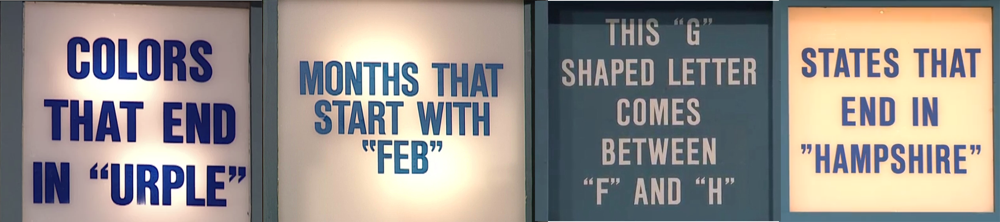
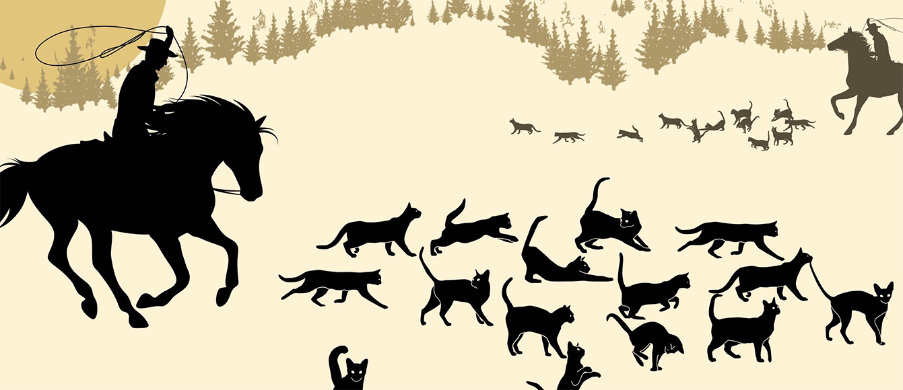

<script src="https://ajax.googleapis.com/ajax/libs/jquery/3.6.0/jquery.min.js"></script>

<script type="text/x-mathjax-config">
MathJax.Hub.Register.StartupHook("TeX Jax Ready",function () {
  MathJax.Hub.Insert(MathJax.InputJax.TeX.Definitions.macros,{
    cancel: ["Extension","cancel"],
    bcancel: ["Extension","cancel"],
    xcancel: ["Extension","cancel"],
    cancelto: ["Extension","cancel"]
  });
});
</script>

<style>
section {
    display: flex;
    display: -webkit-flex;
}

section {
    height: 600px;
    width: 60%;
    margin: auto;
    border-radius: 21px;
    background-color: #212121;
}

.remark-slide-container {
background: #212121;
}

.hljs-github .hljs {
    background: transparent;
    color: #b2dfdb;
}

.hljs-github .hljs-keyword {
    color: #64b5f6;
}

.hljs-github .hljs-literal {
    color: #64b5f6;
}

.hljs-github .hljs-number {
    color: #64b5f6;
}

.hljs-github .hljs-string {
    color: #b7b3ef;
}


.hljs-github .hljs {
    background: transparent;
    color: #b2dfdb;
}

.hljs-github .hljs-keyword {
    color: #64b5f6;
}

.hljs-github .hljs-literal {
    color: #64b5f6;
}

.hljs-github .hljs-number {
    color: #64b5f6;
}

.hljs-github .hljs-string {
    color: #b7b3ef;
}

section p {
    text-align: center;
    font-size: 30px;
    background-color: #212121;
    border-radius: 21px;
    font-family: Roboto Condensed;
    font-style: bold;
    padding: 12px;
    color: #bff4ee;
    margin: auto;
}

#center {
text-align: center;
}

#right {
  text-align: right;
} 

.center p {
  margin: 0;
  position: absolute;
  top: 50%;
  left: 50%;
  -ms-transform: translate(-50%, -50%);
  transform: translate(-50%, -50%);
}

.center2 {
  margin: 0;
  position: absolute;
  top: 50%;
  left: 50%;
  -ms-transform: translate(-50%, -50%);
  transform: translate(-50%, -50%);
}

.tab {
    display: inline-block;
    margin-left: 40px;
}
</style>

```{css echo=FALSE}
.highlight-last-item > ul > li,
.highlight-last-item > ol > li {
  opacity: 0.5;
}
.highlight-last-item > ul > li:last-of-type,
.highlight-last-item > ol > li:last-of-type {
  opacity: 1;
}
```

```{r setup, include=FALSE, purl=FALSE}
library(tidyverse)
library(knitr)
library(kableExtra)
library(fontawesome)
library(here)
library(showtext)
font_add_google("Roboto Condensed", "roboto")
showtext_auto()
```

```{r echo = FALSE, purl=FALSE}
xaringanthemer::style_duo(
  primary_color = "#212121",
  secondary_color = "#bff4ee",
  table_row_border_color = "#212121",
  table_row_even_background_color = "#212121",
  footnote_font_size = "0.6em",
  header_font_google = xaringanthemer::google_font("Roboto Condensed", "700"),
  text_font_google   = xaringanthemer::google_font("Roboto Condensed", "400")
)

xaringanExtra::use_xaringan_extra(c("tile_view", 
                                    "animate_css", 
                                    "tachyons"))

xaringanExtra::use_logo(
  image_url = here::here("static", "img", "course_hex.png"),
  link_url = "https://edp618.asocialdatascientist.com",
  position = xaringanExtra::css_position(top = "1em", right = "1em")
)

```

```{r echo=FALSE}
image_link <- function(image,url,...){
  htmltools::a(
    href=url,
    htmltools::img(src=image,...)
    )
}
```

---

class: highlight-last-item
layout: true

---

# First Things First
		
--

.center2[
<i>Ask questions or comment as you wish!</i>
]

---

# Things to think about

--

+ **Who** evaluates?
		
--

+ **What** is evaluation?
		
--

+ **Where** is evaluation needed?

--

+ **When** is it a good time to evaluate?
		
--

+ **Why** do you have to know how to evaluate?

--

+ Your reputation

---

# **Who** evaluates? 

---

## Traits

+ Able to ask questions to anyone as needed
		
--

+ Can live with the fact that they are likely the most hated and/or feared person in a room or study
		
--

+ Capacity to separate personal biases over and over
		
--

+ Displays the capacity to pass judgement based on grounded scientific outcomes
		
--

+ Interest in studying programs regardless of content
		
--

+ Loves to play with data
		
--

+ Prepared to be political when necessary

--

+ Skilled in anticipating all reasonable scenarios

--

+ Thrives in uncertainty

--

+ Understand, accept, and embrace the jack of all trades but a master of none (or maybe a few) life

---

# **What** is evaluation? 

---

## Comparison of Purposes

.pull-left[
**Evaluation** is not the same as<br>

+ *Assessment*. Snapshot of what is happening in the moment

+ *Research*. Seeking further knowledge
]

--

.pull-right[
**Evaluation** <br>

+ addresses needs for improvement or judgement

+ uses both assessment and research
]

---

## Public Perception of Evaluation

<center>
What people think<br>
<br>

</center>

--

<br>
<center>
What its really like<br>
<br>

</center>

---

# General Types of Evaluations

--

.pull-left[
<span style="color:#FCB56D;">Formal</span><br>
  > Making decisions based on *objective* criteria
  
  > Used in studies
  ]
  
--

.pull-right[
<span style="color:#FC6DB5;">Informal</span><br>

  > Making decisions based on *subjective* criteria
  
  > Used everyday by you
]

---

# Definition

--

.pull-left[
<center>
<span style="color:#FCB56D;">Formal</span>
</center><br>
**Evaluation** is the process of determining the
  
  > *quality (merit)*,
  
  > *value (worth)*, or
  
  > *importance (significance)*
  
  of something, or the product of that process
]

--

.pull-right[
<center>
<span style="color:#FC6DB5;">Informal</span>
</center><br>
**Evaluation** answers
  > *Does it work?*
  
  > *Why does it work?*
]
	
--

.center2[
<br>
<br>
<br>
<br>
<br>
<br>
<br>
<br>
<br>
<br>
<br>
<br>
<br>
<br>
<br>
<br>
<center>
<span style="color:#6db5fc;">Note</span>
</center><br>
<i>How does it work?</i> is a research question

]

---

#  Purposes of Evaluations 

--

.pull-left[
<span style="color:#FCB56D;">Formative</span><br>
  > Evaluation conducted with the intent to improve
  ]


--

.pull-right[
<span style="color:#FC6DB5;">Summative</span><br>
  > Evaluation conducted for decision-making or accountability (aka to pass judgement)
]

---

#  Broad Modes of Evaluation 

--

.pull-left[
<span style="color:#FCB56D;">Goal Free</span><br>
  > Evaluation conducted by avoiding learning the stated purpose/goals/intended achievements of the program prior to or during the evaluation
]

--

.pull-right[
<span style="color:#FC6DB5;">Goal Based</span><br>
  > Evaluation conducted learning the stated purpose/goals/intended achievements of the program prior to or during the evaluation
]

---

# Why is evaluation important? 

--


<br>
<br>
.pull-left[
<p id="center" style="color:#f0b5d3; font-weight: bold; border:1px; border-style:solid; border-color:#f0b5d3; border-radius: 25px; padding: 0.3em;">
<i>Accountability</i> & <i>efficiency</i><br><br>
Responsibility for justification of expenditures, decisions, or the results of actions
</p>
]

--

.pull-right[
<p id="center" style="color:#f5ebd9; font-weight: bold; border:1px; border-style:solid; border-color:#f5ebd9; border-radius: 25px; padding: 0.3em;">
<i>Improvement</i><br><br>
Improving the efficiency and effectiveness of services, the quality of products, the performance of personnel, etc.
</p>
]

--

<br>
<br>
.pull-left[
<p id="center" style="color:#99d2dd; font-weight: bold; border:1px; border-style:solid; border-color:#99d2dd; border-radius: 25px; padding: 0.3em;">
<i>Judgement</i><br><br>
Determining the need or necessity of services, products, personnel, etc.
</p>
]

--

.pull-right[
<p id="center" style="color:#e1e1f9; font-weight: bold; border:1px; border-style:solid; border-color:#e1e1f9; border-radius: 25px; padding: 0.3em;">
<i>Resource allocation</i><br><br>
Allotment, distribution,and uses of existing and/or scarce resources under consideration of competing demands
</p>
]

---

##  Examples 

+ Rash of recalls for FDA approved drugs/pharmaceuticals 

--

+ Contaminants in pet foods

--

+ Dangerous levels of hazardous materials (e.g., lead) in consumer products (e.g., children’s toys)

--

+ Large-scale funding and implementation of educational and human and social service programs that simply do not work (e.g., NCLB, DARE, abstinence only education, etc.)

---

#  Where is evaluation needed? 

--

+ Where there’s a program, especially those that are ongoing

--

+ In practice, anywhere money is involved

---
#  Example: Tuskegee Syphilis Experiment 

+ *Setting*. Clinical Study conducted between 1932 and 1972 by the U.S. Public Health Service (which turned into the CDC beginning in 1952)

--

+ *Sampling Frame*. Studied the natural progression of untreated syphilis in rural African-American men in Alabama under the guise of receiving free health care from the United States government. Investigators enrolled in the study a total of 600 impoverished, African American sharecroppers from Macon County, Alabama

--

+ *Incentives*. Medical exams, rides to and from the clinics, meals on examination days, free treatment for minor ailments and guarantees that provisions would be made after their deaths in terms of burial stipends paid to their survivors

--

+ *Study Design*.

	+ Divided sample into control and experimental groups
		+ 399 already had syphilis
		+ 201 did not
	
	+ Provided no effective care as the men died, went blind or insane, or experienced other severe health problems due to their untreated syphilis

---

+ *Population Outcomes*.
  
  + 28 participants had perished from syphilis
  + 100 others passed away from various related complications
  + 40 spouses had been diagnosed with syphilis and then passed it to 19 children at birth
  
--

+ *Ethical standards*. Violation of guidelines established after the 1940s found that researchers failed to treat patients appropriately after the 1947 standardization of penicillin as an effective cure for the disease they were studying

--

+ *Long Term Effects*. 

  + As a result of this and other ethical violations
    + many African Americans developed a lingering, deep mistrust of public health officials and vaccines
    + in Nov 2021, The Pew Research Center found that 42% of African Americans would take the COVID-19 vaccine - the lowest among any other racial and ethnic group

---

#  When is it a good time to evaluate? 

--

.pull-left[
<span style="color:#FCB56D;">Proactive</span> Evaluations

  + Administered at the onset of a program or cycle
  + Formative by design
  + Implemented to improve within a certain timeframe
  + Provides real-time information about a program
  + Rarely implemented unless required
]

--

.pull-right[
<span style="color:#FC6DB5;">Reactive</span> Evaluations 

+ Administered at the end of a program or cycle
	+ Summative by design
	+ Implemented to construct elements for reporting purposes
	+ Provides post-hoc about a program
	+ Commonly implemented
]

---

#  Why do you have to know how to evaluate?

--

.center2[

<span style="color:#e1e1e1;">Accountability!</span>

]


---

## Should evaluators provide recommendations?

--

.pull-left[
<span style="color:#cf6669;">Questions</span>
<br>
<br>
How long is the evaluation?
]

--

.pull-right[
<span style="color:#bb86fc;">Answers</span>
<br>
<br>
Most evaluations are two weeks to one month
]

--


.pull-left[
Do you enough about any program to give advice?

]

--

.pull-right[

Evaluations are generally *external* meaning an evaluator comes in to an unfamiliar setting and people to conduct a study

]

--

.pull-left[

Is it an expectation of the job?

]

--

.pull-right[

If this is not clarified in the initial stages, then not providing them would be an incomplete study OR may be taken as an overreach

]

--

.pull-left[

What are the practical implication?

]

--

.pull-right[

To determine if an evaluator should serve as an *agent of change*

]

---

# Real World Evaluations

---

## <span style="color:#7ebf97;">Considerations</span> 

> *Benefit*. Is the study actually beneficial or just an interest?

> *Drive*. Are you and possibly a team motivated enough to accomplish this task?

> *Outcomes*. Are the anticipated or possible results worth your time and effort?

> *Resources*.  Do you have enough capital to get the job done?

> *Sample*.  Can you reasonably get enough people or units to perform a study?

> *Workload*. Is the work going to hinder your well being or hinder your resources?

---

##<span style="color:#c0506b;">Scope</span>

> *Frame*. What would be your population and sample? Where would they be from

> *Size*. How large of a study could you reasonably take on?
	
> *Questions*. What questions would you ask?

> *Collection*. What type of data would be collected and how would you go about it?
	
> *Methods*. What study methodologies and/or approaches

> *Timeframe*. What is your anticipated timeframe?

---

#  Logic Models 

---

## Description

A *logic model* is a graphic representation (road map, flow chart, insert buzz word here) and is a very early step in the evaluation planning process where you can show

--

.pull-left[
	+ the shared relationships among the program’s
	
	  + resources
	
    + activities

    + outputs
  
    + outcomes
  
    + impact/effect (if applicable)
]

--

.pull-right[
  + the association between the program’s
    
    + activities
    
    + intended effects
]

---

## Practical Purpose

--

Theory-Driven Evaluation

--

+ Step 1. Find out what a program looks like typically from a sponsor’s or primary stakeholder’s point of view

--

+ Step 2. Find out what it really looks like through a study
	
--

+ Step 3. Compare the two and report the results
	
---

## Picture!

<center>

</center>

---

## Meanings

<center>

</center>

---

<br>
<br>
<br>
<br>
<br>
<br>
.pull-left[
<center>

</center>
]

.pull-right[
<center>

</center>
]

---

## Example

<center>

</center>

---

# Task: Evaluation Proposal

1. Create an Evaluation Team
  
  a. Work in groups of 2 or 3
  
--
  
  b. Pick a program everyone would consider evaluating (real or imaginary)
  
--

2. Establish the Process
  
  a. Make a plan
    
    + Address the Considerations
    
    + Figure out Scope of evaluation
    
    + Construct a Logic Model
    
    + Fill out *Planning a Program Evaluation* as you go along
    
--
  
  b. Decide whether to provide recommendations
  
---

3. Present the Plan
  
  a. Describe the program
  
--
  
  b. Establish a need for the evaluation
  
--
  
  c. Display and explain your logic model for show and tell
  
--
  
  d. Anticipate outcomes and limitations<sup>1</sup>

  
.footnote[
<sup>1</sup> What you expect to see as a result of the study *and* what barriers that may come up
]

---

#  That’s it! 

Any questions?
