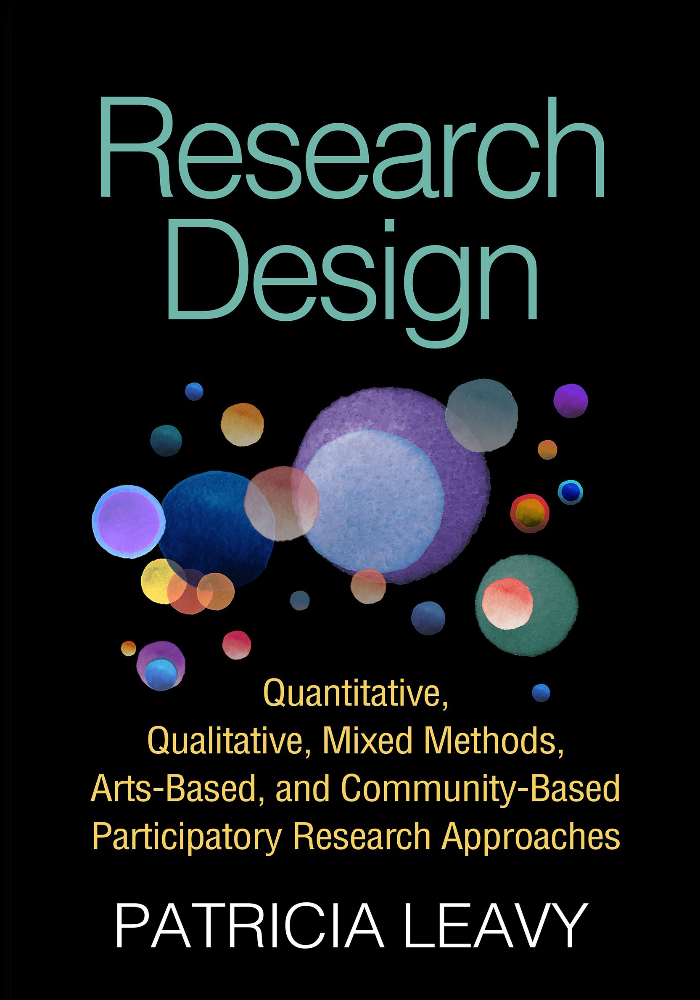

<style>

.center2 {
  margin: 0;
  position: absolute;
  top: 50%;
  left: 50%;
  -ms-transform: translate(-50%, -50%);
  transform: translate(-50%, -50%);
}

ol.nostyle li.nostyle {

  list-style-type: none;
  
}

.brsmallmed {
            display: block;
            margin-bottom: 4em;
        }

.brmedium {
            display: block;
            margin-bottom: 7em;
        }
          
.brlarge {
            display: block;
            margin-bottom: 17em;
        }

</style>


```{css echo=FALSE}
.highlight-last-item > ul > li,
.highlight-last-item > ol > li {
  opacity: 0.5;
}
.highlight-last-item > ul > li:last-of-type,
.highlight-last-item > ol > li:last-of-type {
  opacity: 1;
}
```

```{r setup, include=FALSE, purl=FALSE}
library(tidyverse)
library(knitr)
library(kableExtra)
library(fontawesome)
library(here)
library(DT)
library(scales)
library(latex2exp)
library(showtext)
font_add_google("Roboto Condensed", "roboto")
showtext_auto()
```

```{r echo = FALSE, purl=FALSE}
xaringanthemer::style_duo(
  primary_color = "#212121",
  secondary_color = "#bff4ee",
  table_row_border_color = "#212121",
  table_row_even_background_color = "#212121",
  footnote_font_size = "0.6em",
  header_font_google = xaringanthemer::google_font("Roboto Condensed", "700"),
  text_font_google   = xaringanthemer::google_font("Roboto Condensed", "400")
)

xaringanExtra::use_xaringan_extra(c("tile_view", 
                                    "animate_css", 
                                    "tachyons"))

xaringanExtra::use_logo(
  image_url = here::here("static", "img", "course_hex.png"),
  link_url = "https://edp612.asocialdatascientist.com",
  position = xaringanExtra::css_position(top = "1em", right = "1em")
)

```

---

class: highlight-last-item
layout: true

---

# Welcome!

<center>

<center>

---

# Your Teachers

.pull-left[
<center>
Dr. Abhik Roy


<center>
]

.pull-right[
<center>
Carinna Ferguson


<center>
]

---

# Course Content

--

The purpose and nature of scientific research.

--

How knowledge gained from scientific research differs from other types of knowledge.

--

How to formulate and articulate research problems.

--

The different types and uses of variables in a research study.

--

The methods and techniques for establishing and evaluating reliability and validity.

--

How to critically access and review literature relevant to a particular research problem.

--

How to write a literature review.

--

The relationship between research questions and particular research designs.

--

The most common forms of quantitative and qualitative approaches to research in education and the social and behavioral sciences.

--

The strengths and shortcomings of these approaches to research.

---

# Course Materials

- [eCampus](https://ecampus.wvu.edu/) access: for submissions and grades only

--

- [Materials](https://edp612.asocialdatascientist.com/materials/) and [Extras](https://edp612.asocialdatascientist.com/extras/) pages

--

- Text: Leavy, P. (2017). *Research design: Quantitative, qualitative, mixed methods, arts-based, and community-based participatory research approaches* (1st ed.). The Guilford Press.

<center>

<center>

  >- [Digital edition](https://ebookcentral.proquest.com/lib/wvu/detail.action?docID=4832778) (very free)
  
  >- Softcover edition (not legally free) - ISBN: 9781462514380

---

# Type

.pull-left[
In-class
  >- Lectures
  >- Activities
  >- Work
  >- Breaks
  >- No exams
]

--

.pull-right[
Out-of-class
  >- Work
  >- Literature Review
]

---

# What I expect

--

- Coming to Class

--

- Keeping an open line of communication

--

- Not staying quiet

--

- Asking questions

--

- Participating like crazy

--

- Coming to visit me on Zoom (and hopefully at some point in my office 504O Allen Hall)

---

# Assignments

```{r assignments, echo=FALSE, eval=TRUE}
tribble(
  ~Percent,  ~Task,
  15, "Engagement",
  35, "Literature Reviews",
  15, "Presentation",
  35, "Weeklies"
) %>%
  kableExtra::kable(align='cl',
               col.names = c("Percent", "Task"),
      ) %>%
  kable_paper(html_font = "Roboto Condensed") %>%
  kable_styling(position = "center",
                bootstrap_options = c("striped", 
                                      "hover", 
                                      "condensed", 
                                      "responsive"),
                full_width = FALSE) %>%
  column_spec(1, width = "5em", color = "#ffffff", extra_css = 'vertical-align: middle !important;') %>%
  column_spec(2, width = "12em", color = "#ffffff",
              extra_css = 'vertical-align: middle !important;') %>%
  row_spec(0, color = "#f7f7f7")
```

---

# Grading

```{r grading, echo=FALSE, eval=TRUE}
tribble(
  ~Grade, ~Range,
  "A",  "90–100%",
  "B",  "80%-89%",  
  "C",  "70–79%",
  "D",  "60–69%", 
  "F",  "< 60%"
) %>%
  kableExtra::kable(align='cl',
               col.names = c("Grade", "Range")) %>%
   kable_paper(html_font = "Roboto Condensed") %>%
   kable_styling(position = "center",
                bootstrap_options = c("striped", 
                                      "hover", 
                                      "condensed", 
                                      "responsive"),
                full_width = FALSE) %>%
  column_spec(1, width = "5em") %>%
  column_spec(1, width = "5em", color = "#ffffff", extra_css = 'vertical-align: middle !important;') %>%
  column_spec(2, width = "12em", color = "#ffffff",
              extra_css = 'vertical-align: middle !important;') %>%
  row_spec(0, color = "#f7f7f7")
```

---

# Things We <b>Don't</b> Cover About Research

- Purpose

--

- Audience

--

- Guiding Questions

--

- Interpretation of Findings

--

- Reporting of Results

--

- Usage of Findings

--

- Professional Standards & Ethics

---

# Things We <b>Do</b> Cover About Research

- (Some) Analyses

--

- Approaches

--

- Designs

--

- Data Collection 

--

- Methodology

--

- Reliability

--

- Validity

---

# Keep These in Mind

--

<i>Research</i> 

--

  - is a systematic process of collecting and logically analyzing information (data) for some purpose

--

  - does not care about your feelings or views
  
--

  - demands ethics and trust or we're all screwed

--

.pull-left[
Types
  >- Descriptive
  >- Relational
  >- Causal
]

--

.pull-right[
Purposes
  >- Theoretical
  >- Empirical
  >- Probabilistic
  >- Causational
]

---

# Common Sense v. Science!

.pull-left[
 Common Sense - Grounded in how we come to know the world

  - Subjective
  
  - Objective
]

--

.pull-right[
Science - Grounded in prominent theoretical constructs

  >- Epistemology
  
  >- Methodology
]

---

# How do we know things?

--

- Beliefs

--

- Intuitions

--

- Logic

--

- Opinions of others

--

- Personal experiences

--

- Scientific method

--

- Sensory experiences

--

- Traditions

--

- Failures!

---

# Human Nature v. Science!

.pull-left[
Human Nature
]

--

.pull-right[
Science
]

--

.pull-left[
- usually observations are inaccurate
]

--

.pull-right[
- ensure observations are accurate
]

--

.pull-left[
- generalize from a few cases
]

--

.pull-right[
- explicitly sample for generalizing
]

--

.pull-left[
- observe selectively to see what we’re looking for
]

--

.pull-right[
- consciously decide what and how to observe
]

--

.pull-left[
- make things up to fulfill gaps
]

--

.pull-right[
- base conclusions on evidence alone
]

--

.pull-left[
- get personally and emotionally involved
]

--

.pull-right[
- respect scientific norms regardless of opinions
]

--

.pull-left[
- form views with little or no revisions and stick with them
]

--

.pull-right[
- constantly revise views
]

--

.pull-left[
- think we can figure out everything
]

--

.pull-right[
- accept that not everything is knowable
]


---


## That's it. Questions?