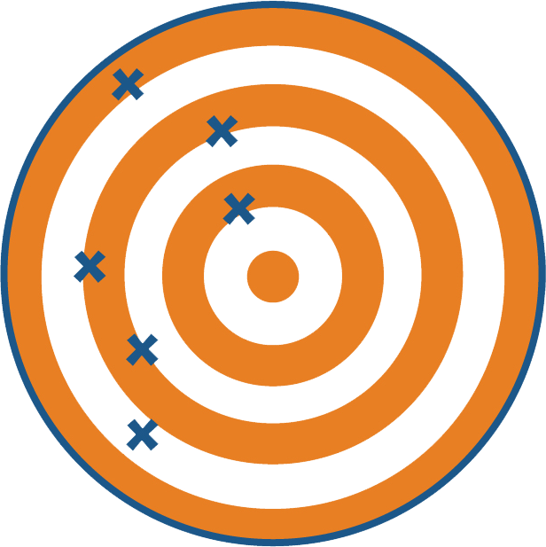
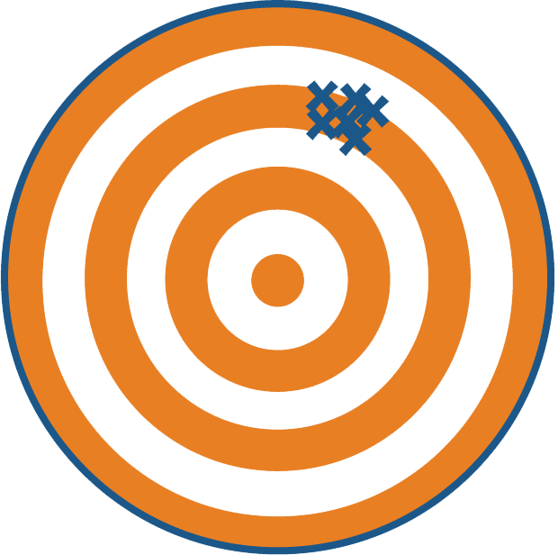

<script>
  function resizeIframe(obj) {
    obj.style.height = obj.contentWindow.document.body.scrollHeight + 'px';
  }
</script>

<script src="https://ajax.googleapis.com/ajax/libs/jquery/3.6.0/jquery.min.js"></script>

<script type="text/x-mathjax-config">
MathJax.Hub.Register.StartupHook("TeX Jax Ready",function () {
  MathJax.Hub.Insert(MathJax.InputJax.TeX.Definitions.macros,{
    cancel: ["Extension","cancel"],
    bcancel: ["Extension","cancel"],
    xcancel: ["Extension","cancel"],
    cancelto: ["Extension","cancel"]
  });
});
</script>

<style>
section {
    display: flex;
    display: -webkit-flex;
}

section {
    height: 600px;
    width: 60%;
    margin: auto;
    border-radius: 21px;
    background-color: #212121;
}

.remark-slide-container {
background: #212121;
}

.hljs-github .hljs {
    background: transparent;
    color: #b2dfdb;
}

.hljs-github .hljs-keyword {
    color: #64b5f6;
}

.hljs-github .hljs-literal {
    color: #64b5f6;
}

.hljs-github .hljs-number {
    color: #64b5f6;
}

.hljs-github .hljs-string {
    color: #b7b3ef;
}


.hljs-github .hljs {
    background: transparent;
    color: #b2dfdb;
}

.hljs-github .hljs-keyword {
    color: #64b5f6;
}

.hljs-github .hljs-literal {
    color: #64b5f6;
}

.hljs-github .hljs-number {
    color: #64b5f6;
}

.hljs-github .hljs-string {
    color: #b7b3ef;
}

section p {
    text-align: center;
    font-size: 30px;
    background-color: #212121;
    border-radius: 21px;
    font-family: Roboto Condensed;
    font-style: bold;
    padding: 12px;
    color: #bff4ee;
    margin: auto;
}

#center {
text-align: center;
}

#right {
  text-align: right;
} 

.center p {
  margin: 0;
  position: absolute;
  top: 50%;
  left: 50%;
  -ms-transform: translate(-50%, -50%);
  transform: translate(-50%, -50%);
}

.center2 {
  margin: 0;
  position: absolute;
  top: 50%;
  left: 50%;
  -ms-transform: translate(-50%, -50%);
  transform: translate(-50%, -50%);
}

.tab {
    display: inline-block;
    margin-left: 40px;
}

.obr
{
    display:block;
    margin-top:-15px;
}

.container {
  display: flex;
}

.container > div {
  flex: 1; /*grow*/
  margin-right: 40px;
}

td, th, tr, table {
    border: 0 !important;
    border-spacing:0 !important;
    overflow-x: hidden;
    overflow-y: hidden;
    background-color: unset !important;
    color: unset !important;
  }

tbody > td > tr:hover {
      background-color: unset !important;
      color: unset !important;
  }
</style>

```{css echo=FALSE}
.highlight-last-item > ul > li,
.highlight-last-item > ol > li {
  opacity: 0.5;
}
.highlight-last-item > ul > li:last-of-type,
.highlight-last-item > ol > li:last-of-type {
  opacity: 1;
}
```


```{r echo = FALSE, purl=FALSE}
xaringanthemer::style_duo(
  primary_color = "#212121",
  secondary_color = "#bff4ee",
  link_color = "#b1ead6",
  text_bold_color = "#4dc6e2",
  table_row_border_color = "#212121",
  table_row_even_background_color = "#212121",
  footnote_font_size = "0.6em",
  header_font_google = xaringanthemer::google_font("Roboto Condensed", "700"),
  text_font_google   = xaringanthemer::google_font("Roboto Condensed", "400")
)

xaringanExtra::use_xaringan_extra(c("tile_view", 
                                    "animate_css", 
                                    "tachyons"))

xaringanExtra::use_logo(
  image_url = here::here("static", "img", "course_hex.png"),
  link_url = "https://edp618.asocialdatascientist.com",
  position = xaringanExtra::css_position(top = "1em", right = "1em")
)
```

```{r setup, include=FALSE, purl=FALSE}
library(tidyverse)
library(knitr)
library(kableExtra)
library(fontawesome)
library(here)
library(clt)
library(showtext)
font_add_google("Roboto Condensed", "roboto")
showtext_auto()
```

```{r echo = FALSE, purl=FALSE}
xaringanthemer::style_duo(
  primary_color = "#212121",
  secondary_color = "#bff4ee",
  table_row_border_color = "#212121",
  table_row_even_background_color = "#212121",
  footnote_font_size = "0.6em",
  header_font_google = xaringanthemer::google_font("Roboto Condensed", "700"),
  text_font_google   = xaringanthemer::google_font("Roboto Condensed", "400")
)

xaringanExtra::use_xaringan_extra(c("tile_view", 
                                    "animate_css", 
                                    "tachyons"))

xaringanExtra::use_logo(
  image_url = here::here("static", "img", "course_hex.png"),
  link_url = "https://edp612.asocialdatascientist.com",
  position = xaringanExtra::css_position(top = "1em", right = "1em")
)

```

#  <span style="color:#d9534f;font-weight:bold;">Reliability</span> and <span style="color:#428bca;font-weight:bold;">Validity</span> 
--

<br>
<br>
.pull-left[
<center>
<span style="color:#d9534f;font-weight:bold;">Reliability</span><br><br><i>being consistent</i>
</center>
]

--

.pull-right[
<center>
<span style="color:#428bca;font-weight:bold;">Validity</span><br><br><i>on target</i>
</center>
]

---

# Recall Scenarios

.pull-left[
<center>
<i>Not</i><span style="color:#d9534f;font-weight:bold;"> Reliable</span> and <i>not</i> <span style="color:#428bca;font-weight:bold;"> Valid</span>
<br><br>

</center>
]

--

.pull-right[
<center>
<span style="color:#d9534f;font-weight:bold;">Reliable</span> but <i>not</i> <span style="color:#428bca;font-weight:bold;"> Valid</span>
<br><br>

</center>
]

--

<br>
<br>
.pull-left[
<center>
<i>Not</i><span style="color:#d9534f;font-weight:bold;"> Reliable</span> but <span style="color:#428bca;font-weight:bold;">Valid</span>
<br><br>

</center>
]

--

.pull-right[
<center>
<span style="color:#d9534f;font-weight:bold;">Reliable</span> and <span style="color:#428bca;font-weight:bold;">Valid</span>
<br><br>

</center>
]

---

# Basic Tenant

<br>
<br>
.pull-left[
A test can be <span style="color:#d9534f;font-weight:bold;">Reliable</span> without being <span style="color:#428bca;font-weight:bold;">Valid</span>
]

--

.pull-right[
A test cannot be <span style="color:#428bca;font-weight:bold;">Valid</span> unless it is <span style="color:#d9534f;font-weight:bold;">Reliable</span>
]

---

# <span style="color:#d9534f;font-weight:bold;">Reliability</span>

--

<br>
<br>
.pull-left[
<center>
<span style="color: 	#ffd5b7;font-weight:bold;">Intra-rater</span> <span style="color:#d9534f;font-weight:bold;">Reliability</span><br><br><i>the degree of agreement between different measurements done by the <span style="color: 	#ffd5b7;">same person</span></i>
</center>
]

--

.pull-right[
<center>
<span style="color: 	#b7e1ff;font-weight:bold;">Inter-rater</span> <span style="color:#d9534f;font-weight:bold;">Reliability</span><br><br><i>degree of agreement between between different measurements done by <span style="color: 	#b7e1ff;">multiple people</span></i>
</center>
]

---

# Cohen's Kappa $\kappa$

+ *Officially*. Measure of the agreement between two raters who each classify $N$ items into $C$ mutually exclusive categories

--

+ *Basic idea*. 

--

  + Quantitative measure of reliability for two raters that are rating the same thing 

--

  + With a correction for how often that the raters may agree by chance
	  
--

+ *Lay terms*. Measure of how well do different people agree

---

## Evaluating

--

<br>
<br>
.pull-left[
<center>
 `\kappa < 0` <br><br>
random agreement among raters
</center>
]

--

.pull-right[
<center>
 `\kappa = 1` <br><br>
complete agreement among raters
</center>
]

---

## Decision Matrix

--

<center>

</center>

--

.pull-left[
<center>
 `A` <br><br>
<font size="3"><i>Agreement</i></font><br><br>
<font size="3">The total number of instances that <span style="color:#7acccc">both Raters</span> said were correct</font>
</center>
]

--

.pull-right[
<center>
 `B` <br><br>
<font size="3"><i>Disagreement</i></font><br><br>
<font size="3">The total number of instances that <span style="color:#b27acc">Rater 2</span> said was incorrect, but</i> <span style="color:#94cc7a">Rater 1</span> said were correct</font>
</center>
]

--

<br>
.pull-left[
<center>
 `C` <br><br>
<font size="3"><i>Disagreement</i></span><br><br>
<font size="3">The total number of instances that <span style="color:#94cc7a">Rater 1</span> said was incorrect, but <span style="color:#b27acc">Rater 2</span> said were correct</font>
</center>
]

--

.pull-right[
<center>
 `D` <br><br>
<font size="3"><i>Agreement</i></span><br><br>
<font size="3">The total number of instances that <span style="color:#7acccc">both Raters</span> said were incorrect</font>
</center>
]

---

## Calculations

---

## Probability of <i>Agreement</i> $P_0$

<br>
<br>
<center>
Number in Full <i>Agreement</i> / Total
</center>
.center2[
$$\dfrac{A+D}{A+B+C+D}$$
]

---

## Probability of <b>Correct</b> Random <i>Agreement</i> $P_{correct}$

<br>
<br>
<center>
Number Correct in Full or Partial <i>Agreement</i> / Total
</center>
.center2[
$$\dfrac{A+B}{A+B+C+D}\cdot\dfrac{A+C}{A+B+C+D}$$
]

---

## Probability of <b>Incorrect</b> Random <i>Agreement</i> $P_{incorrect}$

--

<br>
<br>
<center>
Number Incorrect in Full or Partial <i>Agreement</i> / Total
</center>
.center2[
$$\dfrac{C+D}{A+B+C+D}\cdot\dfrac{B+D}{A+B+C+D}$$
]

---

## Probability of Random <i>Agreement</i>

--

.center2[
$$P_e = P_{correct} + P_{incorrect}$$
]

---

## Kappa $\kappa$

--

.center2[
$$\kappa = \dfrac{P_0 - P_e}{1-P_e}$$ 
]

---

## Interpretation

--

.center2[
```{r echo=FALSE}
tibble(
    
    kappa <- c("`leq 0.20`",
               "`0.21-0.40`",
               "`0.41-0.60`",
               "`0.61-0.80`",
               "`geq 0.81`"),
    
    strength <- c("Poor",
                   "Fair",
                   "Moderate",
                   "Good",
                   "Very Good"),
    
      .name_repair = "minimal"
    
) %>%
  kbl(col.names = c("Value of `kappa`", "Strength of <i>Agreement</i>"), 
      "html", 
      escape = FALSE,
      align = 'cl') %>%
  kable_paper(full_width = FALSE) %>%
  column_spec(1, width = "10em") %>%
  column_spec(2, width = "10em") %>%
  row_spec(0:5, color = "#ffffff",
           background = "#212121",
           extra_css = 'vertical-align: middle !important;')
```
] 

---

#  That’s it! 

Any questions?
