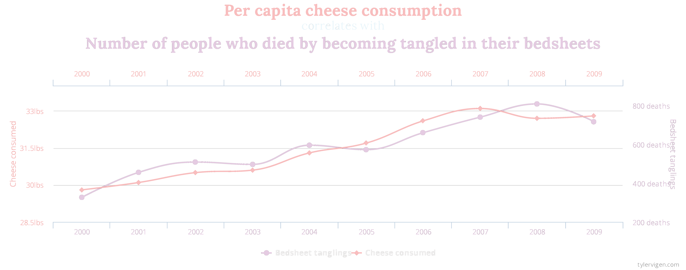

<style>

<script>
  function resizeIframe(obj) {
    obj.style.height = obj.contentWindow.document.body.scrollHeight + 'px';
  }
</script>

.hvr-sweep-to-left {
    display: inline-block;
    vertical-align: middle;
    -webkit-transform: perspective(1px) translateZ(0);
    transform: perspective(1px) translateZ(0);
    box-shadow: 0 0 1px rgba(0, 0, 0, 0);
    position: relative;
    -webkit-transition-property: color;
    transition-property: color;
    -webkit-transition-duration: 0.25s;
    transition-duration: 0.25s;
  }

.hvr-sweep-to-left:before {
  content: "";
  position: absolute;
  z-index: -1;
  top: 0;
  left: 0;
  right: 0;
  bottom: 0;
  background: #761756;
    -webkit-transform: scaleX(0);
  transform: scaleX(0);
  -webkit-transform-origin: 100% 50%;
  transform-origin: 100% 50%;
  -webkit-transition-property: transform;
  transition-property: transform;
  -webkit-transition-duration: 0.3s;
  transition-duration: 0.3s;
  -webkit-transition-timing-function: ease-out;
  transition-timing-function: ease-out;
}

.hvr-sweep-to-left:hover, .hvr-sweep-to-left:focus, .hvr-sweep-to-left:active {
  color: white;
}

.hvr-sweep-to-left:hover:before, .hvr-sweep-to-left:focus:before, .hvr-sweep-to-left:active:before {
  -webkit-transform: scaleX(1);
  transform: scaleX(1);
}

.center2 {
  margin: 0;
  position: absolute;
  top: 50%;
  left: 50%;
  -ms-transform: translate(-50%, -50%);
  transform: translate(-50%, -50%);
}

</style>

```{r setup, include=FALSE, purl=FALSE}
library(tidyverse)
library(knitr)
library(kableExtra)
library(fontawesome)
library(here)
library(DT)
library(scales)
library(latex2exp)
library(reactable)
library(showtext)
font_add_google("Roboto Condensed", "roboto")
showtext_auto()
```
```{r echo = FALSE, purl=FALSE}
xaringanthemer::style_duo(
  primary_color = "#212121",
  secondary_color = "#f4eebf",
  table_row_border_color = "#212121",
  table_row_even_background_color = "#212121",
  footnote_font_size = "0.6em",
  header_font_google = xaringanthemer::google_font("Roboto Condensed", "700"),
  text_font_google   = xaringanthemer::google_font("Roboto Condensed", "400")
)
xaringanExtra::use_xaringan_extra(c("tile_view", "animate_css", "tachyons"))

xaringanExtra::use_logo(
  image_url = here::here("static", "img", "course_hex_alpha.png"),
  link_url = "https://edp613.asocialdatascientist.com",
  position = xaringanExtra::css_position(top = "1em", right = "1em")
)
```

# <span style='color:#bff4ee;'>A Note About The Slides</span>

Currently the equations may not show up properly in Firefox. Other browsers such as Chrome and Safari do appear to render them correctly. 

---

# Terms

--

**bivariate** - Doing something with two variables

--

**bivariate analysis** 

--

>- *Formally*: A statistical method to detect and describe the relationship between two nominal or ordinal variables (typically independent and dependent variables) 

--

>- *Nutshell*: Finding out if and how two variables are related to each other

--

**cross-tabulation** 

--

>- *Formally*: A tool for analyzing the relationship between two or more nominal or ordinal variables

--

>- *Nutshell*: A data table to compare the values between two variables

--

>- *Note*: A good approach when establishing "control" variables

---

# Bivariate Tables 

--

```{r eval = TRUE, echo = FALSE, fig.align='center', out.width='40%'}
knitr::include_graphics("img/bivaraite_table.png")
```

.footnote[*totals* are also known as *marginals*]

---

# Creating a Cross-Tabulation Using Raw Data

--

>- Column totals: Add across columns


--

>- Row totals: Add across rows

---

# Example of Cross-Tabulation Using Raw Data

```{r eval = TRUE, echo = FALSE}

movies <- tibble(
  
Decision = c("Yes",
             "No",
             ""),
  
Delicious = c("4",
              "6",
              "10"),

Disgusting = c("7",
               "9",
               "16"),

Totals = c("11",
           "15",
           "26")
)

```

```{r message=FALSE, warning=FALSE, eval = TRUE, echo = FALSE}

kable(movies, 
      escape = FALSE,
      align = 'cccc',
      col.names = c("", "Delicious", "Disgusting", ""),
      caption = "<b>Views on Candy Corn</b>") %>%
  add_header_above(c("Sentiment" = 4), background = "#212121") %>%
  kable_styling(full_width = FALSE) %>%
  column_spec(1, width = "10em", bold = TRUE) %>%
  column_spec(2, width = "10em") %>%
  column_spec(3, width = "10em") %>%
  column_spec(4, width = "10em") %>%
  row_spec(0, background = "#212121") %>%
  row_spec(2, background = "#212121") 

```
---

# Creating a Cross-Tabulation Using Percents

--

.pull-left[
<span style='color:#e5a8be;'><i>Column</i></span> <i>percentages</i> :<br><br> Use column totals as a denominator of the row values.
]

--

.pull-right[
<span style='color:#61b2e3;'><i>Row</i></span> <i>percentages</i> :<br><br> Use column totals as a denominator of the row values.
]

--


<br>
<center>
<i>Note</i>: Percentages are typically given for the independent variable.
</center>

---


# Example of Cross-Tabulation Using Percents

```{r eval = TRUE, echo = FALSE}

movies <- tibble(
  
Decision = c("Yes",
             "No",
             "<i>N</i>"),
  
Delicious = c("40.00% (4)",
              "60.00% (6)",
              "(10)"),

Disgusting = c("43.75% (7)",
               "56.25% (9)",
               "(16)"),

Totals = c("42.30% (11)",
           "57.69% (15)",
           "(26)")
)

```

```{r message=FALSE, warning=FALSE, eval = TRUE, echo = FALSE}

kable(movies, 
      escape = FALSE,
      align = 'cccc',
      col.names = c("", "Delicious", "Disgusting", ""),
      caption = "<b>Views on Candy Corn</b>") %>%
  add_header_above(c("Sentiment" = 4), background = "#212121") %>%
  kable_styling(full_width = FALSE) %>%
  column_spec(1, width = "10em", bold = TRUE) %>%
  column_spec(2, width = "10em") %>%
  column_spec(3, width = "10em") %>%
  column_spec(4, width = "10em") %>%
  row_spec(0, background = "#212121") %>%
  row_spec(2, background = "#212121") 

```

-- 

<center>

That is a <b>contingency table</b>

</center>
--

<br>
<center>
Specifically a <b>2 x 2 contingency table</b>
</center>

---

# Why Do We Care?

Well we use them if we want to

--

- *partition* the dependent and independent variables 

--

- detect if a relationship *exists* between the dependent and independent variables 

--

- measure how *strong* a relationship may be (known as a *measure of association*)

--

- determine the *direction* of a relationship 

---

# This Way or That Way

The direction of a relationship can be

--

.pull-left[
**positive** if the dependent and independent both go in the same direction up or down
]
  
--

.pull-right[ 
**negative** if the dependent and independent go in opposite directions
]

---

# Example of a Positive Relationship

```{r eval = TRUE, echo = FALSE}

movies_pos <- tibble(
  
Health = c("Poor",
           "Fair",
           "Good",
           "<i>N</i>"),
  
Low = c("39% (15)",
        "36% (14)",
        "25% (10)",
        "(39)"),

Middle = c("12% (32)",
           "45% (114)",
           "43% (109)",
           "(254)"),

High = c("9% (18)",
         "28% (57)",
         "63% (127)",
          "(202)")

)

```

```{r message=FALSE, warning=FALSE, eval = TRUE, echo = FALSE}

kable(movies_pos, 
      escape = FALSE,
      align = 'cccc',
      col.names = c("", "Low", "Middle", "High"),
      caption = "<b>Health Condition by SES</b>") %>%
  add_header_above(c("Sentiment" = 4), background = "#212121") %>%
  kable_styling(full_width = FALSE) %>%
  column_spec(1, width = "10em", bold = TRUE) %>%
  column_spec(2, width = "10em") %>%
  column_spec(3, width = "10em") %>%
  column_spec(4, width = "10em") %>%
  row_spec(0:4, background = "#212121") 

```

*Source: General Social Survey: 1987-1992*

---

# Example of a Negative Relationship

```{r eval = TRUE, echo = FALSE}

movies_neg <- tibble(
  
Health = c("Poor",
           "Fair",
           "Good",
           "<i>N</i>"),
  
Low = c("31% (15)",
        "22% (10)",
        "47% (23)",
        "(48)"),

Middle = c("41% (90)",
           "42% (92)",
           "17% (38)",
           "(220)"),

High = c("48% (86)",
         "20% (36)",
         "32% (58)",
          "(180)")

)

```

```{r message=FALSE, warning=FALSE, eval = TRUE, echo = FALSE}

kable(movies_neg, 
      escape = FALSE,
      align = 'cccc',
      col.names = c("", "Low", "Middle", "High"),
      caption = "<b>Frequency of Trauma by SES</b>") %>%
  add_header_above(c("Sentiment" = 4), background = "#212121") %>%
  kable_styling(full_width = FALSE) %>%
  column_spec(1, width = "10em", bold = TRUE) %>%
  column_spec(2, width = "10em") %>%
  column_spec(3, width = "10em") %>%
  column_spec(4, width = "10em") %>%
  row_spec(0:4, background = "#212121") 

```

*Source: General Social Survey: 1987-1992*

---

# Other Explanations

--

<center>hours studying & grades</center>

--

<br>
<center>partying & assessments</center>

--

<br>
<center>sleep & performance</center>

--

<br>
<center>Color of your car & how well you do in EDP 613</center>

--

<br>
<center>.</center>

--

<br>
<center>.</center>


---

# Elaborate 

--

- A **control variable** is a special type of variable that doesn't change. We can use it to compare the possible effects of a treatment.

--

- **Elaboration** is a specific type of bivariate relationship where control variables are introduced.

---

#  Testing for an intervening relationship

- **Intervening variable** - A control variable that follows an independent variable but precedes the dependent variable in a causal sequence

--

- **Intervening relationships** - The control variable intervenes between the independent and dependent variables

---

# Example: Examining two variables before considering a third one

- <span style='color:#78c4a9;'>independent</span> variable: Attending weekday parties

--

- <span style='color:#e5a8be;'>dependent</span> variable: Grades

--

- <span style='color:#b5caa8;'>intervening</span></span> variable (maybe): Hours studying


---

# Example

- <span style='color:#78c4a9;'>independent</span> variable: Sale of ice cream

--

- <span style='color:#e5a8be;'>dependent</span> variable: Number of outdoor crimes

--

- <span style='color:#b5caa8;'>intervening</span></span> variable (maybe): Outdoor temperature

---

###   Testing for a spurious relationship

- **Spurious relationships** - Both the independent variable and the dependent variable are NOT

--

  1. not causally linked
  
--

  2. influenced by some third variable 
  
--

  3. explained by a control variable

--

- **Nonspurious relationships** - Both the independent variable and the dependent variable
  - cannot by explained by a control variable

---

# Example

- <span style='color:#78c4a9;'>independent</span> variable: Number of firefighters at the scene of a crime

--

- <span style='color:#e5a8be;'>dependent</span> variable: Property damage

--

- Possible cause prior to the control variable: Size of the fire 

---

# Elaborate 

--

- A **control variable** is a special type of variable that doesn't change. We can use it to compare the possible effects of a treatment.

--

- **Elaboration** is a specific type of bivariate relationship where control variables are introduced.

---

# Testing

Elaboration tests 

- are useless on relationships that have been determined like

  - *causal* : At least one variable is found to directly effect another
  
--

- include relationships that are 

  - *spurious* : Both an independent and dependent variable are influenced by some third party variable. If the third variable is unknown, it may appear that there is a causal link when there actually isn't one.
  
--

  - *intervening* : A control variable that comes after an independent variable but is before the dependent variable in a causal chain
  
--

  - *conditional* : An independent variable’s effect on the dependent variable depends something within a control variable

---

#  Testing for a control relationship

<center>
<b>control relationship</b> - An independent variable’s effect on the dependent variable depends on, or is conditioned by, a category of a control variable
</center>

--

<br>
<center>
<i>Note</i>: The relationship between the independent and dependent variables will change according to the different conditions (or categories) of the control variable
</center>

---

# Example: Examining two variables before considering a control 

- <span style='color:#78c4a9;'>independent</span> variable: Number of toys owned

--

- <span style='color:#e5a8be;'>dependent</span> variable: Hours spent playing with toys

--

- <span style='color:#BDA8CA;'>conditional</span></span> variable (maybe): SES

---

# Goals of Elaboration

--

1. *to* test for spurious relationships

--

2. *to* clear up the causal sequence of bivariate relationships by finding possible intervening variables

--

3. *to* specify the different conditions under which the original bivariate relationship might hold

---

## That's it. Take a break before our R session!

<br>
<br>
```{r eval = TRUE, echo = FALSE, fig.align='center', out.width='80%'}

```


.footnote[See more ridiculous correlations at [spurious correlations](https://www.tylervigen.com/spurious-correlations)]
