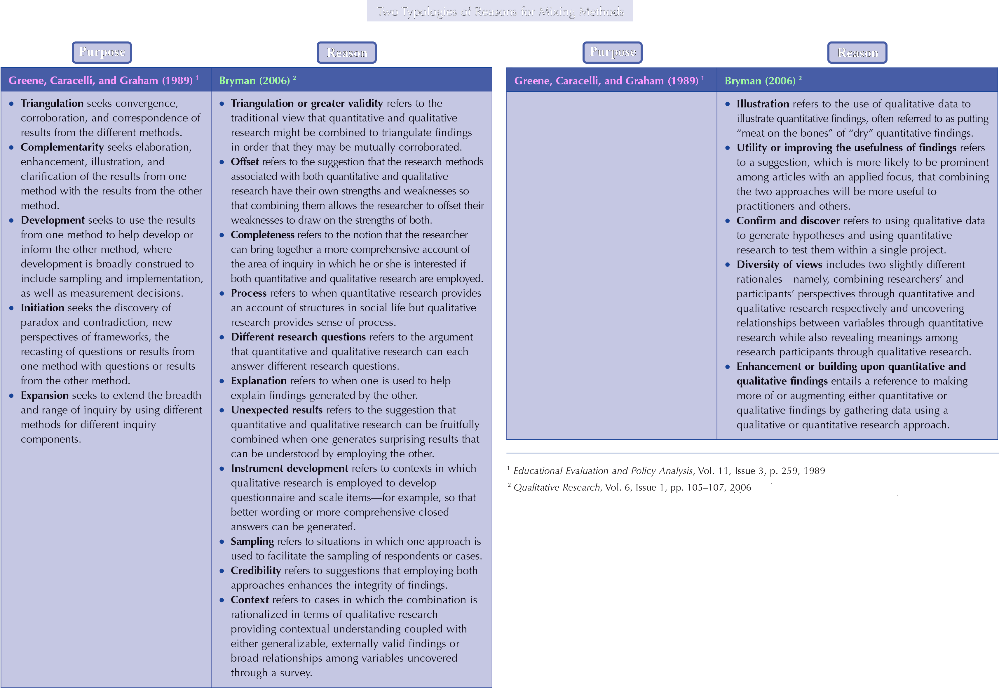

<script src="https://ajax.googleapis.com/ajax/libs/jquery/3.6.0/jquery.min.js"></script>

<link rel="stylesheet" href="https://cdnjs.cloudflare.com/ajax/libs/font-awesome/5.15.4/css/all.min.css" />

<link href='https://fonts.googleapis.com/css?family=Roboto Condensed' rel='stylesheet'>

<script type="text/x-mathjax-config">
MathJax.Hub.Register.StartupHook("TeX Jax Ready",function () {
  MathJax.Hub.Insert(MathJax.InputJax.TeX.Definitions.macros,{
    cancel: ["Extension","cancel"],
    bcancel: ["Extension","cancel"],
    xcancel: ["Extension","cancel"],
    cancelto: ["Extension","cancel"]
  });
});
</script>

<style>
section {
    display: flex;
    display: -webkit-flex;
}


section {
    height: 600px;
    width: 60%;
    margin: auto;
    border-radius: 21px;
    background-color: #212121;
}

section p {
    text-align: center;
    font-size: 30px;
    background-color: #212121;
    border-radius: 21px;
    font-family: Roboto Condensed;
    font-style: bold;
    padding: 12px;
    color: #bff4ee;
    margin: auto;
}

#center {

text-align: center;

}

.center p {
  margin: 0;
  position: absolute;
  top: 50%;
  left: 50%;
  -ms-transform: translate(-50%, -50%);
  transform: translate(-50%, -50%);
}

.center2 {
  margin: 0;
  position: absolute;
  top: 50%;
  left: 50%;
  -ms-transform: translate(-50%, -50%);
  transform: translate(-50%, -50%);
}

.tab {
    display: inline-block;
    margin-left: 40px;
}

td, th, tr, table {
    border: 0 !important;
    border-spacing:0 !important;
  }
</style>

```{css echo=FALSE}
.highlight-last-item > ul > li,
.highlight-last-item > ol > li {
  opacity: 0.5;
}
.highlight-last-item > ul > li:last-of-type,
.highlight-last-item > ol > li:last-of-type {
  opacity: 1;
}
```

```{r setup, include=FALSE, purl=FALSE}
library(tidyverse)
library(knitr)
library(kableExtra)
library(fontawesome)
library(here)
library(clt)
library(showtext)
font_add_google("Roboto Condensed", "roboto")
showtext_auto()
```

```{r echo = FALSE, purl=FALSE}
xaringanthemer::style_duo(
  primary_color = "#212121",
  secondary_color = "#bff4ee",
  table_row_border_color = "#212121",
  table_row_even_background_color = "#212121",
  footnote_font_size = "0.6em",
  header_font_google = xaringanthemer::google_font("Roboto Condensed", "700"),
  text_font_google   = xaringanthemer::google_font("Roboto Condensed", "400")
)

xaringanExtra::use_xaringan_extra(c("tile_view", 
                                    "animate_css", 
                                    "tachyons"))

xaringanExtra::use_logo(
  image_url = here::here("static", "img", "course_hex.png"),
  link_url = "https://edp612.asocialdatascientist.com",
  position = xaringanExtra::css_position(top = "1em", right = "1em")
)

```

---

class: highlight-last-item
layout: true

---

# <span style="color:#A9D18E">Shameless “plug”</span>

EDP 618 Mixing Research Methodologies (Su/Fall 2022)

--

.pull-left[
This course is designed to allow you to acquire an understanding of the choices available for and processes involved in conducting mixed methodological research and evaluation. We will work together to identify potential research questions and/or evaluation foci you are interested in and for which mixed methodological approaches could usefully be applied. We will read and discuss both examples of mixed methodological research and writers discussing important issues to think about when doing mixed methods work. 
]

.pull-right[
Here’s the book we use for EDP 618, and much of what we will discuss today is in there
<br>
<br>
<center>

</center>
]

---

#  Activating prior knowledge 

<span style="color:#A9D18E">Pair-Share Activity<span>

--

- Step 1: Find a partner

--

- Step 2: Discuss your current understanding of what Mixed Methods Research entails and why anyone would want to do it.

  *If you finish this before others, also discuss how Mixed Methods Research 	does or does not seem useful for your own interests.*

--

- Step 3: Co-write a single sentence definition of Mixed Methods Research and 	decide which partner will read it to the class.

--

- Step 4: Read aloud and discuss similarities / differences across definitions.

---

#  Differing Standards Across Research Traditions 

--

<span style="color:#A9D18E">Pair-Share</span>: What do you know about philosophical foundations, especially epistemologies, related to qualitative and quantitative research traditions?

--

<span style="color:#A9D18E">Whole class</span>: How do you see these fitting together (or not) in mixed methodological research?

--

<br>
<br>
<br>
<br>
<br>
<br>
<br>
<br>
.pull-right[
Looking for more depth?
Lincoln & Guba’s (1985) view<br>
[www.socialresearchmethods.net/kb/qualval.php](http://www.socialresearchmethods.net/kb/qualval.php)

More details; some dissension<br>
[http://scholar.lib.vt.edu/ejournals/JTE/v9n1/hoepfl.html](http://scholar.lib.vt.edu/ejournals/JTE/v9n1/hoepfl.html)
]

---

#  A working definition of MMR 

--


Mixed methodological approaches use paradigms, data sources, and/or analytic procedures from both quantitative and qualitative studies in various combinations.

--

<br>
<br>
.pull-right[
Notice that there is a lot of detail NOT specified in this definition: Which paradigms, which data, which analyses, and how might they be combined?
]

---

# Pragmatism side-steps paradigm wars 

--

Inquiries designed to understand “workability” of potential “lines of action” or basis for claims of “warranted assertions”

--

> “Lines of Action” (George Herbert Mead)

> “Workability” (both William James and John Dewey)

> “Warranted assertions” (John Dewey)

--

<br>
<br>
Rather than focus on nature of reality or the possibility of objective truth, focus on “What are the likely consequences of believing or acting on ______?”, and combine elements of qualitative and quantitative approaches to achieve stronger foundations for action.

--

<br>
<br>
.pull-right[
Looking for more depth? Read Morgan (2007) from the very first issue of the *Journal of Mixed Methods Research*<br>
<center>
<a href="downloads/Morgan%20(2007).pdf" target='_blank' download="Morgan (2007)">

</center>
</a>
]

---

#  The Reading: Purposes for mixing 

--

<font size="+2">
Greene, Caracelli , & Graham (1989)
</font>

--

A critical source for understanding the multiplicity of purposes mixed methods research is suited to address. Provides a “language” (actually one of several) for thinking about and describing mixed methods components in your evaluation, your research (dissertation?), and in sources your review.

---

<center>

</center>

---

#  5 Mixed Methods Purposes 

--
  
  **Triangulation** - single phenomenon

--
  
  **Complementarity** - overlapping phenomena

--
  
  **Development** - one method informs the next

--
  
  **Initiation** - seeking paradox / contradiction

--
  
  **Expansion** - study more w/ different methods for different phenomena

---

<center>

</center>

---

#  Sequential Explanatory Example 

--

Way, Stauber, Nakkula, and London (1994) began with quantitative measures of depression and substance use from one suburban and one inner city high schools (*n* = 164 and 242).

--

<br>
<span style="color:yellow">
Authors identified a puzzling finding: Substance use predicted depression at the suburban high school, but not at inner city high school.
</span>

--

<br>
Thematic analysis of 19 qualitative interviews (selected based on quantitative CDI data) allowed authors to describe different meanings of substance use across the two schools.

---

<center>

</center>


---

#  Concurrent Triangulation Example 

Idler, Hudson, and Leventhal (1999), working with 159 elderly African Americans, collected quantitative measures (health ratings, demographics, and medical history) and conducted qualitative interviews about the meanings of their ratings .

--

<br>
<span style="color:yellow">
They initially analyzed the two data sets separately, but after coding the qualitative responses, they transformed qualitative codes into quantitative scores.

--

<br>
Next, they statistically analyzed the quantified qualitative results to determine if initially qualitative responses were related to quantitative ratings.

---

<center>

</center>

---

#  What structural differences do you see? 


<center>
Sequential Explanatory
<br>
<br>

</center>
<br>
<br>


<center>
<br>
Concurrent Triangulation
<br>
<br>

</center>


---

#  What questions do you have for me at this point? 

--

<br>
<br>
<br>
<br>
<br>
<br>
<br>
<br>
<br>
<br>
.pull-right[
Parting Shot: Truly mixed designs optimize potentials for synergy across the entire lifespan of the study, while many designs are only superficially mixed or mixed in name only.
<br>
<br>
Feel free to contact me in the future:<br>
[Reagan.Curtis@mail.wvu.edu](mailto:Reagan.Curtis@mail.wvu.edu)
]

---

# That's It!

--

<br>
<br>
<br>
<br>
<br>
<br>
<br>
<br>
<br>
<center>
<br><br>
<div class="fade_rule"></div>  
<br><br>
</center>

<center>
<a rel="license" href="http://creativecommons.org/licenses/by-nc-sa/4.0/"></a><br /><br />This work is licensed under a <br /><a rel="license" href="http://creativecommons.org/licenses/by-nc-sa/4.0/">Creative Commons Attribution-NonCommercial-ShareAlike 4.0 International License</a>
</center>
