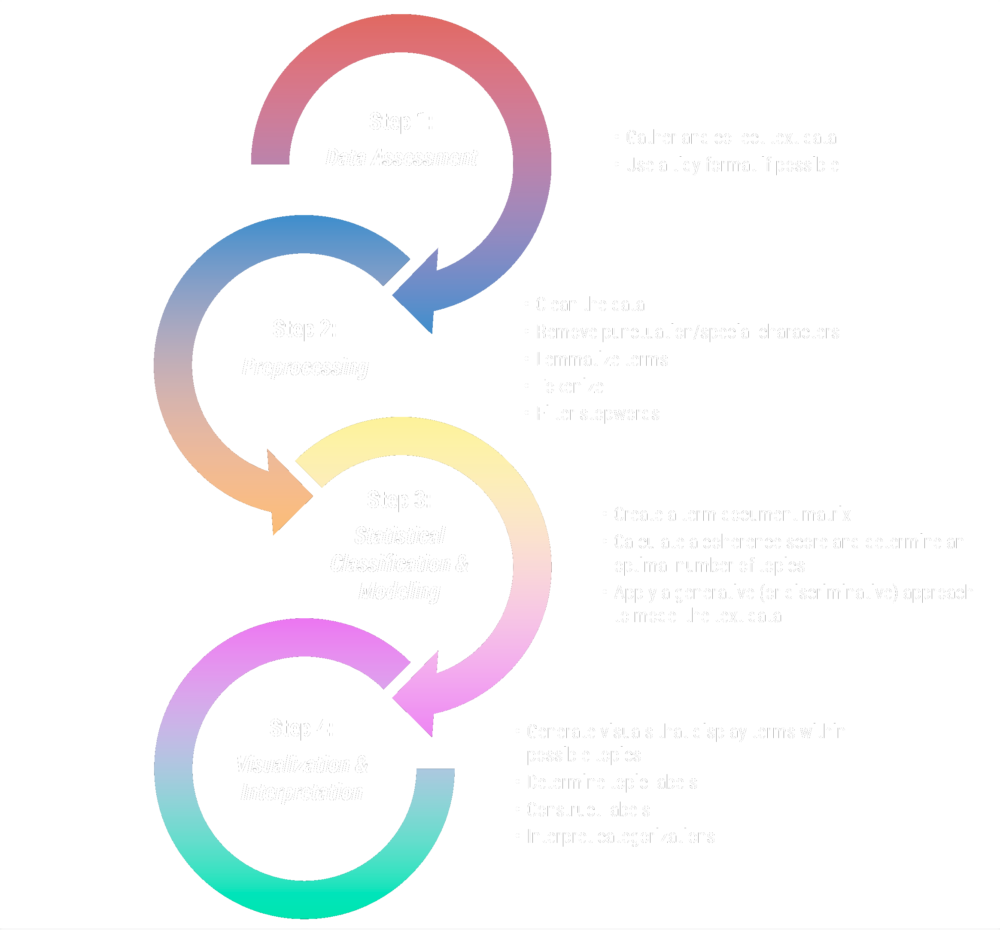
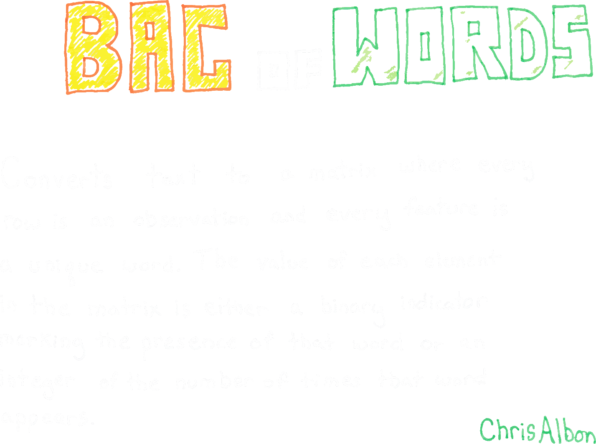
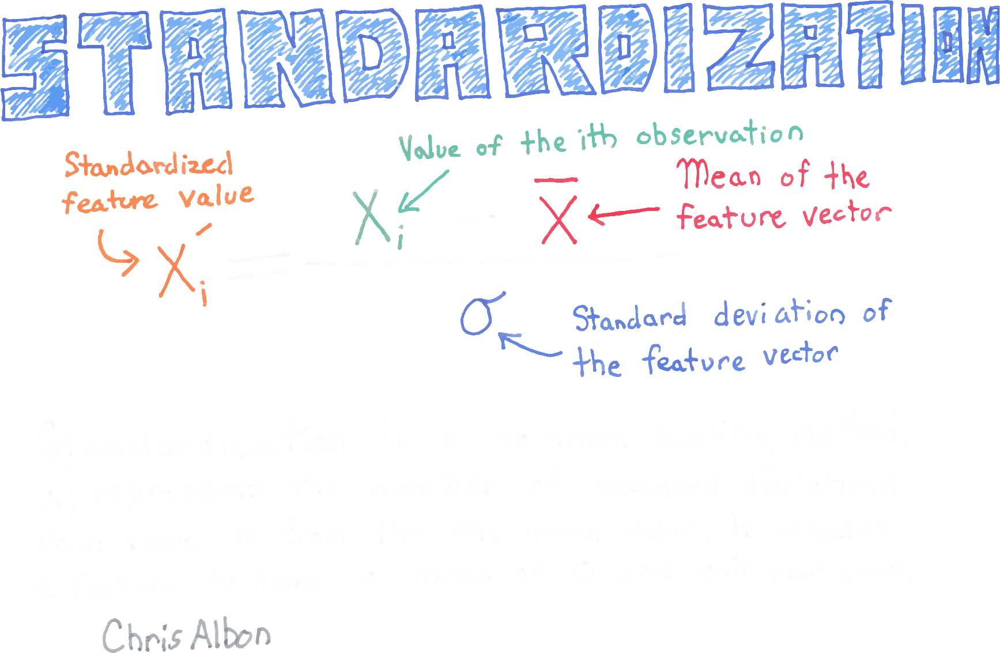
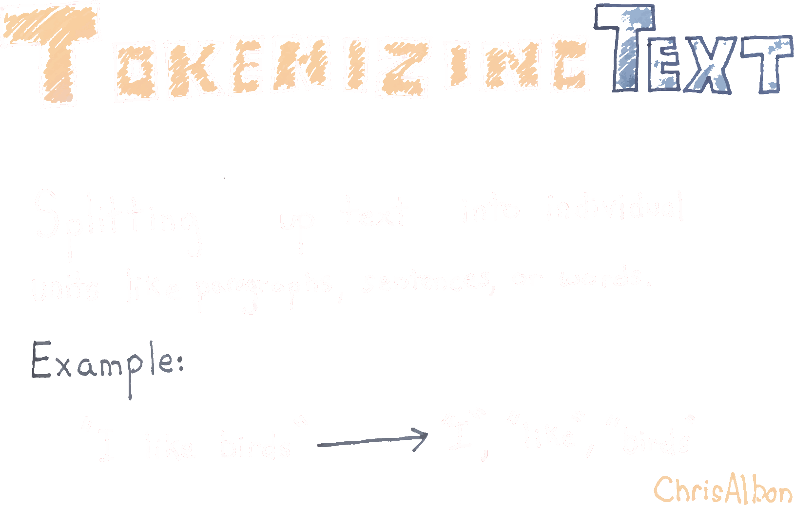
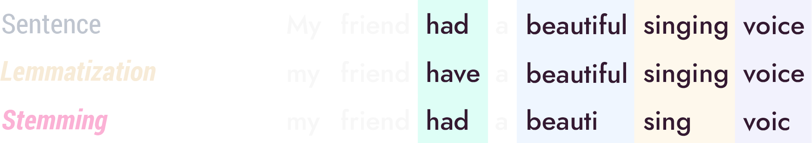

<script>
  function resizeIframe(obj) {
    obj.style.height = obj.contentWindow.document.body.scrollHeight + 'px';
  }
</script>

<script src="https://ajax.googleapis.com/ajax/libs/jquery/3.6.0/jquery.min.js"></script>

<script type="text/x-mathjax-config">
MathJax.Hub.Register.StartupHook("TeX Jax Ready",function () {
  MathJax.Hub.Insert(MathJax.InputJax.TeX.Definitions.macros,{
    cancel: ["Extension","cancel"],
    bcancel: ["Extension","cancel"],
    xcancel: ["Extension","cancel"],
    cancelto: ["Extension","cancel"]
  });
});
</script>

<style>
section {
    display: flex;
    display: -webkit-flex;
}

section {
    height: 600px;
    width: 60%;
    margin: auto;
    border-radius: 21px;
    background-color: #212121;
}

.remark-slide-container {
background: #212121;
}

.hljs-github .hljs {
    background: transparent;
    color: #b2dfdb;
}

.hljs-github .hljs-keyword {
    color: #64b5f6;
}

.hljs-github .hljs-literal {
    color: #64b5f6;
}

.hljs-github .hljs-number {
    color: #64b5f6;
}

.hljs-github .hljs-string {
    color: #b7b3ef;
}


.hljs-github .hljs {
    background: transparent;
    color: #b2dfdb;
}

.hljs-github .hljs-keyword {
    color: #64b5f6;
}

.hljs-github .hljs-literal {
    color: #64b5f6;
}

.hljs-github .hljs-number {
    color: #64b5f6;
}

.hljs-github .hljs-string {
    color: #b7b3ef;
}

section p {
    text-align: center;
    font-size: 30px;
    background-color: #212121;
    border-radius: 21px;
    font-family: Roboto Condensed;
    font-style: bold;
    padding: 12px;
    color: #bff4ee;
    margin: auto;
}

#center {
text-align: center;
}

#right {
  text-align: right;
} 

.center p {
  margin: 0;
  position: absolute;
  top: 50%;
  left: 50%;
  -ms-transform: translate(-50%, -50%);
  transform: translate(-50%, -50%);
}

.center2 {
  margin: 0;
  position: absolute;
  top: 50%;
  left: 50%;
  -ms-transform: translate(-50%, -50%);
  transform: translate(-50%, -50%);
}

.tab {
    display: inline-block;
    margin-left: 40px;
}

.obr
{
    display:block;
    margin-top:-15px;
}

.container {
  display: flex;
}

.container > div {
  flex: 1; /*grow*/
  margin-right: 40px;
}

td, th, tr, table {
    border: 0 !important;
    border-spacing:0 !important;
    overflow-x: hidden;
    overflow-y: hidden;
    background-color: unset !important;
    color: unset !important;
  }

tbody > td > tr:hover {
      background-color: unset !important;
      color: unset !important;
  }
  
.remarkwidth code[class="remark-code"] {
	white-space: pre-wrap;
	padding-left:a 1.85em;
	text-indent: -1.85em;
}

.left-code {
  color: #777;
  width: 60%;
  height: 92%;
  float: left;
}
.right-plot {
  width: 38%;
  float: right;
  padding-left: 1%;
}
</style>

```{css echo=FALSE}
.highlight-last-item > ul > li,
.highlight-last-item > ol > li {
  opacity: 0.5;
}
.highlight-last-item > ul > li:last-of-type,
.highlight-last-item > ol > li:last-of-type {
  opacity: 1;
}
```


```{r echo = FALSE, purl=FALSE}
xaringanthemer::style_duo(
  primary_color = "#212121",
  secondary_color = "#bff4ee",
  link_color = "#b1ead6",
  text_bold_color = "#4dc6e2",
  table_row_border_color = "#212121",
  table_row_even_background_color = "#212121",
  footnote_font_size = "0.6em",
  header_font_google = xaringanthemer::google_font("Roboto Condensed", "700"),
  text_font_google   = xaringanthemer::google_font("Roboto Condensed", "400")
)

xaringanExtra::use_xaringan_extra(c("tile_view", 
                                    "animate_css", 
                                    "tachyons"))

xaringanExtra::use_logo(
  image_url = here::here("static", "img", "course_hex.png"),
  link_url = "https://edp618.asocialdatascientist.com",
  position = xaringanExtra::css_position(top = "1em", right = "1em")
)
```

```{r setup, include=FALSE, purl=FALSE}
library(tidyverse)
library(knitr)
library(kableExtra)
library(fontawesome)
library(patchwork)
library(flipbookr)
library(here)
library(showtext)
font_add_google("Roboto Condensed", "roboto")
showtext_auto()

suppressMessages(library(tidyverse))
suppressMessages(library(tidytext))
suppressMessages(library(tm))
suppressMessages(library(textclean))
suppressMessages(library(topicmodels))
suppressMessages(library(ldatuning))
suppressMessages(library(stopwords))
suppressMessages(library(textstem))
suppressMessages(library(broom))

knitr::opts_chunk$set(echo = TRUE)
options(knitr.table.format = function() {
  if (knitr::is_latex_output()) 'latex' else 'pandoc'
})
```

```{r functions, echo=FALSE}
textcolor <- 
  function(text, color){
  sprintf("<span style='color: %s;'>%s</span>", color, text)
    }
```

# Getting Prepped

---

## Opening a Script Setting the Working Directory

1. Open up RStudio

--

2. Go to `File > New File > R Script`

--

3. Go to `File > Save As` and save the R Script in the same folder as the `csv` file. Name it whatever you want (e.g. **Week 12 R Walkthrough**)

--

4. Run `Week 12 install.R`

--

5. Run the following command in your RStudio console
    ```{r echo = TRUE, eval = FALSE}
    setwd(dirname(rstudioapi::getActiveDocumentContext()$path))
    ```

---

## Loading Packages

--

1. Please load up the following packages by placing these at the top of your script<br>
    ```{r echo = TRUE, eval = FALSE}
    library(tidyverse)
    library(tidytext)
    library(tm)
    library(textclean)
    library(topicmodels)
    library(ldatuning)
    library(stopwords)
    library(textstem)
    library(broom)
    ```  
.footnote[Alternatively if you have the **pacman** package, run `pacman::p_install("tidyverse", "tidytext", "tm", "textclean", "topicmodels", "ldatuning", "stopwords", "textstem", "broom")`]

--

2. You may also want to put 
    ```{r echo = TRUE, eval = FALSE}
    setwd(dirname(rstudioapi::getActiveDocumentContext()$path))
    ```
    below the library list so its there

---

# Before We Begin

--

This is the process we'll cover lightly. There is a lot more going on under the hood and you may not be able to recognize all of the terms, but if you can get a basic understanding of the process, the rest can be filled in by conducting a topic model!

<center>
</a>
</center>

---

Additionally here are a few things we won't be covering in this session so please read over the areas you lack familiarity with. Given that, it is absolutely fine if you cannot fully understand all of these ideas right now - they will hopefully become apparent as we progress

--

.pull-left[
<center>
</a>
</center>
]

--

.pull-right[
<center>
</a>
</center>
]

--

<br>
.pull-left[
<center>
</a>
</center>
]

--

.pull-right[
<center>
</a>
</center>
]

---

## Assessing Data 

--

1. You can retrieve both the *exercising with dogs* data set and `r fa("r-project", fill = "steelblue")` *script* by clicking on the icon below<br>
<br>
<center>
<a href="files/topic_modeling_files.zip" target='_blank' download="Topic Modeling Files">
</a>
</center>

--

2. Bring in the pdf data using
    ```{r}
    exwdogs <- 
      pdftools::pdf_text("exercising_with_dogs.pdf")
    ```
  
--
  
3. Load up the stopwords using
    ```{r}
    data("stop_words")
    ```

--

.footnote[Take a look at the various types of files that can be imported in the tidyverse <a href="files/data-import.pdf" target='_blank' download="Data import with the tidyverse">
</a>]

---

# *Topic Modeling*

--

.center2[<i>A type of probabilistic statistical model for (a) discovering the abstract "topics" - or hidden semantic structures - that occur in a collection of documents and (b) dimensionality reduction</i>]


---

### The Most Annoying Thing About Data

--

.center2[<b>The 80/20 Rule</b><sup>1</sup>: <i>Most data scientists spend only 20 percent of their time on actual data analysis and 80 percent of their time finding, cleaning, and reorganizing huge amounts of data</i>]

.footnote[<sup>1</sup> Loosely based on an idea called **Pareto's Principle** which states that *roughly 80% of outcomes come from 20% of causes*]

---

.center2[<b><span style = "font-size:2.75rem">Step 1: Assessing Data</span></b>]

---

1. Take a look at the data set and think about categorizing terms that may skew how terms are assessed

--

.pull-left[<span class = "tab">the names of the dogs are not important so we could replace all of them simply with the word <b>dog</b></span>]

--

.pull-right[<span class = "tab">canines are prevalent in the data so we could Remove the word <s><b>dog</b></s> altogether</span>]
<br>

--

<ol start="2">
<li> Open up an empty text document and try going through on your own to consider terms that could be collapsed
</ol>

--

<ol start="3">
<li> Open up <span style="font-family:'Source Code Pro'; color:#b7b3ef">Week 12 script.R</span>
</ol>

---

.center2[<b><span style = "font-size:2.75rem">Step 2: Preprocessing</span></b>]

---

<span style = "font-size:1.75rem;"><b>Cleaning</b> Raw Text</b></span>

---

```{r sw1a, include = FALSE}
exwdogs %>%
read_lines() %>% # Parse text into individual lines
as_tibble_col("text") %>% # Create a single tidy column
slice(24:n()) %>% # Remove unnecessary text
mutate(text = textclean::replace_non_ascii(text)) %>% # Convert to a standard format
mutate(text = str_to_lower(text)) %>% # Convert all words to lower case
mutate(text = str_remove_all(text, "[[:digit:]]")) %>% # Remove all numbers
mutate(text = str_remove_all(text, "[[:punct:]]")) %>% # Remove all punctuation
mutate(text = str_remove_all(text, "stage")) %>% # Remove term
mutate(text = str_replace_all(text, "sri ranganatha temple", "temple")) %>% # Replace term
mutate(text = str_replace_all(text, "shakti", "dog")) %>% # Replace term
mutate(text = str_replace_all(text, "foxhounds", "dog")) %>% # Replace term
mutate(text = str_replace_all(text, "swami", "dog")) %>% # Replace term
mutate(text = str_replace_all(text, "max", "dog")) %>% # Replace term
mutate(text = lemmatize_strings(text)) %>% # Lemmatize term
mutate(text = str_remove_all(text, c("dog"))) %>% # Remove term
mutate(text = str_remove_all(text, c("human"))) %>% # Remove term
mutate(text = str_squish(text)) %>% # Remove whitespace
mutate(text = na_if(text, "")) %>% # Replace blanks with NA
drop_na() # Drop all columns with NA
```
`r chunk_reveal(chunk_name = "sw1a", color = c("white", "white", "white"), width = c(200,0), float = "top")`

---

### Assigning a Variable 

Let's save the entire cleaning process 

```{r}
exwdogs_cleaned <-
  exwdogs %>%
  read_lines() %>%
  as_tibble_col("text") %>%
  slice(24:n()) %>%
  mutate(text = textclean::replace_non_ascii(text)) %>%
  mutate(text = str_to_lower(text)) %>%
  mutate(text = str_remove_all(text, "[[:digit:]]")) %>%
  mutate(text = str_remove_all(text, "[[:punct:]]")) %>%
  mutate(text = str_remove_all(text, "stage")) %>%
  mutate(text = str_replace_all(text, "sri ranganatha temple", "temple")) %>%
  mutate(text = str_replace_all(text, "shakti", "dog")) %>%
  mutate(text = str_replace_all(text, "foxhounds", "dog")) %>%
  mutate(text = str_replace_all(text, "swami", "dog")) %>%
  mutate(text = str_replace_all(text, "max", "dog")) %>%
  mutate(text = lemmatize_strings(text)) %>%
  mutate(text = str_remove_all(text, c("dog"))) %>%
  mutate(text = str_remove_all(text, c("human"))) %>%
  mutate(text = str_squish(text)) %>%
  mutate(text = na_if(text, "")) %>%
  drop_na()
```

---

### What Just Happened?

--

Let's try doing something similar but with shorter and simpler text taken from the very funny skit [Sharknado Pitch Meeting](https://youtu.be/CYootnc0uew)

```{r}
example_text <- 
  c("Excerpt from Sharknado Pitch Meeting. 
     Creator: Ryan George. 
    
     (1) It’s peer reviewed. 
     (2) Multiple scientists looked over that and approved of it? 
     (3) No some drunk guy on the pier checked it out. He loved it!
     (4) That is technically peer reviewed. I think we’re good.
    
     --The End--
    ")
```

---

1. Take a look at the raw text data
.remarkwidth[
```{r}
example_text
```
]

--

2. Then we wrangle using a very similar process 

---

```{r sw1b, include = FALSE}
example_text %>%
  read_lines() %>% # Parse text into individual lines
  as_tibble_col("text") %>% # Create a single tidy column
  slice(4:n()) %>% # Remove unnecessary text
  mutate(text = textclean::replace_non_ascii(text)) %>% # Convert to a standard format
  mutate(text = str_to_lower(text)) %>% # Convert all words to lower case
  mutate(text = str_remove_all(text, "[[:digit:]]")) %>% # Remove all numbers
  mutate(text = str_remove_all(text, "[[:punct:]]")) %>% # Remove all punctuation
  mutate(text = str_remove_all(text, "the end")) %>% # Remove term
  mutate(text = str_replace_all(text, "multiple scientists", "scientists")) %>% # Replace term
  mutate(text = str_replace_all(text, "its", "paper")) %>% # Replace term
  mutate(text = str_replace_all(text, "it", "paper")) %>% # Replace term
  mutate(text = str_replace_all(text, "that", "paper")) %>% # Replace term
  mutate(text = lemmatize_strings(text)) %>% # Lemmatize term
  mutate(text = str_remove_all(text, c("paper"))) %>% # Remove term
  mutate(text = str_squish(text)) %>% # Remove whitespace
  mutate(text = na_if(text, "")) %>% # Replace blanks with NA
  drop_na() # Drop all columns with NA
```
`r chunk_reveal(chunk_name = "sw1b", color = c("white", "white", "white"), width = c(200,0), float = "top")`


---

<span style = "font-size:1.75rem"><b>Normalization</b> of Remaining Wording</span>

--


> is used to reduce word randomness which allows some level of standardization to help to reduce the amount of different information that a computer has to process therefore improving efficiency

--

> the overall goal is to reduce inflectional forms and sometimes derivationally related forms of a word to a common base form

--

> two popular normalization techniques are <span style="color:#f5ebd9; font-weight:bold; font-style:italic;">lemmatization</span> and <span style="color:#f0b5d3; font-weight:bold; font-style:italic;">stemming</span>

---

## <span style="color:#f5ebd9; font-weight:bold; font-style:italic;">Lemmatization</span> vs. <span style="color:#f0b5d3; font-weight:bold; font-style:italic;">Stemming</span>

--

<br>
<br>
.pull-left[
<p id="center" style="color:#f5ebd9; border:1px; border-style:solid; border-color:#f5ebd9; border-radius: 25px; padding: 0.3em; margin-top: -6px">
<span style = "font-weight:bold; font-style:italic;">Lemmatization</span><br><br>
the process of reducing words to their base word<br><br>
(takes more time)
</p>
]

--

.pull-right[
<p id="center" style="color:#f0b5d3; border:1px; border-style:solid; border-color:#f0b5d3; border-radius: 25px; padding: 0.3em; margin-top: -6px">
<span style = "font-weight:bold; font-style:italic;">Stemming</span><br><br>
the process of reducing words to their word stem or root form by removing word endings or other affixes<br><br>
(takes less time)
</p>
]

--

<br>
.pull-left[
<p id="center" style="color:#f5ebd9; border:1px; border-style:solid; border-color:#f5ebd9; border-radius: 25px; padding: 0.3em; margin-top: -6px">
<i>Example</i><br><br>
the term <i>better</i> has the lemma <i>good</i>
</p>
]

--

.pull-right[
<p id="center" style="color:#f0b5d3; border:1px; border-style:solid; border-color:#f0b5d3; border-radius: 25px; padding: 0.3em; margin-top: -6px">
<i>Example</i><br><br>
the term <i>flooding</i> has the stem <i>flood</i>
</p>
]

--

.footnote[For a great rundown of this topic, avoid the syntax and read over [Text Normalization for Natural Language Processing (NLP)](https://towardsdatascience.com/text-normalization-for-natural-language-processing-nlp-70a314bfa646)]

---

<br>
<br>
<br>
<br>
<br>
<br>
<br>
<br>
<center>
</a>
</center>

---

<span style = "font-size:1.75rem"><b>Tokenizing</b> Handled Data</span>

--

.center2[<i>A process of distinguishing and classifying sections of a string of input characters</i>]

--

<br>
<br>
<br>
<br>
<br>
<br>
<br>
<br>
<br>
<br>
<br>
<br>
<br>
<br>
<br>
<br>
<br>
<br>
<br>
<br>
<br>
What you should take from this is that <b>unnesting</b> data successfully is a requirement to be able to **tokenize**. While the next set of commands should look familiar, please consider taking a bit of time to really see what occurs in each step

---

<span style = "font-size:1.75rem"><b>Filtering stopwords</b></span>

---

```{r sw2, include = FALSE}
exwdogs_cleaned %>%
  unnest_tokens(word, text) %>%
  anti_join(stop_words) %>%
  count(word, sort = TRUE) %>%
  add_column(document = 1)
```
`r chunk_reveal(chunk_name = "sw2", color = c("white", "white", "white"), width = c(100,100))`

---

### Assign a Variable

Let's save the tokenized data frame

```{r}
exwdogs_tokens <- 
  exwdogs_cleaned %>%
  unnest_tokens(word, text) %>%
  anti_join(stop_words) %>%
  count(word, sort = TRUE) %>%
  add_column(document = 1)
```

---

.center2[<b><span style = "font-size:2.75rem">Step 3: Statistical Classification and Modeling</span></b>]

---

<span style = "font-size:1.75rem">Creating a <b>Term Document Matrix</b></span>

---

```{r sw3, include = FALSE}
exwdogs_tokens %>%
  cast_dtm(document, word, n)
```
`r chunk_reveal(chunk_name = "sw3", color = c("white", "white", "white"), width = c(100,100), chunk_options = "out.width = '80%', fig.retina=6")`

---

### Assigning a Variable

```{r}
exwdogs_dtm <- 
  exwdogs_tokens %>%
  cast_dtm(document, word, n)
```

---

<span style = "font-size:1.75rem">Calculating <b>Coherence Scores</b></span>

--

.center2[<i>A measure of the degree of semantic similarity between high scoring words in the topic which These measurements help distinguish between topics that are semantically interpretable topics and topics that are artifacts of statistical inference</i>]

---

```{r sw4, include = FALSE}
FindTopicsNumber(
  exwdogs_dtm,
  topics = seq(from = 2, to = 20, by = 1), 
  metrics = c("Griffiths2004", 
              "CaoJuan2009", 
              "Arun2010", 
              "Deveaud2014"),
  method = "Gibbs",
  control = list(seed = 77),
  mc.cores = 2L,
  verbose = TRUE
  ) %>%
  FindTopicsNumber_plot()
```
`r chunk_reveal(chunk_name = "sw4", color = c("white", "white", "white"), width = c(90,110), chunk_options = "out.width = '80%', fig.retina=6")`

---

### Assigning a Variable

.left-code[
```{r topic-est, eval=FALSE}
exwdogs_topic_est <-
  FindTopicsNumber(
  exwdogs_dtm,
  topics = seq(from = 2, to = 20, by = 1), # amend these
  metrics = c("Griffiths2004", 
              "CaoJuan2009", 
              "Arun2010", 
              "Deveaud2014"),
  method = "Gibbs",
  control = list(seed = 77),
  mc.cores = 2L,
  verbose = TRUE
  ) %>%
  FindTopicsNumber_plot()
```
]

--

.right-plot[
```{r topic-est-out, ref.label="topic-est", echo=FALSE, results = FALSE, out.width="90%", fig.retina=6}
```
]

---


.pull-left[
The estimate for a total number of topics can be a lowest single value or range of values. We do this by observing where the metric curves tend to plateau and get as close to each other as possible along the horizontal axis. This is known as a limit<br><br>
From the plot, the metrics symbolized by &#9651; and &#65291; are already diverging from each other. While they may head back towards the horizontal axis in the future, the metrics symbolized by &#9723; and &#9675; look to be the closest between 11 and 15<br><br>
So let's start by modeling 11 topics!
]

.pull-right[
```{r echo=FALSE, message=FALSE, warning=FALSE, results = FALSE, out.width="85%", fig.retina=6}
FindTopicsNumber(
  exwdogs_dtm,
  topics = seq(from = 2, to = 20, by = 1), # amend these
  metrics = c("Griffiths2004", 
              "CaoJuan2009", 
              "Arun2010", 
              "Deveaud2014"),
  method = "Gibbs",
  control = list(seed = 77),
  mc.cores = 2L,
  verbose = TRUE
  ) %>%
  FindTopicsNumber_plot()
```
]

---

<span style = "font-size:1.75rem">Applying a <b>Generative Model</b></span></b>

---

```{r sw5, include = FALSE}
LDA(exwdogs_dtm, 
    k = 11, # Number of topics
    control = list(seed = 1234)) %>%
  tidy(matrix = "beta")
```
`r chunk_reveal(chunk_name = "sw5", color = c("white", "white", "white"), width = c(100,100), chunk_options = "out.width = '80%', fig.retina=6")`

---

### Assigning a Variable 

Let's save the topics list

```{r}
exwdogs_topics <- 
  LDA(exwdogs_dtm, 
      k = 11, # Amend this to test a certain number of topics
      control = list(seed = 1234)) %>%
  tidy(matrix = "beta")
```

---

.center2[<b><span style = "font-size:2.75rem">Step 4: Visualization and Interpretation</span></b>]

---

### Plot the Topics

We'll use the top 10 most impactful terms in each area to fill out each potential topic 
<br>
<br>
<br> 

---

```{r sw6, include = FALSE}
exwdogs_topics %>%
group_by(topic) %>%
slice_max(beta, n = 10) %>% 
ungroup() %>%
arrange(topic, -beta) %>%
mutate(term = reorder_within(term, beta, topic)) %>%
ggplot(aes(beta, term, fill = factor(topic))) +
geom_col(show.legend = FALSE) +
scale_fill_viridis_d() +
facet_wrap(~ topic, scales = "free") +
scale_y_reordered() +
theme_minimal()
```
`r chunk_reveal(chunk_name = "sw6", color = c("white", "white", "white"), width = c(110,90), chunk_options = "out.width = '80%', fig.retina=6")`

---

### Assigning a Variable 

Let's save the plot 

```{r}
exwdogs_top_terms <-
  exwdogs_topics %>%
  group_by(topic) %>%
  slice_max(beta, n = 10) %>% 
  ungroup() %>%
  arrange(topic, -beta) %>%
  mutate(term = reorder_within(term, beta, topic)) %>%
  ggplot(aes(beta, term, fill = factor(topic))) +
  geom_col(show.legend = FALSE) +
  scale_fill_viridis_d() +
  facet_wrap(~ topic, scales = "free") +
  scale_y_reordered() +
  theme_minimal()
```

---

<br>
<br>
```{r echo=FALSE, fig.align = 'center', fig.retina=6, fig.width=12}
exwdogs_top_terms
```

--

.footnote[You can save high (or really any) resolution visuals easily using [`ggsave`](https://sscc.wisc.edu/sscc/pubs/using-r-plots/saving-plots.html)]
---

### What Just Happened?

--

> LDA is a form of (unsupervised) learning that views documents as bags-of-words (BoW) where order does not matter. Not having to track the placement of every term saves a lot of time and computational energy

--

> LDA works by first making a key assumption: the way a document was generated was by picking a set of topics and then for each topic picking a set of words

---

### Steps to Finding Topics

In a nutshell for each document $m$

--

1. Assume there are $k$ topics across all of the documents

--

2. Create a distribution $\alpha$ where the $k$ topics are symmetric or asymmetrically spread across each document $m$ by assigning each word a topic

--

3. For each word $w$ in every document $m$, assume its topic is is associated incorrectly but every other word is assigned the correct topic

--

4. Probabilistically assign word $w$ a topic based on two things:
    - what topics are in document $m$
    
    - Create a distribution $\beta$ to assess how many times word $w$ has been assigned a particular topic across all of the documents
    
--

5. Repeat this process a number of times for each document until saturation

---

## Interpret

--

> Much like you would assess a factor or component, the topics are unlabeled and it is up to you to figure out what they could mean. Not every topic may be directly applicable, but should still be interpreted and reported. Discarding topics means that you are removing potentially relevant information

---

Here is a brief assessment of some possible topics that are represented in the topic model with reference to *dogs*

<center>
```{r echo=FALSE}
tibble(
  
  Topic <- c(1,2,3,4,5,6,7,8,9,10,11),
  
  Label <- c("assessing humans' emotional states",
             "adressing the needs of crying people",
             "eye contact between humans and dogs",
             "ability to care for humans",
             "aptitude to sense others emotional states without being physcially present",
             "physically removing emotional artifacts",
             "ability to read the world through smell",
             "skill in refocusing attention on them",
             "need for physical touch",
             "focusing attention via the use of staring",
             "senses and responses affect on emotional states"
             )
  ) %>%
  kbl(format = "html",
      escape = FALSE,
      align = 'cl') %>%
  kable_paper(full_width = FALSE) %>%
  column_spec(1, width = "20em", color = "#ffffff", extra_css = 'vertical-align: middle !important;') %>%
  column_spec(2, width = "30em", color = "#ffffff", extra_css = 'vertical-align: middle !important;') %>%
  row_spec(0, color = "#ffffff", extra_css = 'vertical-align: middle !important;')
```
</center>

--

.footnote[Your assessment would likely differ to varying degrees and that is the point - in that qualitative concepts such as triangulation and saturation still play a large and impactful role in the interpretation phase. Note with a much larger text data set, this task could be significantly easier]

---

#  That’s It! 

Any questions?

--

<br>
<br>
<br>
<br>
<br>
<br>
<br>
<br>
<center>
<br><br>
<div class="fade_rule"></div>  
<br><br>
</center>

<center>
<a rel="license" href="http://creativecommons.org/licenses/by-nc-sa/4.0/"></a><br /><br />This work is licensed under a <br /><a rel="license" href="http://creativecommons.org/licenses/by-nc-sa/4.0/">Creative Commons Attribution-NonCommercial-ShareAlike 4.0 International License</a>
</center>
