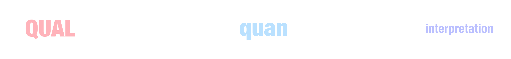
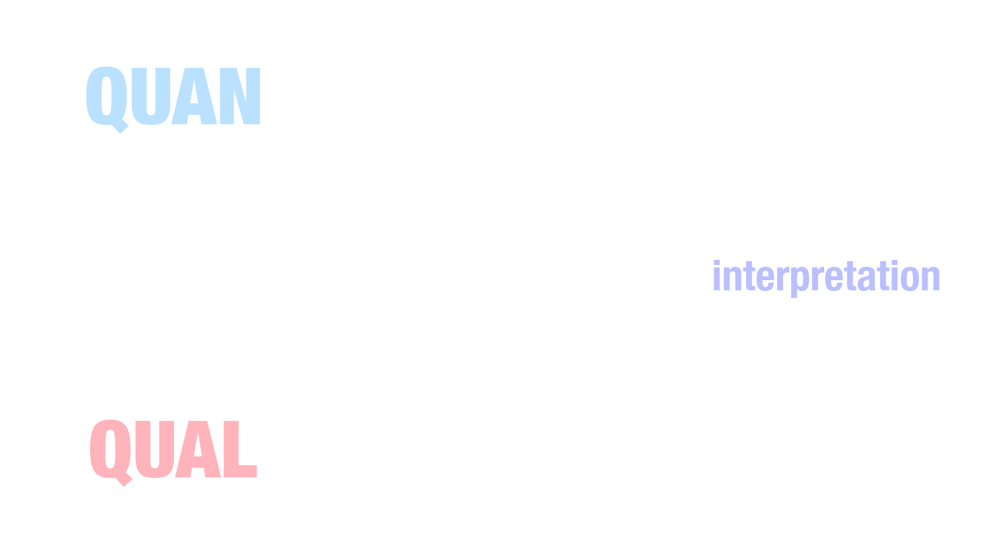

<script src="https://ajax.googleapis.com/ajax/libs/jquery/3.6.0/jquery.min.js"></script>

<script type="text/x-mathjax-config">
MathJax.Hub.Register.StartupHook("TeX Jax Ready",function () {
  MathJax.Hub.Insert(MathJax.InputJax.TeX.Definitions.macros,{
    cancel: ["Extension","cancel"],
    bcancel: ["Extension","cancel"],
    xcancel: ["Extension","cancel"],
    cancelto: ["Extension","cancel"]
  });
});
</script>

<style>
section {
    display: flex;
    display: -webkit-flex;
}

section {
    height: 600px;
    width: 60%;
    margin: auto;
    border-radius: 21px;
    background-color: #212121;
}

.remark-slide-container {
background: #212121;
}

.hljs-github .hljs {
    background: transparent;
    color: #b2dfdb;
}

.hljs-github .hljs-keyword {
    color: #64b5f6;
}

.hljs-github .hljs-literal {
    color: #64b5f6;
}

.hljs-github .hljs-number {
    color: #64b5f6;
}

.hljs-github .hljs-string {
    color: #b7b3ef;
}


.hljs-github .hljs {
    background: transparent;
    color: #b2dfdb;
}

.hljs-github .hljs-keyword {
    color: #64b5f6;
}

.hljs-github .hljs-literal {
    color: #64b5f6;
}

.hljs-github .hljs-number {
    color: #64b5f6;
}

.hljs-github .hljs-string {
    color: #b7b3ef;
}

section p {
    text-align: center;
    font-size: 30px;
    background-color: #212121;
    border-radius: 21px;
    font-family: Roboto Condensed;
    font-style: bold;
    padding: 12px;
    color: #bff4ee;
    margin: auto;
}

#center {
text-align: center;
}

#right {
  text-align: right;
} 

.center p {
  margin: 0;
  position: absolute;
  top: 50%;
  left: 50%;
  -ms-transform: translate(-50%, -50%);
  transform: translate(-50%, -50%);
}

.center2 {
  margin: 0;
  position: absolute;
  top: 50%;
  left: 50%;
  -ms-transform: translate(-50%, -50%);
  transform: translate(-50%, -50%);
}

.tab {
    display: inline-block;
    margin-left: 40px;
}
</style>

```{css echo=FALSE}
.highlight-last-item > ul > li,
.highlight-last-item > ol > li {
  opacity: 0.5;
}
.highlight-last-item > ul > li:last-of-type,
.highlight-last-item > ol > li:last-of-type {
  opacity: 1;
}
```

```{r setup, include=FALSE, purl=FALSE}
library(tidyverse)
library(knitr)
library(kableExtra)
library(fontawesome)
library(here)
library(showtext)
font_add_google("Roboto Condensed", "roboto")
showtext_auto()
```

```{r echo = FALSE, purl=FALSE}
xaringanthemer::style_duo(
  primary_color = "#212121",
  secondary_color = "#bff4ee",
  table_row_border_color = "#212121",
  table_row_even_background_color = "#212121",
  footnote_font_size = "0.6em",
  header_font_google = xaringanthemer::google_font("Roboto Condensed", "700"),
  text_font_google   = xaringanthemer::google_font("Roboto Condensed", "400")
)

xaringanExtra::use_xaringan_extra(c("tile_view", 
                                    "animate_css", 
                                    "tachyons"))

xaringanExtra::use_logo(
  image_url = here::here("static", "img", "course_hex.png"),
  link_url = "https://edp618.asocialdatascientist.com",
  position = xaringanExtra::css_position(top = "1em", right = "1em")
)

```

```{r echo=FALSE}
image_link <- function(image,url,...){
  htmltools::a(
    href=url,
    htmltools::img(src=image,...)
    )
}
```

---

class: highlight-last-item
layout: true

---

#  Readings

--

1. Find a partner

--

2. Discuss 

  + your current understanding of what Mixed Methods Research entails and why anyone would want to do it

  + when Mixed Methods Research does or does not seem useful 

--

3. Come to a consensus and 

  + co-write a single sentence definition of Mixed Methods Research and decide which partner will read it to the class

  + draw a picture of your description

--

4. Submit your work to <a href="https://edp618fall2022.slack.com/archives/C03UGNU6UFQ" target="_blank" style='color:#ff8384;'>#in-class-work</a> on Slack and be ready to discuss

---

#  Its About Triangulation 

<i>Using multiple approaches, data sets, methods, theories, investigators, etc to increase the validity and credibility of  research findings</i>

  > By <b>data source</b> - multiple data collection points

--

  > By <b>researcher</b> – multiple researchers

--

  > By <b>theory</b> – multiple researchers with different theoretical perspectives

--

  > By <b>method</b> – multiple methods

.pull-right[
<center>
Looking for more detail? Look over Luttrell (2005)<br><br>&nbsp;&nbsp;&nbsp;&nbsp;&nbsp;&nbsp;&nbsp;&nbsp;<a href="https://edp612.asocialdatascientist.com/handouts/Luttrell%20(2005).pdf" target='_blank' download="Luttrell (2005)">

</a>
<center>
<br>
]

--

  > By <b>verification</b> – member checking, inquiry audit

--

  > By <b>examination of subjectivity</b> – researcher journaling, inquiry audit


---

#  Working Definition of Mixed Methods Research

--

Mixed methodological approaches use paradigms, data sources, and/or analytic procedures from both quantitative and qualitative studies in various combinations.

--

<br>
<br>
<br>
<br>
<br>
<br>
<br>
<br>
<br>
.pull-right[
Notice that there is a lot of detail NOT specified in this definition like
  - assumptions, 
  - data types
  - models
  - modes of analyses
  - a description of the mixing process
]

--

<br>
<br>
.pull-left[
<span style="text-align: center; display: inline-block; width: 100%;"><span style="display: inline-block;">Rather than focus on nature of reality or the possibility of objective truth, focus on <br><br><i>What are the likely consequences of believing or acting on</span><br>
<span style="display: inline-block; border-bottom: 1px solid white; width: 200px"></span>,<br> and combine elements of qualitative and quantitative<br> approaches to achieve stronger foundations for action.</i>
</span>
]

---

#  Uses for Standard Mixed Methods Approaches 

--

.pull-left[
<p id="center" style="color:#f5ebd9; font-weight: bold; border:1px; border-style:solid; border-color:#f5ebd9; border-radius: 25px; padding: 0.3em;">
<i>Triangulation</i><br><br>
a single phenomenon
</p>
]

--

.pull-right[
<p id="center" style="color:#f0b5d3; font-weight: bold; border:1px; border-style:solid; border-color:#f5ebd9; border-radius: 25px; padding: 0.3em;">
<i>Complementarity</i><br><br>
overlapping phenomenon
</p>
]

--

<center>
<br>
<p id="center" style="color:#d9f5eb; font-weight: bold; border:1px; border-style:solid; border-color:#f5ebd9; border-radius: 25px; padding: 0.3em; width: 525px;">
<i>Development</i><br><br>
situations where one method informs another
</p>
<br>
</center>

--

.pull-left[
<p id="center" style="color:#99d2dd; font-weight: bold; border:1px; border-style:solid; border-color:#99d2dd; border-radius: 25px; padding: 0.3em;">
<i>Initiation</i><br><br>
finding paradox(es) and/or contradiction(s)
</p>
]

--

.pull-right[
<p id="center" style="color:#e1e1f9; font-weight: bold; border:1px; border-style:solid; border-color:#e1e1f9; border-radius: 25px; padding: 0.3em;">
<i>Expansion</i><br><br>
differing methods to address different phenomena
</p>
]

---

#  Designs

---

## Explanatory

--

<center>

</center>

--

<br>
<br>
<i>Process</i>. qualitative data helps explain or build upon initial quantitative results

--

<br>
.pull-left[
<i>Strengths</i>
<br>
- Single researcher
- Two-phases
- Single or multi-study
- Quantitative oriented
]

--

.pull-right[
<i>Challenges</i>
<br>
- Time consuming
- Positives/negatives in using the same sample
- IRB approval
]

---

## Exploratory

--

<center>

</center>

--

<br>
<br>
<i>Process</i>. starts with qualitative data, to explore a phenomenon, and then builds to a second, quantitative phase

--

<br>
.pull-left[
<i>Strengths</i>
<br>
- Single researcher
- Two-phases
- Single or multi-study
- Qualitative oriented
]

--

.pull-right[
<i>Challenges</i>
<br>
- Time consuming
- Must the same sample
- IRB approval
]

---

## Triangulation

--

<center>

</center>

--

<br>
<br>
<i>Process</i>. implementation of the quantitative and qualitative methods during the same timeframe and with equal weight

--

<br>
.pull-left[
<i>Strengths</i>
<br>
- Time reducing
- Single-phase
- Multi-study
- Quantitative and Qualitative equally represented
- IRB approval
]

--

.pull-right[
<i>Challenges</i>
<br>
- Typically needs multiple researchers
- Different samples are typically needed
- Fragile
]

---

# Create a model

--

1. Find a partner

--

2. Premise. The effect of the pandemic on student learning in a university setting

--

3. Come to a consensus and 

  + Write a research question

  + Come up with a mixed methods design using the *A Short But Not So Short Primer on Mixed Methods Designs* document as a reference
  
  + Outline the methodology and analyses

--

4. Submit your work to <a href="https://edp618fall2022.slack.com/archives/C03UGNU6UFQ" target="_blank" style='color:#ff8384;'>#in-class-work</a> on Slack and be ready to discuss

---

#  That’s It! 

Any questions?

--

<br>
<br>
<br>
<br>
<br>
<br>
<br>
<br>
<center>
<br><br>
<div class="fade_rule"></div>  
<br><br>
</center>

<center>
<a rel="license" href="http://creativecommons.org/licenses/by-nc-sa/4.0/"></a><br /><br />This work is licensed under a <br /><a rel="license" href="http://creativecommons.org/licenses/by-nc-sa/4.0/">Creative Commons Attribution-NonCommercial-ShareAlike 4.0 International License</a>
</center>

