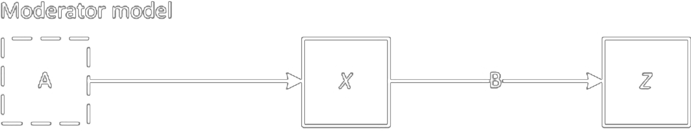
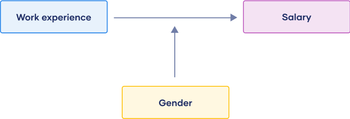
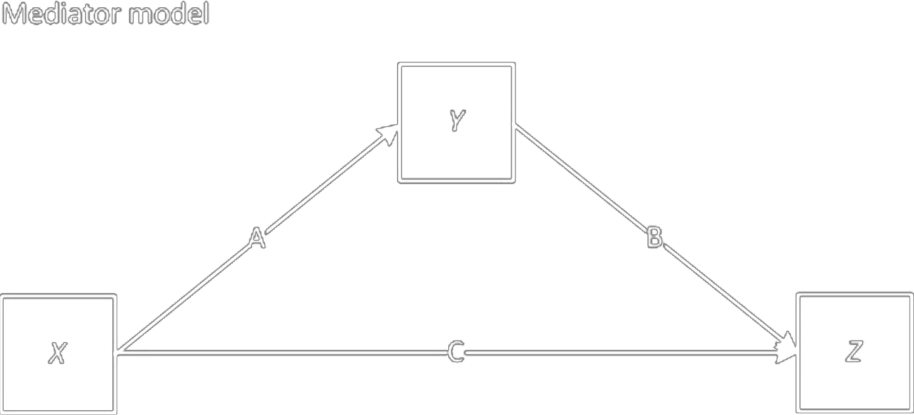
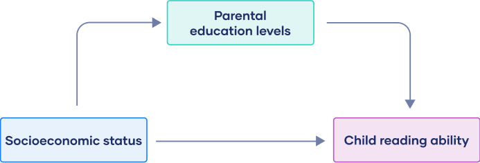

<script src="https://ajax.googleapis.com/ajax/libs/jquery/3.6.0/jquery.min.js"></script>

<script type="text/x-mathjax-config">
MathJax.Hub.Register.StartupHook("TeX Jax Ready",function () {
  MathJax.Hub.Insert(MathJax.InputJax.TeX.Definitions.macros,{
    cancel: ["Extension","cancel"],
    bcancel: ["Extension","cancel"],
    xcancel: ["Extension","cancel"],
    cancelto: ["Extension","cancel"]
  });
});
</script>

<style>
section {
    display: flex;
    display: -webkit-flex;
}

section {
    height: 600px;
    width: 60%;
    margin: auto;
    border-radius: 21px;
    background-color: #212121;
}

section p {
    text-align: center;
    font-size: 30px;
    background-color: #212121;
    border-radius: 21px;
    font-family: Roboto Condensed;
    font-style: bold;
    padding: 12px;
    color: #bff4ee;
    margin: auto;
}

#center {

text-align: center;

}

.center p {
  margin: 0;
  position: absolute;
  top: 50%;
  left: 50%;
  -ms-transform: translate(-50%, -50%);
  transform: translate(-50%, -50%);
}

.center2 {
  margin: 0;
  position: absolute;
  top: 50%;
  left: 50%;
  -ms-transform: translate(-50%, -50%);
  transform: translate(-50%, -50%);
}

.tab {
    display: inline-block;
    margin-left: 40px;
}
</style>

```{css echo=FALSE}
.highlight-last-item > ul > li,
.highlight-last-item > ol > li {
  opacity: 0.5;
}
.highlight-last-item > ul > li:last-of-type,
.highlight-last-item > ol > li:last-of-type {
  opacity: 1;
}
```

```{r setup, include=FALSE, purl=FALSE}
library(tidyverse)
library(knitr)
library(kableExtra)
library(fontawesome)
library(here)
library(clt)
library(showtext)
font_add_google("Roboto Condensed", "roboto")
showtext_auto()
```

```{r echo = FALSE, purl=FALSE}
xaringanthemer::style_duo(
  primary_color = "#212121",
  secondary_color = "#bff4ee",
  table_row_border_color = "#212121",
  table_row_even_background_color = "#212121",
  footnote_font_size = "0.6em",
  header_font_google = xaringanthemer::google_font("Roboto Condensed", "700"),
  text_font_google   = xaringanthemer::google_font("Roboto Condensed", "400")
)

xaringanExtra::use_xaringan_extra(c("tile_view", 
                                    "animate_css", 
                                    "tachyons"))

xaringanExtra::use_logo(
  image_url = here::here("static", "img", "course_hex.png"),
  link_url = "https://edp618.asocialdatascientist.com",
  position = xaringanExtra::css_position(top = "1em", right = "1em")
)

```

```{r echo=FALSE}
image_link <- function(image,url,...){
  htmltools::a(
    href=url,
    htmltools::img(src=image,...)
    )
}
```

```{r eval = TRUE, echo = FALSE, purl=FALSE}
unchecked <- as.character(fontawesome::fa("square", fill = "#b2d8d8"))

checked <- as.character(fontawesome::fa("check", fill = "#ffffff"))
```

<!--
  class: highlight-last-item
layout: true
-->

---

#  Experiments and Causation 

---

#  Cause 

--

+ Variable that produces an effect or result

--

+ Most causes are **inus** - 
	
> A cause is an insufficient (**i**) 

> but non-redundant (**n**) 

> part of an unnecessary (**u**) but

> sufficient condition (**s**)

--

- A given event may have many different causes
	
--

- Many factors are required for an effect to occur, but they can rarely be fully known and how they relate to one another

---

#  Effect 

--

+ Difference between what did happen and what would have happened

--

+ This reasoning generally requires a counterfactual
	
---

#  Counterfactual 

--

+ Knowledge of what would have happened in the absence of a suspected causal agent

--

	+ Physically impossible

--

	+ Impossible to simultaneously receive and not receive a treatment
	
--

	+ Therefore, the central task of all cause-probing research is to approximate the physically impossible counterfactual

---

#  Causal Relationships

--

A causal relationship requires three conditions

--

1. Cause preceded effect (temporal precedence)

--

2. Cause and effect covary

--

3. No other plausible alternative explanations can account for a causal relationship

---

#  Cause, Effect, and Causal Relationships 

--

+ In experiments

--

	+ Presumed causes are manipulated to observe their effect

--

	+ Variability in cause related to variation in an effect

--

	+ Elements of design and extra-study knowledge are used to account for and reduce the plausibility of alternative explanations

---

#  Causation, Correlation, and Confounds 

--

+ Correlation does not prove causation

--

+ Correlations do not meet the first premise of causal logic (temporal precedence)

--

+ Such relationships are often due to a third variable (i.e., a confound)

---

#  Manipulable and Nonmanipulable Causes 

--

+ Experiments involve causal agents that can be manipulated

--

+ Nonmanipulable causes (e.g., ethnicity, gender) cannot be causes in experiments because they cannot be deliberately varied

---

#  Causal Description and Causal Explanation 

--

<br>
<br>
.pull-left[
<p id="center" style="color:#f5ebd9; font-weight: bold; border:1px; border-style:solid; border-color:#f5ebd9; border-radius: 25px; padding: 0.3em;">
<i>Causal description</i><br><br>
identifying that a causal relationship exists between <b>A</b> and <b>B</b>
</p>
]

--

.pull-right[
<p id="center" style="color:#f0b5d3; font-weight: bold; border:1px; border-style:solid; border-color:#f5ebd9; border-radius: 25px; padding: 0.3em;">
<i>Molar causation</i><br><br>
the overall relationship between a treatment package and its effects
</p>
]

--

.pull-left[
<p id="center" style="color:#99d2dd; font-weight: bold; border:1px; border-style:solid; border-color:#99d2dd; border-radius: 25px; padding: 0.3em;">
<i>Causal explanation</i><br><br>
 explaining how <b>A</b> causes <b>B</b>
</p>
]

--

.pull-right[
<p id="center" style="color:#e1e1f9; font-weight: bold; border:1px; border-style:solid; border-color:#e1e1f9; border-radius: 25px; padding: 0.3em;">
<i>Molecular causation</i><br><br>
knowing which parts of a treatment are responsible for which parts of an effect
</p>
]

---

#  Causal Models 

<center>

<center>

---

#  Causal Models 

.pull-left[

]

.pull-right[

]

--

<br>
<br>
.pull-left[

]

.pull-right[

]

---

#  Modern Descriptions of Experiments 

---

#  Randomized Experiment 

--

+ Units are assigned to conditions randomly

--

+ Randomly assigned units are probabilistically equivalent based on expectancy (if certain conditions are met)
	
--

+ Under the appropriate conditions, randomized experiments provide unbiased estimates of an effect

---

#  Quasi-Experiment 

--

+ Shares all features of randomized experiments except assignment

--

+ Assignment to conditions occurs by self-selection

--

+ Greater emphasis on enumerating and ruling out alternative explanations

--

  +  ... through logic and reasoning, design, and measurement

---

#  Natural Experiment 

+ Naturally-occurring contrast between a treatment and comparison condition

--

+ Typically concern nonmanipulable causes

--

+ Requires constructing a counterfactual rather than manipulating one

---

#  Nonexperimental Designs 

+ Often called correlational or passive designs (i.e., cross-sectional)

--

+ Statistical controls often used in place of structural design elements

--

+ Generally do not support strong causal inferences

---

#  Experiments and the Generalization of Causal Connections 

---

#  Most Experiments are Local but have General Aspirations 

--

+ Most experiments are localized

--

+ Limited samples of **utos** 

> units (**u**) 

> treatments (**t**) 

> observations (**o**)

> settings (**s**)

--

+ What Campbell labeled local molar causal validity

---

#  Construct Validity: Causal Generalization as Representation 

--

+ *Premised on generalizing from particular sampled instances of units, treatments, observations, and settings to the abstract, higher order constructs that sampled instances represent*

---

#  External Validity: Causal Generalization as Extrapolation 

--

+ *Inferring a causal relationship to unsampled units, treatments, observations, and settings from sampled instances*

--

+ Enhanced when probability sampling methods are used

--

  + Broad to narrow

--

  + Narrow to broad

---

#  Approaches to Making Causal Generalizations

--

+ Sampling

--

+ Probabilistic

--

+ Heterogeneous instances

--

+ Purposive

--

+ Grounded theory

--

+ Surface similarity

--

+ Ruling out irrelevancies

--

+ Making discrimination

--

+ Interpolation and extrapolation

--

+ Casual explanation

---

# Statistical Conclusion Validity and Internal Validity 


---

#  Validity

--

+ Approximate truthfulness of correctness of an inference

--

+ Not an all or none, either or, condition, rather a matter of degree

--

+ Efforts to increase one type of validity often reduce others

---

#  Statistical Conclusion Validity

--
 

Validity of inferences about the covariation between treatment (**cause**) and outcome (**effect**)

---

#  Internal Validity

--
 
<i>Validity of inferences about whether observed covariation between <b>A</b> (treatment/cause) and <b>B</b> (outcome/effect) reflects a causal relationship from $A$ to $B$ as those variables were manipulated or measured*</i>

---

#  Construct Validity

--

*Validity of inferences about the higher order constructs that represent sampling particulars*

---

#  External Validity 

--

*Validity of inferences about whether a cause-effect relationship holds over variations in units, treatments, observations, and settings*

---

#  Threats to Validity 

--

+ Reasons why an inference may be partly or wholly incorrect

--

+ Design controls can be used to reduce many validity threats, but not in all instances

--

+ Threats to validity are generally context-dependent

---

#  Internal Validity

--

+ *Inferences about whether the observed covariation between $A$ and $B$ reflects a causal relationship from $A$ to $B$ in the form in which the variables were manipulated or measured*

--

+ In most cause-probing studies, internal validity is the primary focus

---

# Threats to Internal Validity: Single-group Studies (1/2)

--

A research team wants to study whether having indoor plants on office desks boosts the productivity of IT employees from a company. The researchers give each of the participating IT employees a plant to place by their desktop for the month-long study. All participants complete a timed productivity task before (pre-test) and after the study (post-test)

---

# Threats to Internal Validity: Single-group Studies (2/2)

--

.pull-left[
**History**. Events occurring concurrently with treatment that could cause the observed effect
]

--

.pull-right[
**Example**. *A week before the end of the study, all employees are told that there will be layoffs. The participants are stressed on the date of the post-test, and performance may suffer*
]

--

.pull-left[
**Maturation**. Naturally occurring changes over time that could be confused with a treatment effect
]

--

.pull-right[
**Example**. *Most participants are new to the job at the time of the pre-test. A month later, their productivity has improved as a result of time spent working in the position*
]

--

.pull-left[
**Instrumentation**. The nature of a measure may change over time or conditions in a way that could be confused with a treatment effect
]

--

.pull-right[
**Example**. *In the pre-test, productivity was measured for 15 minutes, while the post-test was over 30 minutes long*
]

--

.pull-left[
**Testing**. Exposure to a test can affect test scores on subsequent exposures to that test, an occurrence that can be confused with a treatment effect
]

--

.pull-right[
**Example**. *Participants showed higher productivity at the end of the study because the same test was administered. Due to familiarity, or awareness of the study’s purpose, many participants achieved high results*
]

---

#  Threats to Internal Validity: Multi-group Studies (1/2)

--

A researcher wants to compare whether a phone-based app or traditional flashcards are better for learning vocabulary for the SAT. They divide 11th graders from one school into three groups based on baseline (pre-test) scores on vocabulary. For 15 minutes a day, Group A uses the phone-based app, Group B uses flashcards, while Group C spends the time reading as a control. Three months later, post-test measures of vocabulary are taken

---

#  Threats to Internal Validity: Multi-group Studies (2/2)

--

.pull-left[
**Additive and interactive threats**. The impact of a threat can be added to that of another threat or may depend on the level of another threat
]

--

.pull-right[
**Example**. *Groups B and C may resent Group A because of the access to a phone during class. As such, they could be demoralized and perform poorly*
]

--

.pull-left[
**Attrition**. Loss of respondents to treatment or measurement can produce counterfactual effects if that loss is systematically correlated with conditions
]

--

.pull-right[
**Example**. *20% of participants provided unusable data. Almost all of them were from Group C. As a result, it’s hard to compare the two treatment groups to a control group*
]

--

.pull-left[
**Regression**. When units are selected for their extreme scores, they will often have less extreme scores on other variables, an occurrence that can be confused with a treatment effect
]

--

.pull-right[
**Example**. *Because participants are placed into groups based on their initial scores, it’s hard to say whether the outcomes would be due to the treatment or statistical norms*
]

--

.pull-left[
**Selection**. Systematic differences over conditions in respondent characteristics that could also cause the observed effect]

--

.pull-right[
**Example**. *Low-scorers were placed in Group A, while high-scorers were placed in Group B. Because there are already systematic differences between the groups at the baseline, any improvements in group scores may be due to reasons other than the treatment*
]

---

#  Estimating Internal Validity in Experiments 

--

+ By definition randomized experiments eliminate selection through random assignment to conditions

--

+ Most other threats are (should be) probabilistically distributed as well

---

#  Estimating Internal Validity in Experiments

--

+ Only two likely validity threats (typically) arise from experiments

--

  + Attrition

--

	+ Testing

---

#  Estimating Internal Validity in Quasi-Experiments

--

+ Differences between groups tend to be more systematic than random

--

+ All threats should be made explicit and then ruled out one by one
	
--

+ Once identified, threats can be systematically examined

---

#  That’s It! 

Any questions?

--

<br>
<br>
<br>
<br>
<br>
<br>
<br>
<br>
<center>
<br><br>
<div class="fade_rule"></div>  
<br><br>
</center>

<center>
<a rel="license" href="http://creativecommons.org/licenses/by-nc-sa/4.0/"></a><br /><br />This work is licensed under a <br /><a rel="license" href="http://creativecommons.org/licenses/by-nc-sa/4.0/">Creative Commons Attribution-NonCommercial-ShareAlike 4.0 International License</a>
</center>
