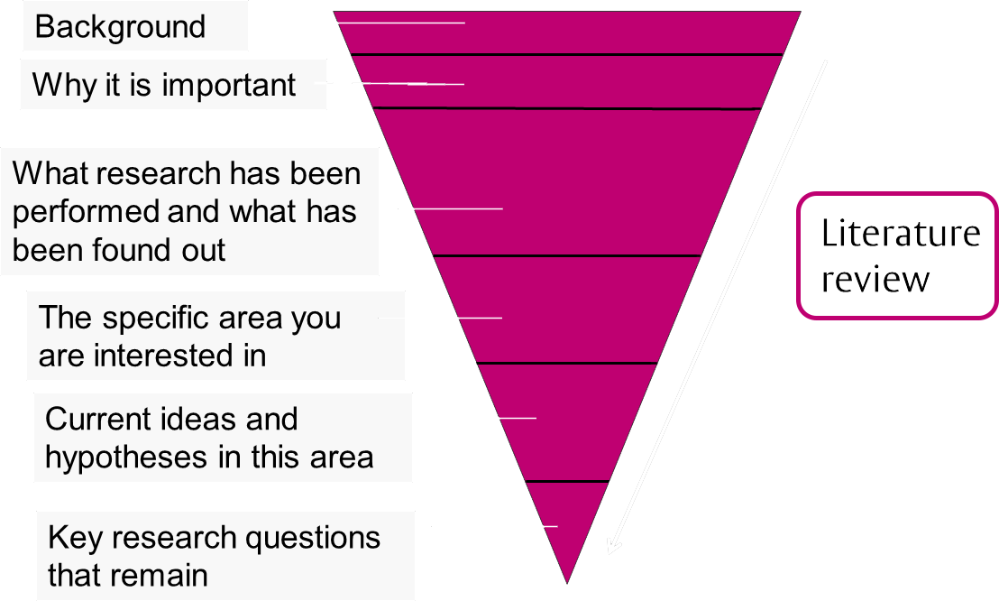
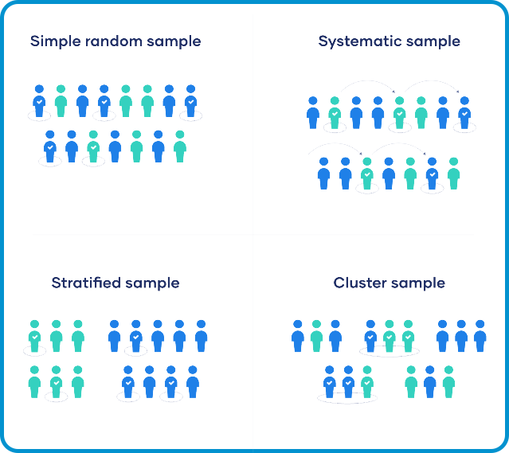
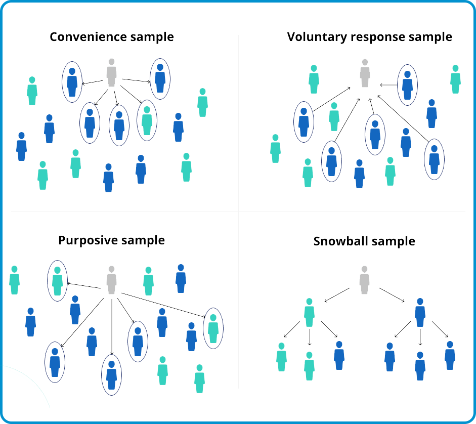

<script src="https://ajax.googleapis.com/ajax/libs/jquery/3.6.0/jquery.min.js"></script>

<script type="text/x-mathjax-config">
MathJax.Hub.Register.StartupHook("TeX Jax Ready",function () {
  MathJax.Hub.Insert(MathJax.InputJax.TeX.Definitions.macros,{
    cancel: ["Extension","cancel"],
    bcancel: ["Extension","cancel"],
    xcancel: ["Extension","cancel"],
    cancelto: ["Extension","cancel"]
  });
});
</script>

<style>
section {
    display: flex;
    display: -webkit-flex;
}

section p {
    margin: auto;
}

section {
    height: 600px;
    width: 60%;
    margin: auto;
    border-radius: 21px;
    background-color: #212121;
}

section p {
    text-align: center;
    font-size: 30px;
    background-color: #212121;
    border-radius: 21px;
    font-family: Roboto Condensed;
    font-style: bold;
    padding: 12px;
    color: #bff4ee;
}

#center {

text-align: center;

}

.center p {
  margin: 0;
  position: absolute;
  top: 50%;
  left: 50%;
  -ms-transform: translate(-50%, -50%);
  transform: translate(-50%, -50%);
}

.center2 {
  margin: 0;
  position: absolute;
  top: 50%;
  left: 50%;
  -ms-transform: translate(-50%, -50%);
  transform: translate(-50%, -50%);
}

.tab {
    display: inline-block;
    margin-left: 40px;
}
</style>

```{css echo=FALSE}
.highlight-last-item > ul > li,
.highlight-last-item > ol > li {
  opacity: 0.5;
}
.highlight-last-item > ul > li:last-of-type,
.highlight-last-item > ol > li:last-of-type {
  opacity: 1;
}
```

```{r setup, include=FALSE, purl=FALSE}
library(tidyverse)
library(knitr)
library(kableExtra)
library(fontawesome)
library(here)
library(DT)
library(scales)
library(latex2exp)
library(rvest)
library(showtext)
font_add_google("Roboto Condensed", "roboto")
showtext_auto()
```

```{r echo = FALSE, purl=FALSE}
xaringanthemer::style_duo(
  primary_color = "#212121",
  secondary_color = "#bff4ee",
  table_row_border_color = "#212121",
  table_row_even_background_color = "#212121",
  footnote_font_size = "0.6em",
  header_font_google = xaringanthemer::google_font("Roboto Condensed", "700"),
  text_font_google   = xaringanthemer::google_font("Roboto Condensed", "400")
)

xaringanExtra::use_xaringan_extra(c("tile_view", 
                                    "animate_css", 
                                    "tachyons"))

xaringanExtra::use_logo(
  image_url = here::here("static", "img", "course_hex.png"),
  link_url = "https://edp612.asocialdatascientist.com",
  position = xaringanExtra::css_position(top = "1em", right = "1em")
)

```

```{r echo = FALSE, eval = TRUE, message=FALSE}
library(tidyverse)
``` 

---

class: highlight-last-item
layout: true

---

#  Plan for the Day 

--

+ Ethics Wrap Up

--

+ Review remaining Ethics Slides

--

+ Facebook Article Discussion

--

+ Literature Matrix Group Discussion

--

+ Getting Started in Research

--

+ Preliminary Ideas Roundtable

---
#  Re: Ethics 


---
#  Facebook Article 


---
#  Literature Matrix Group Discussion 

+ In Groups, review your literature matrix.

--

+ Compare/Contrast notes on articles

--

+ Differences in organization?

--

+ Use for your own Lit Review

---

#  Getting started designing a research project 


---

#  Your own Ideas

--

+ Take a few minutes and consider your own ideas for a research study as we go through the next set of slides:

--

	+ Select a topic to study (maybe what you’re going to do your lit review on)
	
--

	+ Which broad approach do you plan to use (Qualitative, Quantitative)
	
--

	+ Research Purpose Statement

--

	+ 2-3 Research Questions or Hypotheses
	
--

	+ Indented Measures
	
--

	+ Sampling Method

--

+ Prepare to share your initial ideas at the end of class!
<center>

<center>


---

#  Selecting a Research Topic 

Where to get ideas?

--

+ Literature
+ Personal interests
+ Observations
+ Previous research experience

--

+ Narrow your topic
  + Undergraduate research
  + Mentor-Mentee Relationships in UR
  + Disciplinary knowledge transfer between mentors and mentees in UR
	
--

+ Additional Considerations:
  + Researchable?
	+ Significance, Value, Worth?
	+ Has it been done before?

---

#  Lit Review 

+ Goal is to both review research in topic area AND to make it clear why your research questions can add to the field.
--

+ Include seminal studies (landmark studies)

--

+ Synthesize existing literature, do not summarize!

--

<center>

<center>

---
#  Research Purpose, Questions, and Hypotheses  

Research Purpose Statement
+ Purpose and objectives of the study.

--

  + May vary based on approach used (Qual verses Quant)
  
--

Hypotheses & Research Questions

--

+ Hypothesis: predictive relationships between variables (quant)

--

	+ Research Questions: guiding questions of the study
	
--

		+ Quant research – can have both hypotheses and RQs but not always
		
--

		+ Qual – Research questions may be more inductive or open ended.

---
#  Measurement & Variables  

--

+ Categorical Variables
	+ Variables that are able to be sorted into meaningful groups
	+ Student year in school, Race, Binaries (Yes, No; enrolled, not enrolled)
		
--

+ Continuous Variables
  + Rely on progress and preserve meaningful distance between variables
	+ Age, Income, time spent in condition

--

+ Independent Variables
	+ Influences or impacts other variables
		
--

+ Dependent Variable
	+ Affected or influenced by other variables
	+ “depends” on other variables
		
---

# Also...

--

+ Extraneous Variables
	+ May impact data and aren’t controlled for in the study
	+ Covariates

--

	+ May impact the study, so you control for these in your study!

---

#  Sampling 

+ Things to consider:
	+ Who is your population?
	+ Who is the broad group you are interested in that you’re pulling your sample from?
	
--

+ Population: Undergraduate mentors and mentees at R1 institutions.

--

+ Sample: 10 mentor-mentee pairs at R1 university on the mid-East coast.
  + Consider how many participants you might need:
  + Sample size calculators (quantitative research)
  + Reaching saturation (qualitative research)
[calculators](https://www.surveysystem.com/sscalc.htm)

---
#  Sampling 

--

- *Probability Sampling*: Participant selection based on strategy such that population has a known and nonzero chance of being selected. Typically used in quant research. Useful if you are hoping to generalize your findings.

--

- *Purposeful Sampling*: Selecting participants who are the best candidates for the study. Typically used in qualitative research!

--

.pull-left[
<center>

<center>
]

--

.pull-right[
<center>

<center>
]

---

# Your own Ideas

--

+ Take a few minutes and consider your own ideas for a research study:
	
--

	+ Select a topic to study (maybe what you’re going to do your lit review on)
	
--

	+ Which broad approach do you plan to use (Qualitative, Quantitative)
	
--

	+ Research Purpose Statement
	
--

	+ 2-3 Research Questions or Hypotheses
	
--

	+ Indented Measures & Variables
	
--

	+ Sampling Method

---
#  Roundtable 

+ Talk us through your ideas so far!

--

	+ Study purpose, Hypotheses/Research Questions,  Approach (qual or quant), Variables and measures of interest, Sampling

--

	+ Ask each other (and us) questions!

---
#  For Next Week: 

+ Topic: Experimental and Quasi-Experimental Designs

--

	+ Due: L1 - Selecting a Topic and Annotated Bib 
		+ (Similar to what we did in class today!)
		+ Select a topic and describe it in 500 (+/- 50) words
		+ Include an Appendix of the Annotated Bibliography
			+ 5 articles in bibliography
		+ Follow formatting guidelines (APA 7)
		
--

	+ Read:
		+ Leavy Chapter 4, p. 87-93.
		+ Shadish , Cook, & Campbell, Chapter 1
		
---

# Calendar of Tasks

```{r echo=FALSE}
taskitems <- tibble(
  
  task = c("L0",
           "L1",
           "L2",
           "L3",
           "L4",
           "L5",
           "L6"),
  
  description = c("L0: Lit Review Process",
           "L1: Topic Selection & Annotated Bib",
           "L2: Annotated Bibliography",
           "L3: Lit Review First Draft",
           "L4:  Lit Review Second Draft",
           "L5: Lit Review Third Draft",
           "L6: Lit Review Final Version!"),
  
  due = c("Week 3",
          "Week 5",
          "Week 7",
          "Week 9",
          "Week 11",
          "Week 13",
          "Week 15 <sup>1</sup>")
  
)

```

<center>
```{r message=FALSE, warning=FALSE, eval = TRUE, echo = FALSE}
kable(taskitems, 
      col.names = c("", "", ""),
      escape = FALSE,
      align = 'cll') %>%
  kable_styling(full_width = FALSE) %>%
  column_spec(1, width = "5em", color = "#ffffff", extra_css = 'vertical-align: middle !important;') %>%
  column_spec(2, width = "20em", color = "#ffffff", extra_css = 'vertical-align: middle !important;') %>%
  column_spec(3, width = "10em", color = "#ffffff", extra_css = 'vertical-align: middle !important;') 
```
</center>

<a style="font-size:14px;"><sup>1</sup>This is the week of final exams.</a>

---

#  That’s it! 

Any questions?
