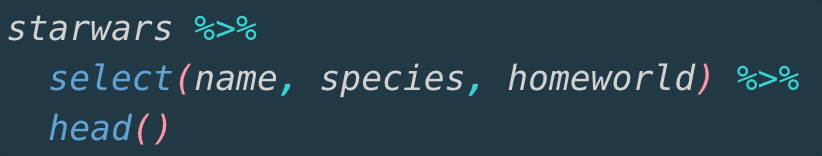

<script>
function resizeIframe(obj) {
    obj.style.height = obj.contentWindow.document.body.scrollHeight + 'px';
  }
</script>

<style>
section {
    display: flex;
    display: -webkit-flex;
}

section p {
    margin: auto;
}

.hljs-github .hljs {
    background: transparent;
    color: #b2dfdb;
}

.hljs-github .hljs-keyword {
    color: #64b5f6;
}

.hljs-github .hljs-literal {
    color: #64b5f6;
}

.hljs-github .hljs-number {
    color: #64b5f6;
}

.hljs-github .hljs-string {
    color: #b7b3ef;
}

section {
    height: 600px;
    width: 60%;
    margin: auto;
    border-radius: 20px;
    background-color: #212121;
}

section p {
    text-align: center;
    font-size: 30px;
    background-color: #212121;
    border-radius: 20px;
    font-family: Roboto Condensed;
    font-style: bold;
    padding: 15px;
    color: #bff4ee;
}

#center {
text-align: center;
}

.center p {
  margin: 0;
  position: absolute;
  top: 50%;
  left: 50%;
  -ms-transform: translate(-50%, -50%);
  transform: translate(-50%, -50%);
}

.center2 {
  margin: 0;
  position: absolute;
  top: 50%;
  left: 50%;
  -ms-transform: translate(-50%, -50%);
  transform: translate(-50%, -50%);
}

.hvr-sweep-to-left {
    display: inline-block;
    vertical-align: middle;
    -webkit-transform: perspective(1px) translateZ(0);
    transform: perspective(1px) translateZ(0);
    box-shadow: 0 0 1px rgba(0, 0, 0, 0);
    position: relative;
    -webkit-transition-property: color;
    transition-property: color;
    -webkit-transition-duration: 0.25s;
    transition-duration: 0.25s;
  }

.hvr-sweep-to-left:before {
  content: "";
  position: absolute;
  z-index: -1;
  top: 0;
  left: 0;
  right: 0;
  bottom: 0;
  background: #761756;
    -webkit-transform: scaleX(0);
  transform: scaleX(0);
  -webkit-transform-origin: 100% 50%;
  transform-origin: 100% 50%;
  -webkit-transition-property: transform;
  transition-property: transform;
  -webkit-transition-duration: 0.3s;
  transition-duration: 0.3s;
  -webkit-transition-timing-function: ease-out;
  transition-timing-function: ease-out;
}

.hvr-sweep-to-left:hover, .hvr-sweep-to-left:focus, .hvr-sweep-to-left:active {
  color: white;
}

.hvr-sweep-to-left:hover:before, .hvr-sweep-to-left:focus:before, .hvr-sweep-to-left:active:before {
  -webkit-transform: scaleX(1);
  transform: scaleX(1);
}

.remark-code{line-height: 1.5; font-size: 80%}
@media print {
  .has-continuation {
    display: block;
  }
}

</style>

```{r setup, include=FALSE,purl=FALSE}
knitr::opts_chunk$set(message = FALSE, 
                      warning = FALSE, 
                      comment = "", 
                      cache = F,
                      widgetframe_self_contained = TRUE)
knitr::opts_knit$set(root.dir = getwd())

library(tidyverse)
library(knitr)
library(kableExtra)
library(here)
library(flipbookr)
library(car)
library(descr)
```

```{r echo = FALSE, purl = FALSE}
xaringanthemer::style_duo(
  primary_color = "#212121",
  secondary_color = "#bff4ee",
  code_inline_background_color = "transparent",
  code_inline_color = "#b2dfdb",
  code_highlight_color = "#db6464",
  table_row_border_color = "#212121",
  table_row_even_background_color = "#212121",
  footnote_font_size = "0.6em",
  header_font_google = xaringanthemer::google_font("Roboto Condensed", "700"),
  text_font_google   = xaringanthemer::google_font("Roboto Condensed", "400")
)

xaringanExtra::use_xaringan_extra(c("tile_view", "animate_css", "tachyons"))

xaringanExtra::use_logo(
  image_url = here::here("static", "img", "course_hex_alpha.png"),
  link_url = "https://edp613.asocialdatascientist.com",
  position = xaringanExtra::css_position(top = "1em", right = "1em")
  )
```

# Prepping a New R Script

1. Open up a blank R script using the menu path **File > New File > R Script**.

--

2. Save this script as `whatever.R` (replacing the term `whatever`) in your R folder. Remember to note where the file is!

--

3. After you have saved this file as `whatever.R`, go to the menu and select **Session > Set Working Directory > To Source File Location**.

---

# Getting ready for this session

>- Get the file `teampolview.csv` and save it in the same location as this script. 

>- Install the package `pacman`. Remember you can download it using **Tools > Install Packages** and typing in the name. Please make sure the **Install Dependencies** option has a checkmark beside of it. The install may take a minute.

<center>

</center>

---

>- `pacman` will automatically install a package if you don't have it and load it up for you. 

```{r echo = TRUE, eval = TRUE, message=FALSE}
pacman::p_load(tidyverse)
``` 

---

# Use the Pipe

- Here's what it looks like: `%>%`. 

--

- In RStudio, you can take a shortcut: 

  - For Windows: <kbd>Ctrl</kbd>+<kbd>Shift</kbd>+<kbd>M</kbd> (Windows)

  - For Macs: <kbd>Cmd</kbd>+<kbd>Shift</kbd>+<kbd>M</kbd> (Mac)
  

---

# Basic Logic

```{r echo = TRUE, eval = FALSE, message=FALSE}
"get up in the morning" %>%
  "drink a lot of coffee" %>%
  "come to work" %>%
  "do stuff" %>%
  "go home "%>%
  "eat" %>%
  "sleep (maybe)"
```

- works like layers

- you can highlight parts of it to run

---

# Example

- Use the default `starwars` data set

--

- type in `starwars`

--

```{r sw1, include = FALSE}
starwars %>%
  select(name, species, homeworld) %>% 
  head()
```

`r chunk_reveal(chunk_name = "sw1", color = c("white", "white", "white"))`

---

# Run a smaller chunk

Highlight the first two lines and run it

--

<center>

</center>

---

# Output

<center>

</center>

---

# Now on to Descriptives

---

# Frequency distributions

- *Frequency distribution* tells us how many observations there are at different values of a variable. 

--

- You could count manually...but why?

--

- We can have R do the work for us using a *frequency table* 

---

## Single variable counts

```{r sw2, include = FALSE}
starwars %>%
  select(name, species, homeworld) %>%
  count(species)
```

`r chunk_reveal(chunk_name = "sw2", color = c("white", "white", "white"))`

---

## Multiple variable counts

```{r sw3, include = FALSE}
starwars %>%
  select(name, species, homeworld) %>%
  count(species, homeworld)
```

`r chunk_reveal(chunk_name = "sw3", color = c("white", "white", "white"))`

--

Better but a large table is difficult to picture...

---

# Arranging Data

We can arrange the data set

```{r sw4, include = FALSE}
starwars %>%
  select(name, species, homeworld) %>%
  count(species, homeworld) %>%
  arrange(-n)
```

`r chunk_reveal(chunk_name = "sw4", color = c("white", "white", "white"))`

--

Well that's better but nothing really beats a picture so... 

---

# Let's Make a Bar Plot

1. Assign the data to a variable
```{r}
sw_counts <- 
  starwars %>%
  select(name, species, homeworld) %>%
  count(species) 
```

---

<span>2.</span> Set up the visual using `ggplot()`
```{r sw5, include = FALSE}
ggplot(data = sw_counts, 
       aes(x = species, y = n)) + 
  geom_bar(stat = "identity")
```

`r chunk_reveal(chunk_name = "sw5", color = c("white", "white", "white"))`

--

<br>
- Well that looks terrible

--

- Maybe we can just look at a few of them

---

# Filtering Data

```{r}
sw_filtered <- starwars %>%
  select(name, species, homeworld) %>%
  count(species, homeworld) %>%
  filter(species %in% c("Human", "Droid", "Gungan"))
```

---

```{r sw6, include = FALSE}
ggplot(data = sw_filtered, 
       aes(
         x = species, 
         y = n
         )
       ) + 
  geom_bar(stat = "identity")
```

`r chunk_reveal(chunk_name = "sw6", color = c("white", "white", "white"))`

---

## Numerical

```{r sw7, include = FALSE}
ggplot(data = sw_filtered, 
       aes(
         x = species, 
         y = n,
         fill = n
         )
       ) + 
  geom_bar(stat = "identity")
```

`r chunk_reveal(chunk_name = "sw7", color = c("white", "white", "white"))`

---

## Categorical

```{r sw8, include = FALSE}
ggplot(data = sw_filtered, 
       aes(
         x = species, 
         y = n,
         fill = species
         )
       ) + 
  geom_bar(stat = "identity")
```

`r chunk_reveal(chunk_name = "sw8", color = c("white", "white", "white"))`

---

## Both!

```{r sw9, include = FALSE}
ggplot(data = sw_filtered, 
       aes(
         x = species, 
         y = n,
         fill = n
         )
       ) + 
  geom_bar(stat = "identity") +
  facet_wrap(n ~ .)
```

`r chunk_reveal(chunk_name = "sw9", color = c("white", "white", "white"))`

---

## Loading up local data

To explore this, let's load the 2012 voter fraud file first and assign it to a variable. We can do this using the `read_csv()` command from the `readr` package within `tidyverse`.

```{r echo = TRUE, eval = FALSE}
voter_fraud <- read_csv("2012_Voter_Fraud.csv")
```

```{r echo = FALSE, eval = TRUE, purl=FALSE}
voter_fraud <- read_csv(here::here("static", "slides", "Week 3", "2012_Voter_Fraud.csv"))
```

---

## Side note

R itself uses `read.csv` which can be a royal pain if you don't know what you're doing. Its strongly advised that you stick with the tidy way of loading data.

Remember:

>- `read_csv` with a `_` is tidy

>- `read.csv` with a `.` is messy

---

# Measures of Central Tendency

To take a look at how we assess the mean, median, and mode, let's use our original data set and first look at the `total` column which has the raw data counts. 

```{r echo = TRUE, eval = TRUE}
voter_fraud %>%
  select(total) 
```

---

For the mean, we use
```{r echo = TRUE, eval = TRUE}
voter_fraud %>%
  summarize(Average = mean(total))
```

---

For the median, we use
```{r echo = TRUE, eval = TRUE}
voter_fraud %>%
  summarize(Average = median(total))
```

---

For the mode, we use
```{r echo = TRUE, eval = TRUE}
voter_fraud %>%
  summarize(Average = mode(total))
```

`mode` still doesn't work!

---

# A Mode You Can Use

```{r echo = TRUE, eval = TRUE}
Mode <- function(x) {
  ux <- unique(x)
  ux[which.max(tabulate(match(x, ux)))]
}

# Notice that 'Mode' is capitalized so that R won't confuse it
# with its internal command 'mode'.
```

---

```{r echo = TRUE, eval = TRUE}
voter_fraud %>%
  summarize(Average = Mode(total))
```

---

# On Your Own

This is your chance to get some practice in and to ask questions. You won't get the opportunity to get help during quizzes and exams so take advantage now!

Open up a new script and load up the `Box Office.csv` data set in R. This set was scraped from Rotten Tomatoes prior to Avengers: Endgame becoming the highest grossing movie of all time.

Now try answering the following questions using R:

1. What is the average number of positive reviews for the top five movies?

2. What are the average number of negative reviews for the bottom five movies?

3. How were movies released over the years? Provide counts and a visualization.

4. Which measure of central tendency is the best to describe the average number of movies over the years? 

5. Which year has the most number of ranked movies?  

I'll post the solutions next week!

---

## That's it for today!
