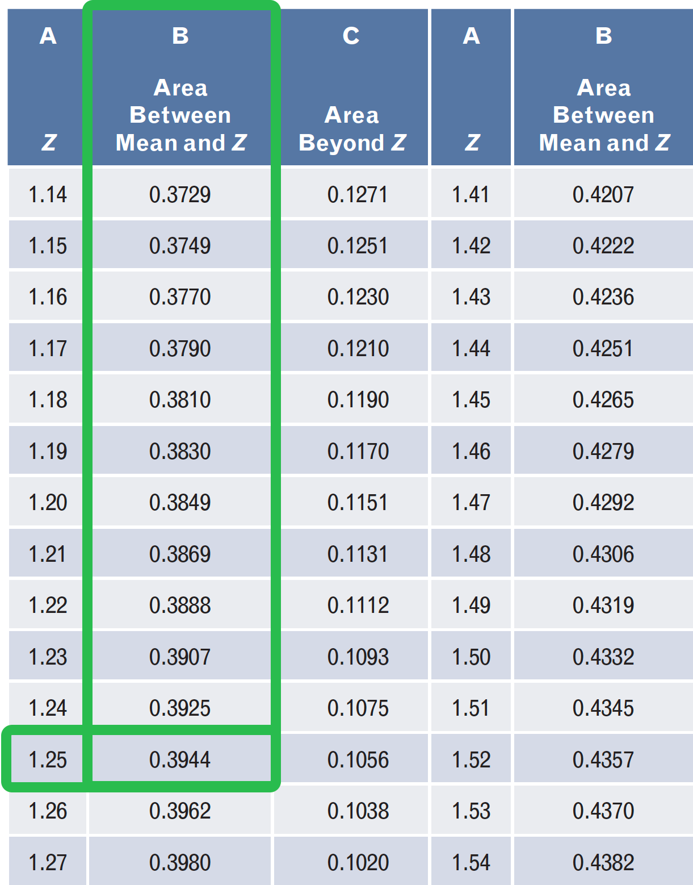
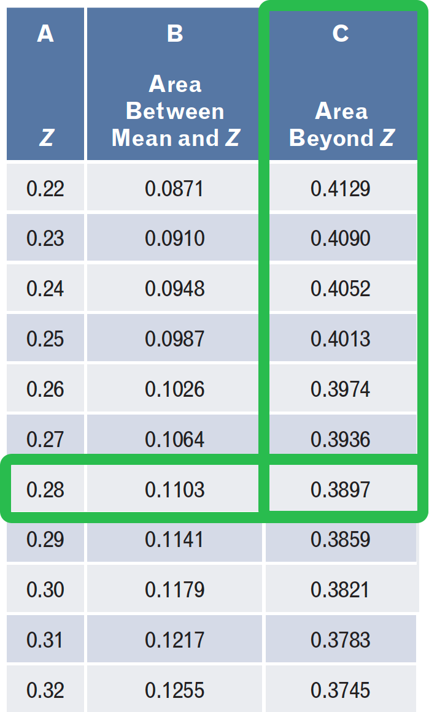
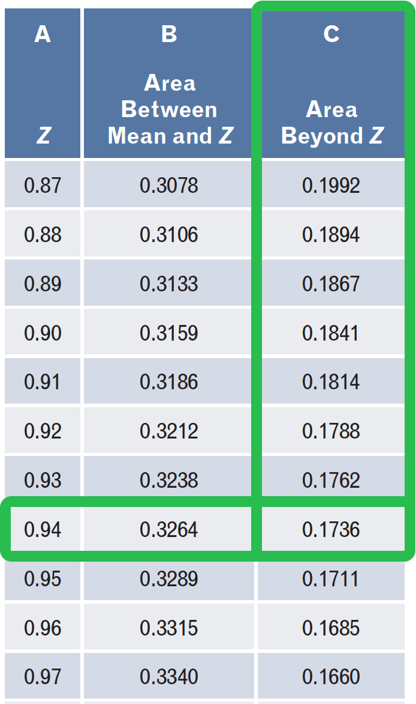
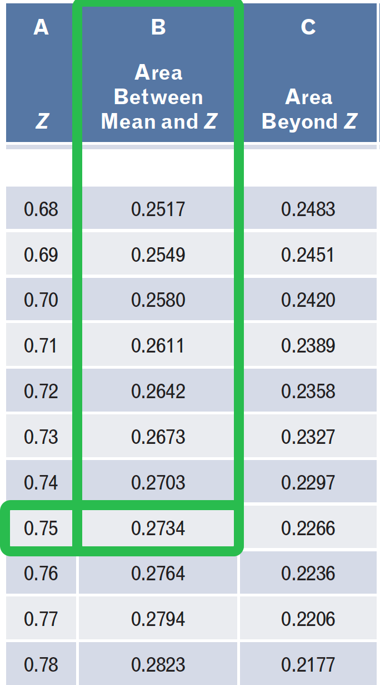
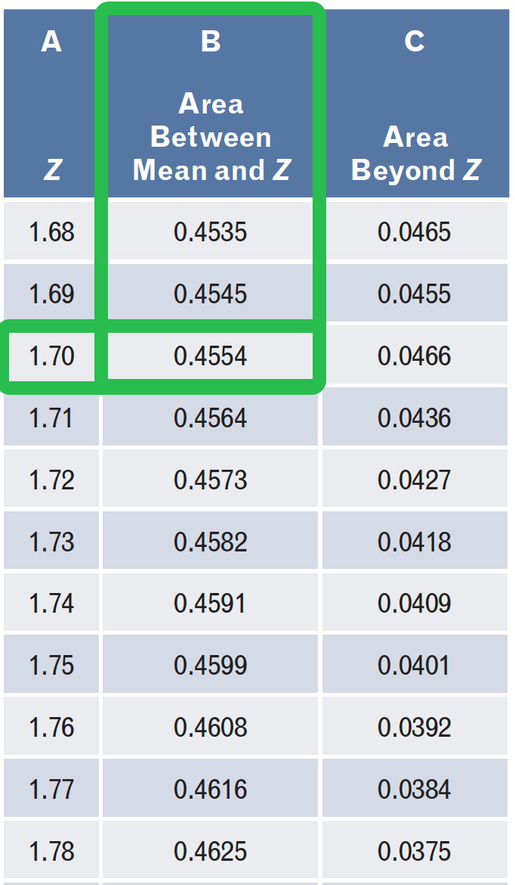
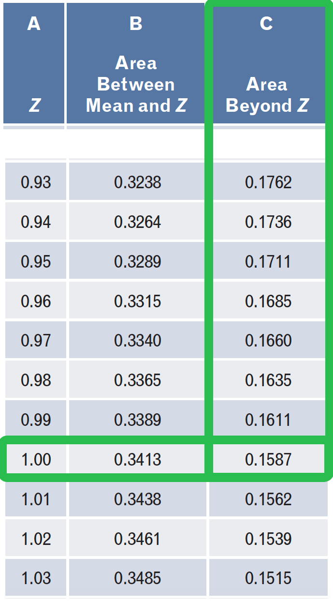
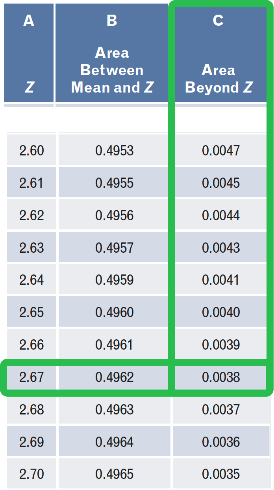
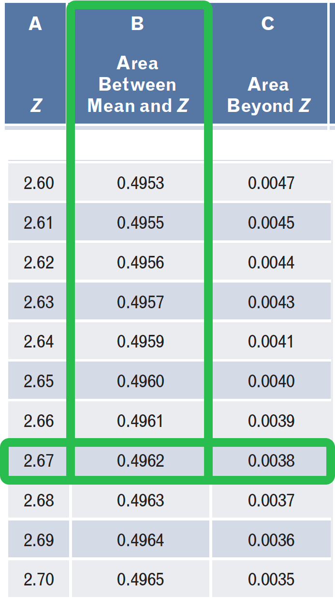
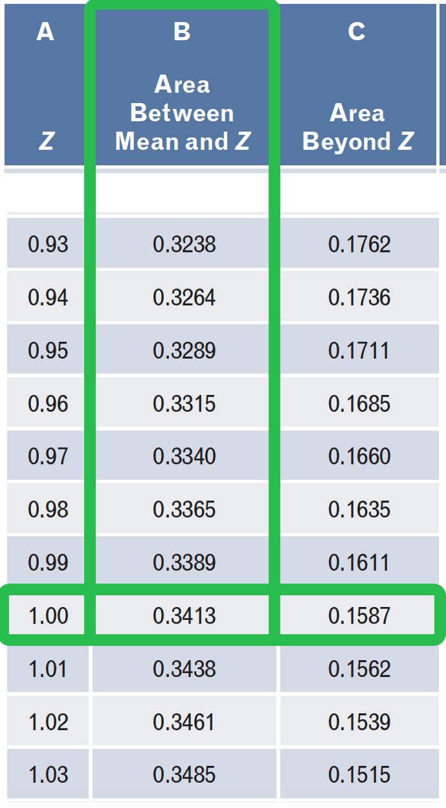
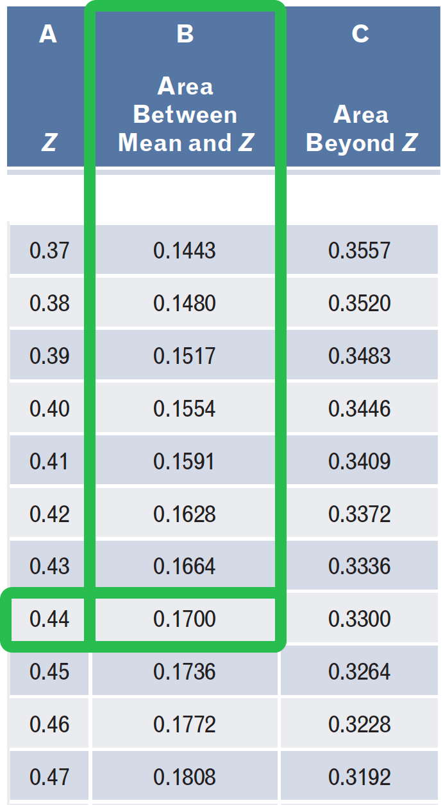

<script src="https://ajax.googleapis.com/ajax/libs/jquery/3.6.0/jquery.min.js"></script>

<script type="text/x-mathjax-config">
MathJax.Hub.Register.StartupHook("TeX Jax Ready",function () {
  MathJax.Hub.Insert(MathJax.InputJax.TeX.Definitions.macros,{
    cancel: ["Extension","cancel"],
    bcancel: ["Extension","cancel"],
    xcancel: ["Extension","cancel"],
    cancelto: ["Extension","cancel"]
  });
});
</script>

<style>
section {
    display: flex;
    display: -webkit-flex;
}

section p {
    margin: auto;
}

section {
    height: 600px;
    width: 60%;
    margin: auto;
    border-radius: 20px;
    background-color: #212121;
}

section p {
    text-align: center;
    font-size: 30px;
    background-color: #212121;
    border-radius: 20px;
    font-family: Roboto Condensed;
    font-style: bold;
    padding: 15px;
    color: #bff4ee;
}

#center {

text-align: center;

}

.center p {
  margin: 0;
  position: absolute;
  top: 50%;
  left: 50%;
  -ms-transform: translate(-50%, -50%);
  transform: translate(-50%, -50%);

</style>

```{r setup, include=FALSE, purl=FALSE}
knitr::opts_chunk$set(echo = FALSE)

library(tidyverse)
library(knitr)
library(kableExtra)
library(fontawesome)
library(here)
library(DT)
library(scales)
library(latex2exp)
library(showtext)
font_add_google("Roboto Condensed", "roboto")
showtext_auto()
```

```{r echo = FALSE, purl=FALSE}
xaringanthemer::style_duo(
  primary_color = "#212121",
  secondary_color = "#bff4ee",
  table_row_border_color = "#212121",
  table_row_even_background_color = "#212121",
  footnote_font_size = "0.6em",
  header_font_google = xaringanthemer::google_font("Roboto Condensed", "700"),
  text_font_google   = xaringanthemer::google_font("Roboto Condensed", "400")
)

xaringanExtra::use_xaringan_extra(c("tile_view", "animate_css", "tachyons"))

xaringanExtra::use_logo(
  image_url = here::here("static", "img", "course_hex_alpha.png"),
  link_url = "https://edp613.asocialdatascientist.com",
  position = xaringanExtra::css_position(top = "1em", right = "1em")
  )
```

```{r eval = TRUE}
unchecked <- as.character(fontawesome::fa("square", fill = "#b2d8d8"))

checked <- as.character(fontawesome::fa("check", fill = "#ffffff"))
```

```{r echo=FALSE}
round2 = function(x, n) {
  posneg = sign(x)
  z = abs(x)*10^n
  z = z + 0.5 + sqrt(.Machine$double.eps)
  z = trunc(z)
  z = z/10^n
  z*posneg
}
```

# Idea

The area under a normal curve is equal to 1

- represents a population

- is probabilistic

```{r, echo=FALSE, fig.align='center', dpi=300, fig.height=1.5, fig.width=2.5}
mean_thing <- 10
std_thing <- 10
lcb <- ((mean_thing - (3 * std_thing)) - 5)
ucb <- (((2 * mean_thing) + (3 * (2 * std_thing))) + 5)

ggplot(data = data.frame(u = c(lcb, ucb)),
       mapping = aes(x = u)) +
  stat_function(mapping = aes(color = "Distbn. 1"),
                fun = dnorm,
                geom = "area",
                fill = "#5bc0de",
                alpha = 1,
                args = list(mean = (3.7 * mean_thing),
                            sd = (2 * std_thing)),
                show.legend = FALSE) +
  scale_color_manual(values = c("transparent")) +
  theme_void(base_family = "roboto") +
  theme(
        panel.grid.major = element_blank(), 
        panel.grid.minor = element_blank(),
        panel.background = element_rect(fill = "#212121",color = NA),
        plot.background = element_rect(fill = "#212121",color = NA)
        ) + 
  expand_limits(x = c(-45,0), 
                y = 0)  +
  annotate('text', 
           x = 52, 
           y = 0.010, 
           label = 'Area = 1', 
           color = '#ffffff',
           size = 4,
           family = "roboto",
           fontface = 2,
           hjust = 1)
```

---

# By extension

- The area under the curve between two values is a proportion of the total population

```{r, echo=FALSE, fig.align='center', dpi=400, fig.height=1.3, fig.width=2.3}
ggplot(NULL, aes(c(-3,3))) +
    geom_area(stat = "function", fun = dnorm, fill = NA, color = "#ffffff", xlim = c(-3.5, 3.5), size=0.6) +
  geom_area(stat = "function", fun = dnorm, fill = "#5bc0de", xlim = c(-2, 1)) +
#  geom_area(stat = "function", fun = dnorm, fill = "#de795b", xlim = c(0, 3.45)) +
  scale_color_manual(values = c("transparent")) +
  theme_void(base_family = "roboto") +
  theme(
        panel.grid.major = element_blank(), 
        panel.grid.minor = element_blank(),
        panel.background = element_rect(fill = "#212121",color = NA),
        plot.background = element_rect(fill = "#212121",color = NA)
        ) +
  annotate('text', 
           x = -0.20, 
           y = 0.15, 
           label = 'Some\nproportion', 
           color = '#ffffff',
           size = 3,
           family = "roboto",
           fontface = 2,
           hjust = 0.5)
```

---

## Example

Assuming the area under the curve between 0 to 2 is 0.20, what is

a. the proportion of the population between 0 and 2?

b. the proportion of the population not between 0 and 2?

---

## Solution

a. 
```{r, echo=FALSE, fig.align='center', dpi=400, fig.height=1.35, fig.width=2.35}
ggplot(NULL, aes(c(-3,3))) +
    geom_area(stat = "function", fun = dnorm, fill = NA, color = "#ffffff", xlim = c(-3.5, 3.5), size=0.6) +
  geom_area(stat = "function", fun = dnorm, fill = "#5bc0de", xlim = c(0, 2)) +
#  geom_area(stat = "function", fun = dnorm, fill = "#de795b", xlim = c(0, 3.45)) +
  scale_color_manual(values = c("transparent")) +
  theme_void(base_family = "roboto") +
  theme(
        panel.grid.major = element_blank(), 
        panel.grid.minor = element_blank(),
        panel.background = element_rect(fill = "#212121",color = NA),
        plot.background = element_rect(fill = "#212121",color = NA)
        ) +
  annotate('text', 
           x = 0.66, 
           y = 0.17, 
           label = '20%\nhere', 
           color = '#ffffff',
           size = 1.8,
           family = "roboto",
           fontface = 2,
           hjust = 0.5)
```

---

## Solution

b. 
```{r, echo=FALSE, fig.align='center', dpi=400, fig.height=1.35, fig.width=2.35}
ggplot(NULL, aes(c(-3,3))) +
    geom_area(stat = "function", fun = dnorm, fill = NA, color = "#ffffff", xlim = c(-3.5, 3.5), size=0.6) +
  geom_area(stat = "function", fun = dnorm, fill = "#5bc0de", xlim = c(0, 2)) +
#  geom_area(stat = "function", fun = dnorm, fill = "#de795b", xlim = c(0, 3.45)) +
  scale_color_manual(values = c("transparent")) +
  theme_void(base_family = "roboto") +
  theme(
        panel.grid.major = element_blank(), 
        panel.grid.minor = element_blank(),
        panel.background = element_rect(fill = "#212121",color = NA),
        plot.background = element_rect(fill = "#212121",color = NA)
        ) +
  annotate('text', 
           x = -0.62, 
           y = 0.17, 
           label = '80%\nbetween both', 
           color = '#ffffff',
           size = 1.7,
           family = "roboto",
           fontface = 2,
           hjust = 0.5) +
  geom_segment(aes(x = -0.70, 
                   xend = -0.98, 
                   y = 0.135, 
                   yend= 0.10),
               arrow = arrow(length = unit(1.2, "mm")), 
               lwd = 0.2,
               color = "#ffffff") +
  geom_segment(aes(x = -0.42, 
                   xend = 2.20, 
                   y = 0.135, 
                   yend = 0.01),
               arrow = arrow(length = unit(1.2, "mm")), 
               lwd = 0.2,
               color = "#ffffff")
```

---

# Variables

We have 

<br>
.pull-left[
<p id="center" style="color:#dd99d2; font-weight: bold; border:1px; border-style:solid; border-color:#f0b5d3; border-radius: 25px; padding: 0.3em;">
`\mu`<br><br>
population mean
</p>
]

--

.pull-right[
<p id="center" style="color:#f5ebd9; font-weight: bold; border:1px; border-style:solid; border-color:#f5ebd9; border-radius: 25px; padding: 0.3em;">
`\overline{Y}`<br><br>
sample mean
</p>
]

--

<br>
<br>
<br>
.pull-left[
<p id="center" style="color:#99d2dd; font-weight: bold; border:1px; border-style:solid; border-color:#99d2dd; border-radius: 25px; padding: 0.3em;">
`\sigma`<br><br>
population standard deviation
</p>
]

--

.pull-right[
<p id="center" style="color:#e5d9e3; font-weight: bold; border:1px; border-style:solid; border-color:#e1e1f9; border-radius: 25px; padding: 0.3em;">
`s`<br><br>
sample standard deviation
</p>
]

---

# The Emperical Rule: Idea

```{r, echo=FALSE, fig.align='center', dpi=400, fig.height=1.39, fig.width=2.39, warning=FALSE, message=FALSE}
ggplot(NULL, aes(c(-3,3))) +
    geom_area(stat = "function", fun = dnorm, fill = NA, color = "#ffffff", xlim = c(-3.5, 3.5), size=0.6) +
    geom_area(stat = "function", fun = dnorm, fill = "#c3e7f3", xlim = c(-3, 3)) +
  geom_area(stat = "function", fun = dnorm, fill = "#9bd8eb", xlim = c(-2, 2)) +
    geom_area(stat = "function", fun = dnorm, fill = "#5bc0de", xlim = c(-1, 1)) +
  scale_color_manual(values = c("transparent")) +
  theme_void(base_family = "roboto") +
  theme(
        panel.grid.major = element_blank(), 
        panel.grid.minor = element_blank(),
        panel.background = element_rect(fill = "#212121",color = NA),
        plot.background = element_rect(fill = "#212121",color = NA)
        ) +
  annotate('text', 
           x = 0, 
           y = 0.248, 
           label = 'About 68%\nof data sits here', 
           color = '#ffffff',
           size = 1.7,
           family = "roboto",
           fontface = 2,
           hjust = 0.5) +
  annotate('text', 
           x = 0, 
           y = 0.143, 
           label = 'About 95%\nof data sits here', 
           color = '#ffffff',
           size = 1.7,
           family = "roboto",
           fontface = 2,
           hjust = 0.5) +
  annotate('text', 
           x = 0, 
           y = 0.035, 
           label = 'About 99.7%\nof data sits here', 
           color = '#ffffff',
           size = 1.7,
           family = "roboto",
           fontface = 2,
           hjust = 0.5) +
  geom_segment(aes(x = -0.70, 
                   xend = -0.92, 
                   y = 0.247, 
                   yend = 0.246),
               arrow = arrow(length = unit(1.2, "mm")), 
               lwd = 0.3,
               color = "#ffffff") +
   geom_segment(aes(x = 0.70, 
                   xend = 0.92, 
                   y = 0.247, 
                   yend = 0.246),
               arrow = arrow(length = unit(1.2, "mm")), 
               lwd = 0.3,
               color = "#ffffff") +
   geom_segment(aes(x = -0.70, 
                    xend = -1.36, 
                    y = 0.144, 
                    yend = 0.140),
               arrow = arrow(length = unit(1.2, "mm")), 
               lwd = 0.3,
               color = "#ffffff") +
   geom_segment(aes(x = 0.70, 
                   xend = 1.36, 
                   y = 0.144, 
                   yend = 0.140),
               arrow = arrow(length = unit(1.2, "mm")), 
               lwd = 0.3,
               color = "#ffffff") +
  geom_segment(aes(x = 0.70, 
                   xend = 2.16, 
                   y = 0.035, 
                   yend = 0.020),
               arrow = arrow(length = unit(1.2, "mm")), 
               lwd = 0.3,
               color = "#ffffff") +
  geom_segment(aes(x = -0.70, 
                   xend = -2.16, 
                   y = 0.035, 
                   yend = 0.020),
               arrow = arrow(length = unit(1.2, "mm")), 
               lwd = 0.3,
               color = "#ffffff") 
```

---

# The Emperical Rule: Statistic

```{r, echo=FALSE, fig.align='center', dpi=400, fig.height=1.39, fig.width=2.39, warning=FALSE, message=FALSE}
ggplot(NULL, aes(c(-3,3))) +
    geom_area(stat = "function", fun = dnorm, fill = NA, color = "#ffffff", xlim = c(-3.5, 3.5), size=0.6) +
    geom_area(stat = "function", fun = dnorm, fill = "#c3e7f3", xlim = c(-3, 3)) +
  geom_area(stat = "function", fun = dnorm, fill = "#9bd8eb", xlim = c(-2, 2)) +
    geom_area(stat = "function", fun = dnorm, fill = "#5bc0de", xlim = c(-1, 1)) +
  scale_color_manual(values = c("transparent")) +
  theme_void(base_family = "roboto") +
  theme(
        panel.grid.major = element_blank(), 
        panel.grid.minor = element_blank(),
        panel.background = element_rect(fill = "#212121",color = NA),
        plot.background = element_rect(fill = "#212121",color = NA)
        ) +
  annotate('text', 
           x = 0, 
           y = 0.253, 
           label = '1 standard\ndeviation\nfrom the mean',
           color = '#ffffff',
           size = 1.7,
           family = "roboto",
           fontface = 2,
           hjust = 0.5) +
  annotate('text', 
           x = 0, 
           y = 0.152, 
           label = '2 standard\ndeviations\nfrom the mean', 
           color = '#ffffff',
           size = 1.7,
           family = "roboto",
           fontface = 2,
           hjust = 0.5) +
  annotate('text', 
           x = 0, 
           y = 0.05, 
           label = '3 standard\ndeviations\nfrom the mean', 
           color = '#ffffff',
           size = 1.7,
           family = "roboto",
           fontface = 2,
           hjust = 0.5) +
  geom_segment(aes(x = -0.70, 
                   xend = -0.92, 
                   y = 0.248, 
                   yend = 0.246),
               arrow = arrow(length = unit(1.2, "mm")), 
               lwd = 0.3,
               color = "#ffffff") +
   geom_segment(aes(x = 0.70, 
                   xend = 0.92, 
                   y = 0.248, 
                   yend = 0.246),
               arrow = arrow(length = unit(1.2, "mm")), 
               lwd = 0.3,
               color = "#ffffff") +
   geom_segment(aes(x = -0.70, 
                    xend = -1.36, 
                    y = 0.148, 
                    yend = 0.140),
               arrow = arrow(length = unit(1.2, "mm")), 
               lwd = 0.3,
               color = "#ffffff") +
   geom_segment(aes(x = 0.70, 
                   xend = 1.36, 
                   y = 0.148, 
                    yend = 0.140),
               arrow = arrow(length = unit(1.2, "mm")), 
               lwd = 0.3,
               color = "#ffffff") +
  geom_segment(aes(x = 0.70, 
                   xend = 2.16, 
                   y = 0.046, 
                   yend = 0.020),
               arrow = arrow(length = unit(1.2, "mm")), 
               lwd = 0.3,
               color = "#ffffff") +
  geom_segment(aes(x = -0.70, 
                   xend = -2.16, 
                   y = 0.046, 
                   yend = 0.020),
               arrow = arrow(length = unit(1.2, "mm")), 
               lwd = 0.3,
               color = "#ffffff") 
```

---

# The Emperical Rule: Formula

```{r, echo=FALSE, fig.align='center', dpi=400, fig.height=1.39, fig.width=2.39, warning=FALSE, message=FALSE}
ggplot(NULL, aes(c(-3,3))) +
    geom_area(stat = "function", fun = dnorm, fill = NA, color = "#ffffff", xlim = c(-3.5, 3.5), size=0.6) +
    geom_area(stat = "function", fun = dnorm, fill = "#c3e7f3", xlim = c(-3, 3)) +
  geom_area(stat = "function", fun = dnorm, fill = "#9bd8eb", xlim = c(-2, 2)) +
    geom_area(stat = "function", fun = dnorm, fill = "#5bc0de", xlim = c(-1, 1)) +
  scale_color_manual(values = c("transparent")) +
  theme_void(base_family = "roboto") +
  theme(
        panel.grid.major = element_blank(), 
        panel.grid.minor = element_blank(),
        panel.background = element_rect(fill = "#212121",color = NA),
        plot.background = element_rect(fill = "#212121",color = NA)
        ) +
  annotate('text', 
           x = 0, 
           y = 0.248, 
           label = TeX(r'($\mu + \sigma$)'),
           color = '#ffffff',
           size = 1.7,
           family = "roboto",
           fontface = 2,
           hjust = 0.5) +
  annotate('text', 
           x = 0, 
           y = 0.143, 
           label = TeX(r'($\mu + 2\sigma$)'), 
           color = '#ffffff',
           size = 1.7,
           family = "roboto",
           fontface = 2,
           hjust = 0.5) +
  annotate('text', 
           x = 0, 
           y = 0.035, 
           label = TeX(r'($\mu + 3\sigma$)'),  
           color = '#ffffff',
           size = 1.7,
           family = "roboto",
           fontface = 2,
           hjust = 0.5) +
  geom_segment(aes(x = -0.70, 
                   xend = -0.92, 
                   y = 0.247, 
                   yend = 0.246),
               arrow = arrow(length = unit(1.2, "mm")), 
               lwd = 0.3,
               color = "#ffffff") +
   geom_segment(aes(x = 0.70, 
                   xend = 0.92, 
                   y = 0.247, 
                   yend = 0.246),
               arrow = arrow(length = unit(1.2, "mm")), 
               lwd = 0.3,
               color = "#ffffff") +
   geom_segment(aes(x = -0.70, 
                    xend = -1.36, 
                    y = 0.144, 
                    yend = 0.140),
               arrow = arrow(length = unit(1.2, "mm")), 
               lwd = 0.3,
               color = "#ffffff") +
   geom_segment(aes(x = 0.70, 
                   xend = 1.36, 
                   y = 0.144, 
                   yend = 0.140),
               arrow = arrow(length = unit(1.2, "mm")), 
               lwd = 0.3,
               color = "#ffffff") +
  geom_segment(aes(x = 0.70, 
                   xend = 2.16, 
                   y = 0.035, 
                   yend = 0.020),
               arrow = arrow(length = unit(1.2, "mm")), 
               lwd = 0.3,
               color = "#ffffff") +
  geom_segment(aes(x = -0.70, 
                   xend = -2.16, 
                   y = 0.035, 
                   yend = 0.020),
               arrow = arrow(length = unit(1.2, "mm")), 
               lwd = 0.3,
               color = "#ffffff") 
```

---

## Example

Assume a sample with 

$$\mu = 176$$
$$\sigma = 36$$

is normal. Approximately what percentage of the sample
values are between 104 and 248?


---

## Solution

>- The value 104 is two standard deviations below the mean since

\begin{aligned}
\mu - 2\sigma &= 176 - 2 \cdot 36\\
&= 104
\end{aligned}

--

>- The value 248 is two standard deviations above the mean since

\begin{aligned}
\mu+2\sigma &= 176 + 2 \cdot 36\\
&= 248
\end{aligned}

--

>- So about 95% of the data points are between 104 and 248.

---

## Example

Assume a sample with 

$$\mu = 176$$
$$\sigma = 36$$

is normal. Between what two value will about 68%
of the sampled data points be?

---

## Solution

>- The value 104 is two standard deviations below the mean since

\begin{aligned}
\mu - 2\sigma &= 176 - \cdot 36\\
&= 140
\end{aligned}

--

>- The value 248 is two standard deviations above the mean since

\begin{aligned}
\mu + 2\sigma &= 176 + \cdot 36\\
&= 212
\end{aligned}

--

>- So between 140 and 212 are about 68% of the data.

---

# The $z$-score

A $z$*-score* is a standard way to look at the normal curve. 

--

- By itself the values don't really mean anything

--

- Provides a common metric for most measures


--

When plotting a $z$-score

--

>- The points on the horizontal axis to the 

  >>- $\leftarrow$ of the $\mu$ have negative $z$-scores.

--

  >>- $\rightarrow$ of the $\mu$ have positive $z$-scores.

--

>- The mean $\mu=$ the median = the mode sits at the origin (middle)

--

>- Needs something to interpret it like the *Standard Normal Table* (Appendix B; p. 375)

---

## Example

How much of a population is represented by the shaded area under the standard normal curve?

```{r, echo=FALSE, fig.align='center', dpi=400, fig.height=1.20, fig.width=2.20}
ggplot(NULL, aes(c(-3,3))) +
    geom_area(stat = "function", fun = dnorm, fill = NA, color = "#ffffff", xlim = c(-3.5, 3.5), size=0.6) +
  geom_area(stat = "function", fun = dnorm, fill = "#5bc0de", xlim = c(-3.5, 1.25)) +
#  geom_area(stat = "function", fun = dnorm, fill = "#de795b", xlim = c(0, 3.45)) +
  scale_fill_manual(values = c("transparent")) +
  scale_x_continuous(breaks = c(0, 1.25),
                     labels = c(TeX(r'($0$)'), 1.25)) +
  theme_void(base_family = "roboto") +
  theme(
        panel.grid.major = element_blank(), 
        panel.grid.minor = element_blank(),
        panel.background = element_rect(fill = "#212121",color = NA),
        plot.background = element_rect(fill = "#212121",color = NA),
        axis.text.x = element_text(size = 4,
                                   color = "#ffffff")
        ) +
  geom_segment(aes(x = 0, 
                   xend = 0, 
                   y = 0, 
                   yend= 0.4),
               lwd = 0.2,
               lty = "dashed",
               color = "#ffffff")
  
```

---

## Solution

*idea*: The area less than $1.25$ is equivalent to the entire area to the left of $\mu$ added to the area between $\mu$ and $1.25$

*standard normal table*: This is $0.5000 + 0.3944 = 0.8944$ implying that our sample consists of approximately 89.44% of the population
<br>
<br>
<center>

</center>

---

## Example

How much of a population is represented by the shaded area under the standard normal curve?

```{r, echo=FALSE, fig.align='center', dpi=400, fig.height=1.20, fig.width=2.20}
ggplot(NULL, aes(c(-3,3))) +
    geom_area(stat = "function", fun = dnorm, fill = NA, color = "#ffffff", xlim = c(-3.5, 3.5), size=0.6) +
  geom_area(stat = "function", fun = dnorm, fill = "#5bc0de", xlim = c(-3.5, -0.28)) +
  geom_area(stat = "function", fun = dnorm, fill = "#5bc0de", xlim = c(0.94, 3.5)) +
  scale_fill_manual(values = c("transparent")) +
  scale_x_continuous(breaks = c(-0.28, 0, 0.94),
                     labels = c(-0.28, TeX(r'($\mu=0$)'), 0.94)) +
  theme_void(base_family = "roboto") +
  theme(
        panel.grid.major = element_blank(), 
        panel.grid.minor = element_blank(),
        panel.background = element_rect(fill = "#212121",color = NA),
        plot.background = element_rect(fill = "#212121",color = NA),
        axis.text.x = element_text(size = 4,
                                   color = "#ffffff")
        ) +
  geom_segment(aes(x = 0, 
                   xend = 0, 
                   y = 0, 
                   yend= 0.4),
               lwd = 0.2,
               lty = "dashed",
               color = "#ffffff")
  
```

---

## Solution

*idea*: The area less than $-0.28$ is equivalent to the area greater than $0.28$ added to the area greater than $0.94$ 

*standard normal table*: This is $0.3897 + 0.1736 = 0.5633$ implying that our sample consists of approximately 56.33% of the population
<br>
<br>
.pull-left[
<center>

</center>
]

.pull-right[
<center>

</center>
]

---

## Example 

How much of a population is represented by the shaded area under the standard normal curve?

```{r, echo=FALSE, fig.align='center', dpi=400, fig.height=1.20, fig.width=2.20}
ggplot(NULL, aes(c(-3,3))) +
    geom_area(stat = "function", fun = dnorm, fill = NA, color = "#ffffff", xlim = c(-3.5, 3.5), size=0.6) +
  geom_area(stat = "function", fun = dnorm, fill = "#5bc0de", xlim = c(-0.75, 1.7)) +
 # geom_area(stat = "function", fun = dnorm, fill = "#5bc0de", xlim = c(0.94, 3.5)) +
  scale_fill_manual(values = c("transparent")) +
  scale_x_continuous(breaks = c(-0.75, 0, 1.70),
                     labels = c(-0.75, TeX(r'($\mu = 0$)'), 1.70)) +
  theme_void(base_family = "roboto") +
  theme(
        panel.grid.major = element_blank(), 
        panel.grid.minor = element_blank(),
        panel.background = element_rect(fill = "#212121",color = NA),
        plot.background = element_rect(fill = "#212121",color = NA),
        axis.text.x = element_text(size = 4,
                                   color = "#ffffff")
        ) +
  geom_segment(aes(x = 0, 
                   xend = 0, 
                   y = 0, 
                   yend= 0.4),
               lwd = 0.2,
               lty = "dashed",
               color = "#ffffff")
  
```

---

## Solution

*idea*: The area between $-0.75$ and $1.7$ can be look at as the area between $0$ and $0.75$ added to the the area between $0$ and $1.7$

*standard normal table*: This is $0.2734 + 0.4554 = 0.7288$ implying that our sample consists of approximately 72.88% of the population
<br>
<br>
.pull-left[
<center>

</center>
]

.pull-right[
<center>

</center>
]

---

# Calculating the $z$-score

Let $Y$ be a value from a normal distribution with a mean and standard deviation, then the $z$-score
of $Y$ is

--

<br>
.pull-left[
<p id="center" style="color:#e2b7bf; font-weight: bold; border:1px; border-style:solid; border-color:#e2b7bf; border-radius: 25px; padding: 0.3em;">
`z=\frac{Y-\overline{Y}}{s}`<br><br>
sample
</p>
]

--

.pull-right[
<p id="center" style="color:#c4b7e2; font-weight: bold; border:1px; border-style:solid; border-color:#c4b7e2; border-radius: 25px; padding: 0.3em;">
`z=\frac{Y-\mu}{\sigma}`<br><br>
population
</p>
]

---

## Example

A sample has mean $\mu = 47$ years old and standard deviation $s = 3$. What proportion of the population is included between 50 and 55?

---

## Solution

We can find the $z$-scores by 

.pull-left[
\begin{align}
z_{50} &= \frac{50-47}{3}\\
&= 1
\end{align}
]

.pull-right[
\begin{align}
z_{55} &= \frac{55-47}{3}\\
&\approx 2.67
\end{align}
]

so we are looking at the area under the normal curve between 1 and 2.67

```{r, echo=FALSE, fig.align='center', dpi=400, fig.height=0.7, fig.width=1.2}
ggplot(NULL, aes(c(-3,3))) +
    geom_area(stat = "function", fun = dnorm, fill = NA, color = "#ffffff", xlim = c(-3.5, 3.5), size=0.6) +
  geom_area(stat = "function", fun = dnorm, fill = "#5bc0de", xlim = c(1, 2.67)) +
 # geom_area(stat = "function", fun = dnorm, fill = "#5bc0de", xlim = c(0.94, 3.5)) +
  scale_fill_manual(values = c("transparent")) +
  scale_x_continuous(breaks = c(0, 1, 2.67),
                     labels = c(TeX(r'($\mu = 0$)'), 1, 2.67)) +
  theme_void(base_family = "roboto") +
  theme(
        panel.grid.major = element_blank(), 
        panel.grid.minor = element_blank(),
        panel.background = element_rect(fill = "#212121",color = NA),
        plot.background = element_rect(fill = "#212121",color = NA),
        axis.text.x = element_text(size = 4,
                                   color = "#ffffff")
        ) +
  geom_segment(aes(x = 0, 
                   xend = 0, 
                   y = 0, 
                   yend= 0.4),
               lwd = 0.2,
               lty = "dashed",
               color = "#ffffff")
  
```

---

## Solution (using the area between the $\mu$ and $z$)

*idea*: The area between 1 and 2.67 can be found by finding the area between the mean and 1 subtracted from the area between the mean and 2.67

*standard normal table*: This is $0.1587 - 0.0038 = 0.1549$ implying that our sample consists of approximately 15.49% of the population

.pull-left[
<center>

</center>
]

.pull-right[
<center>

</center>
]

---

## Solution (using the area beyond $z$)

*idea*: The area between 1 and 2.67 can be found by finding the area beyond 2.67 and subtracting it from the area beyond 1

*standard normal table*: This is $0.4962 - 0.3413 = 0.1549$ implying that our sample consists of approximately 15.49% of the population
<br>
<br>
.pull-left[
<center>

</center>
]

.pull-right[
<center>

</center>
]

---

# Note

If we have a $z$-score, $\mu$, and $\sigma$, we can restructure our equation to figure out a data point value using basic algebra

\begin{align}
z &= \frac{Y-\mu}{\sigma}\\
z\cdot\sigma &= \frac{Y - \mu}{\sigma} \cdot \sigma\\
z\cdot\sigma &= \frac{Y - \mu}{\cancel{\sigma}} \cdot \cancel{\sigma}\\
z\cdot\sigma &= Y - \mu\\
z\cdot\sigma + \mu &= Y - \mu + \mu\\
z\cdot\sigma + \mu &= Y \cancel{- \mu + \mu} \\
z\cdot\sigma + \mu &= Y \\
\mu + z\cdot\sigma &= Y \\
Y &= \mu + z\cdot\sigma
\end{align}

---

# Finding the value of a data point

So to figure out the true value of a data point, we use $$Y = \mu + z\cdot\sigma$$

---

## Example 

The Centers for Disease Control and Prevention reported that diastolic blood pressures of adult women in the United States are approximately normally distributed with mean 80.5 and standard deviation 9.9. Find the 67th percentile of the blood pressures

How much of a population is represented by the shaded area under the standard normal curve?

```{r, echo=FALSE, fig.align='center', dpi=400, fig.height=1.0, fig.width=2.0}
ggplot(NULL, aes(c(-3,3))) +
    geom_area(stat = "function", fun = dnorm, fill = NA, color = "#ffffff", xlim = c(-3.5, 3.5), size=0.6) +
  geom_area(stat = "function", fun = dnorm, fill = "#5bc0de", xlim = c(-3.5, 1.67)) +
#  geom_area(stat = "function", fun = dnorm, fill = "#de795b", xlim = c(0, 3.45)) +
  scale_fill_manual(values = c("transparent")) +
  scale_x_continuous(breaks = c(0, 1.67),
                     labels = c(TeX(r'($\mu=0$)'),
                                TeX(r'($Y$)'))) +
  theme_void(base_family = "roboto") +
  theme(
        panel.grid.major = element_blank(), 
        panel.grid.minor = element_blank(),
        panel.background = element_rect(fill = "#212121",color = NA),
        plot.background = element_rect(fill = "#212121",color = NA),
        axis.text.x = element_text(size = 4,
                                   color = "#ffffff")
        ) +
  geom_segment(aes(x = 0, 
                   xend = 0, 
                   y = 0, 
                   yend= 0.4),
               lwd = 0.2,
               lty = "dashed",
               color = "#ffffff")
```

---

## Solution

*idea*: Since we are trying to find the 67th percentile, the standard normal curve can be split into two areas, namely everything
- less than 0.67 
- greater than 0.67, or the remaining 33%

The area less than $0.67$ is equivalent to the entire area to the left of $\mu$ added to the area between $\mu$ and $0.67$ which is $0.67 - 0.50 = 0.17$

---

## Solution (continued)

*standard normal table*: This is 

\begin{align}
Y &= 80.5 + 0.44\cdot 9.9\\
&\approx 84.86
\end{align}

implying that data point is likely 84.86. This means that the 67th percentile of diastolic blood pressures of
adult women in the United States is approximately 84.86

<center>

</center>

---


## That's it. Let's take a break before working in R.
