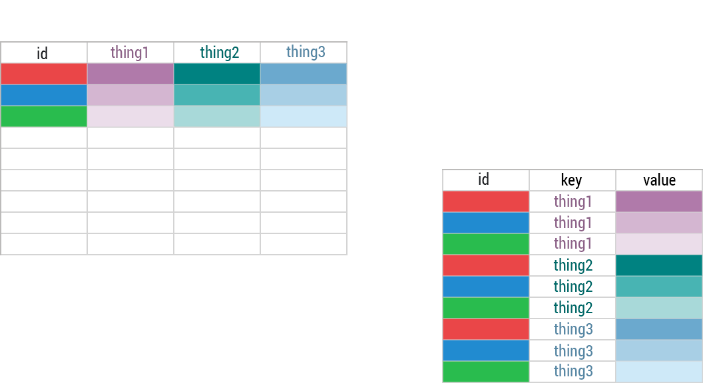

<script>
  function resizeIframe(obj) {
    obj.style.height = obj.contentWindow.document.body.scrollHeight + 'px';
  }
</script>

<style>
section {
    display: flex;
    display: -webkit-flex;
}

section p {
    margin: auto;
}

.hljs-github .hljs {
    background: transparent;
    color: #b2dfdb;
}

.hljs-github .hljs-keyword {
    color: #64b5f6;
}

.hljs-github .hljs-literal {
    color: #64b5f6;
}

.hljs-github .hljs-number {
    color: #64b5f6;
}

.hljs-github .hljs-string {
    color: #b7b3ef;
}

section {
    height: 600px;
    width: 60%;
    margin: auto;
    border-radius: 20px;
    background-color: #212121;
}

section p {
    text-align: center;
    font-size: 30px;
    background-color: #212121;
    border-radius: 20px;
    font-family: Roboto Condensed;
    font-style: bold;
    padding: 15px;
    color: #bff4ee;
}

#center {
text-align: center;
}

.center p {
  margin: 0;
  position: absolute;
  top: 50%;
  left: 50%;
  -ms-transform: translate(-50%, -50%);
  transform: translate(-50%, -50%);
}

.center2 {
  margin: 0;
  position: absolute;
  top: 50%;
  left: 50%;
  -ms-transform: translate(-50%, -50%);
  transform: translate(-50%, -50%);
}

</style>

```{r setup, include=FALSE,purl=FALSE}
knitr::opts_chunk$set(message = FALSE, 
                      warning = FALSE, 
                      comment = "", 
                      cache = F,
                      widgetframe_self_contained = TRUE)
knitr::opts_knit$set(root.dir = getwd())

library(tidyverse)
library(knitr)
library(kableExtra)
library(here)
library(flipbookr)
library(patchwork)
```

```{r echo = FALSE, purl = FALSE}
xaringanthemer::style_duo(
  primary_color = "#212121",
  secondary_color = "#bff4ee",
  code_inline_background_color = "transparent",
  code_inline_color = "#b2dfdb",
  code_highlight_color = "#db6464",
  table_row_border_color = "#212121",
  table_row_even_background_color = "#212121",
  footnote_font_size = "0.6em",
  header_font_google = xaringanthemer::google_font("Roboto Condensed", "700"),
  text_font_google   = xaringanthemer::google_font("Roboto Condensed", "400")
)

xaringanExtra::use_xaringan_extra(c("tile_view", "animate_css", "tachyons"))

xaringanExtra::use_logo(
  image_url = here::here("static", "img", "course_hex_alpha.png"),
  link_url = "https://edp613.asocialdatascientist.com",
  position = xaringanExtra::css_position(top = "1em", right = "1em")
  )
```

# Prepping a New R Script

1. Open up a blank R script using the menu path **File > New File > R Script**.

--

2. Save this script as `whatever.R` (replacing the term `whatever`) in your R folder. Remember to note where the file is!

--

3. After you have saved this file as `whatever.R`, go to the menu and this week try running the following alternative to **Session > Set Working Directory > To Source File Location** at the top of your script

.center2[
```{r echo=TRUE,eval=FALSE}
setwd(dirname(rstudioapi::getActiveDocumentContext()$path))
```
]

---

# Getting ready for this session

Get the files

>- `Box Office.csv`
  
>- `teampolview.csv` 

---

and save it in the same location as this script. 

>- Install the packages `viridis` and `patchwork`. 

>- Load up `tidyverse` and `viridis`

This week try using `pacman` to do it

```{r echo = TRUE, eval = TRUE, message=FALSE}
pacman::p_load(tidyverse,
               patchwork,
               viridis)
``` 

---

# Last week's R activity

---

## Load up data

```{r eval=FALSE}
boxoffice <- read_csv("Box Office.csv")
```

```{r echo = FALSE, eval = TRUE, purl=FALSE}
boxoffice <- read_csv(here::here("static", "slides", "Week 5", "Box Office.csv"))
```

---

## Before we go on

Thes solutions are just one of **many** ways to get to the actual answer. Your work may and will likely vary.

---

### 1. What is the average number of positive reviews for the top five movies?

```{r sw1, include = FALSE}
boxoffice %>%
  arrange(Rank) %>%
  head(5) %>%
  summarize(mean_pos = 
              mean(AllPos, 
                   na.rm = TRUE)) %>%
  pull()
```

`r chunk_reveal(chunk_name = "sw1", color = c("white", "white", "white"), width = c(150, 50), float = "top")`

---

### 2. What are the average number of negative reviews for the bottom five movies?
  
```{r sw2,  include = FALSE}
boxoffice %>%
  arrange(Rank) %>%
  tail(5) %>%
  summarize(mean_neg = 
              mean(AllNeg, 
                   na.rm = TRUE)) %>%
  pull()
```

`r chunk_reveal(chunk_name = "sw2", color = c("white", "white", "white"), width = c(150, 50), float = "top")`

---

### 3. How were movies released over the years? Provide counts and a visualization.
  
```{r sw3, include = FALSE}
boxoffice %>%
  group_by(year) %>%
  count(name = "number of movies") %>%
  ungroup()
```

`r chunk_reveal(chunk_name = "sw3", color = c("white", "white", "white"), width = c(90, 120))`

---

#### Save as a variable

```{r}
boxoffice_annualnum <- 
  boxoffice %>%
  group_by(year) %>%
  count(name = "number of movies") %>%
  ungroup()
```

---

### 4. Which measure of central tendency is the best to describe the average number of movies over the years?

Since the data is skewed, the median is the best indicator of the true average
  
- Median
```{r sw4a, include = FALSE}
boxoffice_annualnum %>%
  summarize(median = 
              median(`number of movies`, 
                     na.rm = TRUE)) %>%
  pull()
```

`r chunk_reveal(chunk_name = "sw4a", color = c("white", "white", "white"), width = c(95, 115))`

---

- Mean
```{r sw4b, include = FALSE}
boxoffice_annualnum %>%
  summarize(mean = 
              mean(`number of movies`, 
                     na.rm = TRUE)) %>%
  pull()
```

`r chunk_reveal(chunk_name = "sw4b", color = c("white", "white", "white"), width = c(95, 115))`

---

- Plot
```{r sw4c, include = FALSE}
ggplot(boxoffice_annualnum, 
       aes(year, 
           `number of movies`, 
           fill = `number of movies`)) +
  geom_bar(stat = "identity") + 
  theme_minimal() +
  scale_fill_viridis_c(direction = -1)
```

`r chunk_reveal(chunk_name = "sw4c", color = c("white", "white", "white"), width = c(95, 115))`

---

```{r echo=FALSE, fig.align='center'}
boxoffice_median <- 
boxoffice_annualnum %>%
  summarize(median = median(`number of movies`, na.rm = TRUE)) %>%
  pull()

boxoffice_mean <- 
boxoffice_annualnum %>%
  summarize(mean = mean(`number of movies`, na.rm = TRUE)) %>%
  pull()

ggplot(boxoffice_annualnum, 
         aes(year, 
             `number of movies`, 
             fill = `number of movies`)) +
  geom_bar(stat = "identity") + 
  theme_minimal() +
  scale_fill_viridis_c(direction = -1) +
  geom_hline(yintercept = boxoffice_mean,
               size = 1,
               color = "#9ec8e7",
               show.legend = TRUE) +
  geom_text(aes(1960, boxoffice_mean,
                label = "mean", 
                vjust = -1),
            color = "#9ec8e7",) +
  geom_hline(yintercept = boxoffice_median,
             size = 1,
             color = "#6f9a91",
             show.legend = TRUE) +
  geom_text(aes(1960, boxoffice_median,
                label = "median", 
                vjust = -1),
            color = "#6f9a91")
```

---

### 5. Which year has the most number of ranked movies? 

```{r sw5a,  include = FALSE}
boxoffice %>%
  group_by(year) %>%
  tally() %>%
  rename(`number of movies` = n) %>%
  ungroup() %>%
  filter(`number of movies` == 
           max(`number of movies`))
```

`r chunk_reveal(chunk_name = "sw5a", color = c("white", "white", "white"), width = c(150, 50), float = "top")`

---

*or*

```{r sw5b,  include = FALSE}
boxoffice %>%
  group_by(year) %>%
  summarise(`number of movies` = n()) %>%
  ungroup() %>%
  filter(`number of movies` == 
           max(`number of movies`))
```

`r chunk_reveal(chunk_name = "sw5b", color = c("white", "white", "white"), width = c(92, 118))`

---

*or*

```{r sw5c,  include = FALSE}
boxoffice %>%
  group_by(year) %>%
  mutate(`number of movies` = n()) %>%
  ungroup() %>%
  distinct(year, .keep_all=TRUE) %>%
  filter(`number of movies` == 
           max(`number of movies`)) %>%
  select(year, `number of movies`)
```

`r chunk_reveal(chunk_name = "sw5c", color = c("white", "white", "white"), width = c(93, 118))`

---

### Imaginary bonus: What are the top ranked movie by year?

```{r swiba,  include = FALSE}
boxoffice %>%
  group_by(year) %>%
  filter(Rank == max(Rank)) %>%
  select(Rank, Movie, year) %>%
  arrange(-year) %>%
  ungroup()
```

`r chunk_reveal(chunk_name = "swiba", color = c("white", "white", "white"), width = c(90, 120))`

---

```{r}
top_movie_year <- 
  boxoffice %>%
  group_by(year) %>%
  filter(Rank == max(Rank)) %>%
  select(Rank, Movie, year) %>%
  arrange(-year) %>%
  ungroup()
```

---

#### Numerical

```{r swibb,  include = FALSE}
ggplot(top_movie_year, 
       aes(year, 
           Rank, 
           fill = Movie)) +
  geom_bar(stat = "identity",
           show.legend = FALSE) + 
  theme_minimal() +
  scale_fill_viridis_d(direction = -1) +
  labs(title = "Top Movies by Year and Rank",
       subtitle = "According to Rotten Tomatoes")
```

`r chunk_reveal(chunk_name = "swibb", color = c("white", "white", "white"), width = c(110, 100))`

---

#### Categorical

```{r swibc,  include = FALSE}
ggplot(top_movie_year, 
       aes(year, 
           Movie, 
           fill = Movie)) +
  geom_bar(stat = "identity",
           show.legend = FALSE) + 
  theme_minimal() +
  scale_fill_viridis_d(direction = -1) +
  labs(title = "Top Movies by Year",
       subtitle = "According to Rotten Tomatoes")
```

`r chunk_reveal(chunk_name = "swibc", color = c("white", "white", "white"), width = c(110, 100))`

---

That looks off. Let's try 

--

- reordering the bars which we can do a command called `reorder()` 

--

- setting limits on the horizontal axis which we can do with a command called `xlim()`

--

```{r swibd,  include = FALSE}
ggplot(top_movie_year, 
       aes(year, 
           reorder(Movie, -year),
           fill = Movie)) +
  geom_bar(stat = "identity",
           show.legend = FALSE) + 
  theme_minimal() +
  scale_fill_viridis_d(direction = -1) +
  labs(title = "Top Movies by Year",
       subtitle = "According to Rotten Tomatoes") +
  coord_cartesian(xlim = c(1900, 2015))
```

`r chunk_reveal(chunk_name = "swibd", color = c("white", "white", "white"), width = c(110, 100))`

---

Ok now on to the normal curve!

---

## Load up data

```{r eval=FALSE}
nfl_pol <- read_csv("teampolview.csv")
```

```{r echo = FALSE, eval = TRUE, purl=FALSE}
nfl_pol <- read_csv(here::here("static", "slides", "Week 5", "teampolview.csv"))
```

---

## Data Wrangling

```{r swwrangle,  include = FALSE}
nfl_pol %>%
  select(Team, 
         `Total Respondents`, `Total Democrats`, 
         Republican, `Other Republican`) %>%
  rowwise(Team) %>%
  mutate(`Total Republicans` = sum(c(Republican,`Other Republican`))) %>%
  select(-c(Republican,`Other Republican`)) %>% 
  mutate(percent_dem = round(`Total Democrats`/`Total Respondents`,2)) %>%
  mutate(percent_rep = round(`Total Republicans`/`Total Respondents`,2))
```

`r chunk_reveal(chunk_name = "swwrangle", color = c("white", "white", "white"), width = c(150, 50), float = "top")`

---

## Give it a variable

```{r}
nfl_percentages <- 
  nfl_pol %>%
  select(Team, 
         `Total Respondents`, 
         `Total Democrats`, 
          Republican,
         `Other Republican`) %>%
  rowwise(Team) %>%
  mutate(`Total Republicans` = sum(c(Republican,`Other Republican`))) %>%
  select(-c(Republican,
            `Other Republican`)) %>% 
  mutate(percent_dem = round(`Total Democrats`/`Total Respondents`,2)) %>%
  mutate(percent_rep = round(`Total Republicans`/`Total Respondents`,2))
```

---

## Plot for Democrats by Team

```{r swdems, include = FALSE}
ggplot(nfl_percentages, 
       aes(reorder(Team, percent_dem), 
           percent_dem,
           fill = percent_dem)) +
  geom_bar(stat="identity") +
  coord_flip() +
  theme_minimal() 
```

`r chunk_reveal(chunk_name = "swdems", color = c("white", "white", "white"), width = c(100, 110))`

---

## Plot for Republicans by Team

```{r swgops, include = FALSE}
ggplot(nfl_percentages, 
       aes(reorder(Team, percent_rep), 
           percent_rep,
           fill = percent_rep)) +
  geom_bar(stat="identity") +
  coord_flip() +
  theme_minimal() 
```

`r chunk_reveal(chunk_name = "swgops", color = c("white", "white", "white"), width = c(100, 110))`

---

## Let's compare them!

But first we need to assign variables

```{r}
p1 <- 
  ggplot(nfl_percentages, 
         aes(reorder(Team, percent_dem),
             percent_dem,
             fill = percent_dem)) +
  geom_bar(stat="identity") +
  coord_flip() +
  theme_minimal() 
```


```{r}
p2 <- 
  ggplot(nfl_percentages, 
         aes(reorder(Team, percent_rep), 
             percent_rep,
             fill = percent_rep)) +
  geom_bar(stat="identity") +
  coord_flip() +
  theme_minimal() 
```

---

# Patch it together using `Patchwork`

```{r fig.align='center', out.width="40%"}
p1 + p2
```

---

## A better way

That's not really a comparison...at least not teamwise! Let's try something different

---

## More Data Wrangling: Going from wide to long using `pivot_longer`

<center>

</center>
<br>

---

### Let's pivot!

```{r swpivot, include = FALSE}
nfl_percentages %>%
  pivot_longer(c(percent_dem, percent_rep),
               names_to = "type",
               values_to = "political_percentages")
```

`r chunk_reveal(chunk_name = "swpivot", color = c("white", "white", "white"), width = c(120, 90))`

---

## Give it a variable

```{r}
nlf_percentages_long <- 
  nfl_percentages %>%
  pivot_longer(c(percent_dem, percent_rep),
               names_to = "type",
               values_to = "political_percentages")
```

---

## More Data Wrangling: Pivoting

```{r swfacet, include = FALSE}
ggplot(nlf_percentages_long, 
       aes(Team, 
           political_percentages,
           fill =  political_percentages)) +
  geom_bar(stat="identity") +
  coord_flip() +
  theme_minimal() +
  facet_wrap(.~type)
```

`r chunk_reveal(chunk_name = "swfacet", color = c("white", "white", "white"), width = c(105, 110))`

---

# Your turn

Try these on your own

1. Compare how the different ethnicities within each political party differ.

2. Compare how each specific ethnicity between each political party differ.

3. Which ethnicity in each political party is the most conservative? the most liberal?

---

## That's it for today!
