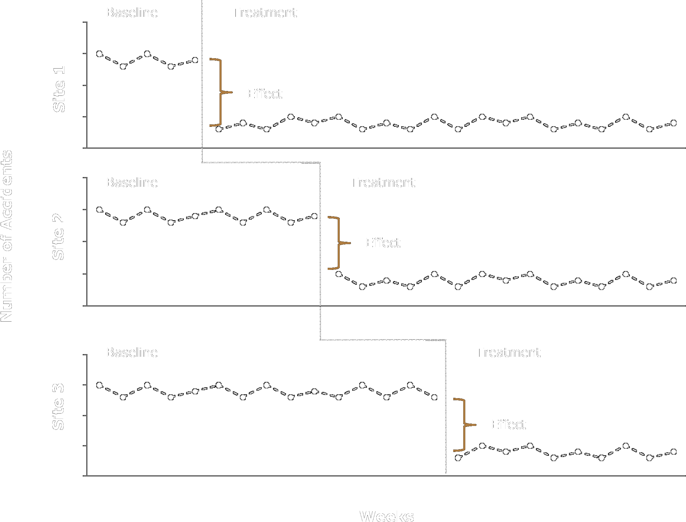
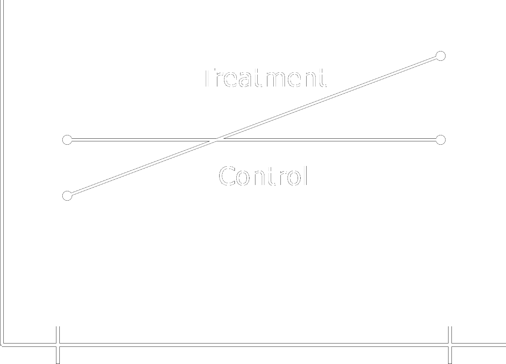
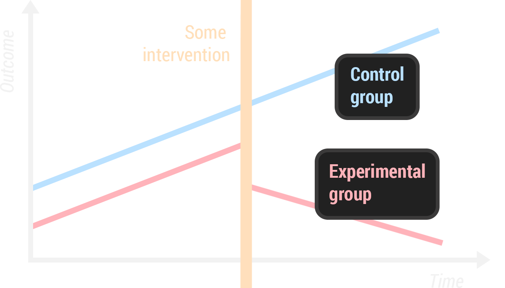
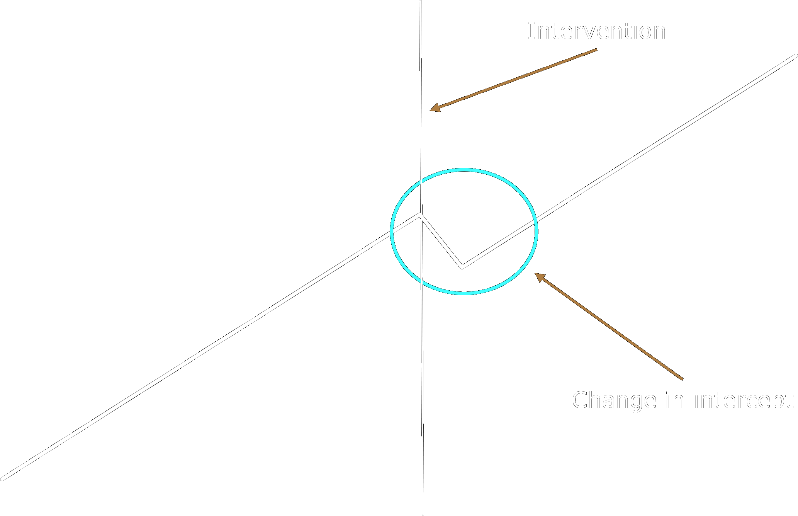
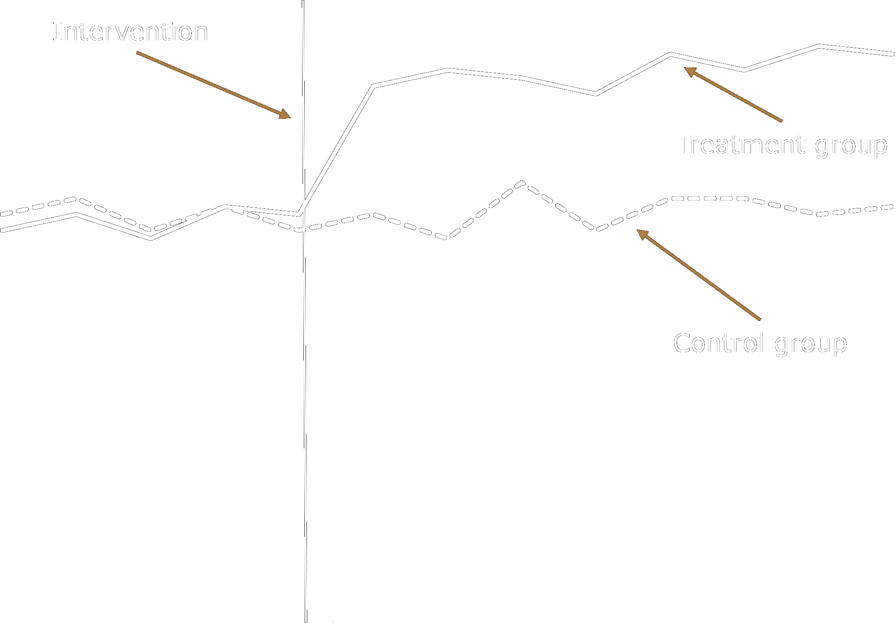
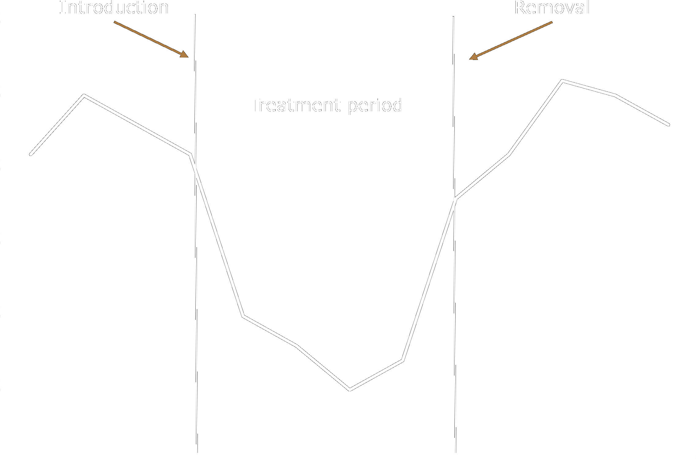

<script src="https://ajax.googleapis.com/ajax/libs/jquery/3.6.0/jquery.min.js"></script>

<script type="text/x-mathjax-config">
MathJax.Hub.Register.StartupHook("TeX Jax Ready",function () {
  MathJax.Hub.Insert(MathJax.InputJax.TeX.Definitions.macros,{
    cancel: ["Extension","cancel"],
    bcancel: ["Extension","cancel"],
    xcancel: ["Extension","cancel"],
    cancelto: ["Extension","cancel"]
  });
});
</script>

<style>
section {
    display: flex;
    display: -webkit-flex;
}

section {
    height: 600px;
    width: 60%;
    margin: auto;
    border-radius: 21px;
    background-color: #212121;
}

.remark-slide-container {
background: #212121;
}

.hljs-github .hljs {
    background: transparent;
    color: #b2dfdb;
}

.hljs-github .hljs-keyword {
    color: #64b5f6;
}

.hljs-github .hljs-literal {
    color: #64b5f6;
}

.hljs-github .hljs-number {
    color: #64b5f6;
}

.hljs-github .hljs-string {
    color: #b7b3ef;
}


.hljs-github .hljs {
    background: transparent;
    color: #b2dfdb;
}

.hljs-github .hljs-keyword {
    color: #64b5f6;
}

.hljs-github .hljs-literal {
    color: #64b5f6;
}

.hljs-github .hljs-number {
    color: #64b5f6;
}

.hljs-github .hljs-string {
    color: #b7b3ef;
}

section p {
    text-align: center;
    font-size: 30px;
    background-color: #212121;
    border-radius: 21px;
    font-family: Roboto Condensed;
    font-style: bold;
    padding: 12px;
    color: #bff4ee;
    margin: auto;
}

#center {
text-align: center;
}

#right {
  text-align: right;
} 

.center p {
  margin: 0;
  position: absolute;
  top: 50%;
  left: 50%;
  -ms-transform: translate(-50%, -50%);
  transform: translate(-50%, -50%);
}

.center2 {
  margin: 0;
  position: absolute;
  top: 50%;
  left: 50%;
  -ms-transform: translate(-50%, -50%);
  transform: translate(-50%, -50%);
}

.tab {
    display: inline-block;
    margin-left: 40px;
}

.obr
{
    display:block;
    margin-top:-15px;
}

.container {
  display: flex;
}

.container > div {
  flex: 1; /*grow*/
  margin-right: 40px;
}

td, th, tr, table {
    border: 0 !important;
    border-spacing:0 !important;
    overflow-x: hidden;
    overflow-y: hidden;
    background-color: unset !important;
    color: unset !important;
  }

tbody > td > tr:hover {
      background-color: unset !important;
      color: unset !important;
  }
</style>

```{css echo=FALSE}
.highlight-last-item > ul > li,
.highlight-last-item > ol > li {
  opacity: 0.5;
}
.highlight-last-item > ul > li:last-of-type,
.highlight-last-item > ol > li:last-of-type {
  opacity: 1;
}
```


```{r echo = FALSE, purl=FALSE}
xaringanthemer::style_duo(
  primary_color = "#212121",
  secondary_color = "#bff4ee",
  link_color = "#b1ead6",
  text_bold_color = "#4dc6e2",
  table_row_border_color = "#212121",
  table_row_even_background_color = "#212121",
  footnote_font_size = "0.6em",
  header_font_google = xaringanthemer::google_font("Roboto Condensed", "700"),
  text_font_google   = xaringanthemer::google_font("Roboto Condensed", "400")
)

xaringanExtra::use_xaringan_extra(c("tile_view", 
                                    "animate_css", 
                                    "tachyons"))

xaringanExtra::use_logo(
  image_url = here::here("static", "img", "course_hex.png"),
  link_url = "https://edp618.asocialdatascientist.com",
  position = xaringanExtra::css_position(top = "1em", right = "1em")
)
```

```{r, setup, include=FALSE}
knitr::opts_chunk$set(echo = FALSE)
options(knitr.table.format = function() {
  if (knitr::is_latex_output()) 'latex' else 'pandoc'
})

library(tidyverse)
library(knitr)
library(kableExtra)
library(fontawesome)
library(here)
library(showtext)
font_add_google("Roboto Condensed", "roboto")
showtext_auto()
```
   
```{r load_packages, message=FALSE, warning=FALSE, include=FALSE} 
library(tidyverse)
library(fontawesome)
library(knitr)
library(kableExtra)
```

# Part I: Modern Descriptions of Experiments 

--

.pull-left[
<p id="center" style="color:#f5ebd9; font-weight: bold; border:1px; border-style:solid; border-color:#f5ebd9; border-radius: 25px; padding: 0.3em;">
<i>Randomized</i>
</p>
]

--

.pull-right[
<p id="center" style="color:#f0b5d3; font-weight: bold; border:1px; border-style:solid; border-color:#f5ebd9; border-radius: 25px; padding: 0.3em;">
<i>Quasi-Experiments</i>
</p>
]

--

.pull-left[
<span style="color:#f5ebd9" class = "tab">Units are assigned to conditions randomly</span>
]

--

.pull-right[ 
<span style="color:#f0b5d3;" class = "tab">Units are assigned to conditions non-randomly</span>
]

--

.pull-left[
<span style="color:#f5ebd9" class = "tab">Randomly assigned units are probabilistically equivalent based on expectancy (if certain conditions are met)</span>
]

--

.pull-right[ 
<span style="color:#f0b5d3;" class = "tab">Assignment to conditions occurs by self-selection</span>
]

--

.pull-left[
<span style="color:#f5ebd9" class = "tab">Under the appropriate conditions, randomized experiments provide unbiased estimates of an effect</span>
]

--

.pull-right[ 
<span style="color:#f0b5d3;" class = "tab">Greater emphasis on enumerating and ruling out alternative explanations</span>
]

--

.pull-left[
<span style="color:#f5ebd9" class = "tab">Example: Randomized controlled trials (RCT)</span>
]

--

.pull-right[ 
<span style="color:#f0b5d3;" class = "tab">Example: Regression discontinuity design (RDD)</span>
]

---

##  Basic Design Elements and Notation 

---

###  Notation 

$$
  \require{enclose}
$$

<center>
```{r echo=FALSE}

tibble(
  
  Variable <- c("`X`", "`O`", "`R`", "`NR`", "\` $\\enclose{horizontalstrike}{X}$\ `", "`X_+`", "`X_-`", "`C`", "---", "&#183;&#183;&#183;"),
  
  Description <- c("treatment", "observation", "random assignment", "nonrandom assignment", "removed treatment", "treatment expected to produce an effect in one direction", "conceptually opposite treatment expected to reverse an effect", "cutting score", "non-randomly formed groups", "cohort")
  
) %>%
  kbl(format = "html",
      escape = FALSE,
      align = 'cl') %>%
  kable_paper(full_width = FALSE) %>%
  column_spec(1, width = "20em", color = "#ffffff", extra_css = 'vertical-align: middle !important;') %>%
  column_spec(2, width = "30em", color = "#ffffff", extra_css = 'vertical-align: middle !important;') %>%
  row_spec(0, color = "#ffffff", extra_css = 'vertical-align: middle !important;')
```
</center>


---

# The Logic of Quasi-Experimentation 

---

###  Rationale 

--

+ Quasi-experiments are often a necessity given practical and logistical constraints

--

+ <div class="container">
  <div>Greater emphasis on construct or external validity rather than cause-effect associations</div>
  <div>Funding, ethics, administration</div>
  <div>The intervention has already occurred</div>
</div>
<br>
<div class="container">
  <div><center><i><span style="color:#ff70a6">least common</span></i></center></div>
  <div><center><i><span style="color:#c8b8db">somewhat common</span></i></center></div>
  <div><center><i><span style="color:#70d6ff">most common</span></i></center></div>
</div>

--

+ Sometimes they are the best alternative, even if causal inferences are weaker than is possible with other designs

---

### Central Principles 
  
--
  
  + Identification and study of plausible threats to internal validity

--
  
  + Careful scrutiny of plausible alternative explanations for treatment-outcome covariation

--
  
  + Primacy of control by design

--
  
  + Use carefully planned and implemented design elements rather than statistical controls for anticipated confounds

--
  
  + Coherent pattern matching
  
--

  + Complex (a priori) causal hypotheses that reduce the plausibility of alternative explanations

  
---

## Designs without Control Groups

---
  
### One-Group Posttest Only Design 

--

.center2[
```{r echo = FALSE}
tibble(
  c("`X`", 
    "",
    "",
    "Treatment"),
  c("", 
    "",
    "",
    "\` $\\rightarrow$\ `"),
  c("`O_2`", 
    "",
    "",
    "Posttest"),
  .name_repair = "minimal"
) %>%
  kbl(col.names = c("", "", ""),
      format = "html",
      escape = FALSE,
      align = 'ccc') %>%
  kable_paper(full_width = FALSE) %>%
  column_spec(c(1,3), width = "10em", color = "#ffffff", extra_css = 'vertical-align: middle !important;') %>%
  column_spec(c(2), width = "3em", color = "#ffffff", extra_css = 'vertical-align: middle !important;',
              background = "transparent") 
```
]

--

<br>
<br>
<br>
<br>
<br>
<br>
<br>
<br>
<br>
<br>
<br>
<br>
<br>
<br>
+ Absence of pretest makes it difficult to know if change has occurred and absence of a control group makes it difficult to know what would have happened without treatment

--

+ Known as a one-shot study

---

## One-Group Pretest-Posttest Design

--

.center2[
```{r echo = FALSE}
tibble(
  c("`O_1`", 
    "",
    "",
    "Pretest"),
  c("", 
    "",
    "",
    "\` $\\rightarrow$\ `"),
  c("`X`", 
    "",
    "",
    "Treatment"),
  c("", 
    "",
    "",
    "\` $\\rightarrow$\ `"),
  c("`O_2`", 
    "",
    "",
    "Posttest"),
  .name_repair = "minimal"
) %>%
  kbl(col.names = c("", "", "", "", ""),
      format = "html",
      escape = FALSE,
      align = 'ccccc') %>%
  column_spec(c(1,3,5), width = "10em", color = "#ffffff", extra_css = 'vertical-align: middle !important;') %>%
  column_spec(c(2,4), width = "3em", color = "#ffffff", extra_css = 'vertical-align: middle !important;') 
```
]

--

<br>
<br>
<br>
<br>
<br>
<br>
<br>
<br>
<br>
<br>
<br>
<br>
+ Adding a pretest provides weak information concerning what might have happened to participants had the treatment not occurred

--

+ Known as a pre-post study

---

### One-Group Pretest-Posttest Design with Double Pretest

--

.center2[
```{r echo = FALSE}
tibble(
  c("`O_1`", 
    "",
    "",
    "Pretest"),
  c("", 
    "",
    "",
    "\` $\\rightarrow$\ `"),
  c("`O_2`", 
    "",
    "",
    "Pretest"),
  c("", 
    "",
    "",
    "\` $\\rightarrow$\ `"),
  c("`X`", 
    "",
    "",
    "Treatment"),
  c("", 
    "",
    "",
    "\` $\\rightarrow$\ `"),
  c("`O_3`", 
    "",
    "",
    "Posttest"),
  .name_repair = "minimal"
) %>%
  kbl(col.names = c("", "", "", "", "", "", ""),
      format = "html",
      escape = FALSE,
      align = 'ccccccc') %>%
  column_spec(c(1,3,5,7), width = "10em", color = "#ffffff", extra_css = 'vertical-align: middle !important;') %>%
  column_spec(c(2,4,6), width = "3em", color = "#ffffff", extra_css = 'vertical-align: middle !important;') 
```
]

--

<br>
<br>
<br>
<br>
<br>
<br>
<br>
<br>
<br>
<br>
<br>
<br>
<br>
+ Adding multiple pretests reduces the plausibility of maturation and regression effects

--

+ Can confirm maturational trends

---

### One-Group Pretest-Posttest Design Using a Nonequivalent Variable

--

.center2[
```{r echo = FALSE}
tibble(
  c("`\\{O_{1A}, O_{1B}\\}`", 
    "",
    "",
    "Pretest"),
  c("", 
    "",
    "",
    "\` $\\rightarrow$\ `"),
  c("`X`", 
    "",
    "",
    "Treatment"),
  c("", 
    "",
    "",
    "\` $\\rightarrow$\ `"),
  c("`\\{O_{2A}, O_{2B}\\}`", 
    "",
    "",
    "Posttest"),
  .name_repair = "minimal"
) %>%
  kbl(col.names = c("", "", "", "", ""),
      format = "html",
      escape = FALSE,
      align = 'ccccc') %>%
  column_spec(c(1,3,5), width = "10em", color = "#ffffff", extra_css = 'vertical-align: middle !important;') %>%
  column_spec(c(2,4), width = "3em", color = "#ffffff", extra_css = 'vertical-align: middle !important;') 
```
]

--

<br>
<br>
<br>
<br>
<br>
<br>
<br>
<br>
<br>
<br>
<br>
<br>
<br>
+ Measure $A$ is expected to change because of treatment, $B$ is not

--

+ Both $A$ and $B$ are expected to respond to the same validity threats in the same way

---

#### Example

*Lottery ticket sales in convenience stores after introduction of signs in store windows reading “did you buy your ticket?”*

<br>
<center>

<center>

---

## Removed-Treatment Design

--

$$
  \require{enclose}
$$

.center2[
```{r echo = FALSE}
tibble(
  c("`O_1`", 
    "",
    "",
    "Pretest"),
  c("", 
    "",
    "",
    "\` $\\rightarrow$\ `"),
  c("`X`", 
    "",
    "",
    "Treatment"),
  c("", 
    "",
    "",
    "\` $\\rightarrow$\ `"),
  c("`O_2`", 
    "",
    "",
    "Posttest"),
  c("", 
    "",
    "",
    "\` $\\rightarrow$\ `"),
  c("`O_3`", 
    "",
    "",
    "Pretest"),
  c("", 
    "",
    "",
    "\` $\\rightarrow$\ `"),
  c("\` $\\enclose{horizontalstrike}{X}$\ `", 
    "",
    "",
    "Removal"),
  c("", 
    "",
    "",
    "\` $\\rightarrow$\ `"),
  c("`O_4`", 
    "",
    "",
    "Posttest"),
  .name_repair = "minimal"
) %>%
  kbl(col.names = c("", "", "", "", "", "", "", "", "", "", ""),
      format = "html",
      escape = FALSE,
      align = 'ccccccccccc') %>%
  column_spec(c(1,3,5,7,9,11), width = "10em", color = "#ffffff", extra_css = 'vertical-align: middle !important;') %>%
  column_spec(c(2,4,6,8,10), width = "3em", color = "#ffffff", extra_css = 'vertical-align: middle !important;') 
```
]

--

<br>
<br>
<br>
<br>
<br>
<br>
<br>
<br>
<br>
<br>
<br>
<br>
+ Demonstrates that outcomes rise and fall with the presence or absence of treatment

---

#### Example

*Generally interpretable outcome pattern*

<br>
<center>

<center>

---

### Repeated-Treatment Design

--

$$
  \require{enclose}
$$

.center2[
```{r echo = FALSE}
tibble(
  c("`O_1`", 
    "",
    "",
    "Pretest"),
  c("", 
    "",
    "",
    "\` $\\rightarrow$\ `"),
  c("`X`", 
    "",
    "",
    "Treatment"),
  c("", 
    "",
    "",
    "\` $\\rightarrow$\ `"),
  c("`O_2`", 
    "",
    "",
    "Posttest"),
  c("", 
    "",
    "",
    "\` $\\rightarrow$\ `"),
  c("\` $\\enclose{horizontalstrike}{X}$\ `", 
    "",
    "",
    "Removal"),
  c("", 
    "",
    "",
    "\` $\\rightarrow$\ `"),
  c("`O_3`", 
    "",
    "",
    "Posttest"),
  c("", 
    "",
    "",
    "\` $\\rightarrow$\ `"),
    c("`X`", 
    "",
    "",
    "Treatment"),
    c("", 
    "",
    "",
    "\` $\\rightarrow$\ `"),
  c("`O_4`", 
    "",
    "",
    "Posttest"),
  .name_repair = "minimal"
) %>%
  kbl(col.names = c("", "", "", "", "", "", "", "", "", "", "", "", ""),
      format = "html",
      escape = FALSE,
      align = 'ccccccccccccc') %>%
  column_spec(c(1,3,5,7,9,11,13), width = "10em", color = "#ffffff", extra_css = 'vertical-align: middle !important;') %>%
  column_spec(c(2,4,6,8,10,12), width = "3em", color = "#ffffff", extra_css = 'vertical-align: middle !important;') 
```
]

--

<br>
<br>
<br>
<br>
<br>
<br>
<br>
<br>
<br>
<br>
<br>
<br>
+ Few threats could explain a close relationship between treatment introductions and removals and parallel outcome changes

---

#### Example

*Mean narcotics use over multiple Methadone maintenance on/off conditions*

<br>
<center>

<center>

---

# $A - B$ Designs 

--
  
+ Multiple-baseline design (a class of single-subject designs), or collection of $A - B$ designs, to assess the effects of an intervention across separate baselines

--

+ Variables

 > $A$ = baseline
 
 > $B$ = treatment

--

+ The intervention is introduced in a staggered manner and the baseline provides a predicted level of the dependent variable in absence of the treatment

--

+ $A - B - A$ designs are sometimes called removal designs (i.e., the treatment is removed)

---

#### Example

<br>
<center>

<center>

---

## Designs that use a Control Group but no Pretest 

---

###  Posttest-Only Design with Nonequivalent Control Group 

--

.center2[
```{r echo = FALSE}
tibble(
  c("`NR`", 
    "",
    "------",
    "",
    "`NR`",
    "",
    "",
    "Non Random Assignment"),
  c("", 
    "",
    "------",
    "",
    "",
    "",
    "",
    "\` $\\rightarrow$\ `"),
  c("`X`", 
    "",
    "------",
    "",
    "",
    "",
    "",
    "Treatment"),
  c("", 
    "",
    "------",
    "",
    "",
    "",
    "",
    "\` $\\rightarrow$\ `"),
  c("`O_1`", 
    "",
    "------",
    "",
    "`O_1`",
    "",
    "",
    "Posttest"),
  .name_repair = "minimal"
) %>%
  kbl(col.names = c("", "", "", "", ""),
      format = "html",
      escape = FALSE,
      align = 'ccccc') %>%
  column_spec(c(1,3,5), width = "10em", color = "#ffffff", extra_css = 'vertical-align: middle !important;') %>%
  column_spec(c(2,4), width = "3em", color = "#ffffff", extra_css = 'vertical-align: middle !important;') %>% 
  kable_styling()
```
]

--

<br>
<br>
<br>
<br>
<br>
<br>
<br>
<br>
<br>
<br>
<br>
<br>
<br>
<br>
<br>
<br>
+ Unknown pretest group differences make it extremely difficult to separate treatment effects from selection effects

---

###  Posttest-Only Design using an Independent Sample Pretest 

--

.center2[
```{r echo = FALSE}
tibble(
  c("`NR`", 
    "",
    "------",
    "",
    "`NR`",
    "",
    "",
    "Non Random Assignment"),
  c("", 
    "",
    "------",
    "",
    "",
    "",
    "",
    "\` $\\rightarrow$\ `"),
  c("`O_1`", 
    "",
    "------",
    "",
    "`O_1`",
    "",
    "",
    "Pretest"),
  c("&#166;", 
    "",
    "------",
    "",
    "&#166;",
    "",
    "",
    "\` $\\rightarrow$\ `"),
  c("`X`", 
    "",
    "------",
    "",
    "",
    "",
    "",
    "Treatment"),
  c("", 
    "",
    "------",
    "",
    "",
    "",
    "",
    "\` $\\rightarrow$\ `"),
  c("`O_2`", 
    "",
    "------",
    "",
    "`O_2`",
    "",
    "",
    "Posttest"),
  .name_repair = "minimal"
) %>%
  kbl(col.names = c("", "", "", "", "", "", ""),
      format = "html",
      escape = FALSE,
      align = 'ccccc') %>%
  column_spec(c(1,3,5,7), width = "10em", color = "#ffffff", extra_css = 'vertical-align: middle !important;') %>%
  column_spec(c(2,4,6), width = "3em", color = "#ffffff", extra_css = 'vertical-align: middle !important;') %>% 
  kable_styling()
```
]

--

<br>
<br>
<br>
<br>
<br>
<br>
<br>
<br>
<br>
<br>
<br>
<br>
<br>
<br>
<br>
<br>
Assumes overlapping group membership

  + Pretest measurements may be reactive 

--

  + Cannot follow same groups over time

--

  + When interested in studying intact communities whose members change over time

---

##  Case Control Studies 

--
  
+ Predominant method for many forms of epidemiological research

--

+ Used to identify factors that may contribute to a condition by comparing subjects who have that condition (i.e., *cases*) with those who do not have the condition but are otherwise similar (i.e., *controls*)

--

+ Example: Used to determine the association between smoking and lung cancer

---

### Untreated Control Group Design with Dependent Pretest and Posttest Samples

--

.center2[
```{r echo = FALSE}
tibble(
  c("`NR`", 
    "",
    "------",
    "",
    "`NR`",
    "",
    "",
    "Non Random Assignment"),
  c("", 
    "",
    "------",
    "",
    "",
    "",
    "",
    "\` $\\rightarrow$\ `"),
  c("`O_1`", 
    "",
    "------",
    "",
    "`O_1`",
    "",
    "",
    "Pretest"),
  c("", 
    "",
    "------",
    "",
    "",
    "",
    "",
    "\` $\\rightarrow$\ `"),
  c("`X`", 
    "",
    "------",
    "",
    "",
    "",
    "",
    "Treatment"),
  c("", 
    "",
    "------",
    "",
    "",
    "",
    "",
    "\` $\\rightarrow$\ `"),
  c("`O_2`", 
    "",
    "------",
    "",
    "`O_2`",
    "",
    "",
    "Posttest"),
  .name_repair = "minimal"
) %>%
  kbl(col.names = c("", "", "", "", "", "", ""),
      format = "html",
      escape = FALSE,
      align = 'ccccc') %>%
  column_spec(c(1,3,5,7), width = "10em", color = "#ffffff", extra_css = 'vertical-align: middle !important;') %>%
  column_spec(c(2,4,6), width = "3em", color = "#ffffff", extra_css = 'vertical-align: middle !important;') %>% 
  kable_styling()
```
]

--

<br>
<br>
<br>
<br>
<br>
<br>
<br>
<br>
<br>
<br>
<br>
<br>
<br>
+ A selection bias is always present, but the pretest observation allows for determining the magnitude and direction of bias

---

#### Outcome Pattern 1

--

> *Both groups grow apart at different average rates in the same direction*

--

> This pattern is consistent with treatment effects and can sometimes be causally interpreted, but it is subject to numerous threats, especially selection-maturation

--

.pull-right[

]

---

#### Outcome Pattern 2

--

> *Spontaneous growth only occurs in the treatment group*

--

> Not a lot of reliance can be placed on this pattern as the reasons why spontaneous growth only occurred in the treatment group must be explained (e.g., selection-maturation) 

--

.pull-right[

]

---

#### Outcome Pattern 3

--

> *Initial pretest differences favoring the treatment group diminish over time*

--

> Same internal validity threats as outcome patterns #1 and #2 except that selection-maturation threats are less plausible

--

.pull-right[

]

---

#### Outcome Pattern 4

--

> *Initial pretest differences favoring the control group diminish over time*

--

> Subject to numerous validity threats (e.g., selection-instrumentation, selection-history), but generally can be causally interpreted

--

.pull-right[

]

---

#### Outcome Pattern 5

--

> *Outcomes that crossover in the direction of relationships*

--

> Most amenable to causal interpretation and most threats cannot plausibly explain this pattern

--

.pull-right[

]

---

## Modeling Selection Bias

<div style="display: flex; justify-content: flex-end">
.footnote[<sup>1</sup> aka <span style="color:#f5ebd9;"><i>strata</i></span><br>
<sup>2</sup> aka <span style="color:#f0b5d3;"><i>propensities</i></span>]
</div>

--

.pull-left[
<p id="center" style="color:#f5ebd9; font-weight: bold; border:1px; border-style:solid; border-color:#f5ebd9; border-radius: 25px; padding: 0.3em; margin-top: -6px">
<i>Sample matching / Stratified sampling</i><br><br>
Pair samples so that the participants share every characteristic except for the one under investigation / Sample specific proportions of individuals from various subpopulations<span style="color:#ffffff;"><sup>1</sup></span> within a larger population
</p>
]

--

.pull-right[
<p id="center" style="color:#f0b5d3; font-weight: bold; border:1px; border-style:solid; border-color:#f0b5d3; border-radius: 25px; padding: 0.3em; margin-top: -6px">
<i>Instrumental variable analysis</i><br><br>
Statistical modeling of covariates believed to explain selection biases
</p>
]

--

<center>
<br>
<p id="center" style="color:#d9f5eb; font-weight: bold; border:1px; border-style:solid; border-color:#f5ebd9; border-radius: 25px; padding: 0.3em; width: 525px; margin-top: -6px">
<i>Hidden bias analysis</i><br><br>
Difference with respect to unmeasured variables/characteristics
</p>
<br>
</center>

--

.pull-left[
<p id="center" style="color:#f5ebd9; font-weight: bold; border:1px; border-style:solid; border-color:#f5ebd9; border-radius: 25px; padding: 0.3em; margin-top: -6px">
<i>Sensitivity analysis</i><br><br>
Detect hidden bias that would be needed to explain observed differences
</p>
]

--

.pull-right[
<p id="center" style="color:#f0b5d3; font-weight: bold; border:1px; border-style:solid; border-color:#f0b5d3; border-radius: 25px; padding: 0.3em; margin-top: -6px">
<i>Propensity score analysis</i><br><br>
Predict probabilities<span style="color:#ffffff;"><sup>2</sup></span> of group membership which are then used for matching or as covariate
</p>
]

---

## Interrupted Time-Series

--

tracking a period before and after an intervention at a known point in time to assess the intervention’s effects within a single group/population

--

.pull-left[
Observations can be made over a period<br><br><br>
aka a <i>time series</i>
]

--

.pull-right[ 
An exact point is known where a treatment or intervention occurred<br><br> 
aka an <i>interruption</i>
]

--

<br>
<center>

<center>

---

### Types of Effects

--

.pull-left[
<span class="tab">Form</span>
]

.pull-right[
slope or intercept changes
]

--

.pull-left[
<span class="tab">Permanence</span>
]

.pull-right[
changes from continuous to discontinuous (or visa versa)
]

--

.pull-left[
<span class="tab">Level</span>
] 

.pull-right[
changes read as instantaneous or delayed 
]

---

### Autocorrelation

--

> occurs when observation at one point in time depends from observations at another point in time

--

> effects must be modeled and removed from a time-series before assessing treatment impact

--

.pull-left[
<span class="tab"><i>Trends</i></span><br><br>
<span class="tab">an upwards or downwards shift in a data set over time</span>
]

.pull-right[
<br>
<br>
<span class="tab">Average life expectancy at birth, population of the Earth</span>
]

--

.pull-left[
<span class="tab"><i>Seasonality</i></span><br><br>
<span class="tab">observations that coincide with seasonal patterns</span>
] 

.pull-right[
<br>
<br>
<span class="tab">sales of ice cream, average global temperature</span>
]

--

.pull-left[
<span class="tab"><i>Cyclicity</i></span><br><br>
<span class="tab">data rise and fall, but without a fixed frequency and duration caused</span>
] 

.pull-right[
<br>
<br>
<span class="tab">time getting out of bed, traffic congestion</span>
]

--

.pull-left[
<span class="tab"><i>Noise</i></span><br><br>
<span class="tab">Random variations</span>
]

.pull-right[
<br>
<br>
<span class="tab">level of wellbeing dependent on prior rest, sneezing incessantly</span>
]

---

<br>
<br>
<br>
<br>
<br>
<center>

</center>

---

<br>
<br>
<br>
<br>
<br>
<center>
```{r echo = FALSE}
tibble(
  c("`O_1`", 
    "",
    "",
    "Prettest"),
  c("", 
    "",
    "",
    "\` $\\rightarrow$\ `"),
  c("`O_2`", 
    "",
    "",
    "Pretest"),
  c("", 
    "",
    "",
    "\` $\\rightarrow$\ `"),
  c("`O_3`", 
    "",
    "",
    "Pretest"),
  c("", 
    "",
    "",
    "\` $\\rightarrow$\ `"),
  c("`O_4`", 
    "",
    "",
    "Pretest"),
  c("", 
    "",
    "",
    "\` $\\rightarrow$\ `"),
  c("`O_5`", 
    "",
    "",
    "Pretest"),
  c("", 
    "",
    "",
    "\` $\\rightarrow$\ `"),
  c("`X`", 
    "",
    "",
    "Treatment"),
  c("", 
    "",
    "",
    "\` $\\rightarrow$\ `"),
  c("`O_6`", 
    "",
    "",
    "Posttest"),
    c("", 
    "",
    "",
    "\` $\\rightarrow$\ `"),
  c("`O_7`", 
    "",
    "",
    "Posttest"),
    c("", 
    "",
    "",
    "\` $\\rightarrow$\ `"),
  c("`O_8`", 
    "",
    "",
    "Posttest"),
    c("", 
    "",
    "",
    "\` $\\rightarrow$\ `"),
  c("`O_9`", 
    "",
    "",
    "Posttest"),
    c("", 
    "",
    "",
    "\` $\\rightarrow$\ `"),
  c("`O_{10}`", 
    "",
    "",
    "Posttest"),
  .name_repair = "minimal"
) %>%
  kbl(col.names = c("", "", "","", "", "","", "", "", "", "", "", "","", "", "", "", "", "", "", ""),
      format = "html",
      escape = FALSE,
      align = 'ccccccccccccccccccccc') %>%
  kable_paper(full_width = FALSE) %>%
  column_spec(c(1,3,5,7,9,11,13,15,17,19,21), width = "10em", color = "#ffffff", extra_css = 'vertical-align: middle !important;') %>%
  column_spec(c(2,4,6,8,10,12,14,16,18,20), width = "3em", color = "#ffffff", extra_css = 'vertical-align: middle !important;') 
```
</center>

--

<br>
> The basic interrupted time-series design requires one treatment group with many observations before and after a treatment

---

<br>
<br>
<br>
<br>
<center>

</center>

---

<br>
<br>
<br>
<br>
<center>

</center>

---

<br>
<br>
<br>
<br>
<center>

</center>

---

<br>
<br>
<br>
<br>
<center>

</center>

---

<br>
<br>
<br>
<br>
<center>

</center>

---

<br>
<br>
<br>
<br>
<center>

</center>

---

# Part II: Mixed Methods Evaluations

---

## Branches

--

<br>
<br>
.pull-left[
<p id="center" style="color:#baffc9; font-weight: bold; border:1px; border-style:solid; border-color:#baffc9; border-radius: 25px; padding: 0.3em;">
<i>Methods</i><br><br>
emphasis on the use of research methods in the form of techniques used to conduct the evaluations
</p>
]

--

.pull-right[
<p id="center" style="color:#ffb3ba; font-weight: bold; border:1px; border-style:solid; border-color:#ffb3ba; border-radius: 25px; padding: 0.3em;">
<i>Use</i><br><br>
emphasis on utility
</p>
]

--

.pull-left[
<p id="center" style="color:#bae1ff; font-weight: bold; border:1px; border-style:solid; border-color:#bae1ff; border-radius: 25px; padding: 0.3em;">
<i>Values</i><br><br>
emphasis on an evaluand
</p>
]

--

.pull-right[
<p id="center" style="color:#ffdfba; font-weight: bold; border:1px; border-style:solid; border-color:#ffdfba; border-radius: 25px; padding: 0.3em;">
<i>Social Justice</i><br><br>
emphasis on marginalized groups in society and their advocates, the need to explicitly address issues of power, and the design of evaluations to create change
</p>
]

---

## <span style="color:#baffc9">Methods</span> Branch

--

- quantitatively driven mixed methods designs

--

- priority on the use of randomized controlled trials

---


## <span style="color:#ffb3ba">Use</span> Branch

--

- prioritize the need to assist key program stakeholders in program decision making

--

- concerned for the ways in which evaluation information will be used and focus specifically on those who will use the information

---

## <span style="color:#bae1ff">Values</span> Branch

--

- values and subjective meaning

--

- values with a secondary concern for methods

---

## <span style="color:#ffdfba">Social Justice</span> Branch

--

- addresses issues of power

--

- design of evaluations to support social transformation

---

### Task

In groups of two or three, design a mixed methods evaluation study with a QED to address the efficacy of a drug of your choice. First review the content from Chapters 1 and 2 in Mertens (2017). Then be ready to present a multi page slideshow addressing the following criteria

> your research question

> the type of mixed methods evaluation

> how the study addresses for any deficiencies with your chosen QED

> a context specific picture of both the study and specific QED, respectively

> any additional information that should help us to understand the overall narrative

---

#  That’s It! 

Any questions?

--

<br>
<br>
<br>
<br>
<br>
<br>
<br>
<br>
<center>
<br><br>
<div class="fade_rule"></div>  
<br><br>
</center>

<center>
<a rel="license" href="http://creativecommons.org/licenses/by-nc-sa/4.0/"></a><br /><br />This work is licensed under a <br /><a rel="license" href="http://creativecommons.org/licenses/by-nc-sa/4.0/">Creative Commons Attribution-NonCommercial-ShareAlike 4.0 International License</a>
</center>