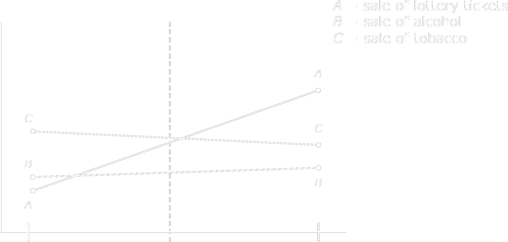
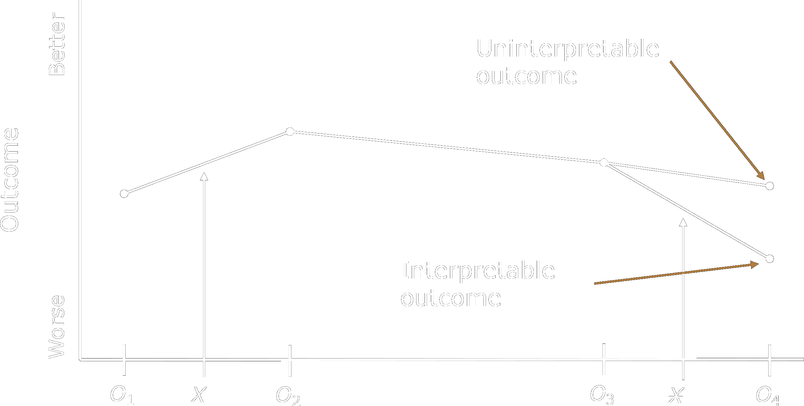
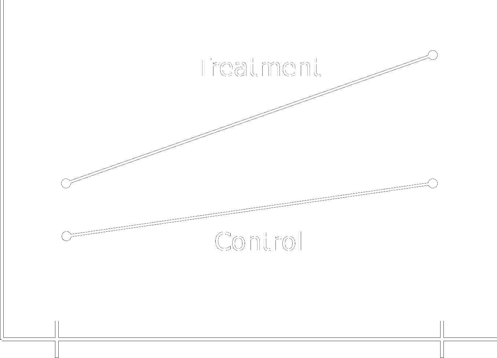
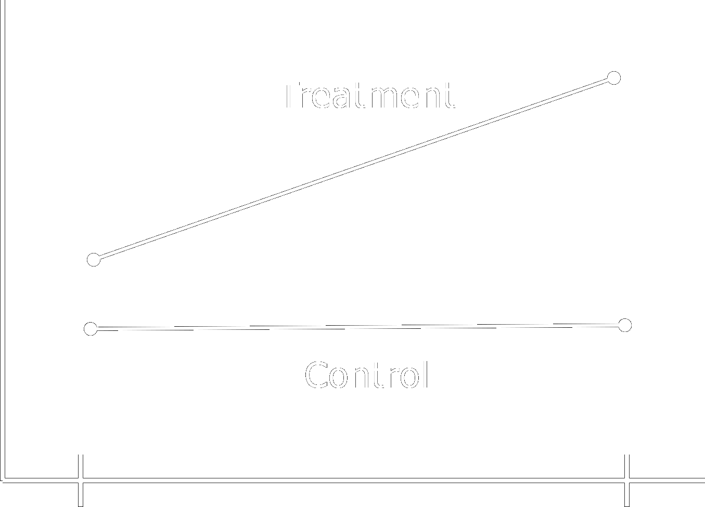
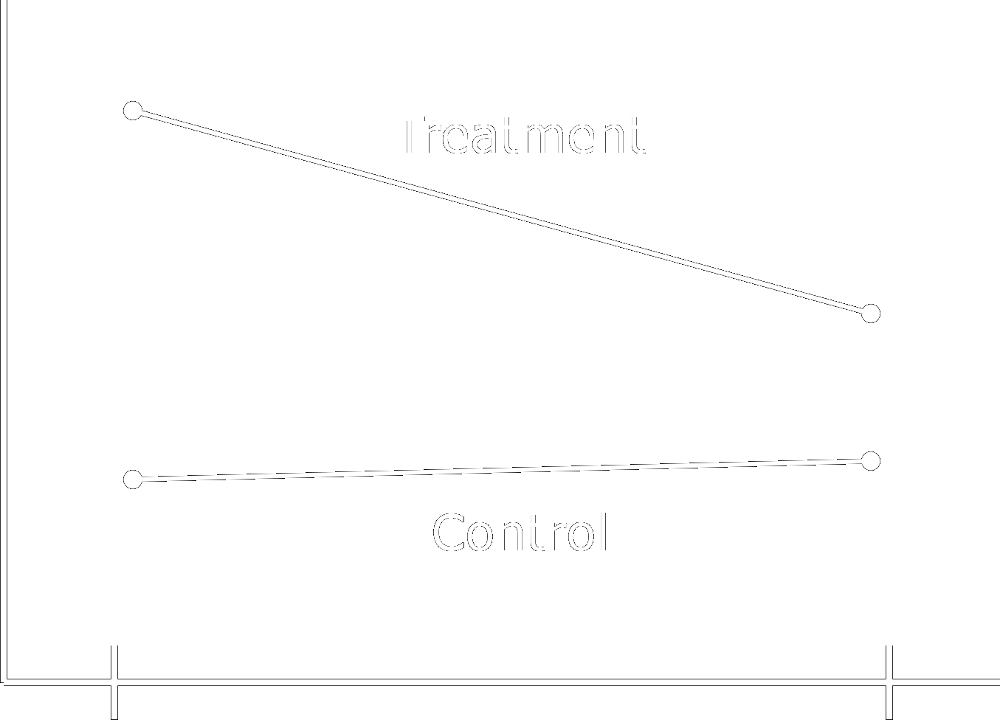
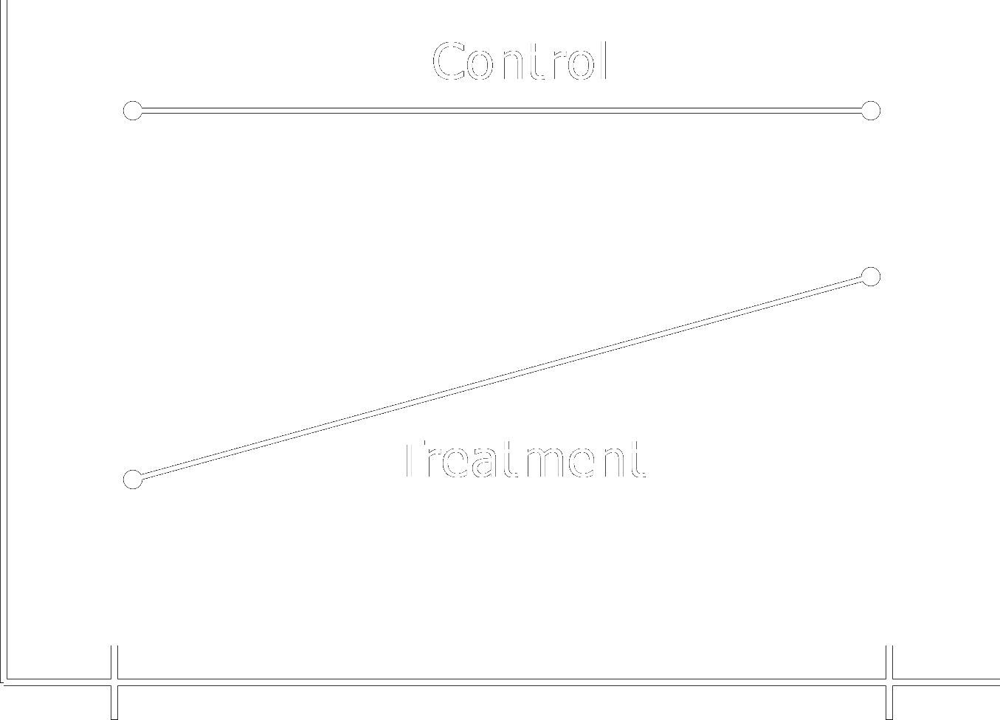
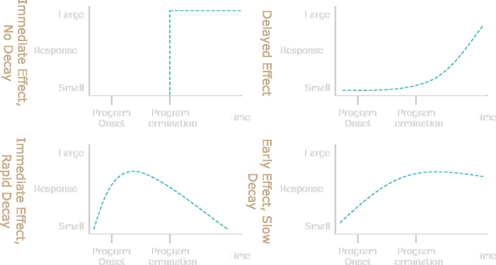
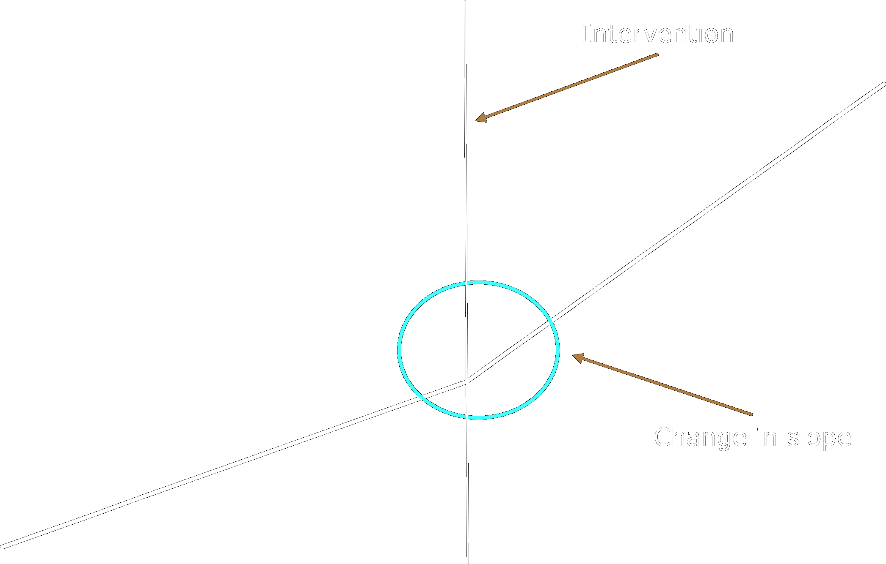
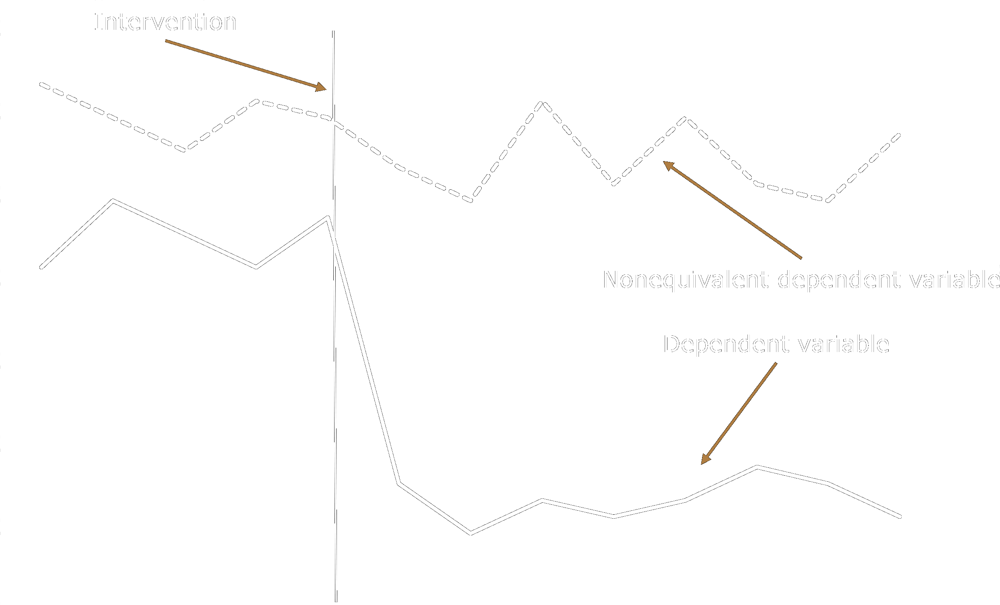

<script src="https://ajax.googleapis.com/ajax/libs/jquery/3.6.0/jquery.min.js"></script>

<script type="text/x-mathjax-config">
MathJax.Hub.Register.StartupHook("TeX Jax Ready",function () {
  MathJax.Hub.Insert(MathJax.InputJax.TeX.Definitions.macros,{
    cancel: ["Extension","cancel"],
    bcancel: ["Extension","cancel"],
    xcancel: ["Extension","cancel"],
    cancelto: ["Extension","cancel"]
  });
});
</script>

<style>
section {
    display: flex;
    display: -webkit-flex;
}

section {
    height: 600px;
    width: 60%;
    margin: auto;
    border-radius: 21px;
    background-color: #212121;
}

section p {
    text-align: center;
    font-size: 30px;
    background-color: #212121;
    border-radius: 21px;
    font-family: Roboto Condensed;
    font-style: bold;
    padding: 12px;
    color: #bff4ee;
    margin: auto;
}

#center {
text-align: center;
}

.center p {
  margin: 0;
  position: absolute;
  top: 50%;
  left: 50%;
  -ms-transform: translate(-50%, -50%);
  transform: translate(-50%, -50%);
}

.center2 {
  margin: 0;
  position: absolute;
  top: 50%;
  left: 50%;
  -ms-transform: translate(-50%, -50%);
  transform: translate(-50%, -50%);
}

.tab {
    display: inline-block;
    margin-left: 40px;
}

td, th, tr, table {
    border: 0 !important;
    border-spacing:0 !important;
  }
</style>

```{css echo=FALSE}
.highlight-last-item > ul > li,
.highlight-last-item > ol > li {
  opacity: 0.5;
}
.highlight-last-item > ul > li:last-of-type,
.highlight-last-item > ol > li:last-of-type {
  opacity: 1;
}
.normal-list > ul > li,
.normal-list > ol > li {
  opacity: 1;
}
```

```{r, setup, include=FALSE}
knitr::opts_chunk$set(echo = FALSE)
options(knitr.table.format = function() {
  if (knitr::is_latex_output()) 'latex' else 'pandoc'
})
```
   
```{r load_packages, message=FALSE, warning=FALSE, include=FALSE} 
library(tidyverse)
library(fontawesome)
library(knitr)
library(kableExtra)
```

<!--
class: highlight-last-item
layout: true
-->

---

# Modern Descriptions of Experiments 

---

## Randomized Experiment 

--

+ Units are assigned to conditions randomly

--

+ Randomly assigned units are probabilistically equivalent based on expectancy (if certain conditions are met)

--

+ Under the appropriate conditions, randomized experiments provide unbiased estimates of an effect

---

## Quasi-Experiments

--

+ Shares all features of randomized experiments except assignment

--

+ Assignment to conditions occurs by self-selection

--

+ Greater emphasis on enumerating and ruling out alternative explanations

--

  + ... through logic and reasoning, design, and measurement

---

#  Basic Design Elements and Notation 

---

class: normal-list

##  Assignment

--
 
+ Random assignment

+ Cutoff-based assignment

+ Other nonrandom assignment

+ Matching and stratifying

+ Masking

---

class: normal-list

##  Measurement

--

+ Posttest observations

+ Single posttests

+ Nonequivalent dependent variables

+ Multiple substantive posttests

+ Pretest observations

+ Single pretest

+ Retrospective pretest

+ Proxy pretest

+ Repeated pretests over time

+ Pretests on independent samples

+ Moderator variable with predicted interaction

+ Measuring threats to validity

---

class: normal-list

##  Comparison Groups 

--

+ Single nonequivalent groups

+ Multiple nonequivalent groups

+ Cohorts

+ Internal versus external controls

+ Constructed contrasts

	+ Regression extrapolation contrasts
	
	+ Normed contrasts
	
	+ Secondary data contrasts

---

class: normal-list

##  Treatments 

--

+ Switching replications

+ Reversed treatments

+ Removed treatments

+ Repeated treatments

---

##  Notation 

$$
  \require{enclose}
$$

<center>
```{r echo=FALSE}

tibble(
  
  Variable <- c("`X`", "`O`", "`R`", "`NR`", "\` $\\enclose{horizontalstrike}{X}$\ `", "`X_+`", "`X_-`", "`C`", "---", "&#183;&#183;&#183;"),
  
  Description <- c("treatment", "observation", "random assignment", "nonrandom assignment", "removed treatment", "treatment expected to produce an effect in one direction", "conceptually opposite treatment expected to reverse an effect", "cutting score", "non-randomly formed groups", "cohort")
  
) %>%
  kbl(format = "html",
      escape = FALSE,
      align = 'cl') %>%
  kable_paper(full_width = FALSE) %>%
  column_spec(1, width = "20em", color = "#ffffff", extra_css = 'vertical-align: middle !important;') %>%
  column_spec(2, width = "30em", color = "#ffffff", extra_css = 'vertical-align: middle !important;') %>%
  row_spec(0, color = "#ffffff", extra_css = 'vertical-align: middle !important;')
```
</center>


---

# The Logic of Quasi-Experimentation 

---

##  Rationale 

--

+ Quasi-experiments are often a necessity given practical and logistical constraints

--

+ Greater emphasis on construct or external validity rather than cause-effect associations - ***least common***

--

+ Funding, ethics, administration - ***somewhat common***

--

+ The intervention has already occurred - ***most common***

--

+ Sometimes they are the best alternative, even if causal inferences are weaker than is possible with other designs

---

## Central Principles 
  
--
  
  + Identification and study of plausible threats to internal validity

--
  
  + Careful scrutiny of plausible alternative explanations for treatment-outcome covariation

--
  
  + Primacy of control by design

--
  
  + Use carefully planned and implemented design elements rather than statistical controls for anticipated confounds

--
  
  + Coherent pattern matching
  
--

  + Complex (a priori) causal hypotheses that reduce the plausibility of alternative explanations

--

  + Even so, great care must be taken when planning such studies as numerous threats that cannot be controlled are often operating
  
---

# Designs without Control Groups

---
  
## One-Group Posttest Only Design 

--

.center2[
```{r echo = FALSE}
tibble(
  c("`X`", 
    "",
    "",
    "Treatment"),
  c("", 
    "",
    "",
    "\` $\\rightarrow$\ `"),
  c("`O_2`", 
    "",
    "",
    "Posttest"),
  .name_repair = "minimal"
) %>%
  kbl(col.names = c("", "", ""),
      format = "html",
      escape = FALSE,
      align = 'ccc') %>%
  kable_paper(full_width = FALSE) %>%
  column_spec(c(1,3), width = "10em", color = "#ffffff", extra_css = 'vertical-align: middle !important;') %>%
  column_spec(c(2), width = "3em", color = "#ffffff", extra_css = 'vertical-align: middle !important;') 
```
]

--

<br>
<br>
<br>
<br>
<br>
<br>
<br>
<br>
<br>
<br>
<br>
<br>
> Absence of pretest makes it difficult to know if change has occurred and absence of a control group makes it difficult to know what would have happened without treatment

--

<br>
> Known as a one-shot study

---

## One-Group Pretest-Posttest Design

--

.center2[
```{r echo = FALSE}
tibble(
  c("`O_1`", 
    "",
    "",
    "Pretest"),
  c("", 
    "",
    "",
    "\` $\\rightarrow$\ `"),
  c("`X`", 
    "",
    "",
    "Treatment"),
  c("", 
    "",
    "",
    "\` $\\rightarrow$\ `"),
  c("`O_2`", 
    "",
    "",
    "Posttest"),
  .name_repair = "minimal"
) %>%
  kbl(col.names = c("", "", "", "", ""),
      format = "html",
      escape = FALSE,
      align = 'ccccc') %>%
  column_spec(c(1,3,5), width = "10em", color = "#ffffff", extra_css = 'vertical-align: middle !important;') %>%
  column_spec(c(2,4), width = "3em", color = "#ffffff", extra_css = 'vertical-align: middle !important;') 
```
]

--

<br>
<br>
<br>
<br>
<br>
<br>
<br>
<br>
<br>
<br>
<br>
<br>
> Adding a pretest provides weak information concerning what might have happened to participants had the treatment not occurred

--

<br>
> Known as a one-shot study

---

## One-Group Pretest-Posttest Design with Double Pretest

--

.center2[
```{r echo = FALSE}
tibble(
  c("`O_1`", 
    "",
    "",
    "Pretest"),
  c("", 
    "",
    "",
    "\` $\\rightarrow$\ `"),
  c("`O_2`", 
    "",
    "",
    "Pretest"),
  c("", 
    "",
    "",
    "\` $\\rightarrow$\ `"),
  c("`X`", 
    "",
    "",
    "Treatment"),
  c("", 
    "",
    "",
    "\` $\\rightarrow$\ `"),
  c("`O_3`", 
    "",
    "",
    "Posttest"),
  .name_repair = "minimal"
) %>%
  kbl(col.names = c("", "", "", "", "", "", ""),
      format = "html",
      escape = FALSE,
      align = 'ccccccc') %>%
  column_spec(c(1,3,5,7), width = "10em", color = "#ffffff", extra_css = 'vertical-align: middle !important;') %>%
  column_spec(c(2,4,6), width = "3em", color = "#ffffff", extra_css = 'vertical-align: middle !important;') 
```
]

--

<br>
<br>
<br>
<br>
<br>
<br>
<br>
<br>
<br>
<br>
<br>
<br>
> Adding multiple pretests reduces the plausibility of maturation and regression effects

--

<br>
> Additional pretests can confirm maturational trends

---

## One-Group Pretest-Posttest Design Using a Nonequivalent Variable

--

.center2[
```{r echo = FALSE}
tibble(
  c("`\\{O_{1A}, O_{1B}\\}`", 
    "",
    "",
    "Pretest"),
  c("", 
    "",
    "",
    "\` $\\rightarrow$\ `"),
  c("`X`", 
    "",
    "",
    "Treatment"),
  c("", 
    "",
    "",
    "\` $\\rightarrow$\ `"),
  c("`\\{O_{2A}, O_{2B}\\}`", 
    "",
    "",
    "Posttest"),
  .name_repair = "minimal"
) %>%
  kbl(col.names = c("", "", "", "", ""),
      format = "html",
      escape = FALSE,
      align = 'ccccc') %>%
  column_spec(c(1,3,5), width = "10em", color = "#ffffff", extra_css = 'vertical-align: middle !important;') %>%
  column_spec(c(2,4), width = "3em", color = "#ffffff", extra_css = 'vertical-align: middle !important;') 
```
]

--

<br>
<br>
<br>
<br>
<br>
<br>
<br>
<br>
<br>
<br>
<br>
<br>
> Measure $A$ is expected to change because of treatment, $B$ is not

--

<br>
> Both $A$ and $B$ are expected to respond to the same validity threats in the same way

---

### Example

*Lottery ticket sales in convenience stores after introduction of signs in store windows reading “did you buy your ticket?”*

<br>
<center>

<center>

---

## Removed-Treatment Design

--

$$
  \require{enclose}
$$

.center2[
```{r echo = FALSE}
tibble(
  c("`O_1`", 
    "",
    "",
    "Pretest"),
  c("", 
    "",
    "",
    "\` $\\rightarrow$\ `"),
  c("`X`", 
    "",
    "",
    "Treatment"),
  c("", 
    "",
    "",
    "\` $\\rightarrow$\ `"),
  c("`O_2`", 
    "",
    "",
    "Posttest"),
  c("", 
    "",
    "",
    "\` $\\rightarrow$\ `"),
  c("`O_3`", 
    "",
    "",
    "Pretest"),
  c("", 
    "",
    "",
    "\` $\\rightarrow$\ `"),
  c("\` $\\enclose{horizontalstrike}{X}$\ `", 
    "",
    "",
    "Removal"),
  c("", 
    "",
    "",
    "\` $\\rightarrow$\ `"),
  c("`O_4`", 
    "",
    "",
    "Posttest"),
  .name_repair = "minimal"
) %>%
  kbl(col.names = c("", "", "", "", "", "", "", "", "", "", ""),
      format = "html",
      escape = FALSE,
      align = 'ccccccccccc') %>%
  column_spec(c(1,3,5,7,9,11), width = "10em", color = "#ffffff", extra_css = 'vertical-align: middle !important;') %>%
  column_spec(c(2,4,6,8,10), width = "3em", color = "#ffffff", extra_css = 'vertical-align: middle !important;') 
```
]

--

<br>
<br>
<br>
<br>
<br>
<br>
<br>
<br>
<br>
<br>
<br>
<br>
> Demonstrates that outcomes rise and fall with the presence or absence of treatment

---

### Example

*Generally interpretable outcome pattern*

<br>
<center>

<center>

---

## Repeated-Treatment Design

--

$$
  \require{enclose}
$$

.center2[
```{r echo = FALSE}
tibble(
  c("`O_1`", 
    "",
    "",
    "Pretest"),
  c("", 
    "",
    "",
    "\` $\\rightarrow$\ `"),
  c("`X`", 
    "",
    "",
    "Treatment"),
  c("", 
    "",
    "",
    "\` $\\rightarrow$\ `"),
  c("`O_2`", 
    "",
    "",
    "Posttest"),
  c("", 
    "",
    "",
    "\` $\\rightarrow$\ `"),
  c("\` $\\enclose{horizontalstrike}{X}$\ `", 
    "",
    "",
    "Removal"),
  c("", 
    "",
    "",
    "\` $\\rightarrow$\ `"),
  c("`O_3`", 
    "",
    "",
    "Posttest"),
  c("", 
    "",
    "",
    "\` $\\rightarrow$\ `"),
    c("`X`", 
    "",
    "",
    "Treatment"),
    c("", 
    "",
    "",
    "\` $\\rightarrow$\ `"),
  c("`O_4`", 
    "",
    "",
    "Posttest"),
  .name_repair = "minimal"
) %>%
  kbl(col.names = c("", "", "", "", "", "", "", "", "", "", "", "", ""),
      format = "html",
      escape = FALSE,
      align = 'ccccccccccccc') %>%
  column_spec(c(1,3,5,7,9,11,13), width = "10em", color = "#ffffff", extra_css = 'vertical-align: middle !important;') %>%
  column_spec(c(2,4,6,8,10,12), width = "3em", color = "#ffffff", extra_css = 'vertical-align: middle !important;') 
```
]

--

<br>
<br>
<br>
<br>
<br>
<br>
<br>
<br>
<br>
<br>
<br>
<br>
> Few threats could explain a close relationship between treatment introductions and removals and parallel outcome changes

---

### Example

*Mean narcotics use over multiple Methadone maintenance on/off conditions*

<br>
<center>

<center>

---

# $A - B$ Designs 

--
  
+ Multiple-baseline design (a class of single-subject designs), or collection of $A - B$ designs, to assess the effects of an intervention across separate baselines

--

+ Variables

>- $A$ = baseline

--

>- $B$ = treatment

--

+ The intervention is introduced in a staggered manner and the baseline provides a predicted level of the dependent variable in absence of the treatment

--

+ $A - B - A$ designs are sometimes called removal designs (i.e., the treatment is removed)

---

### Example

<br>
<center>

<center>

---

# Designs that use a Control Group but no Pretest 

---

##  Posttest-Only Design with Nonequivalent Control Group 

--

.center2[
```{r echo = FALSE}
tibble(
  c("`NR`", 
    "",
    "------",
    "",
    "`NR`",
    "",
    "",
    "Non Random Assignment"),
  c("", 
    "",
    "------",
    "",
    "",
    "",
    "",
    "\` $\\rightarrow$\ `"),
  c("`X`", 
    "",
    "------",
    "",
    "",
    "",
    "",
    "Treatment"),
  c("", 
    "",
    "------",
    "",
    "",
    "",
    "",
    "\` $\\rightarrow$\ `"),
  c("`O_1`", 
    "",
    "------",
    "",
    "`O_1`",
    "",
    "",
    "Posttest"),
  .name_repair = "minimal"
) %>%
  kbl(col.names = c("", "", "", "", ""),
      format = "html",
      escape = FALSE,
      align = 'ccccc') %>%
  column_spec(c(1,3,5), width = "10em", color = "#ffffff", extra_css = 'vertical-align: middle !important;') %>%
  column_spec(c(2,4), width = "3em", color = "#ffffff", extra_css = 'vertical-align: middle !important;') %>% 
  kable_styling()
```
]

--

<br>
<br>
<br>
<br>
<br>
<br>
<br>
<br>
<br>
<br>
<br>
<br>
<br>
<br>
> Unknown pretest group differences make it extremely difficult to separate treatment effects from selection effects

---

##  Posttest-Only Design using an Independent Sample Pretest 

--

.center2[
```{r echo = FALSE}
tibble(
  c("`NR`", 
    "",
    "------",
    "",
    "`NR`",
    "",
    "",
    "Non Random Assignment"),
  c("", 
    "",
    "------",
    "",
    "",
    "",
    "",
    "\` $\\rightarrow$\ `"),
  c("`O_1`", 
    "",
    "------",
    "",
    "`O_1`",
    "",
    "",
    "Pretest"),
  c("&#166;", 
    "",
    "------",
    "",
    "&#166;",
    "",
    "",
    "\` $\\rightarrow$\ `"),
  c("`X`", 
    "",
    "------",
    "",
    "",
    "",
    "",
    "Treatment"),
  c("", 
    "",
    "------",
    "",
    "",
    "",
    "",
    "\` $\\rightarrow$\ `"),
  c("`O_2`", 
    "",
    "------",
    "",
    "`O_2`",
    "",
    "",
    "Posttest"),
  .name_repair = "minimal"
) %>%
  kbl(col.names = c("", "", "", "", "", "", ""),
      format = "html",
      escape = FALSE,
      align = 'ccccc') %>%
  column_spec(c(1,3,5,7), width = "10em", color = "#ffffff", extra_css = 'vertical-align: middle !important;') %>%
  column_spec(c(2,4,6), width = "3em", color = "#ffffff", extra_css = 'vertical-align: middle !important;') %>% 
  kable_styling()
```
]

--

<br>
<br>
<br>
<br>
<br>
<br>
<br>
<br>
<br>
<br>
<br>
<br>
<br>
> Assumes overlapping group membership

--

> Useful when

--

>> Pretest measurements may be reactive 

--

>> Cannot follow same groups over time

--

>> When interested in studying intact communities whose members change over time

---

#  Case Control Studies 

--
  
+ Predominant method for many forms of epidemiological research

--

+ Used to identify factors that may contribute to a condition by comparing subjects who have that condition (i.e., 'cases ') with those who do not have the condition but are otherwise similar (i.e., 'controls' )

--

+ Example: Famously used to determine the association between smoking and lung cancer

---

##  Untreated Control Group Design with Dependent Pretest and Posttest Samples

--

.center2[
```{r echo = FALSE}
tibble(
  c("`NR`", 
    "",
    "------",
    "",
    "`NR`",
    "",
    "",
    "Non Random Assignment"),
  c("", 
    "",
    "------",
    "",
    "",
    "",
    "",
    "\` $\\rightarrow$\ `"),
  c("`O_1`", 
    "",
    "------",
    "",
    "`O_1`",
    "",
    "",
    "Pretest"),
  c("", 
    "",
    "------",
    "",
    "",
    "",
    "",
    "\` $\\rightarrow$\ `"),
  c("`X`", 
    "",
    "------",
    "",
    "",
    "",
    "",
    "Treatment"),
  c("", 
    "",
    "------",
    "",
    "",
    "",
    "",
    "\` $\\rightarrow$\ `"),
  c("`O_2`", 
    "",
    "------",
    "",
    "`O_2`",
    "",
    "",
    "Posttest"),
  .name_repair = "minimal"
) %>%
  kbl(col.names = c("", "", "", "", "", "", ""),
      format = "html",
      escape = FALSE,
      align = 'ccccc') %>%
  column_spec(c(1,3,5,7), width = "10em", color = "#ffffff", extra_css = 'vertical-align: middle !important;') %>%
  column_spec(c(2,4,6), width = "3em", color = "#ffffff", extra_css = 'vertical-align: middle !important;') %>% 
  kable_styling()
```
]

--

<br>
<br>
<br>
<br>
<br>
<br>
<br>
<br>
<br>
<br>
<br>
<br>
<br>
> A selection bias is always present, but the pretest observation allows for determining the magnitude and direction of bias

---

### Outcome Pattern 1

--

> *Both groups grow apart at different average rates in the same direction*

--

> This pattern is consistent with treatment effects and can sometimes be causally interpreted, but it is subject to numerous threats, especially selection-maturation

--

.pull-right[

]

---

### Outcome Pattern 2

--

> *Spontaneous growth only occurs in the treatment group*

--

> Not a lot of reliance can be placed on this pattern as the reasons why spontaneous growth only occurred in the treatment group must be explained (e.g., selection-maturation) 

--

.pull-right[

]

---

### Outcome Pattern 3

--

> *Initial pretest differences favoring the treatment group diminish over time*

--

> Same internal validity threats as outcome patterns #1 and #2 except that selection-maturation threats are less plausible

--

.pull-right[

]

---

### Outcome Pattern 4

--

> *Initial pretest differences favoring the control group diminish over time*

--

> Subject to numerous validity threats (e.g., selection-instrumentation, selection-history), but generally can be causally interpreted

--

.pull-right[

]

---

### Outcome Pattern 5

--

> *Outcomes that crossover in the direction of relationships*

--

> Most amenable to causal interpretation and most threats cannot plausibly explain this pattern

--

.pull-right[

]

---

# Modeling Selection Bias

--

- *Simple matching and stratifying* 

  - Overt biases with respect to measured variables/characteristics

--

- *Instrumental variable analysis* 

  - Statistical modeling of covariates believed to explain selection biases

--

- *Hidden bias analysis* 

  - Difference with respect to unmeasured variables/characteristics
  
  - Sensitivity analysis (how much hidden bias would need to be present to explain observed differences)
  
--

- *Propensity score analysis* 
  
  - Predicted probabilities of group membership
  
  - Propensities then used for matching or as covariate

---

# Interrupted Time-Series

--

A large series of observations made on the same variable consecutively over time

--

- Observations can be made on the same units (e.g., people) or on constantly changing units (e.g., populations)

--

- Must know the exact point at which a treatment or intervention occurred (i.e., the interruption)

--

- Interrupted time-series designs are powerful cause-probing designs when experimental designs cannot be used and when a time series is feasible

---

## Types of Effects

--

- Form of the effect (slope or intercept)

--

- Permanence of the effect (continuous or discontinuous)

--

- Immediacy of the effect (immediate or delayed)

--

- Independence of observations

--

  - (Most) statistical analyses assume observations are independent (one observation is independent of another)
  
--

  - In interrupted time-series, observations are autocorrelated (related to prior observations or lags)
  
--

  - Requires a large number of observations to estimate autocorrelation
  
--

- Seasonality

--

  - Observations that coincide with seasonal patterns
  
--

  - Seasonality effects must be modeled and removed from a time-series before assessing treatment impact

---

.center2[

]

---

.center2[
```{r echo = FALSE}
tibble(
  c("`O_1`", 
    "",
    "",
    "Prettest"),
  c("", 
    "",
    "",
    "\` $\\rightarrow$\ `"),
  c("`O_2`", 
    "",
    "",
    "Pretest"),
  c("", 
    "",
    "",
    "\` $\\rightarrow$\ `"),
  c("`O_3`", 
    "",
    "",
    "Pretest"),
  c("", 
    "",
    "",
    "\` $\\rightarrow$\ `"),
  c("`O_4`", 
    "",
    "",
    "Pretest"),
  c("", 
    "",
    "",
    "\` $\\rightarrow$\ `"),
  c("`O_5`", 
    "",
    "",
    "Pretest"),
  c("", 
    "",
    "",
    "\` $\\rightarrow$\ `"),
  c("`X`", 
    "",
    "",
    "Treatment"),
  c("", 
    "",
    "",
    "\` $\\rightarrow$\ `"),
  c("`O_6`", 
    "",
    "",
    "Posttest"),
    c("", 
    "",
    "",
    "\` $\\rightarrow$\ `"),
  c("`O_7`", 
    "",
    "",
    "Posttest"),
    c("", 
    "",
    "",
    "\` $\\rightarrow$\ `"),
  c("`O_8`", 
    "",
    "",
    "Posttest"),
    c("", 
    "",
    "",
    "\` $\\rightarrow$\ `"),
  c("`O_9`", 
    "",
    "",
    "Posttest"),
    c("", 
    "",
    "",
    "\` $\\rightarrow$\ `"),
  c("`O_{10}`", 
    "",
    "",
    "Posttest"),
  .name_repair = "minimal"
) %>%
  kbl(col.names = c("", "", "","", "", "","", "", "", "", "", "", "","", "", "", "", "", "", "", ""),
      format = "html",
      escape = FALSE,
      align = 'ccccccccccccccccccccc') %>%
  kable_paper(full_width = FALSE) %>%
  column_spec(c(1,3,5,7,9,11,13,15,17,19,21), width = "10em", color = "#ffffff", extra_css = 'vertical-align: middle !important;') %>%
  column_spec(c(2,4,6,8,10,12,14,16,18,20), width = "3em", color = "#ffffff", extra_css = 'vertical-align: middle !important;') 
```
]

--

<br>
<br>
<br>
<br>
<br>
<br>
<br>
<br>
<br>
<br>
<br>
<br>
<br>
<br>
<br>
<br>
<br>
<br>
<br>
> The basic interrupted time-series design requires one treatment group with many observations before and after a treatment

---

.center2[

]

---

.center2[

]

---

.center2[

]

---

.center2[

]

---

.center2[

]

---

.center2[

]

---

#  That's It!

Any questions?
