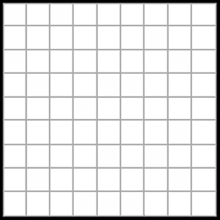
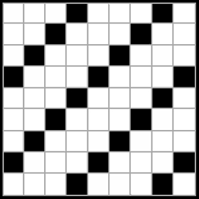
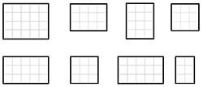

<script src="https://ajax.googleapis.com/ajax/libs/jquery/3.6.0/jquery.min.js"></script>

<script type="text/x-mathjax-config">
MathJax.Hub.Register.StartupHook("TeX Jax Ready",function () {
  MathJax.Hub.Insert(MathJax.InputJax.TeX.Definitions.macros,{
    cancel: ["Extension","cancel"],
    bcancel: ["Extension","cancel"],
    xcancel: ["Extension","cancel"],
    cancelto: ["Extension","cancel"]
  });
});
</script>

<style>
section {
    display: flex;
    display: -webkit-flex;
}

section p {
    margin: auto;
}

section {
    height: 600px;
    width: 60%;
    margin: auto;
    border-radius: 20px;
    background-color: #212121;
}

section p {
    text-align: center;
    font-size: 30px;
    background-color: #212121;
    border-radius: 20px;
    font-family: Roboto Condensed;
    font-style: bold;
    padding: 15px;
    color: #bff4ee;
}

#center {

text-align: center;

}

.center p {
  margin: 0;
  position: absolute;
  top: 50%;
  left: 50%;
  -ms-transform: translate(-50%, -50%);
  transform: translate(-50%, -50%);
}

#center {

text-align: center;

}

</style>


```{r setup, include=FALSE, purl=FALSE}
library(knitr)
library(here)
```

```{r echo = FALSE, purl=FALSE}
xaringanthemer::style_duo(
  primary_color = "#212121",
  secondary_color = "#bff4ee",
  header_font_google = xaringanthemer::google_font("Jost", "600"),
  text_font_google   = xaringanthemer::google_font("Jost", "400")
)

xaringanExtra::use_xaringan_extra(c("tile_view", "animate_css", "tachyons"))

xaringanExtra::use_logo(
  image_url = here::here("static", "img", "course_hex_alpha.png"),
  link_url = "https://edp613.asocialdatascientist.com",
  position = xaringanExtra::css_position(top = "1em", right = "1em")
)
```

```{r echo = FALSE, eval = TRUE, message=FALSE}
library(tidyverse)
``` 

# Two Types of Sampling

<br>
<br>
.pull-left[
<p id="center" style="color:#91b8ff; font-weight: bold; border:1px; border-style:solid; border-color:#91b8ff; border-radius: 25px; padding: 0.3em;">
Nonprobability
</p>
]

--

.pull-right[
<p id="center" style="color:#ff91b8; font-weight: bold; border:1px; border-style:solid; border-color:#ff91b8; border-radius: 25px; padding: 0.3em;">
Probability
</p>
]

---

# Nonprobability Sampling

--

>- Probability is usually unknown

--

>- Does not rely on numerical data

--

>- Inability to generalize to any populous

---

## Notions

--

>- *You get what you get and you don't throw a fit* method

--

>- Used when you want to say something about a discrete phenomena, a few select cases (people, places, objects, etc)

---

## General Framework

--

>- Nonrandom selection

--

>- Sampling bias is present, and samples are not considered representative of the populations from which they were drawn


---

## Primary Types

--

>- **Convenience**

--

>- **Purposive**

--

>- **Quota**

--

>- **Snowball** 

---

## Convenience Sampling

--

* Cases are selected based on their availability to the researcher

--

* Also called **haphazard** or **accidental** sampling

--

* Ideal for: **Exploratory or preliminary research** when trying to gain an initial sense of attitudes or an idea about a new setting

---

## Purposive Sampling

--

* Sample elements are selected based on 

--

  >- elective criteria that define a unique group
    
--
    
  >- targeting knowledgeable individuals (aka *key informants*)
 
--

* Ideal for: *Case Study Research*

--

* Sampling continues until

--

  >- Data are comprehensive: **Completeness**

--

  >- Little or no new knowledge is added: **Saturation**

---

## Snowball Sampling

--

* Select one member of a population, and after speaking to him/her ask that person to identify others in the population

 
--

* Ideal for: *hard to reach populations* (e.g., criminalsm homeless, prostitutes, etc.)

--

* Targeted incentives may be used to ensure diversity in the sample

---

## Quota Sampling

--

* Available cases are selected according to defined subgroups exhibit certain characteristics of interest

--

* A slight improvement over those who are simply available since sample proportions match the population on a particular feature 

--

* The sample is not representative of the population by design

---

## Why should I even care? 

```{r eval = TRUE, echo = FALSE, fig.align='center'}
knitr::include_graphics("img/cartman.gif")
```

--
<br>
<br>
Because:

--

>- Any choice will limit the type of utilizable quantitative study

--

>- Not everything can be explained quantitatively

--

>- Some studies mandate mixed methods!

---

# Probability Sampling

>- Based solely on the idea that a population can be represented by a subset of it given some error: **Random selection**! 
>>- Example: $45\% \pm 3\%$ agree with...

--

>- Ability to generalize to a certain populous

--

>- Inability to describe individual phenomena at any great depth

---

## Notions

--

- *You must have enough whatever* method

--

- Used when you want to say something about a large population (people, places, objects, etc)

---

## General Framework

--

>- Random selection.

--

>- Sampling bias is minimal, and samples are considered representative of the populations from which they were drawn


---

## Primary Types

--

>- **Census**

--

>- **Simple Random Sample (SRS)**

--

>- **Systematic**

--

>- **Stratified** 

--

>- **Cluster** 

---

## Census

--

* An official count or survey of a population, typically recording various details of individuals.

--

<br>
<center>
 
<center>

---

## Benefits

--

-  *"Easy"* to administer

--

-  Self-Weighting. (i.e. no sample element is  worth more than another element)

--

-  No error associated with a result

--

-  Data analysis is simple


---

## Drawbacks

--

-  Extremely expensive

--

-  Time consuming

--

-  Typically infeasible

---

## When to use

--

-  Small sample

--

-  Generalize to an overall populous

---

## Example

--

>- Population: 81 healthcare institutions in a county that perform surgery

--

>-  What to do

--

>>- Create a list of all healthcare institutions in the county that perform surgery

--
    
>>- Number them 1, 2, . . . , *N* where *N* is the total number of healthcare institutions (So *N* = 81)

---

## Simple Random Sample (SRS)

--

* Each element of the frame is given an equal probability of selection

--

<br>
<center>
 
<center>

---

## Benefits

--

-  *"Easy"* to administer

--

-  Self-Weighting. (i.e. no sample element is  worth more than another element)

--

-  Error is easy to calculate

--

-  Data analysis is simple


---

## Drawbacks

--

-  Vulnerable to sampling errors

--

-  Possible underrepresentation of subgroups

--

-  Often tedious, costly, and possibly impractical


---

## When to use

--

-  Large sample

--

-  Complete sampling frame: Known *population*, *needed characteristics* and *setting*

--

-  Generalize to a specific populous

--

-  Not a great deal of information is available about the population

--

-  Data collection can be efficiently performed on randomly distributed items

--

- Low cost of sampling

---

## Example

--

>- Population: 81 healthcare institutions in a county that perform surgery

--

>-  What to do

--

>>- Create a list of all healthcare institutions in the county that perform surgery

--

>>- Number them 1, 2, . . . , *N* where *N* is the total number of healthcare institutions (So *N* = 81)

--

>>- Use a random method to obtain *n* (say *n* = 51) 

---

## Simple Random Sample (SRS)

--

* Each element of the frame is given an equal probability of selection

--

<br>
<center>
 
<center>

---

## Benefits

--

-  *"Easy"* to administer

--

-  Self-Weighting. (i.e. no sample element is  worth more than another element)

--

-  Error is easy to calculate

--

-  Data analysis is simple

---

## Drawbacks

--

-  Vulnerable to sampling errors

--

-  Possible underrepresentation of subgroups

--

-  Often tedious, costly, and possibly impractical

---

## When to use

--

-  Large sample

--

-  Complete sampling frame: Known *population*, *needed characteristics* and *setting*

--

-  Generalize to a specific populous

--

-  Not a great deal of information is available about the population

--

-  Data collection can be efficiently performed on randomly distributed items

--

- Low cost of sampling

---

## Example

--

>- Population: 81 healthcare institutions in a county that perform surgery

--

>-  What to do

--

>>- Create a list of all healthcare institutions in the county that perform surgery

--

>>- Number them 1, 2, . . . , *N* where *N* is the total number of healthcare institutions (So *N* = 81)

--

>>- Use a random method to obtain *n* (say *n* = 51) 

---

## Systematic Sample

--

* An arranging of a population according to some ordering pattern and then the selection of elements at regular intervals from that that ordered list

--

<br>
<center>
 
<center>

---

## Benefits

--

-  *"Easy"* to administer

--

-  Simple selection process

--

-  Less subjective to selection error than SRS

--

-  Most likely will provide a more robust information set per unit cost than an SRS

--

-  May provide more information about a population than an SRS

---

## Drawbacks

--

-  Vulnerable to periodicities

--

-  Dependence on a previous and next unit

---

## When to use

--

-  Given population are of the same type - aka a **homogeneous population**

--

-  Sample units are uniformly distributed over a population

--

---

## Example

--

>- Population: 81 healthcare institutions in a county that perform surgery

--

>-  What to do

--

>>- Create a list of all healthcare institutions in the county that perform surgery

--

>>- Number them 1, 2, . . . , *N* where *N* is the total number of healthcare institutions (So *N* = 81)

--

>>- Use a random method to the first unit *k* (say *k* = 3) 

--

>>- Then choose every *n* unites afterwards (say *n* = 5) 

---

## Stratified Random Sampling

--

- Population can be divided and subdivided into distinct *categories* - aka **strata**

--

- Then simple random sampling or systematic sampling is applied within each stratum

--

<br>
<center> 
 
<center>

---

## Benefits

--

-  Reduced error and increases precision compared to SRS

--

-  Reduced sampling error

--

-  Less variability than an SRS


---

## Drawbacks

--

-  Can be expensive

--

-  Stratifications must be implicitly defined

---

## When to use

--

-  Strata is mutually exclusive

--

-  Strata are collectively exhaustive

---

## Example

--

>- Population: 81 healthcare institutions in a county that perform surgery

--

>-  What to do

--

>>- Create a list of all healthcare institutions in the county that perform surgery.

--

>>- Number them 1, 2, . . . , *N* where *N* is the total number of healthcare institutions (So *N* = 81)

--

>>- Use a random method to the first unit *k* (say *k* = 3) 

--

>>- Divide them up into distinct *M* categories and use an SRS or systematic sampling method. (say  *M *= 8 and *n* = 24)

---

## Cluster Random Sampling

--

- Population can be divided and subdivided into distinct *groups* - aka **cluster**

--

- Then simple random sampling or systematic sampling is applied within each cluster

--

<br>
<center> 
 
<center>

---

## Benefits

--

-  No need for a sampling frame

--

-  Clusters can be stratified if necessary which results in increased precision

--

-  Cost efficient since clusters are housed close together


---

## Drawbacks

--

-  Requires a larger sample size than SRS

--

-  May not represent diversity within a populous

--

-  May have high error due to sampling

---

## When to use

--

-  Clusters are mutually exclusive

--

-  Clusters are collectively exhaustive

--

-  Census can be administered on all selected clusters

--

-  You do not have a full sampling frame

---

## Example

--

>- Population: 81 healthcare institutions in a county that perform surgery

--

>-  What to do

--

>>- Create a list of all healthcare institutions in the county that perform surgery

--

>>- Number them 1, 2, . . . , *N* where *N* is the total number of healthcare institutions (So *N* = 81)

--

>>- Use a random method to the first unit *k* (say *k* = 3) 

--

>>- Divide them up into distinct *M* groups and use a census on each. (say  *M *= 8 and *n* = 24)

---

## That's it for part I! Let's take a break before moving to part II
