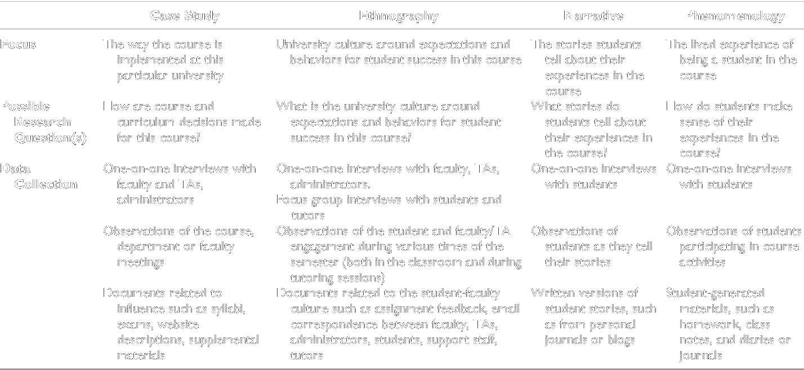
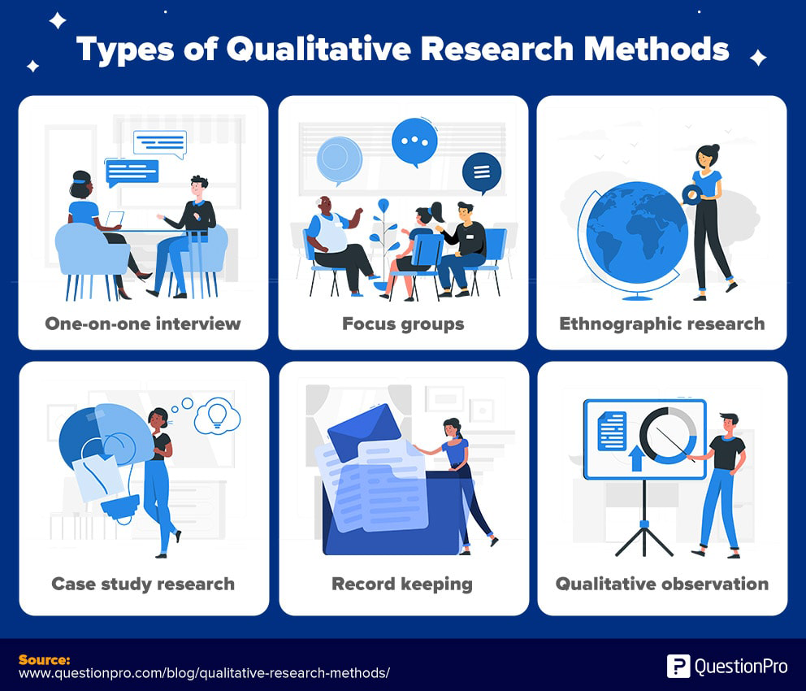
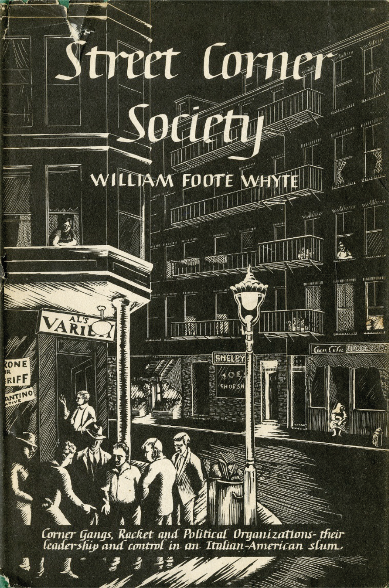

<script src="https://ajax.googleapis.com/ajax/libs/jquery/3.6.0/jquery.min.js"></script>

<script type="text/x-mathjax-config">
MathJax.Hub.Register.StartupHook("TeX Jax Ready",function () {
  MathJax.Hub.Insert(MathJax.InputJax.TeX.Definitions.macros,{
    cancel: ["Extension","cancel"],
    bcancel: ["Extension","cancel"],
    xcancel: ["Extension","cancel"],
    cancelto: ["Extension","cancel"]
  });
});
</script>

<style>
section {
    display: flex;
    display: -webkit-flex;
}


section {
    height: 600px;
    width: 60%;
    margin: auto;
    border-radius: 21px;
    background-color: #212121;
}

section p {
    text-align: center;
    font-size: 30px;
    background-color: #212121;
    border-radius: 21px;
    font-family: Roboto Condensed;
    font-style: bold;
    padding: 12px;
    color: #bff4ee;
    margin: auto;
}

#center {

text-align: center;

}

.center p {
  margin: 0;
  position: absolute;
  top: 50%;
  left: 50%;
  -ms-transform: translate(-50%, -50%);
  transform: translate(-50%, -50%);
}

.center2 {
  margin: 0;
  position: absolute;
  top: 50%;
  left: 50%;
  -ms-transform: translate(-50%, -50%);
  transform: translate(-50%, -50%);
}

.tab {
    display: inline-block;
    margin-left: 40px;
}

td, th, tr, table {
    border: 0 !important;
    border-spacing:0 !important;
  }
  
img.middle { 
vertical-align: middle; 
}

.title-slide {
  background-image: url("img/image1.png");
}
</style>

```{css echo=FALSE}
.highlight-last-item > ul > li,
.highlight-last-item > ol > li {
  opacity: 0.5;
}
.highlight-last-item > ul > li:last-of-type,
.highlight-last-item > ol > li:last-of-type {
  opacity: 1;
}
```

```{r setup, include=FALSE, purl=FALSE}
library(tidyverse)
library(knitr)
library(kableExtra)
library(fontawesome)
library(here)
library(clt)
library(showtext)
font_add_google("Roboto Condensed", "roboto")
showtext_auto()
```

```{r echo = FALSE, purl=FALSE}
xaringanthemer::style_duo(
  primary_color = "#212121",
  secondary_color = "#bff4ee",
  table_row_border_color = "#212121",
  table_row_even_background_color = "#212121",
  footnote_font_size = "0.6em",
  header_font_google = xaringanthemer::google_font("Roboto Condensed", "700"),
  text_font_google   = xaringanthemer::google_font("Roboto Condensed", "400")
)

xaringanExtra::use_xaringan_extra(c("tile_view", 
                                    "animate_css", 
                                    "tachyons"))

xaringanExtra::use_logo(
  image_url = here::here("static", "img", "course_hex.png"),
  link_url = "https://edp612.asocialdatascientist.com",
  position = xaringanExtra::css_position(top = "1em", right = "1em")
)

```

---

class: highlight-last-item
layout: true

---

background-image: url("img/image2.png")

# Plan for Today

--

+ Discuss – briefly – ways of analyzing qualitative data

--

  + I’ll also – briefly – describe how different methods will allow for different knowledge

--

+ I’ll cover

--

	+ Ethnography
	
--

	+ Phenomenology
	
--

	+ Grounded Theory

---

background-image: url("img/image3.png")

# Questions

--

- What are you curious about?

--

- What research questions are you asking?

--

- How would you study those questions?

---

.center2[

]

---

# Qualitative Data

--

- Who do we want our participants to be? 

--

- What qualities should they have?

--

- Should they be representative?

---

## Living and Dying at Murray Manor

--

- Jay Gubrium, 1997/1975

--

- *Life course perspective*. Constructivist approach (life course is constructed by our interactions)

--

- How would he approach this work?

---

## Data Collection

--

.center2[

]

---

## Research questions 

```{r tbl7, echo = FALSE}
tbl7 <- tibble::tribble(
~`Quantitative Research Questions`, ~`Qualitative Research Questions`,
"Does witnessing IPV impact children’s romantic relationships in adulthood?","How do people who witnessed IPV as children experience their current relationships?",
"What is the relationship between sexual orientation or gender identity and homelessness for adolescents in foster care?","How do adolescents who identify as LGBTQ experience the foster care system?",
"How do truancy laws affect expulsion risk? Does risk differ by race and SES?","How do truancy laws impact adolescents who have been suspended?*"
)

kableExtra::kable_paper(knitr::kable(tbl7), 
                        font_size = 18) %>%
  column_spec(1, width = "20em") %>%
  column_spec(2, width = "20em") %>%
  row_spec(0:3, color = "#ffffff",
           background = "#212121",
           extra_css = 'vertical-align: middle !important;')
```

---

background-image: url("img/image6.png")

# Ethnography

---

## How we learn what we know

+ Ethnographic inquiry

--

	+ What is it?
	
--

	+ How is it done?

--

	+ Examples of ethnographic work

--

	+ Indigenous peoples

--

	+ Fieldwork

---

## What is it?

--

- *Ethno*. Refers to human culture

--

- *Graphy*. Description of

--

- A research process used in the scientific study of human interactions in social settings

--

- Any **documentary** is an ethnography

---

## How is it done?

--

- Observe and interact with participants in real-life environment

--

- Ethnographers should take note of all impressions

--

- Study people in their context

--

- Make observations of behaviors

--

- Develop hypotheses of behaviors and constantly test those out

---

## Data

--

.pull-left[
<center>
<hr style="height:10px; visibility:hidden;" />

</center>
]

.pull-right[
<i>Data</i>. Verbal descriptions of people, interactions, settings, objects and phenomena within the context being studies
]

--

.pull-left[
<center>
<hr style="height:10px; visibility:hidden;" />

</center>
]

.pull-right[
<i>Data Sources</i>. The people, settings, and relevant objects being observed
]

--

.pull-left[
<center>
<hr style="height:10px; visibility:hidden;" />

</center>
]

.pull-right[
<i>Data Collection</i>. Done by the researcher through observation,  often combined with formal and informal interviews
]

--

.pull-left[
<center>
<hr style="height:10px; visibility:hidden;" />

</center>
]

.pull-right[
<i>Data treatment and analysis </i>. Presentation of verbal descriptions and/or logical analysis of information to discover salient patterns and themes
]

---

## Example

--

.pull-left[
<center>

</center>
]

--

.pull-right[
+ Street Corner Society: The Social Structure of an Italian Slum


+ Whyte - Wealthy, white, on a Harvard Fellowship

+ Wanted to learn how immigrants and 1st generation Italians organized what seemed like a chaotic “slum”
	
+ Criticisms
]

---

## Digital

--

- We may all be participating...

--

- Twitter &nbsp; `r fa("twitter", fill = "#1da1f2")`

--

  - Professional development among medical students

--

  - Mentorship

--

  - Welfare provision

--

- Disney &nbsp; `r fa("magic", fill = "#BFF5FD")`

--
  
  - We could do an ethnography of Disney people using social media sites for Disney fans

---

background-image: url("img/image16_alt.png")

# Phenomenology

---

# Definition

+ Study of a phenomenon

--

	+ Assumption that reality is made up of phenomena as they are understood within our experience, our consciousness

---

## Example 

+ Suicide attempt survivors’ interpretations of reactions

--

	+ Interviews with 40 survivors about their family and friend reactions
	
--

	+ Three patterns emerged
	
--

		+ Stigmatizing statements and emphasis on reactor’s feelings were interpreted as signs that survivors were a burden
		
--

		+ Avoidant reactions and excessive monitoring were interpreted as cues that suicidal behavior must remain hidden so as not to be a burden
		
--

		+ Asking questions and projecting strength were interpreted as signs that survivors belonged and were not a burden

---

#  Stigmatizing statements and emphasis on reactor’s feelings 

--

.center2[
“The biggest thing that gets to me about people around suicide is that they think it's all about them, and people totally forget that people attempt suicide because they are in too much pain. And when people try to understand it, it's all about, Well, why didn't you talk to me? Me, me, me? There is no connection between you did this because you were in so much pain…. I understand they have to process it themselves, but it was still no real connection and compassion for why this happens. It's still the judgment.”
]

---

#  Avoidant reactions and excessive monitoring 

--

.center2[
“I knew that they really didn't want to talk about it, about the details. And I personally find that sharing it with someone is a really helpful thing, but I didn't want to push them. I think it would have been more helpful for me if I could talk about it.”
]

---

#  Asking questions and projecting strength 

--

.center2[
“For someone to say, “Wow, what's happening for you in your life right now?” not “What's wrong with you? How can we diagnose you?” but “What's happening in your life? What makes you feel like it's not worth living?” Just open, curious questions. An attitude of curiosity rather fear, I think is a big piece of it.”
]

---

# Phenomenological Inquiry

--

+ What is it?
	
--

+ How is it done?

--

+ Data

--

+ Example

---

## What is it?

--

- The lived experience

--

- It can be descriptive

--

- The way in which people come to understand objects and events by consciously experiencing them

---

## How is it done?

--

- Purposive samples of 7-20 usually going for **saturation**. 

--

- Researcher is the instrument

--

- Data collection - interview groups or individuals who have experienced the phenomenon 

--

- Data collection is directly tied to analysis, that eventually is coded or structured into themes

---

## Data

--

- Multiple interviews with participants; observations may also occur

--

- Transform the lived experience into an experience the subject would agree with

--

- Code the data

--

- Put it into written form and create confirmation of the data texts

--

- Create a complete integration of all of these for a research document

---

## Example

--

- Anne Solveig Iversen, Marit Graue, Anne Haugstvedt & Målfrid Råheim (2018) Being mothers and fathers of a child with type 1 diabetes aged 1 to 7 years: a phenomenological study of parents’ experiences, International Journal of Qualitative Studies on Health and Well-being, 13:1, DOI: [10.1080/17482631.2018.1487758](https://doi.org/10.1080/17482631.2018.1487758) 

--

- 7 Couples, 1 single mother

--

- Questions like: How did you experience the time around getting the diagnosis? How did you experience the daily burdens as a mother/father of a child with T1D?

--

- Analysis involved asking: What does this text speak about? The authors looked for themes, and then how to differentiate between core themes and supportive themes

--

- Core theme: Striving to live an ordinary family life, yet feeling and living very different

---

background-image: url("img/image17_alt.png")

# Grounded Theory

---

# Grounded Theory

--

- Both descriptive and explanatory**

--

- Constant Comparison: data collection & analysis

--

  - Data collection begins

--

  - Data analysis begins

--

  - More data collection

--

  - More analysis

--

  - More data collection

--

- That process occurs until theoretical saturation


---

## Your Sample

--

+ 1st : Purposive

--

	+ Divorced fathers with at least 1 child under 18 who has less than 50% physical custody and has been divorced less than 3 years from their first wife (no stepparents).
	
--

+ 2nd: Theoretical

--

	+ Fathers with higher conflict ex-wife relationships
	
--

	+ Fathers who don’t see their kids as much
	
--

	+ Less educated, lower income fathers

---

## Your Sample & Data Collection

--

- Generally small samples

--

  - 20-40 (could be smaller for thesis) people

--

  - Written data: 100+ pages, depending on what you analyze

--

- Interview Protocol

--
  
  - You’ll need to write questions for your participants

--

  - This can, and will, change as data collection proceeds

---

## What Data Looks Like

--

.pull-left[
<b>I: Do you like the current situation?</b>
<br>
<br>
R: I mean it’s fine. Eventually we’ll be 50/50 and it’ll be kind of like a 2-3-2. It’s our own thing we came up with to give us blocks of time, but not be apart from the kids too long. We have the holiday schedule and it’s pretty well mapped out. And then it starts in 2010 is when we’ll be 50-50. It’ 5 days now, it’ll be 6 days out of 14 in 2009 and then basically 50-50 come 2010. I’d like to have them more and she would too. And we both trust each other as parents, so to the extent that me having them more would take some away from her and then they need to be with both, so I think 50/50 would probably be the best in our case. It may be for everyone, but for our case it works out good.
]

--

.pull-right[
<b>I: So why the 2009, 2010 build-up to 50-50?</b>
<br>
<br>
R: it’s just a gradual thing. We’re trying to make the transition from them being, when we were separated more and me less, we’re just trying to make the transition for the boys a little bit easier so it isn’t just going from not divorced – separated and being with her more and then boom, being with each 50-50 right away. Just because I live in the new house with the neighbors they don’t know, with everything new, we thought it would be easier to keep similarity in their life. Now, my wife’s eventually going to move and we’ll sell that house so they’ll be some disruption anyway. At least right now it means less disruption right now and they can get to know my house and my neighbors a little more gradually. 

]
---

### Communicating with Children

--

.center2[
I told her: Okay, I’m going to be here and I told her where I was moving, what I was going to do (as far as getting a divorce, explaining the process). Of course she was 10 at the time and I don’t know if she could grasp it, but I said I know it looks like I’m leaving, but I’m not leaving you . – 006
<br>
<br>
<sup>*</sup>age
]

---

### Communicating with Children

--

.center2[
I tried to tell them, just upfront – I’m not leaving . Really it was more of me coming right out and saying ‘it’s going to be better if I’m the one that moves.’ – 005
]

---

## Communicating with Children 

.center2[
He said some kids were teasing him. I go – you know what? At your age, I had trouble too. And then I told him…when I was your age I had this problem, but as I’ve gotten older I did this to deal with it. That helped me, so maybe it’ll help you out. I tried to give him the options, but I want him to choose so that he learns. – 007
]

---

#  Coded Data: Definition of Involvement 

.center2[
```{r tbl31, echo = FALSE}
tbl31 <- tibble::tribble(
~`Involvement`, ~`Definition`, ~`How Fathers Enacted the Expectation`,
"Physical Involvement ","Fathers’ physical availability to children","Communicating with Children ; Doing Activities with Children; Providing Routine Care; Reassuring Children",
"Psychological Involvement","Fathers’ cognitive awareness of children","Wanting to Spend Time with Children; Monitoring Children’s Emotional Needs; Setting an Example; Concern with Children’s School Progress",
"Fiscal Involvement","Fathers’ financial support of children","Providing Child Support; Providing for Children’s Needs/Wants"
)

kableExtra::kable_styling(knitr::kable(tbl31), font_size = 18)
```
]

---

## How Do You Do That?

--

- Use line-by-line coding first

--

  - Code everything – you may or may not keep those early codes
  
--

- Ask what is happening in each bit of data
  
--

- Compare data with data
  
--

  - Statement with statement
  
--

  - Story with story
  
--

  - Incident with incident

--

- Then compare code with code
  
--

- Begin after 1st interview, early data

---

## Can you generalize?

--

- Not to the population

--

- So what's the point?

--

- To better understand context

--

- To identify shared experiences for a subset of people

--

- To support a broader, quantitative study

---

# Questions?

