<script src="https://ajax.googleapis.com/ajax/libs/jquery/3.6.0/jquery.min.js"></script>

<script type="text/x-mathjax-config">
MathJax.Hub.Register.StartupHook("TeX Jax Ready",function () {
  MathJax.Hub.Insert(MathJax.InputJax.TeX.Definitions.macros,{
    cancel: ["Extension","cancel"],
    bcancel: ["Extension","cancel"],
    xcancel: ["Extension","cancel"],
    cancelto: ["Extension","cancel"]
  });
});
</script>

<style>
section {
    display: flex;
    display: -webkit-flex;
}


section {
    height: 600px;
    width: 60%;
    margin: auto;
    border-radius: 21px;
    background-color: #212121;
}

section p {
    text-align: center;
    font-size: 30px;
    background-color: #212121;
    border-radius: 21px;
    font-family: Roboto Condensed;
    font-style: bold;
    padding: 12px;
    color: #bff4ee;
    margin: auto;
}

#center {

text-align: center;

}

.center p {
  margin: 0;
  position: absolute;
  top: 50%;
  left: 50%;
  -ms-transform: translate(-50%, -50%);
  transform: translate(-50%, -50%);
}

.center2 {
  margin: 0;
  position: absolute;
  top: 50%;
  left: 50%;
  -ms-transform: translate(-50%, -50%);
  transform: translate(-50%, -50%);
}

.tab {
    display: inline-block;
    margin-left: 40px;
}

td, th, tr, table {
    border: 0 !important;
    border-spacing:0 !important;
  }
</style>

```{css echo=FALSE}
.highlight-last-item > ul > li,
.highlight-last-item > ol > li {
  opacity: 0.5;
}
.highlight-last-item > ul > li:last-of-type,
.highlight-last-item > ol > li:last-of-type {
  opacity: 1;
}
```

```{r setup, include=FALSE, purl=FALSE}
library(tidyverse)
library(knitr)
library(kableExtra)
library(fontawesome)
library(here)
library(clt)
library(showtext)
font_add_google("Roboto Condensed", "roboto")
showtext_auto()
```

```{r echo = FALSE, purl=FALSE}
xaringanthemer::style_duo(
  primary_color = "#212121",
  secondary_color = "#bff4ee",
  table_row_border_color = "#212121",
  table_row_even_background_color = "#212121",
  footnote_font_size = "0.6em",
  header_font_google = xaringanthemer::google_font("Roboto Condensed", "700"),
  text_font_google   = xaringanthemer::google_font("Roboto Condensed", "400")
)

xaringanExtra::use_xaringan_extra(c("tile_view", 
                                    "animate_css", 
                                    "tachyons"))

xaringanExtra::use_logo(
  image_url = here::here("static", "img", "course_hex.png"),
  link_url = "https://edp612.asocialdatascientist.com",
  position = xaringanExtra::css_position(top = "1em", right = "1em")
)

```

---

#  The Tailored Design Method (TDM) 

--

- Premised on social exchange perspective on human behavior - *You do something for me, and I do something for you*

--

- Assumes that the likelihood of responding is greater when the expected rewards outweigh the anticipated costs - *Increased benefits with decreased costs*

---

# Approaches to Increasing Benefits 

--

- Provide information about the survey

--

- Ask for help or advise

--

- Show positive regard

--

- Say thank you!

--

- Support group values

--

- Give tangible rewards 

--

- Make the questionnaire interesting

--

- Provide social validation

--

- Inform people that opportunities to respond are limited

---

# Approaches to Decreasing Costs 

--


- Avoid subordinating language

--

- Emphasize similarity to other requests or tasks to which a person has already responded

--

- Make it convenient to respond

--

- Make the questionnaire short and easy to complete

--

- Minimize requests for personal or sensitive information

---

#  Establishing Trust

--

- Provide information about the survey

--

- Ask for help or advise

--

- Show positive regard

--

- Say thank you!


---

#  Choosing Words and Forming Question

--

+ Ask one question at a time

--

+ Be sure the question specifies the response task

--

+ Make sure the question applies to the respondent

--

+ Make sure the question is technically accurate

--

+ Make sure *yes* means **yes** and *no* means **no**

--

+ Use complete sentences with simple sentence structures

--

+ Use as few words as possible to pose the question

--

+ Use specific and concrete words to specify the concepts clearly

--

+ Use simple and familiar words

---

# Visual Presentation of Survey Questions (1/2)

--

+ Choose line spacing, font, and text size to ensure the legibility of the text

--

+ Integrate special instructions into the question where they will be used rather than including them as freestanding entities

--

+ Make sure words and visual elements that make up the question send consistent messages

--

+ Organize each question in a way that minimizes the need to reread portions in order to comprehend the response task

--

+ Separate optional or occasionally needed instructions from the question stem by font or symbol variation


---

# Visual Presentation of Survey Questions (2/2)

--

+ Use darker and/or larger print for the question and lighter and/or smaller print for answer choices and answer spaces

--

+ Use spacing to create subgrouping within a question

--

+ Use visual design properties to emphasize elements that are important to the respondent and to de-emphasize those that are not

--

+ Visually standardize all answer spaces or response options

---

#  First Things First: Avoid Double-Barreled Questions!

--

.pull-left[

]

--

.pull-left[

]

---

#  Double-Barreled Questions – What’s the problem? 

--

<center>

</center>
<br>

--

<hr style="width:100px; margin: auto;" />
<br>
<br>
<center>
Respondents don’t know what you are asking for
</center>

--

<br>
<center>
If the answer is <b>Yes</b>, then are the respondents saying it for the burger, fries, or both?
</center>

--

<br>
<center>
This can lead to massive bias, unreliable or unusable results
</center>

---

# Structures

**The following slides consist of examples of common structures of survey items.**
 
***This is by no means comprehensive!***

---

##  Nominal Type Questions 

.center2[

]

<br>
<br>
<br>
<br>
<br>
<br>
<br>
<br>
<br>
<br>
<br>
<br>
<br>
<br>
<br>
<br>
<br>
.footnote[
*More about [nominal variables](https://statsandr.com/blog/variable-types-and-examples/#nominal)*
]

---

##  Nominal Type Questions - Dichotomous

--

.center2[

]

---

##  Ordinal Type Questions

--

.center2[

]

<br>

.footnote[
*More about [ordinal variables](https://statsandr.com/blog/variable-types-and-examples/#ordinal)*
]

---

## More About Ordinal Type Questions

--

<br>
<br>
.center2[

]

---

### Ordinal or Nominal?

--

<br>
<br>
<br>
<br>
<br>
.pull-left[

]

--

.pull-right[

]

---

## Semantic Differentials

--

<br>
.pull-left[
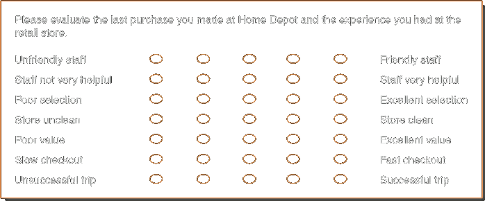
]

--

.pull-right[

]

--

<br>
<center>

</center>

---

## Visual Analogs

--

<br>
<br>
<br>
<br>
<br>
.pull-left[
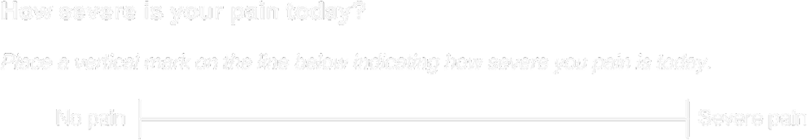
]

--

.pull-right[

]

---

## Guttman Scaling

--

.center2[
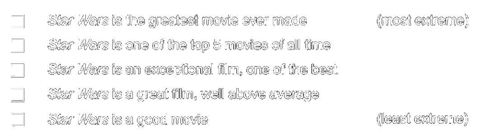
]

---

## Filters/Skip Patterns

--

Comes in many names:

--

> Skip logic

--

> Conditional Branching

--

> Conditional Logic

--

.pull-right[

]

---

# Closed Ended

---

# General Structural Guidelines

--

- State both positive and negative sides in the question stem when asking either/or types of questions

--

- Develop lists of answer categories that include all reasonable possible answers

--

- Develop lists of answer categories that are mutually exclusive

--

- Maintain spacing between answer categories that is consistent with measurement intent

---

## Positive and Negative Sides in Question Stem

--

.pull-left[
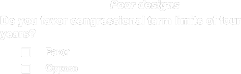
]

--

.pull-right[
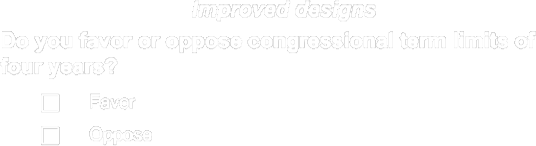
]

--

.pull-left[
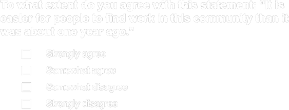
]

--

.pull-right[
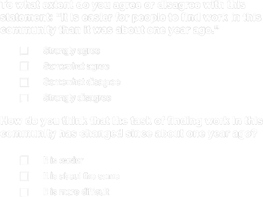
]

---

## Exhaustive and Mutually Exclusive Questions

--

.pull-left[
<center>

</center>
]

--

.pull-right[
<center>

</center>
]


---

## Spacing Response Options Evenly

--

<br>
<br>
<center>
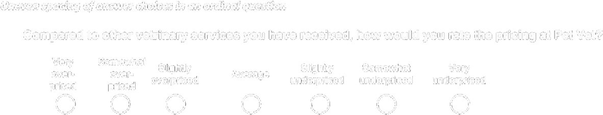
</center>

--

<br>
<br>
<center>
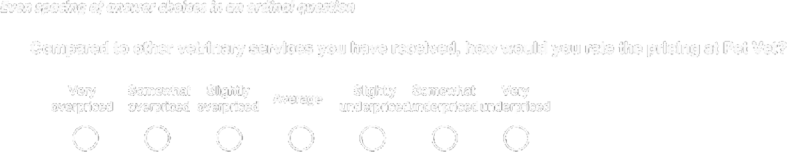
</center>


---

# Closed-Ended Questions: Nominal Scales

--

- Ask respondents to rank only a few items at once rather than a long list

--

- Avoid bias from unequal comparisons

--

- Randomize response options if there is concern about order effects

--

- Use forced-choice questions rather than check-all-that-apply questions

--

- Consider using differently shaped answer spaces (circles and squares if possible) to help respondents distinguish between single- and multiple-answer questions

---

## Unordered

--


--

.pull-right[

]

---

## Unordered

.center2[

]

---

## Comparisons

<center>
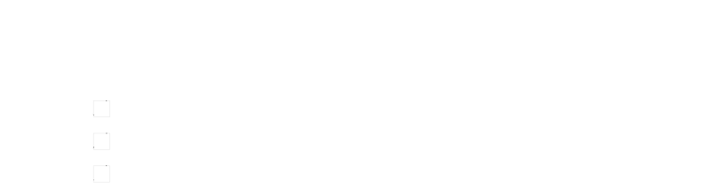
</center>
<br>

--

<hr style="width:100px; margin: auto;" />
<br>
<center>

</center>
<br>

--

<hr style="width:100px; margin: auto;" />
<br>
<center>

</center>
<br>

--

<hr style="width:100px; margin: auto;" />
<br>
<center>

</center>

---

## Check-all-that-Apply versus Forced-Choice

--

<br>
<br>
<br>
<br>
<br>
.pull-left[
<center>

</center>
]

--

.pull-right[
<center>

</center>
]

---

## Distinguishing Between Single-and Multiple-Answer Questions

--

<br>
<br>
<br>
<br>
<br>
.pull-left[
<center>

</center>
]

--

.pull-right[
<center>

</center>
]

---

# Closed-Ended Questions: Ordinal Scales

--

- Align response options vertically in one column or horizontally in one row and strive for equal distance between categories

--

- Carefully evaluate the use of numeric labels and their impact on measurement

--

- Choose an appropriate scale length—in general, limit scales to four or five categories

--

- Choose direct or construct-specific labels to improve cognition

--

- Consider how verbally labeling and visually displaying all response categories may influence answers

--

- Place non-substantive options at the end of the scale and separate them from substantive options

--

- Provide scales that approximate the actual distribution of the characteristic in the population

--

- Provide balances scales where categories are relatively equal distances apart conceptually

---

## Scalar Questions

<center>

</center>
<br>

--

<center>

</center>
<br>

--

<hr style="width:100px; margin: auto;" />
<br>
<center>

</center>
<br>

---

## Scalar Questions

--

.pull-left[
<center>

</center>
]

--

.pull-right[
<center>

</center>
]

<br>
.footnote[
*Note: Balanced Scales with Even Distance Between Categories*
]

---

## Scalar Questions

--

.center2[

]

---

## Aligning the Conceptual and Visual Midpoints

--

**This is by far one of the most important criteria to check off when considering survey aesthetics!**

---

.center2[
<center>

</center>
]

---

# Open Ended

---

## Open-Ended Numerical

--

- Ask for the specific unit desired in the question stem

--

- Provide answer spaces that are sized appropriately for the response task

--

- Provide units labels with the answer spaces

---

## Numeric

<center>

</center>
<br>

--

<hr style="width:100px; margin: auto;" />
<br>
<center>

</center>
<br>

--

<hr style="width:100px; margin: auto;" />
<br>
<center>

</center>
<br>

--

<hr style="width:100px; margin: auto;" />
<br>
<center>

</center>

---

## Open-Ended Lists

--

- Design the answer spaces to support the number and type of responses desired

--

- Provide labels with answer spaces to reinforce the type of response requested

--

- Specify the number and type of responses desired in the question 

---

## Lists

--

.center2[
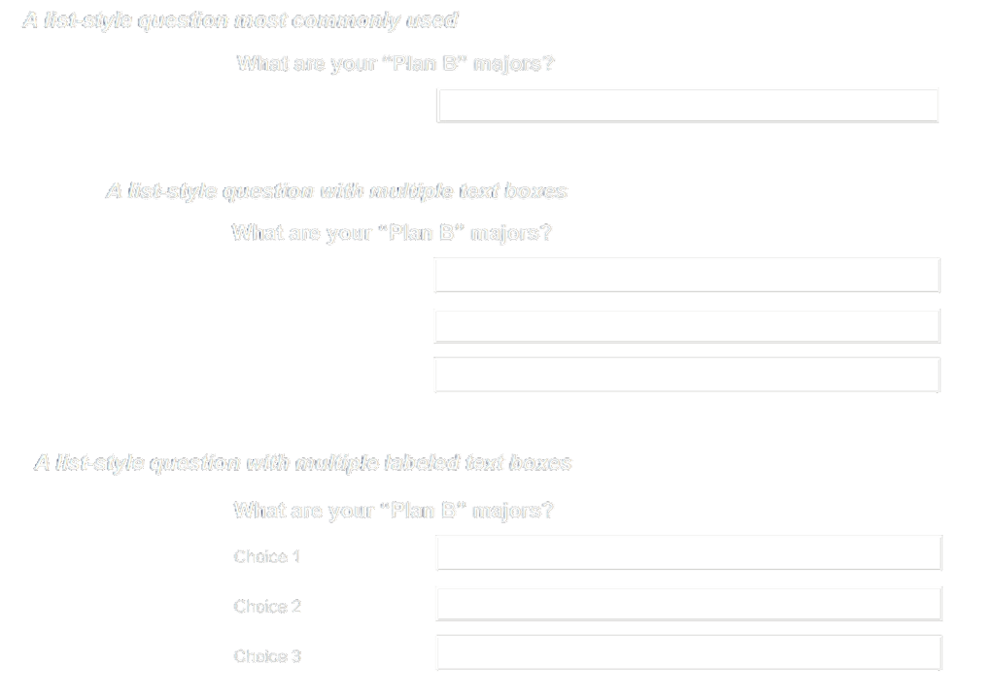
]

---

# Open-Ended Explanatory 

--

- Consider programming probes to open-ended responses in internet surveys

--

- Provide adequate space for respondents to completely answer the question

--

- Provide extra motivation to respond

--

- Use scrollable boxes on internet surveys

---

## Explanatory

--


.center2[
<center>
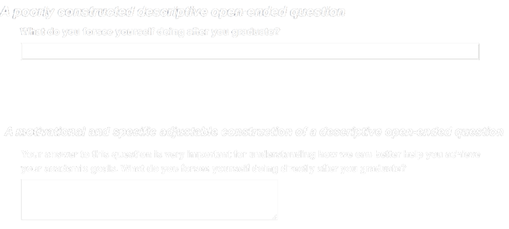
</center>
]

---

# Partially Closed

---

## Partially Closed Nominal

--

.center2[

]

---

# And That's It...For Now!

--

If you are interested in a fairly light yet comprehensive read on how to create or conduct surveys, try reading ***Internet, Phone, Mail, and Mixed-Modes Surveys: The Tailored Design*** Method by *Dillman*, *Smyth* and *Christian*. The Library has an [eBook version of the text](https://libwvu.on.worldcat.org/oclc/878301194) you can access right now with your WVU login.

I also use the text in my [EDP 619: Survey Research Methods](https://edp619.asocialdatascientist.com/) course. Much like this class, the content is free to anyone for personal use. For more information, please look at the licensing information provided below.


<center>
<br><br>
<div class="fade_rule"></div>  
<br><br>
</center>

<center>
<a rel="license" href="http://creativecommons.org/licenses/by-nc-sa/4.0/"></a><br /><br />This work is licensed under a <br /><a rel="license" href="http://creativecommons.org/licenses/by-nc-sa/4.0/">Creative Commons Attribution-NonCommercial-ShareAlike 4.0 International License</a>
</center>
