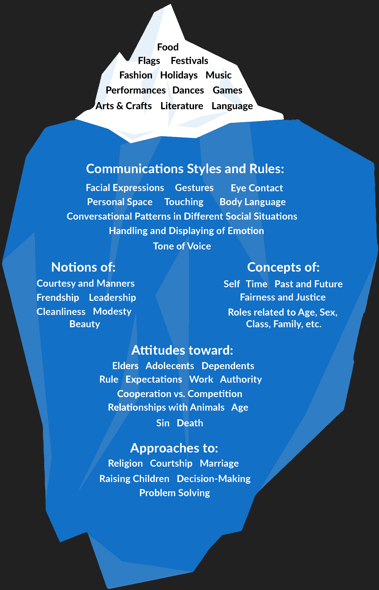

```{r setup, echo=FALSE, warning=FALSE, message=FALSE, include=FALSE}
source(here::here("static", "slides", "all.R"))
```


# Defining Evaluation

---

## (Mostly) Official

<br>
<br>
<br>
.center2[
<span style="color:#00b0cc; font-weight: bold; font-style: italic;">Evaluation</span> is the act or process of determining the 

> <span style="color:#f19bcf; font-style: italic;">merit</span><br><span style="color:f5f7f6; font-style: italic;">quality</span> 

> <span style="color:#f19bcf; font-style: italic;">worth</span><br><span style="color:#f5f7f6; font-style: italic;">value</span> 

> <span style="color:#f19bcf; font-style: italic;">significance</span><br><span style="color:#f5f7f6; font-style: italic;">importance</span>

of something or the product of that process
]

---

### A Closer Look

--

<br>
<br>
<br>
<br>
.pull-left[
What do <span style="color:#f19bcf; font-style: italic;">merit</span>, <span style="color:#f19bcf; font-style: italic;">worth</span>, and <span style="color:#f19bcf; font-style: italic;">significance</span> mean to you both separately and in combination?
]

---

### A Closer Look

<br>
<br>
<br>
<br>
.center2[
.pull-left[
Can you think of real world examples of each?
]]

---

## Generally 

<br>
<br>
<br>
<br>
.center2[
<span style="color:#00b0cc; font-weight: bold; font-style: italic;">Evaluation</span> answers the questions

> <span style="color:#00b0cc; font-style: italic;">does it work?</span>

> <span style="color:#00b0cc; font-style: italic;">why does it work?</span>
]

---


## What About the How? 

<br>
<br>
<br>
<br>
.center2[
We typically leave the remaining question <span style="color:#00b0cc; font-style: italic;">how does it work?</span>
to people with grounded knowledge in a particular area

> aka <i>content experts</i>
]


---

# More Terms with the Stem <span style="color:#00b0cc; font-weight: bold; font-style: italic;">Eval-</span>

--

<br>
<br>
<br>
<br>
<br>
.pull-left[
<p id="center" style="color:#00b0cc; border:1px; border-style:solid; border-color:##00b0cc; border-radius: 25px; padding: 0.8em;">
<b><i>Evaluator</i></b><br><br>
<span style="color:#ffffff;">The person(s) evaluating something</span>
</p>
]

.pull-right[
<p id="center" style="color:#00b0cc; border:1px; border-style:solid; border-color:##00b0cc; border-radius: 25px; padding: 0.8em;">
<b><i>Evaluand</i></b><br><br>
<span style="color:#ffffff;">The thing(s) being evaluated</span>
</p>
]

---

# Levels, Performances, and Measures

--

<br>
<br>
<br>
<br>
.center2[
.pull-left[
Of the three terms<span style="color:#B2DF9C; font-style: italic;">criteria</span>, <span style="color:#B2DF9C; font-style: italic;">standards</span>, and <span style="color:#B2DF9C; font-style: italic;">indicators</span>, which of the three do you believe is harder to identify?
]]

---

# Levels, Performances, and Measures

<br>
<br>
<br>
<br>
.center2[
.pull-left[
Can you think of real world examples of each?
]]

---

# <b>Primary</b> Purposes of Evaluation

--

<br>
<br>
<br>
<br>
.pull-left[
<p id="center" style="color:#ffb3ba; font-weight: bold; border:1px; border-style:solid; border-color:#ffb3ba; border-radius: 25px; padding: 0.8em;">
<i>Formative</i><br><br>
Conducted with the intent to improve
<br><br>
</p>
]

.pull-right[
<p id="center" style="color:#bae1ff; font-weight: bold; border:1px; border-style:solid; border-color:#bae1ff; border-radius: 25px; padding: 0.8em;">
<i>Summative</i><br><br>
Conducted with the intent to inform decision making and/or determine judgment
</p>
]

---

# <b>Secondary</b> Purposes of Evaluation 

--

.pull-left[
<center>
<p id="center" style="color:#f4dbb5; font-weight: bold; border:1px; border-style:solid; border-color:#f4dbb5; border-radius: 25px; padding: 0.8em; margin-top: 10px;">
<i>Developmental</i>
<br><br>
To help develop an intervention or program
<br><br>
</p>
</center>
]

--

.pull-right[
<center>
<p id="center" style="color:#95f4f1; font-weight: bold; border:1px; border-style:solid; border-color:#95f4f1; border-radius: 25px; padding: 0.8em; margin-top: 10px;">
<i>Accountability</i>
<br><br>
To hold accountable
<br><br>
</p>
</center>
]

--

<center>
<p id="center" style="color:#ccfaca; font-weight: bold; border:1px; border-style:solid; border-color:#ccfaca; border-radius: 25px; padding: 0.8em; width: 525px; margin-top: 10px;">
<i>Monitoring</i><br><br>
To assess implementation and gauge progress toward a desired end
</p>
<br>
</center>

--

<center style="margin-top: -43px;">
.pull-left[
<p id="center" style="color:#f7d5b5; font-weight: bold; border:1px; border-style:solid; border-color:#f7d5b5; border-radius: 25px; padding: 0.8em;">
<i>Knowledge Generation</i><br><br>
To generate knowledge about general patterns of effectiveness
</p>
</center>
]

--

.pull-right[
<center>
<p id="center" style="color:#b1d5f7; font-weight: bold; border:1px; border-style:solid; border-color:#b1d5f7; border-radius: 25px; padding: 0.8em;">
<i>Ascriptive</i>
<br><br>
Merely for the sake of knowing
<br><br>
</p>
</center>
]

---

## <span style="color:#f4dbb5; font-weight: bold; font-style: italic;">Developmental</span> vs <span style="color:#ffb3ba; font-weight: bold; font-style: italic;">Formative</span> Evaluation

<br>
<br>
<center>
A video from an evaluator named Michael Quinn Patton describing the differences can be found by clicking on the icon below<br><br>
</center>
<div class="centerpiece">
<a href="https://youtu.be/Wg3IL-XjmuM">

</a>
</div>

---

## A bit more on <span style="color:#f4dbb5; font-weight: bold; font-style: italic;">Developmental</span> Evaluation 

<br>
<br>
.center2[
```{r tbl10, echo = FALSE}
tibble::tribble(
  ~` `, ~`What might the purpose of the evaluation be?`, ~`What questions might the evaluation try to answer?`,
  "<span style='color:#ffb3ba; font-weight: bold;'><i>Formative</i></span> <b>Evaluation</b>"," "," ",
  "The program has been designed and piloted with a group of 20 principals. What kind of evaluative feedback should the ASDC seek?"," "," ",
  " "," "," ",
  "<span style='color:#bae1ff; font-weight: bold;'><i>Summative</i></span> <b>Evaluation</b>"," "," ",
  "The program has been delivered to all principals in the county. What kind of evaluative feedback should the ASDC seek?"," "," "
) %>%
 knitr::kable(
   escape = FALSE,
   align = 'lcc') %>%
  kable_styling(full_width = FALSE,
                bootstrap_options = c('condensed')) %>%
  row_spec(0:2, background = "#212121", extra_css = 'vertical-align: middle !important;')
```
]

---

# Introduction to Roles and Styles 

--

<br>
<br>
.pull-left[
Evaluator Roles: 

> Independent

> Topical

> External 

> Internal
]

.pull-right[
<br>
<br>
<br>
<br>
The one that you take on in an evaluation will determine a lot!
]

---

## Defining Culture 

--

> What is culture?


> How do we recognize it?

--

<br>
<br>
.pull-right[
<i>Culture can be defined as the shared experiences of people, including their languages, values, customs, beliefs, and more. It also includes worldviews, ways of knowing, and ways of communicating. Culturally significant factors encompass, but are not limited to, race/ethnicity, religion, social class, language, disability, sexual orientation, age, and gender.</i>
]

.pull-right[
-- 
<a href="https://www.eval.org">American Evaluation Association</a> (2011)
]

---

### The Iceberg

<center>

</center>

---

### Markus & Kitayama (1991) 

<center>

</center>

---

### Cultural Influences Activity 

<br>
.pull-left[
<br>
<br>
<br>
<br>
<br>
<br>
How might each of the following influence an evaluation’s design and implementation?
]

.pull-right[
> Language of participants

> Role of food and eating

> Evaluators attire when interacting with participants
 
> Concept of time

> Communication styles

> Importance of family relationships

> Values/norms re: individualism, independence, conflict

> Understanding of social structure
]

---

## Increasing your Cultural Sensitivity 

<br>
<br>
<br>

--

> Assess your own attitudes, beliefs, values

> Incorporate culturally diverse groups and perspectives throughout evaluation process

> Build in sufficient time to negotiate access and build trust in community / organization

> Demystify evaluation, avoid jargon (please!), build buy-in

> Be flexible in choice of evaluation methods, use multiple data sources, multiple data collection methods, multiple perspectives

---

# Meta-evaluation

--

<div class="centerpiece">
A &nbsp;<span style="color:#00b0cc; font-weight: bold; font-style: italic;">meta-evaluation</span>&nbsp; is an evaluation of an evaluation or evaluations
</div>

---
 
## Classifications

--

<br>
.pull-left[
<p id="center" style="color:#CA94FF; border:1px; border-style:solid; border-color:#CA94FF; border-radius: 25px; padding: 0.8em;">
<i><b>According to the role
the evaluation plays</b></i><br><br>
<span style="color:#ffb3ba;">Formative</span> or <span style="color:#bae1ff;">Summative</span>
<br>
<br>
</p>
]

--

.pull-right[
<p id="center" style="color:#CA94FF;border:1px; border-style:solid; border-color:#CA94FF; border-radius: 25px; padding: 0.8em;">
<i><b>According to the content or the program phase evaluated</b></i><br><br>
<span style="color:#e9ebff;">Design</span>, <span style="color:#e9ebff;">Process</span>, or <span style="color:#e9ebff;">Results</span>
<br>
<br>
</p>
]

--

<br>
.pull-left[
<p id="center" style="color:#CA94FF; border:1px; border-style:solid; border-color:#CA94FF; border-radius: 25px; padding: 0.8em;">
<i><b>According to the moment of the evaluation</b></i><br><br>
After the fact - aka <span style="color:#e9ebff;">ex-ante</span> or before the event -aka <span style="color:#e9ebff;">ex-postfacto</span>
</p>
]

--

.pull-right[
<p id="center" style="color:#CA94FF;border:1px; border-style:solid; border-color:#CA94FF; border-radius: 25px; padding: 0.8em;">
<i><b>According to the evaluator's role</b></i><br><br>
<span style="color:#e9ebff;">Internal</span> or <span style="color:#e9ebff;">External</span>
<br><br>
</p>
]

--

.footnote[Concentrate on the idea of a <span style="color:#ffb3ba;">formative</span> and <span style="color:#bae1ff;">summative</span> evaluation this week. There is no need to worry if you don't know what any of remaining terms mean and/or imply (and yes that includes this idea of a <span style="color:#00b0cc; font-weight: bold; font-style: italic;">meta-evaluation</span>)! You'll have plenty of opportunities to learn about them as we progress through the term.]

---

# Considerations

---

## Things to Evaluate

--

<br>
<br>
.center2[
> Evaluation criteria

> Evaluation standards

> Performance

> Program costs

> Program goals
]

---

## Things to Assess 

--

<br>
<br>
.center2[
> [Evaluation Standards](https://evaluationstandards.org/program/)

> Location

> Stakeholder Needs

> Sponsor Needs

> Your costs
]

---

# A Look at Goals

---

## Include

.pull-left[
<br>
Preparatory conditions
]

.pull-right[
+ What does it take to be ready to target a goal?
  
+ Progress toward that state is a goal
]
  
--

<br>
.pull-left[
<br>
Intended operations
]

.pull-right[
+ What a program tries to implement to achieve a goal is a type of goal.
]
  
--

<br>
.pull-left[
Targeted outcomes
]

.pull-right[
+ Short-term (initial)

+ Medium-term (intermediate)
  
+ Long-term (distant)
]

---

## Whose are Important? 

--

<div class="centerpiece">
It's not always obvious!
</div>

---

## How to Decide Which Matter Most? 

--

.pull-left[.tabsixt[
<br>
<span class="numberCircle clrForest"><span>&#10003;</span></span>
  ]
]

.pull-right[.revtabquad[
<span style="color:#6fe1d9;">Talk to stakeholders/sponsors; explicitly ask their perspective on recipient needs, program goals, and evaluation goals</span>
  ]
]
<br>
<br>

--

.pull-left[.tabsixt[
<span class="numberCircle clrForest"><span>&#10003;</span></span>
  ]
]

.pull-right[.revtabquad[
<span style="color:#6fe1d9;">Figure out other ways to find needs</span>
  ]
]
<br>
<br>

--

.pull-left[.tabsixt[
<span class="numberCircle clrForest"><span>&#10003;</span></span>
  ]
]

.pull-right[.revtabquad[
<span style="color:#6fe1d9;">Read all available program documentation</span>
  ]
]
<br>
<br>

--

.pull-left[.tabsixt[
<br>
<span class="numberCircle clrForest"><span>&#10003;</span></span>
  ]
]

.pull-right[.revtabquad[
<span style="color:#6fe1d9;">Develop a logic model connecting needs through program activities, outputs and outcomes associated with goals</span>
  ]
]

---

# Logic Model Parts

.pull-left[
.tabdbl[
<span class="textstyle inputs">
INPUTS
</span>
]
<br>
.tabtpl[
<span class="textstyle inputs proginv">
Program Investments
</span>
  ]
]

.pull-right[
<br>
<span style="color:#fac090;">what resources go into a program - aka 
<span style="color:#fcd5b5;">
<i>investments</i>
</span>
</span>
]

--

<br>
.pull-left[
.tabdbl[
<span class="textstyle outputs">
OUTPUTS
</span>
  ]
] 

.pull-right[
<span style="color:#d7e4bd;">what is produced through those activities</span>
]

--

.pull-left[
.tabtpl[
<br>
<span class="textstyle outputs actpart">
Activities
</span>
  ]
]

.pull-right[
.tabtpl[
<span style="color:#ebf1de;">the activities the program assumes - i.e. <i>what actually occurs</i>
</span>
  ]
]

.pull-left[
.tabtpl[
<br>
<span class="textstyle outputs actpart">Participation
</span>
  ]
]

.pull-right[
.tabtpl[
<span style="color:#ebf1de;">who is part of the program and how are they served - i.e. <i>who is served like stakeholders and sponsors and what engagement they have</i>
</span>
  ]
]

---

# Logic Model Parts

<br>
.pull-left[
.tabdbl[
<span class="textstyle outcomes">
OUTCOMES
</span>
  ]
] 

.pull-right[
<span style="color:#b9cde5;">
changes or benefits that result from the program
</span>
]

--

.pull-left[
.tabtpl[
<br>
<span class="textstyle outcomes shmelo">
Short
</span>
  ]
]

.pull-right[
.tabtpl[
<span style="color:#dce6f4;">
Learning like <i>awareness</i>, <i>aspirations</i>, <i>attitudes</i>, <i>knowledge</i>, <i>motivations</i>, <i>opinions</i>, <i>skills</i>, ect.
</span>
  ]
]

.pull-left[
.tabtpl[
<br>
<span class="textstyle outcomes shmelo">
Medium/Intermediate
</span>
  ]
]

.pull-right[
.tabtpl[
<span style="color:#dce6f4;">
Actions like <i>behaviors</i>, <i>decisions</i>, <i>policies</i>, <i>practice</i>, etc.
</span>
  ]
]

.pull-left[
.tabtpl[
<br>
<span class="textstyle outcomes shmelo">
Long
</span>
  ]
]


.pull-right[
.tabtpl[
<span style="color:#dce6f4;">Consequences like those that are <i>civic</i>, <i>economic</i>, <i>environmental</i>, <i>political</i>, <i>professional</i>, <i>social</i>, etc.
</span>
  ]
]

---

### <span style="color:#bff4ee;">A Basic Model</span>

<br>
.pull-left[
<center>

</center>
]

.pull-right[
<center>

</center>
]

<center>
<br>
<br>
<i>Download a 
<a href="https://edp617.asocialdatascientist.com/slides/what%20is%20pe/docs/Blank%20Logic%20Model.pdf" target="_blank">high quality PDF</a></i>
</center>

.footnote[<i>Other 
<a href="https://fyi.extension.wisc.edu/programdevelopment/logic-models/" target="_blank">types of logic models</a></i>]

---

### <span style="color:#bff4ee;">An Example</span>

<br>
<center>

</center>

<center>
<br>
<br>
<i>Download a 
<a href="https://edp617.asocialdatascientist.com/slides/what%20is%20pe/docs/REDACTED%20Logic%20Model.pdf" target="_blank">high quality PDF</a></i>
</center>

.footnote[<i>More 
<a href="https://fyi.extension.wisc.edu/programdevelopment/logic-models/bibliography/" target="_blank">examples of logic models</a></i>
</center>
]

---

# Basic Factors of an Evaluation

---

## Identifying Criteria 

--

<br>
<br>
<br>
.pull-left[
<br>
<br>
What matters enough to measure given what you know about all the other factors?
]

.pull-right[
> Any relevant past performance data

> Costs

> Existing literature and standards

> Needs and Goals
]

---

## Estimating Cost

--

<br>
<br>
<br>
.pull-left[
<br>
<br>
<br>
Often very hard to do and do well
]

--

.pull-right[
Almost always addressed in a relative way

  + Relative resource intensity of alternative programs (including development and/or retraining costs)
  
  + Proportion of resources allocated to different program activities (logic modeling can be very helpful for thinking about this)
]

---

## Measuring Performances

--

<br>
<br>
<br>
<br>
.pull-left[
> Sponsor perception

> Staff performance / perception

> Stakeholder performance / perception
]

--

.pull-right[
In a nutshell

> Who is best positioned to really know?

> Multiple times, multiple perspectives
]

---

## Evaluation Statements

---

### Developing a Purpose

--

<br>
.pull-left[
<br>
<span style="margin-left:80px;">Step</span> <span class="numberCircle clrMauve"><span>1</span></span>
]

.pull-right[
<p style="color:#ffffff;border:1.1px; border-style:solid; border-color:#7b5d99; border-radius: 25px; padding: 0.8em;">
<i>Critique sample evaluation purpose statements<sup>1</sup> to better understand what might go into crafting a good one</i>
</p>
]

.footnote[<sup>1</sup>&nbsp;More about this coming up later]

--

.pull-left[
<br>
<span style="margin-left:80px;">Step</span> <span class="numberCircle clrRose"><span>2</span></span>
]

.pull-right[
<p style="color:#ffffff;border:1.1px; border-style:solid; border-color:#e6568b; border-radius: 25px; padding: 0.8em;">
<i>Write preliminary evaluation statement for the program you'll evaluate</i>
</p>
]

--

.pull-left[
<br>
<span style="margin-left:80px;">Step</span> <span class="numberCircle clrBlueciel"><span>3</span></span>
]

.pull-right[
<p style="color:#ffffff;border:1.1px; border-style:solid; border-color:#21adfc; border-radius: 25px; padding: 0.8em;">
<i>Write 3 - 7 potential evaluation questions relevant to the evaluation purpose statement you wrote for step 2</i>
</p>
]

---

### Thinking About Statements

--

<br>
In the following slides, take a look at the sample evaluation purpose statements and *for each* try to identify the following four things

--

.pull-left[.tabsixt[
<span class="numberCircle clrPeach"><span>&#10003;</span></span>
  ]
]

.pull-right[.revtabquad[
<span style="color:#f1c3c3;">what is being evaluated?</span>
  ]
]
<br>
<br>

--

.pull-left[.tabsixt[
<span class="numberCircle clrPeach"><span>&#10003;</span></span>
  ]
]

.pull-right[.revtabquad[
<span style="color:#f1c3c3;">how will results be used?</span>
  ]
]
<br>
<br>

--

.pull-left[.tabsixt[
<span class="numberCircle clrPeach"><span>&#10003;</span></span>
  ]
]

.pull-right[.revtabquad[
<span style="color:#f1c3c3;">what kind of evaluation will be implemented (developmental, formative, or summative)?</span>
  ]
]
<br>
<br>

--

.pull-left[.tabsixt[
<span class="numberCircle clrPeach"><span>&#10003;</span></span>
  ]
]

.pull-right[.revtabquad[
<span style="color:#f1c3c3;">how could the statement of purpose be improved?</span>
  ]
]

---

#### <span style="color:#bff4ee;">Example of Evaluation Statements</span>

<br>
<br>
.pull-left[
<center>

</center>
]

--

.pull-right[
<center>

</center>
]

--

<br>
<center>

</center>

---

### Some Tips

--

<br>
<br>
> Be confident but <b>never</b> demeaning or overpowering

> Be clear

> Be concise 

> Be truthful

> Don’t overpromise<sup>1</sup> 

> Get buy in

> Write in a way that's meaningful to your sponsor(s)/stakeholder(s)

.footnote[<sup>1</sup>&nbsp;Under-delivering can destroy careers!]

---

## Thats it!

If you have any questions, please reach out

--

<br>
<br>
<br>
<br>
<br>
<br>
<br>
<br>
<br>
<center>
<br><br>
<div class="fade_rule"></div>  
<br><br>
</center>

<center>
<a rel="license" href="http://creativecommons.org/licenses/by-nc-sa/4.0/"></a><br /><br />This work is licensed under a <br /><a rel="license" href="http://creativecommons.org/licenses/by-nc-sa/4.0/">Creative Commons Attribution-NonCommercial-ShareAlike 4.0 International License</a>
</center>
